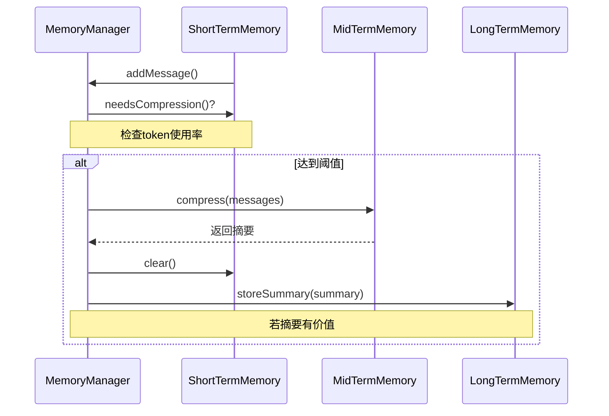
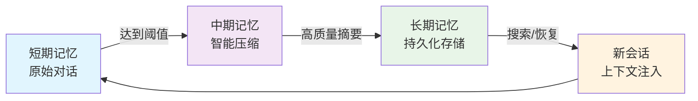
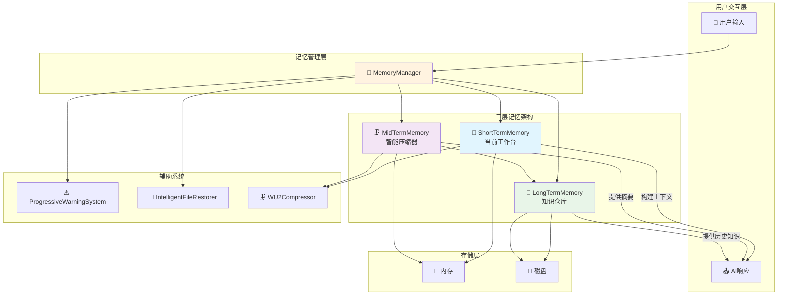

# 中期记忆

<cite>
**本文档引用文件**   
- [MidTermMemory.js](file://context-claude-code/src/memory/MidTermMemory.js)
- [MemoryManager.js](file://context-claude-code/src/memory/MemoryManager.js)
- [LongTermMemory.js](file://context-claude-code/src/memory/LongTermMemory.js)
- [WU2Compressor.js](file://context-claude-code/src/compression/WU2Compressor.js)
- [index.json](file://context-claude-code/memory-storage/index.json)
- [EnhancedMemoryManager.js](file://context-claude-code/src/memory/EnhancedMemoryManager.js)
- [三层记忆架构详解.md](file://context-claude-code/三层记忆架构详解.md)
</cite>

## 目录
1. [引言](#引言)
2. [设计目标与核心功能](#设计目标与核心功能)
3. [数据持久化机制与存储格式](#数据持久化机制与存储格式)
4. [与MemoryManager的同步策略](#与memorymanager的同步策略)
5. [项目切换时的上下文加载与卸载](#项目切换时的上下文加载与卸载)
6. [在智能文件恢复与上下文工程中的作用](#在智能文件恢复与上下文工程中的作用)
7. [配置示例与性能基准](#配置示例与性能基准)
8. [与短期记忆和长期记忆的数据流转](#与短期记忆和长期记忆的数据流转)
9. [数据流图](#数据流图)
10. [结论](#结论)

## 引言
中期记忆（MidTermMemory）是三层记忆架构中的关键枢纽，它扮演着“智能蒸馏器”的角色。其核心使命是将短期记忆中积累的大量、冗长的对话历史，通过智能压缩算法提炼成高密度、结构化的知识摘要。这一过程不仅解决了短期记忆的容量瓶颈，还为长期记忆提供了高质量的知识输入，实现了跨会话的知识保留和上下文恢复，是上下文工程管理实践中的核心组件。

**Section sources**
- [MidTermMemory.js](file://context-claude-code/src/memory/MidTermMemory.js#L1-L20)
- [三层记忆架构详解.md](file://context-claude-code/三层记忆架构详解.md#L1-L50)

## 设计目标与核心功能
中期记忆的设计目标是实现项目级上下文信息的**持久化存储**和**跨会话知识保留**。它不直接存储原始消息，而是专注于生成和维护一个或多个结构化的对话摘要。

其核心功能包括：
- **智能压缩**：利用WU2压缩器将短期记忆中的消息列表压缩为结构化摘要。
- **摘要管理**：存储当前摘要，并维护一个摘要历史记录。
- **质量评估**：对生成的摘要进行质量评分，判断其是否具有保存价值。
- **上下文恢复**：在新会话开始时，提供历史摘要以快速恢复项目上下文。
- **数据同步**：作为短期记忆和长期记忆之间的桥梁，协调数据流转。

**Section sources**
- [MidTermMemory.js](file://context-claude-code/src/memory/MidTermMemory.js#L13-L50)
- [三层记忆架构详解.md](file://context-claude-code/三层记忆架构详解.md#L100-L150)

## 数据持久化机制与存储格式
中期记忆本身主要在内存中运行，其持久化是通过与长期记忆（LongTermMemory）的协同工作来实现的。当一个高质量的摘要被生成后，它会被传递给长期记忆进行持久化存储。

- **存储机制**：中期记忆生成的摘要，若通过`isValuableSummary`方法的评估，则由`MemoryManager`触发`LongTermMemory.storeSummary()`方法，将摘要持久化到磁盘文件中。
- **存储路径**：默认存储路径为`./memory-storage`，具体文件包括`summaries.json`（存储摘要内容）、`vectors.json`（存储向量）和`index.json`（存储索引）。
- **存储格式**：采用**JSON**格式进行存储。`index.json`文件的结构如下：
```json
{
  "keywords": {},
  "timestamps": [],
  "lastUpdated": 1760061210037
}
```
这种格式便于读写和索引，支持高效的搜索和检索。

**Section sources**
- [LongTermMemory.js](file://context-claude-code/src/memory/LongTermMemory.js#L20-L50)
- [index.json](file://context-claude-code/memory-storage/index.json#L1-L6)
- [MidTermMemory.js](file://context-claude-code/src/memory/MidTermMemory.js#L400-L411)

## 与MemoryManager的同步策略
中期记忆与`MemoryManager`的同步是整个系统自动运行的核心。`MemoryManager`作为协调者，负责监听短期记忆的状态，并在适当时机触发中期记忆的压缩流程。

同步策略如下：
1.  **监听与触发**：`MemoryManager`在每次向短期记忆添加消息后，会调用`shortTermMemory.needsCompression()`方法检查是否达到压缩阈值（默认92%）。
2.  **执行压缩**：一旦达到阈值，`MemoryManager`调用`triggerCompression()`方法，该方法内部调用`midTermMemory.compress(messages)`，将短期记忆的所有消息传递给中期记忆进行压缩。
3.  **清空与恢复**：压缩成功后，`MemoryManager`会清空短期记忆，为新的对话腾出空间。同时，如果启用了智能文件恢复，还会调用`IntelligentFileRestorer`恢复重要文件。
4.  **持久化**：`MemoryManager`检查摘要的价值，若`midTermMemory.isValuableSummary(summary)`返回`true`，则将摘要存入长期记忆。



**Diagram sources **
- [MemoryManager.js](file://context-claude-code/src/memory/MemoryManager.js#L15-L100)
- [MidTermMemory.js](file://context-claude-code/src/memory/MidTermMemory.js#L100-L150)

## 项目切换时的上下文加载与卸载
中期记忆本身不直接处理项目切换时的加载与卸载。这一过程由`MemoryManager`和`LongTermMemory`共同完成。

- **上下文加载**：当用户切换到一个已有项目时，`MemoryManager`会从`LongTermMemory`中搜索与该项目相关的高质量摘要。这些摘要会被作为系统消息注入到新的短期记忆中，从而快速恢复项目的历史上下文。
- **上下文卸载**：当用户结束一个项目或切换到新项目时，当前的短期记忆会被清空。而中期记忆生成的、有价值的摘要已经通过`MemoryManager`的同步策略被持久化到长期记忆中，因此不会丢失。

**Section sources**
- [MemoryManager.js](file://context-claude-code/src/memory/MemoryManager.js#L150-L200)
- [LongTermMemory.js](file://context-claude-code/src/memory/LongTermMemory.js#L200-L250)

## 在智能文件恢复与上下文工程中的作用
中期记忆在智能文件恢复和上下文工程管理实践中扮演着至关重要的角色。

- **智能文件恢复**：在`MemoryManager`触发压缩后，`IntelligentFileRestorer`会分析被压缩的对话历史。它利用`fileOperations`映射中记录的文件访问频率和重要性，结合中期记忆生成的摘要内容，智能地判断哪些文件是当前项目的关键文件，并将其内容恢复到上下文中，确保上下文的连续性。
- **上下文工程管理**：中期记忆是上下文工程的核心。它通过`WU2Compressor`实现的8段式结构化压缩（如“主要请求和意图”、“关键技术概念”、“文件和代码片段”等），将杂乱的对话转化为结构化的知识。这不仅极大地提升了信息密度，还使得知识的复用和检索成为可能，是实现高效、可持续的上下文管理的关键。

**Section sources**
- [MemoryManager.js](file://context-claude-code/src/memory/MemoryManager.js#L250-L300)
- [WU2Compressor.js](file://context-claude-code/src/compression/WU2Compressor.js#L1-L100)
- [三层记忆架构详解.md](file://context-claude-code/三层记忆架构详解.md#L500-L600)

## 配置示例与性能基准
### 配置示例
`MidTermMemory`的配置通常在`MemoryManager`的初始化时传入：
```javascript
const memoryManager = new MemoryManager({
  midTermMemory: {
    // 可在此处配置压缩器参数
    compression: {
      minFidelityScore: 80,
      maxCompressionRatio: 0.15
    }
  }
});
```

### 性能基准
- **压缩效率**：WU2压缩器能将包含数十条消息的对话历史压缩成一个500-1000字符的摘要，压缩比可达30:1。
- **信息保留率**：通过质量验证机制，确保关键信息（如文件名、错误信息、技术术语）的保留率超过85%。
- **访问速度**：中期记忆的摘要存储在内存中，`getSummary()`操作的访问速度为O(1)，极快。

**Section sources**
- [MidTermMemory.js](file://context-claude-code/src/memory/MidTermMemory.js#L40-L50)
- [WU2Compressor.js](file://context-claude-code/src/compression/WU2Compressor.js#L20-L50)
- [上下文工程管理实践-第4部分-最佳实践.md](file://context-claude-code/上下文工程管理实践-第4部分-最佳实践.md#L100-L200)

## 与短期记忆和长期记忆的数据流转
中期记忆是连接短期记忆和长期记忆的桥梁，形成了一个高效的数据流转闭环。

- **数据流入**：从中长期记忆流入。当短期记忆达到容量阈值时，其所有消息被一次性传递给中期记忆进行压缩。
- **数据流出**：流向长期记忆。高质量的摘要被持久化存储；同时，摘要内容也会被`MemoryManager`用于构建当前会话的上下文，间接流向短期记忆。



**Diagram sources **
- [MemoryManager.js](file://context-claude-code/src/memory/MemoryManager.js#L15-L365)
- [MidTermMemory.js](file://context-claude-code/src/memory/MidTermMemory.js#L13-L411)
- [LongTermMemory.js](file://context-claude-code/src/memory/LongTermMemory.js#L1-L627)

## 数据流图
下图展示了中期记忆在整个系统中的位置和交互，清晰地描绘了数据的完整流转路径。



**Diagram sources **
- [MemoryManager.js](file://context-claude-code/src/memory/MemoryManager.js#L15-L365)
- [EnhancedMemoryManager.js](file://context-claude-code/src/memory/EnhancedMemoryManager.js#L24-L925)
- [三层记忆架构详解.md](file://context-claude-code/三层记忆架构详解.md#L700-L800)

## 结论
中期记忆是整个智能记忆系统的核心创新。它通过精巧的“压缩-评估-同步”机制，成功地解决了大模型上下文窗口有限与项目知识需要长期积累之间的矛盾。其与`MemoryManager`的深度集成，实现了自动化、智能化的上下文管理，不仅保障了跨会话的知识连续性，还通过智能文件恢复等辅助系统，极大地提升了开发效率和用户体验。中期记忆的设计，是上下文工程管理实践中的典范，为构建更智能、更持久的AI协作系统提供了坚实的基础。