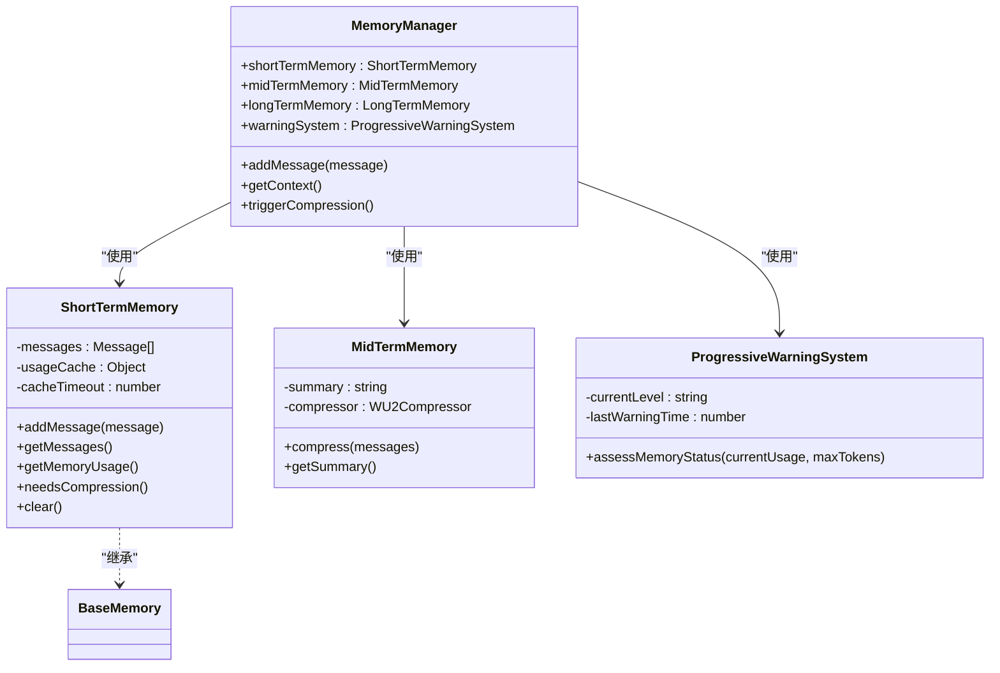
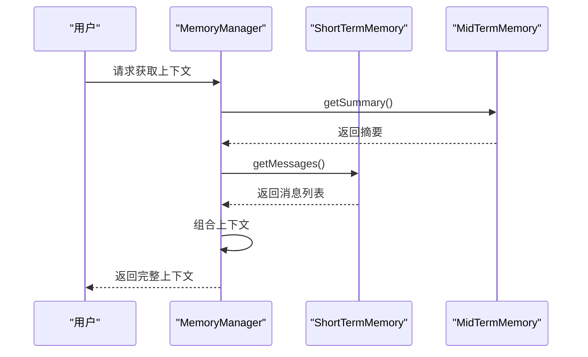

# 短期记忆

<cite>
**Referenced Files in This Document**   
- [ShortTermMemory.js](file://context-claude-code/src/memory/ShortTermMemory.js)
- [MemoryManager.js](file://context-claude-code/src/memory/MemoryManager.js)
- [BaseMemory.js](file://context-claude-code/src/memory/BaseMemory.js)
- [types/index.js](file://context-claude-code/src/types/index.js)
- [MidTermMemory.js](file://context-claude-code/src/memory/MidTermMemory.js)
- [ProgressiveWarningSystem.js](file://context-claude-code/src/warning/ProgressiveWarningSystem.js)
- [ClaudeContextManager.js](file://context-claude-code/src/claude-core/ClaudeContextManager.js)
</cite>

## 目录
1. [引言](#引言)
2. [核心设计与架构](#核心设计与架构)
3. [实现机制详解](#实现机制详解)
4. [与MemoryManager的交互](#与memorymanager的交互)
5. [上下文压缩与警告系统](#上下文压缩与警告系统)
6. [UML类图](#uml类图)
7. [上下文读取流程](#上下文读取流程)
8. [结论](#结论)

## 引言

短期记忆（ShortTermMemory）是三层记忆架构中最活跃的层，其设计目的是在内存中高效管理当前AI会话的实时上下文数据。作为系统的核心工作区，短期记忆层提供了极低的访问延迟和高性能的数据处理能力，确保了AI助手能够快速响应用户请求并维持流畅的对话体验。该层的设计灵感来源于人类大脑的短期记忆机制，专注于存储和处理当前会话中的关键信息，为AI的实时决策和响应提供支持。

**Section sources**
- [ShortTermMemory.js](file://context-claude-code/src/memory/ShortTermMemory.js#L1-L20)

## 核心设计与架构

短期记忆层的设计基于`BaseMemory`基类，继承了其基本的内存管理功能，并通过`MemoryTier.SHORT_TERM`枚举值明确标识其在三层架构中的层级。其核心数据结构是一个消息队列（`this.messages`），采用数组实现，以确保O(1)时间复杂度的添加和访问操作。这种设计使得新消息可以被快速追加到队列末尾，而历史消息的检索也能高效完成。

该层的配置参数在构造函数中定义，包括`maxTokens`（最大token容量，默认200,000）、`compressionThreshold`（压缩阈值，默认0.92）和`cacheTimeout`（缓存超时时间，默认5秒）。这些参数共同决定了短期记忆的行为模式，例如何时触发压缩以及如何优化性能。通过将配置作为参数传入，系统实现了高度的灵活性和可定制性，允许根据不同的应用场景调整其行为。

**Section sources**
- [ShortTermMemory.js](file://context-claude-code/src/memory/ShortTermMemory.js#L12-L30)
- [types/index.js](file://context-claude-code/src/types/index.js#L19-L23)
- [BaseMemory.js](file://context-claude-code/src/memory/BaseMemory.js#L13-L193)

## 实现机制详解

### 数据结构与性能优化

短期记忆的核心数据结构是`this.messages`数组，它直接存储了会话中的所有消息对象。为了优化性能，系统引入了`this.usageCache`对象，用于缓存当前的token使用量。该缓存包含`tokens`（已使用token数）、`lastUpdated`（最后更新时间戳）和`dirty`（脏数据标志）三个字段。当有新消息添加时，`dirty`标志被置为`true`，表示缓存已过期。在下次查询使用量时，系统会检查缓存的有效性：如果缓存未过期且非脏数据，则直接返回缓存值；否则，将重新计算并更新缓存。

### Token使用量计算（VE函数）

获取内存使用情况的核心方法是`getMemoryUsage()`，也称为“VE函数”。该函数首先检查缓存的有效性，若有效则直接返回结果。若缓存失效，系统会执行一个高效的反向遍历算法：从消息队列的末尾（最新消息）开始向前遍历，寻找包含`usage`字段的消息。一旦找到，便通过`validateUsageData()`（HY5函数）进行三重验证，确保数据的完整性和准确性，然后调用`zY5()`函数精确计算总token数。这种反向遍历策略极大地提升了效率，因为`usage`信息通常存在于最近的AI回复中。如果遍历完整个队列仍未找到`usage`信息，系统将退化为手动计算所有消息的token。

### 压缩触发机制（yW5函数）

`needsCompression()`方法，即“yW5函数”，负责检查是否需要启动压缩流程。它通过调用`getMemoryUsage()`获取当前使用百分比，并与`compressionThreshold`（默认92%）进行比较。一旦使用率超过阈值，系统会立即记录日志并返回`true`，触发后续的压缩操作。这种基于容量的过期策略是防止内存溢出的关键防线。

**Section sources**
- [ShortTermMemory.js](file://context-claude-code/src/memory/ShortTermMemory.js#L69-L192)

## 与MemoryManager的交互

短期记忆层并非独立运行，而是作为`MemoryManager`（记忆管理器）的一部分，与其紧密协作。`MemoryManager`是整个三层记忆架构的协调中心，它在初始化时会创建`ShortTermMemory`、`MidTermMemory`和`LongTermMemory`的实例。

当用户添加一条新消息时，`MemoryManager`的`addMessage()`方法首先将其添加到`ShortTermMemory`中。随后，它会立即调用`ShortTermMemory.needsCompression()`检查是否需要压缩。如果返回`true`，`MemoryManager`将调用其`triggerCompression()`方法，启动整个压缩流程。此流程包括：从`ShortTermMemory`获取所有消息，交由`MidTermMemory`进行压缩生成摘要，清空`ShortTermMemory`以释放空间，并将有价值的摘要存入`LongTermMemory`。

此外，`MemoryManager`还负责组合最终的上下文。`getContext()`方法会首先尝试从`MidTermMemory`获取历史对话摘要，并将其作为系统消息插入。然后，它会将`ShortTermMemory`中的所有实时消息追加到上下文末尾。这种设计确保了AI既能了解长期的历史背景，又能专注于当前的对话细节。

**Section sources**
- [MemoryManager.js](file://context-claude-code/src/memory/MemoryManager.js#L62-L94)
- [MemoryManager.js](file://context-claude-code/src/memory/MemoryManager.js#L149-L183)
- [MemoryManager.js](file://context-claude-code/src/memory/MemoryManager.js#L100-L143)

## 上下文压缩与警告系统

短期记忆层在上下文压缩和渐进式警告系统中扮演着核心角色。如前所述，当`ShortTermMemory`的使用率达到92%的阈值时，会触发压缩流程。这个阈值是经过精心设计的“魔法阈值”，旨在平衡信息保留和性能开销。

与此同时，`MemoryManager`集成了`ProgressiveWarningSystem`（渐进式警告系统）。该系统会定期评估`ShortTermMemory`的使用情况，并根据三个层级的阈值发出警告：
- **60% (_W5)**：发出“记忆使用量较高”的温和提醒。
- **80% (jW5)**：发出“记忆空间紧张，建议手动整理”的紧急警告。
- **92% (h11)**：触发“记忆空间已满，正在整理...”的临界警告，并自动启动压缩。

这种三级预警机制为用户和系统本身提供了充足的缓冲时间，确保了用户体验的平稳过渡。

**Section sources**
- [ShortTermMemory.js](file://context-claude-code/src/memory/ShortTermMemory.js#L181-L192)
- [ProgressiveWarningSystem.js](file://context-claude-code/src/warning/ProgressiveWarningSystem.js#L55-L147)

**Diagram sources **
- [MemoryManager.js](file://context-claude-code/src/memory/MemoryManager.js#L15-L365)
- [ShortTermMemory.js](file://context-claude-code/src/memory/ShortTermMemory.js#L12-L334)
- [MidTermMemory.js](file://context-claude-code/src/memory/MidTermMemory.js#L15-L411)
- [ProgressiveWarningSystem.js](file://context-claude-code/src/warning/ProgressiveWarningSystem.js#L15-L480)

## 上下文读取流程

**Diagram sources **
- [MemoryManager.js](file://context-claude-code/src/memory/MemoryManager.js#L100-L143)
- [ShortTermMemory.js](file://context-claude-code/src/memory/ShortTermMemory.js#L130-L135)
- [MidTermMemory.js](file://context-claude-code/src/memory/MidTermMemory.js#L150-L155)

## 结论

短期记忆层是三层记忆架构的基石，它通过高效的数据结构和智能的管理策略，成功地在内存中实现了对实时上下文数据的高性能管理。其基于时间（缓存超时）和容量（92%阈值）的双重过期策略，确保了系统的稳定性和响应速度。通过与`MemoryManager`和`ProgressiveWarningSystem`的深度集成，短期记忆不仅是一个简单的数据存储层，更是一个智能的、可预测的、用户友好的上下文管理核心。其设计充分体现了在复杂系统中平衡性能、容量和用户体验的工程智慧。