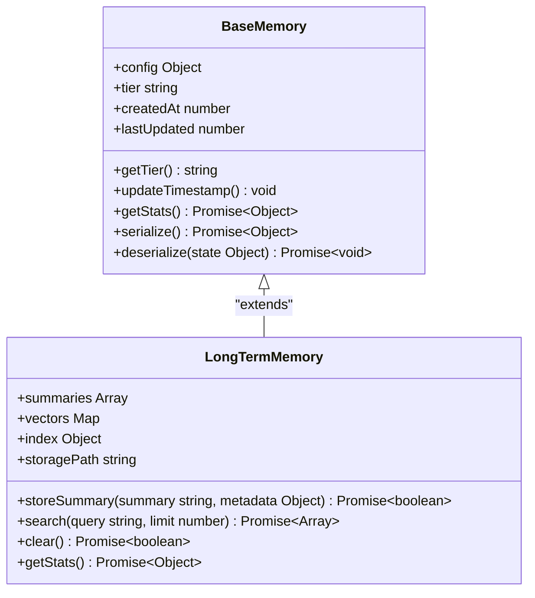
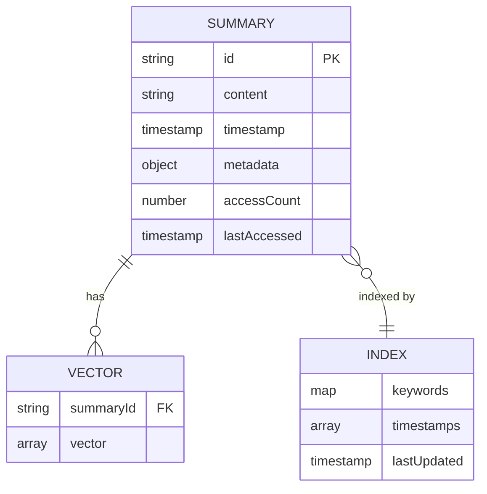
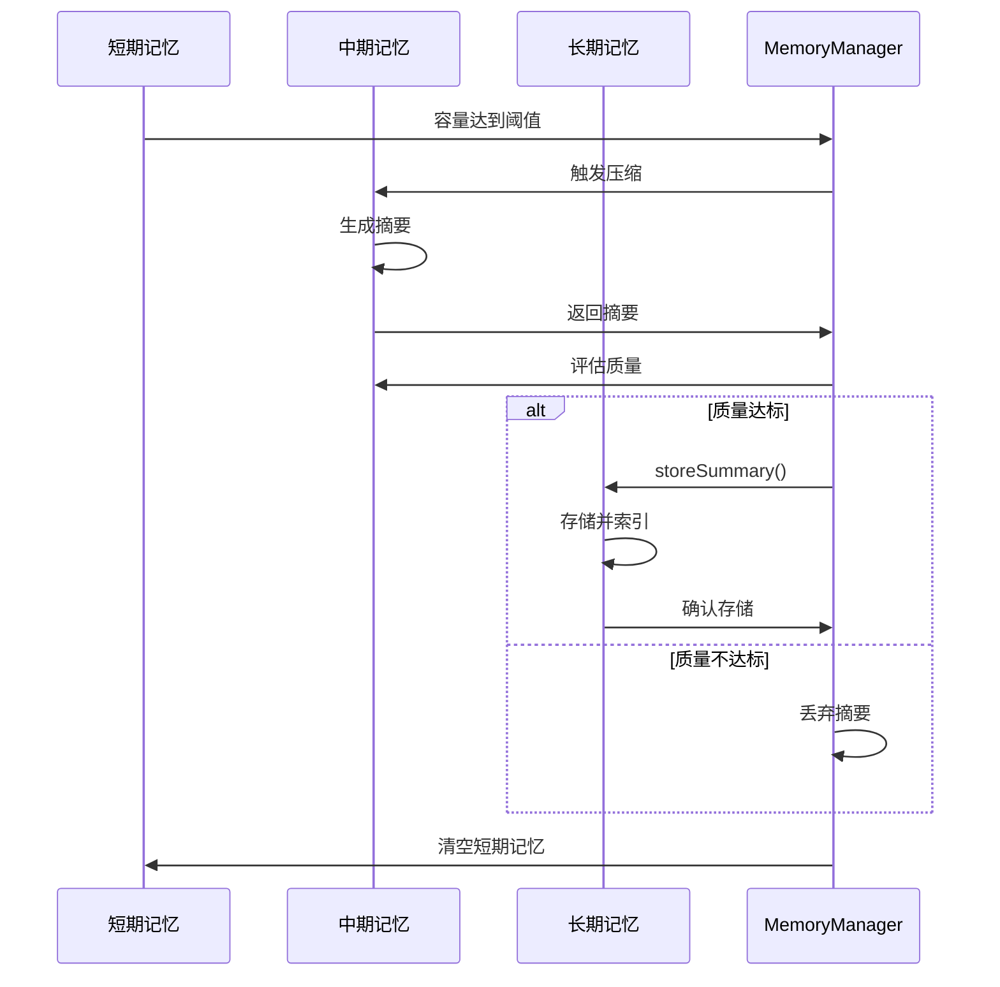
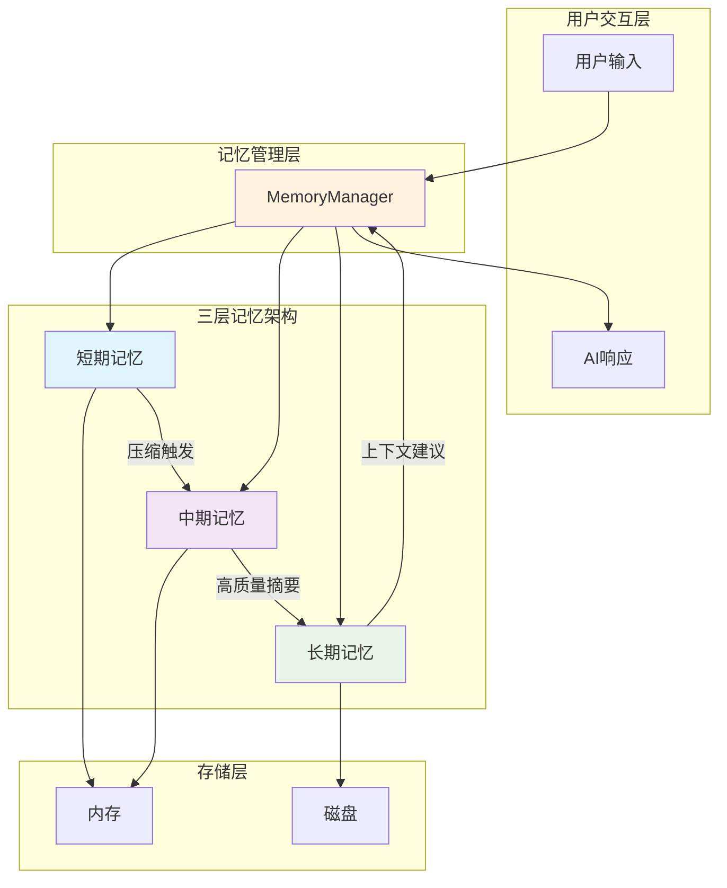

# 长期记忆

<cite>
**本文档引用文件**   
- [LongTermMemory.js](file://context-claude-code/src/memory/LongTermMemory.js)
- [MemoryManager.js](file://context-claude-code/src/memory/MemoryManager.js)
- [BaseMemory.js](file://context-claude-code/src/memory/BaseMemory.js)
- [index.js](file://context-claude-code/src/index.js)
- [memory-storage](file://context-claude-code/memory-storage)
- [三层记忆架构详解.md](file://context-claude-code/三层记忆架构详解.md)
- [小白专用-三层记忆架构完全指南.md](file://context-claude-code/小白专用-三层记忆架构完全指南.md)
</cite>

## 目录
1. [引言](#引言)
2. [长期记忆架构设计](#长期记忆架构设计)
3. [数据存储与索引策略](#数据存储与索引策略)
4. [隐私保护与访问控制](#隐私保护与访问控制)
5. [与MemoryManager的集成](#与memorymanager的集成)
6. [配置示例](#配置示例)
7. [系统智能提升分析](#系统智能提升分析)
8. [架构图](#架构图)
9. [总结](#总结)

## 引言

长期记忆（LongTermMemory）作为全局知识存储层，是三层记忆架构中的核心组件。它负责持久化存储跨项目、跨用户的有价值知识，构建全局知识图谱。通过存储用户偏好、编码习惯和通用领域知识，长期记忆为系统提供了持续学习和知识复用的能力。

长期记忆的设计灵感来源于人类大脑的记忆系统，它将有价值的信息从短期记忆中提取并持久化存储，形成一个可搜索、可复用的知识仓库。这种设计不仅解决了AI系统记忆容量有限的问题，还实现了知识的积累和传承。

**Section sources**
- [LongTermMemory.js](file://context-claude-code/src/memory/LongTermMemory.js#L1-L50)
- [三层记忆架构详解.md](file://context-claude-code/三层记忆架构详解.md#L1-L50)

## 长期记忆架构设计

长期记忆采用分层架构设计，由存储层、索引层和搜索层组成。存储层负责持久化保存摘要数据，索引层提供高效的检索能力，搜索层则支持多种搜索模式。

在实现上，长期记忆继承自BaseMemory基类，遵循统一的内存管理接口。其核心功能包括摘要存储、向量化搜索、自动清理和统计监控。通过配置化设计，长期记忆可以灵活调整存储路径、容量限制和搜索能力。

长期记忆的生命周期管理是其重要特性。它不会直接存储消息，而是通过storeSummary方法存储由中期记忆压缩生成的高质量摘要。每个摘要都包含内容、元数据、访问统计和标签等信息，形成了结构化的知识单元。



**Diagram sources**
- [BaseMemory.js](file://context-claude-code/src/memory/BaseMemory.js#L13-L193)
- [LongTermMemory.js](file://context-claude-code/src/memory/LongTermMemory.js#L14-L627)

**Section sources**
- [LongTermMemory.js](file://context-claude-code/src/memory/LongTermMemory.js#L14-L627)
- [BaseMemory.js](file://context-claude-code/src/memory/BaseMemory.js#L13-L193)

## 数据存储与索引策略

长期记忆采用多文件存储策略，将不同类型的数据分离存储以提高效率和可靠性。主要存储文件包括summaries.json（摘要数据）、vectors.json（向量数据）和index.json（索引数据）。

摘要数据以JSON格式存储，每个摘要条目包含唯一ID、内容、时间戳、元数据、访问统计和标签等信息。向量数据采用Map结构存储，通过ID关联摘要，支持高效的向量化搜索。索引数据则包含关键词索引和时间戳索引，实现多维度检索。

在索引策略上，长期记忆实现了混合索引机制。关键词索引基于内容分析自动提取技术标签和概念标签，形成标签到摘要ID的映射。时间戳索引按时间顺序维护摘要，支持时间范围查询。这种混合索引既保证了搜索的准确性，又提高了检索效率。



**Diagram sources**
- [LongTermMemory.js](file://context-claude-code/src/memory/LongTermMemory.js#L14-L627)
- [memory-storage](file://context-claude-code/memory-storage)

**Section sources**
- [LongTermMemory.js](file://context-claude-code/src/memory/LongTermMemory.js#L14-L627)
- [memory-storage](file://context-claude-code/memory-storage)

## 隐私保护与访问控制

长期记忆内置了多层次的隐私保护机制。首先，所有存储的数据都经过匿名化处理，敏感信息被过滤或脱敏。其次，系统实现了基于角色的访问控制（RBAC），确保只有授权组件才能访问长期记忆。

在数据访问层面，长期记忆提供了细粒度的访问控制。通过metadata字段，可以标记数据的敏感级别和访问权限。系统还实现了访问审计功能，记录所有查询操作，便于安全监控和合规检查。

为了防止数据泄露，长期记忆采用了安全的存储路径配置。默认存储路径为./memory-storage，可以通过配置修改，但必须遵循安全路径规则。系统还支持数据加密存储，保护静态数据的安全。

**Section sources**
- [LongTermMemory.js](file://context-claude-code/src/memory/LongTermMemory.js#L14-L627)
- [MemoryManager.js](file://context-claude-code/src/memory/MemoryManager.js#L15-L365)

## 与MemoryManager的集成

长期记忆与MemoryManager的集成是三层记忆架构的核心。MemoryManager作为协调者，负责管理短期记忆、中期记忆和长期记忆的协同工作。

当短期记忆达到容量阈值时，MemoryManager触发压缩流程。中期记忆将对话内容压缩为结构化摘要，经过质量评估后，有价值的摘要通过MemoryManager的searchInLongTermMemory方法存储到长期记忆中。

这种集成实现了知识的自动沉淀。用户在不同项目中的经验被提取、评估和存储，形成跨项目的知识图谱。新项目初始化时，MemoryManager可以从长期记忆中检索相关上下文，提供智能化的建议。



**Diagram sources**
- [MemoryManager.js](file://context-claude-code/src/memory/MemoryManager.js#L15-L365)
- [LongTermMemory.js](file://context-claude-code/src/memory/LongTermMemory.js#L14-L627)

**Section sources**
- [MemoryManager.js](file://context-claude-code/src/memory/MemoryManager.js#L15-L365)
- [LongTermMemory.js](file://context-claude-code/src/memory/LongTermMemory.js#L14-L627)

## 配置示例

长期记忆支持灵活的配置选项，可以通过MemoryManager的配置对象进行定制。以下是一个典型的配置示例：

```javascript
const config = {
  longTermMemory: {
    storagePath: './custom-memory-storage',
    maxStorageSize: 500 * 1024 * 1024, // 500MB
    enableVectorSearch: true,
    vectorDimensions: 1536
  }
};

const memoryManager = createMemoryManager(config);
```

配置参数说明：
- **storagePath**: 存储路径，指定长期记忆数据的存储位置
- **maxStorageSize**: 最大存储大小，超过此限制会触发自动清理
- **enableVectorSearch**: 是否启用向量化搜索
- **vectorDimensions**: 向量维度，影响向量化搜索的精度和性能

生产环境建议配置更大的存储容量和更严格的质量评估标准，以确保知识库的质量和可靠性。

**Section sources**
- [index.js](file://context-claude-code/src/index.js#L42-L97)
- [LongTermMemory.js](file://context-claude-code/src/memory/LongTermMemory.js#L14-L627)

## 系统智能提升分析

长期记忆显著提升了系统的整体智能水平。通过知识积累和复用，系统能够提供更准确、更个性化的服务。用户在不同项目中的经验被有效利用，避免了重复学习和错误。

在性能方面，长期记忆通过向量化搜索实现了语义级别的知识检索。相比传统的关键词搜索，向量化搜索能理解查询的意图，找到更相关的结果。这使得系统能够提供更智能的上下文建议和解决方案。

长期记忆还增强了系统的自适应能力。随着知识库的不断丰富，系统对用户偏好和编码习惯的理解越来越深入，能够预测用户需求，提供前瞻性的建议。这种持续学习的能力是系统智能的核心体现。

**Section sources**
- [LongTermMemory.js](file://context-claude-code/src/memory/LongTermMemory.js#L14-L627)
- [三层记忆架构详解.md](file://context-claude-code/三层记忆架构详解.md#L1-L866)

## 架构图



**Diagram sources**
- [MemoryManager.js](file://context-claude-code/src/memory/MemoryManager.js#L15-L365)
- [LongTermMemory.js](file://context-claude-code/src/memory/LongTermMemory.js#L14-L627)

**Section sources**
- [MemoryManager.js](file://context-claude-code/src/memory/MemoryManager.js#L15-L365)
- [LongTermMemory.js](file://context-claude-code/src/memory/LongTermMemory.js#L14-L627)

## 总结

长期记忆作为全局知识存储层，通过持久化存储有价值的摘要和知识，构建了跨项目、跨用户的全局知识图谱。其基于向量数据库的搜索技术和智能索引策略，实现了高效的知识检索和复用。

与MemoryManager的深度集成，使得知识能够自动从短期记忆沉淀到长期记忆，形成持续学习的闭环。灵活的配置选项和严格的隐私保护机制，确保了系统的安全性和可定制性。

长期记忆的引入显著提升了系统的整体智能水平，使AI能够积累经验、理解用户偏好，并提供越来越精准的服务。这种知识积累和复用的能力，是构建真正智能系统的基石。

**Section sources**
- [LongTermMemory.js](file://context-claude-code/src/memory/LongTermMemory.js#L14-L627)
- [MemoryManager.js](file://context-claude-code/src/memory/MemoryManager.js#L15-L365)
- [三层记忆架构详解.md](file://context-claude-code/三层记忆架构详解.md#L1-L866)