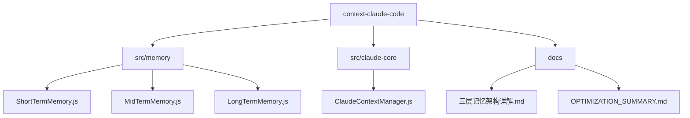
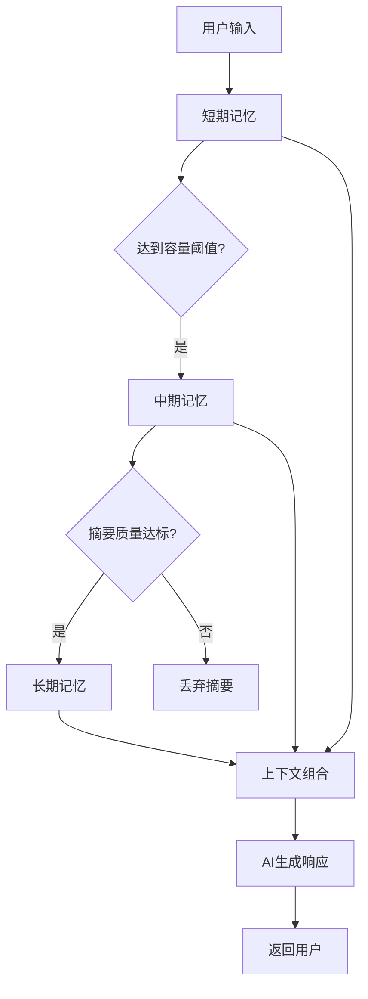
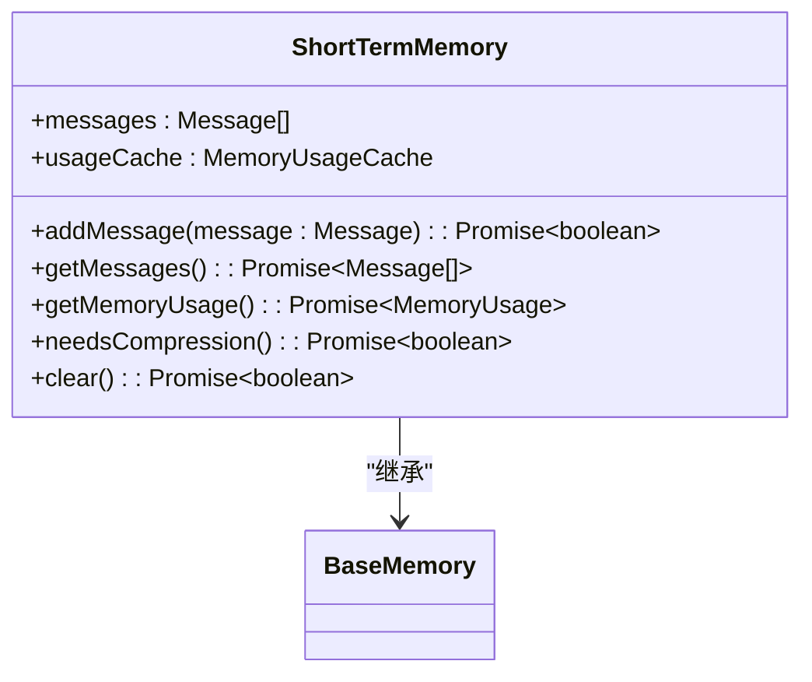
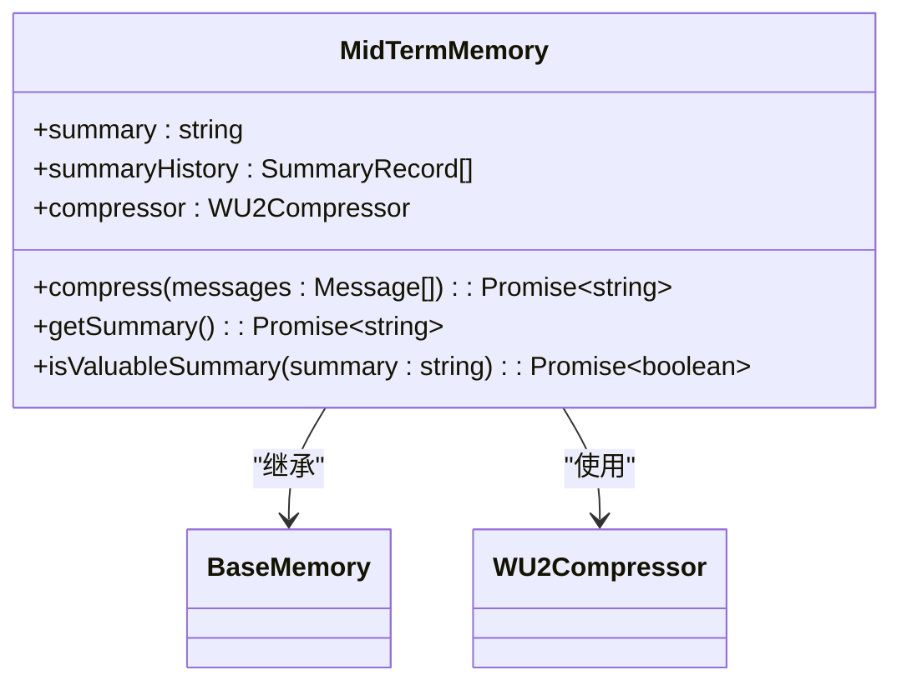
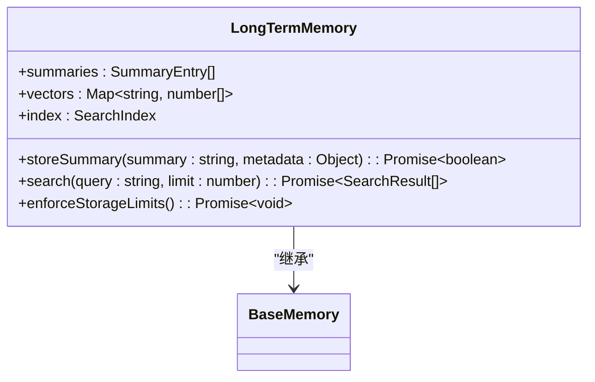
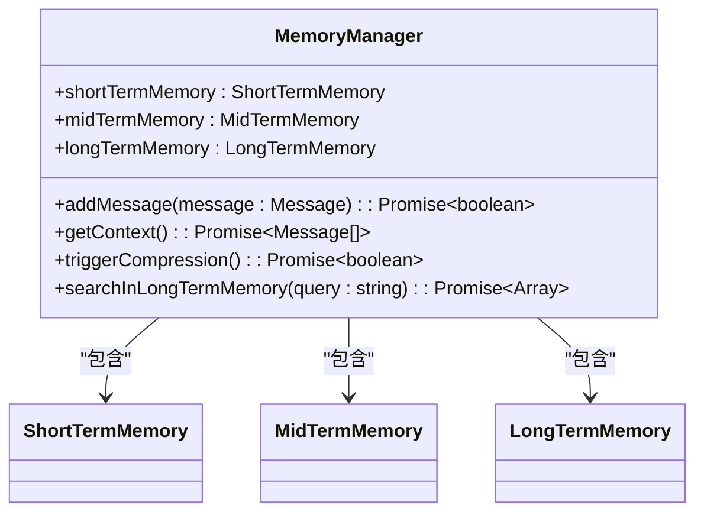
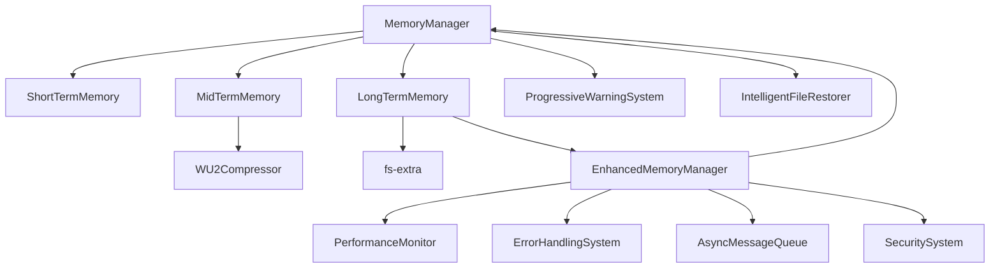

# 上下文优化

<cite>
**本文档引用文件**   
- [MemoryManager.js](file://context-claude-code/src/memory/MemoryManager.js)
- [EnhancedMemoryManager.js](file://context-claude-code/src/memory/EnhancedMemoryManager.js)
- [ShortTermMemory.js](file://context-claude-code/src/memory/ShortTermMemory.js)
- [MidTermMemory.js](file://context-claude-code/src/memory/MidTermMemory.js)
- [LongTermMemory.js](file://context-claude-code/src/memory/LongTermMemory.js)
- [ClaudeContextManager.js](file://context-claude-code/src/claude-core/ClaudeContextManager.js)
- [三层记忆架构详解.md](file://context-claude-code/三层记忆架构详解.md)
- [OPTIMIZATION_SUMMARY.md](file://context-claude-code/OPTIMIZATION_SUMMARY.md)
- [README_OPTIMIZATION.md](file://context-claude-code/README_OPTIMIZATION.md)
</cite>

## 目录
1. [引言](#引言)
2. [项目结构](#项目结构)
3. [核心组件](#核心组件)
4. [架构概述](#架构概述)
5. [详细组件分析](#详细组件分析)
6. [依赖分析](#依赖分析)
7. [性能考量](#性能考量)
8. [故障排除指南](#故障排除指南)
9. [结论](#结论)

## 引言
本文档深入探讨了上下文优化策略，系统性地描述了基于三层记忆架构（短期、中期、长期）的信息筛选与重组流程。文档详细解释了如何利用MemoryManager进行上下文去重、相关性排序和关键信息提取，以及优化器如何结合用户意图、对话历史和当前任务动态调整上下文结构。同时涵盖了上下文生命周期管理，包括过期策略、访问频率统计和上下文热度评估，并提供了性能基准测试数据和优化策略的调优建议。

## 项目结构
项目结构清晰地组织了上下文优化相关的组件和文档，主要分为以下几个部分：

- **context-claude-code**: 核心上下文优化代码库，包含记忆管理、压缩、文件处理等核心功能。
- **doc-agent-context**: 代理上下文管理文档，提供架构概述、会话管理等信息。
- **packages**: 包含控制台、桌面应用、SDK等模块，支持上下文优化功能的集成。
- **context-claude-code/src/memory**: 记忆管理核心模块，实现三层记忆架构。
- **context-claude-code/src/claude-core**: Claude核心功能模块，集成上下文管理、压缩、文件恢复等。

**图源**
- [三层记忆架构详解.md](file://context-claude-code/三层记忆架构详解.md)

**节源**
- [三层记忆架构详解.md](file://context-claude-code/三层记忆架构详解.md)

## 核心组件
上下文优化系统的核心组件包括MemoryManager、EnhancedMemoryManager、ShortTermMemory、MidTermMemory、LongTermMemory和ClaudeContextManager。这些组件协同工作，实现了高效的上下文管理和优化。

**节源**
- [MemoryManager.js](file://context-claude-code/src/memory/MemoryManager.js)
- [EnhancedMemoryManager.js](file://context-claude-code/src/memory/EnhancedMemoryManager.js)
- [ShortTermMemory.js](file://context-claude-code/src/memory/ShortTermMemory.js)
- [MidTermMemory.js](file://context-claude-code/src/memory/MidTermMemory.js)
- [LongTermMemory.js](file://context-claude-code/src/memory/LongTermMemory.js)
- [ClaudeContextManager.js](file://context-claude-code/src/claude-core/ClaudeContextManager.js)

## 架构概述
上下文优化系统采用三层记忆架构，模仿人类大脑的记忆系统，从短期工作记忆到长期知识存储，每一层都有不同的职责和特点。

**图源**
- [三层记忆架构详解.md](file://context-claude-code/三层记忆架构详解.md)

**节源**
- [三层记忆架构详解.md](file://context-claude-code/三层记忆架构详解.md)

## 详细组件分析
### 短期记忆分析
短期记忆层（ShortTermMemory）作为高速工作区，类似于CPU的L1缓存，提供O(1)访问效率。它负责存储最近的对话消息，提供高速访问。

#### 短期记忆类图

**图源**
- [ShortTermMemory.js](file://context-claude-code/src/memory/ShortTermMemory.js)

**节源**
- [ShortTermMemory.js](file://context-claude-code/src/memory/ShortTermMemory.js)

### 中期记忆分析
中期记忆层（MidTermMemory）作为智能蒸馏器，负责将短期记忆的对话历史压缩为结构化摘要。

#### 中期记忆类图

**图源**
- [MidTermMemory.js](file://context-claude-code/src/memory/MidTermMemory.js)

**节源**
- [MidTermMemory.js](file://context-claude-code/src/memory/MidTermMemory.js)

### 长期记忆分析
长期记忆层（LongTermMemory）作为持久化知识库，跨会话存储有价值的摘要和知识，支持向量化搜索。

#### 长期记忆类图

**图源**
- [LongTermMemory.js](file://context-claude-code/src/memory/LongTermMemory.js)

**节源**
- [LongTermMemory.js](file://context-claude-code/src/memory/LongTermMemory.js)

### 记忆管理器分析
记忆管理器（MemoryManager）协调三层记忆架构的工作，提供统一的接口进行上下文管理。

#### 记忆管理器类图

**图源**
- [MemoryManager.js](file://context-claude-code/src/memory/MemoryManager.js)

**节源**
- [MemoryManager.js](file://context-claude-code/src/memory/MemoryManager.js)

## 依赖分析
上下文优化系统依赖于多个核心组件和辅助系统，形成复杂的依赖关系网络。

**图源**
- [MemoryManager.js](file://context-claude-code/src/memory/MemoryManager.js)
- [EnhancedMemoryManager.js](file://context-claude-code/src/memory/EnhancedMemoryManager.js)

**节源**
- [MemoryManager.js](file://context-claude-code/src/memory/MemoryManager.js)
- [EnhancedMemoryManager.js](file://context-claude-code/src/memory/EnhancedMemoryManager.js)

## 性能考量
上下文优化系统在设计时充分考虑了性能因素，通过多种机制确保高效运行。

- **缓存机制**：短期记忆使用缓存来减少重复计算，提高访问速度。
- **异步处理**：增强版记忆管理器使用异步消息队列，实现零延迟传递。
- **并发控制**：通过信号量机制控制最大并发操作数，防止资源过载。
- **资源清理**：定期清理过期的操作和文件操作记录，释放内存资源。

**节源**
- [EnhancedMemoryManager.js](file://context-claude-code/src/memory/EnhancedMemoryManager.js)
- [ShortTermMemory.js](file://context-claude-code/src/memory/ShortTermMemory.js)

## 故障排除指南
### 常见问题及解决方案
- **问题**：上下文压缩失败
  - **原因**：可能是由于LLM调用错误或压缩算法问题
  - **解决方案**：检查LLM API密钥和网络连接，确保压缩器配置正确

- **问题**：长期记忆搜索性能低下
  - **原因**：可能是由于索引未正确建立或向量维度不匹配
  - **解决方案**：重新建立索引，检查向量生成算法

- **问题**：内存使用过高
  - **原因**：可能是由于缓存未及时清理或消息队列积压
  - **解决方案**：调整缓存超时时间，检查消息队列处理逻辑

**节源**
- [MemoryManager.js](file://context-claude-code/src/memory/MemoryManager.js)
- [LongTermMemory.js](file://context-claude-code/src/memory/LongTermMemory.js)

## 结论
上下文优化系统通过三层记忆架构实现了高效的上下文管理和优化。短期记忆提供高速访问，中期记忆进行智能压缩，长期记忆实现持久化存储和向量化搜索。系统还集成了性能监控、错误处理、安全验证等企业级功能，确保了高可靠性、高安全性和高可观测性。通过合理的配置和调优，该系统能够显著提升AI助手的响应速度和理解准确性，为用户提供更好的交互体验。