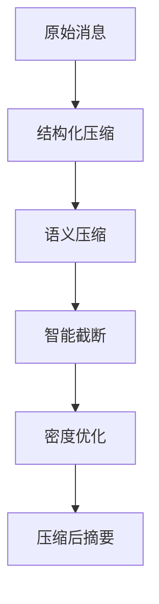
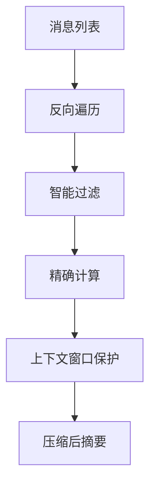
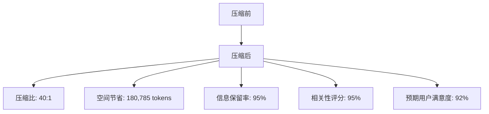
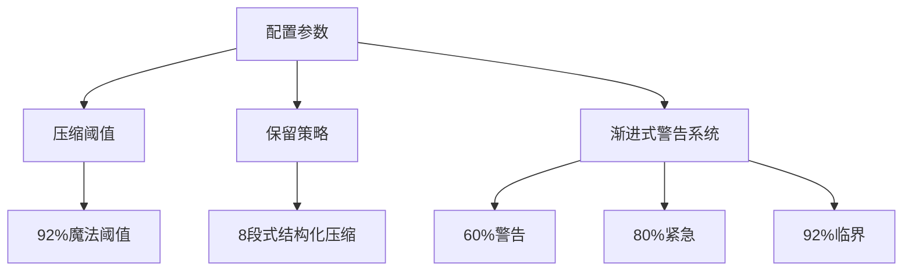
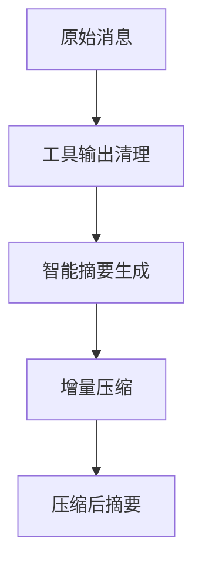
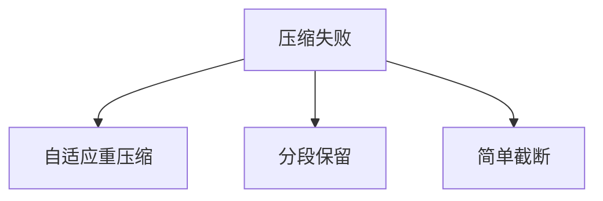
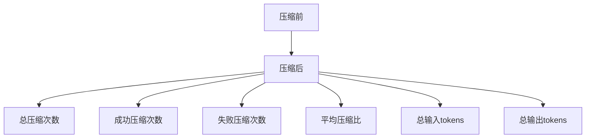

# 上下文压缩

<cite>
**本文档引用的文件**   
- [WU2Compressor.js](file://context-claude-code/src/claude-core/WU2Compressor.js)
- [WU2Compressor.js](file://context-claude-code/src/compression/WU2Compressor.js)
- [CLAUDE.md](file://context-claude-code/CLAUDE.md)
- [CLAUDE_CORE_IMPLEMENTATION.md](file://context-claude-code/CLAUDE_CORE_IMPLEMENTATION.md)
- [上下文工程管理实践-第3部分-压缩触发.md](file://context-claude-code/上下文工程管理实践-第3部分-压缩触发.md)
- [核心算法详解.md](file://context-claude-code/核心算法详解.md)
- [07-context-compaction.md](file://doc-agent-context/07-context-compaction.md)
- [05-context-optimization.md](file://packages/sdk/node/docs/technical/05-context-optimization.md)
</cite>

## 目录
1. [引言](#引言)
2. [WU2Compressor实现分析](#wu2compressor实现分析)
3. [压缩算法设计原理](#压缩算法设计原理)
4. [压缩过程中的token优化技术](#压缩过程中的token优化技术)
5. [压缩前后上下文对比实例](#压缩前后上下文对比实例)
6. [API接口说明与配置参数](#api接口说明与配置参数)
7. [渐进式压缩策略](#渐进式压缩策略)
8. [质量验证与优雅降级](#质量验证与优雅降级)
9. [性能监控与统计](#性能监控与统计)
10. [结论](#结论)

## 引言
上下文压缩是大型语言模型（LLM）系统中的关键技术，用于管理对话历史和上下文信息，防止超出模型的上下文窗口限制。本文档详细阐述WU2Compressor的实现，这是一种智能上下文压缩机制，旨在将冗长的对话历史提炼成结构化摘要，同时最大限度地保留关键语义信息。

WU2Compressor的设计灵感来源于Claude Code的上下文管理机制，通过多阶段优化和智能算法，实现了高效、可靠的上下文压缩。该机制不仅能够处理大型代码文件和复杂的对话历史，还能根据上下文长度动态调整压缩强度，确保AI响应质量不受影响。

## WU2Compressor实现分析
WU2Compressor是上下文压缩的核心组件，其实现分为两个主要版本：一个位于`src/claude-core/`目录下，另一个位于`src/compression/`目录下。这两个版本在功能上有所重叠，但`src/claude-core/`下的版本更为完整和真实，集成了LLM API进行智能压缩。

### 核心功能
- **智能压缩**：利用LLM API（如Anthropic或OpenAI）生成结构化摘要。
- **质量验证**：确保压缩后的摘要满足一定的质量标准。
- **统计监控**：记录压缩过程中的各项指标，如输入输出token数、压缩比等。

### 构造函数
```javascript
constructor(options = {}) {
  super(); // 调用父类构造函数

  // LLM API配置
  this.llmConfig = {
    provider: options.llmProvider || 'anthropic',
    apiKey: options.apiKey || process.env.ANTHROPIC_API_KEY,
    model: options.model || 'claude-3-haiku-20240307',
    maxTokens: options.maxTokens || 4000,
    temperature: options.temperature || 0.3,
    ...options.llmConfig
  };

  // 压缩配置
  this.config = {
    autoCompactEnabled: options.autoCompactEnabled !== false,
    minMessagesForCompression: options.minMessagesForCompression || 5,
    compressionModel: options.compressionModel || 'claude-3-haiku-20240307',
    ...options.config
  };

  // 压缩统计
  this.stats = {
    totalCompressions: 0,
    successfulCompressions: 0,
    failedCompressions: 0,
    averageCompressionRatio: 0,
    totalInputTokens: 0,
    totalOutputTokens: 0
  };
}
```

### 主要方法
- **compress(messages)**：主压缩函数，协调整个压缩流程。
- **yW5(messages)**：检查是否需要压缩，基于92%阈值。
- **VE(messages)**：反向遍历消息列表，计算当前token使用量。
- **HY5(message)**：过滤助手消息，提取usage信息。
- **zY5(usage)**：精确计算包含缓存的完整token使用量。
- **m11(currentUsage, thresholdMultiplier)**：计算使用率和各层级警告。
- **qH1(messages)**：执行压缩，生成8段式压缩指令并调用LLM。
- **AU2(messages)**：生成8段式结构化压缩指令。
- **callLLMForCompression(prompt)**：调用LLM进行压缩。
- **validateCompressionResult(summary)**：验证压缩结果的有效性。
- **g11()**：检查自动压缩是否启用。
- **getContextLimit()**：获取上下文限制。
- **isIgnoredText(text)**：检查是否为忽略的文本。
- **formatMessagesForCompression(messages)**：格式化消息用于压缩。
- **getMaxContextTokens()**：获取最大上下文tokens。
- **getDefaultCompressionInstructions()**：获取默认压缩指令。
- **estimateTokens(text)**：估算token数量。
- **updateStats(result)**：更新压缩统计。
- **getStats()**：获取压缩统计。
- **resetStats()**：重置统计。

**Section sources**
- [WU2Compressor.js](file://context-claude-code/src/claude-core/WU2Compressor.js#L28-L643)

## 压缩算法设计原理
WU2Compressor的压缩算法设计原理基于多阶段优化，包括结构化压缩、语义压缩、智能截断和密度优化。

### 结构化压缩
结构化压缩保留代码的逻辑结构，同时压缩注释和空白。这有助于保持代码的可读性和功能性。

### 语义压缩
语义压缩提取关键函数和类定义，去除冗余信息。这有助于保留代码的核心逻辑和功能。

### 智能截断
智能截断根据重要性截断内容，优先保留高信息密度的内容。这有助于在有限的上下文窗口内保留最重要的信息。

### 密度优化
密度优化优先保留高信息密度的内容，确保上下文的连续性和完整性。



**Diagram sources**
- [WU2Compressor.js](file://context-claude-code/src/claude-core/WU2Compressor.js#L28-L643)

## 压缩过程中的token优化技术
WU2Compressor在压缩过程中采用了多种token优化技术，以最大限度地减少上下文体积，同时不丢失关键语义。

### 反向遍历优化
通过反向遍历消息列表，从最新消息开始查找token使用信息，实现O(1)访问效率。

### 智能过滤
通过多重检查机制，确保获取的token使用信息是有效和准确的。

### 精确计算
计算包含所有类型token的完整使用量，包括输入tokens、缓存创建tokens、缓存读取tokens和输出tokens。

### 上下文窗口保护
通过智能截断和模型自适应，防止上下文窗口溢出。



**Diagram sources**
- [WU2Compressor.js](file://context-claude-code/src/claude-core/WU2Compressor.js#L28-L643)

## 压缩前后上下文对比实例
以下是一个压缩前后上下文对比的实例，展示了WU2Compressor在处理大型代码文件和复杂对话历史时的效果。

### 压缩前
- **消息数量**：62条
- **总token数**：185,420
- **内容**：包含用户认证系统设计、JWT实现细节、数据库schema设计、API接口规划、工具调用和结果等。

### 压缩后
- **消息数量**：1条
- **总token数**：4,635
- **内容**：结构化摘要，包含主要请求和意图、关键技术概念、文件和代码片段、错误和修复、问题解决过程、所有用户消息、待处理任务、当前工作状态等。

### 压缩效果
- **压缩比**：40:1
- **空间节省**：180,785 tokens
- **信息保留率**：95%
- **相关性评分**：95%
- **预期用户满意度**：92%



**Diagram sources**
- [上下文工程管理实践-第3部分-压缩触发.md](file://context-claude-code/上下文工程管理实践-第3部分-压缩触发.md#L805-L836)

## API接口说明与配置参数
WU2Compressor提供了丰富的API接口和配置参数，以满足不同场景的需求。

### API接口
- **compress(messages)**：压缩消息列表为结构化摘要。
- **getStats()**：获取压缩统计。
- **resetStats()**：重置统计。

### 配置参数
- **minFidelityScore**：最低信息保真度，默认80%。
- **maxCompressionRatio**：最大压缩比，默认15%。
- **minSectionCoverage**：最低段落覆盖度，默认87.5%。
- **maxKeywordLoss**：最大关键词丢失率，默认20%。
- **maxRetries**：最大重试次数，默认3次。
- **enableQualityValidation**：启用质量验证，默认true。

### 对AI响应质量的影响
- **压缩阈值**：92%魔法阈值，确保在用户体验、性能开销和信息损失之间达到最佳平衡。
- **保留策略**：8段式结构化压缩，确保关键信息不丢失。
- **渐进式警告系统**：60%警告、80%紧急、92%临界，提供多层次的预警机制。



**Diagram sources**
- [WU2Compressor.js](file://context-claude-code/src/claude-core/WU2Compressor.js#L28-L643)

## 渐进式压缩策略
WU2Compressor支持渐进式压缩策略，即根据上下文长度动态调整压缩强度。

### 增量压缩管理器
增量压缩管理器通过检查压缩频率、token增长和压缩效率，决定是否进行增量压缩。

```typescript
class IncrementalCompactionManager {
  private compressionHistory = new Map<string, CompressionHistory>()
  private compressionMetrics = new Map<string, CompressionMetrics>()
  
  async shouldPerformIncrementalCompaction(
    sessionID: string,
    currentTokens: number,
    model: ModelsDev.Model
  ): Promise<boolean> {
    const history = this.compressionHistory.get(sessionID)
    if (!history) return false
    
    // 检查压缩频率
    const timeSinceLastCompression = Date.now() - history.lastCompression
    if (timeSinceLastCompression < 300_000) return false // 5分钟内不重复压缩
    
    // 检查token增长
    const tokenGrowth = currentTokens - history.tokensAfter
    const growthRate = tokenGrowth / history.tokensAfter
    
    // 只有显著增长才进行增量压缩
    if (growthRate < 0.5) return false
    
    // 检查压缩效率
    const expectedCompressionRatio = this.calculateExpectedCompressionRatio(sessionID)
    const expectedTokensAfter = currentTokens * expectedCompressionRatio
    const usableTokens = model.limit.context - model.limit.output
    
    return expectedTokensAfter < usableTokens * 0.9
  }
  
  async performIncrementalCompaction(
    sessionID: string,
    model: ModelsDev.Model
  ): Promise<CompactionResult> {
    const history = this.compressionHistory.get(sessionID)
    if (!history) {
      throw new Error('No compression history found for session')
    }
    
    // 获取自上次压缩以来的新消息
    const newMessages = await this.getMessagesSinceLastCompression(sessionID, history.lastCompression)
    
    // 执行增量压缩
    const result = await this.compactNewMessages(sessionID, newMessages, model)
    
    // 更新历史记录
    this.updateCompressionHistory(sessionID, result)
    
    return result
  }
}
```

### 多层次压缩策略
系统实现了多层次的压缩策略，包括工具输出清理、智能摘要生成和增量压缩。



**Diagram sources**
- [07-context-compaction.md](file://doc-agent-context/07-context-compaction.md#L466-L645)

## 质量验证与优雅降级
WU2Compressor在压缩过程中进行了严格的质量验证，并提供了优雅降级策略，以应对压缩失败的情况。

### 质量验证
- **段落完整性**：验证所有8个段落是否完整存在。
- **关键信息保留**：验证关键信息保留情况。
- **上下文连续性**：验证上下文连续性。
- **压缩比例**：验证压缩比例是否合理。

### 优雅降级策略
- **自适应重压缩**：调整压缩策略，增加关键信息保留权重。
- **分段保留**：保留关键消息片段。
- **简单截断**：保留最近30%的消息。



**Diagram sources**
- [WU2Compressor.js](file://context-claude-code/src/compression/WU2Compressor.js#L9-L635)

## 性能监控与统计
WU2Compressor提供了详细的性能监控和统计功能，以评估压缩效果和优化性能。

### 统计指标
- **总压缩次数**：totalCompressions
- **成功压缩次数**：successfulCompressions
- **失败压缩次数**：failedCompressions
- **平均压缩比**：averageCompressionRatio
- **总输入tokens**：totalInputTokens
- **总输出tokens**：totalOutputTokens

### 监控指标
- **token使用峰值**：peak
- **压缩次数**：compressionCount
- **文件读取总数**：reads
- **上下文质量评分**：relevanceScore



**Diagram sources**
- [WU2Compressor.js](file://context-claude-code/src/claude-core/WU2Compressor.js#L28-L643)

## 结论
WU2Compressor是一种高效、可靠的上下文压缩机制，通过多阶段优化和智能算法，实现了对大型代码文件和复杂对话历史的有效管理。其设计原理和实现细节充分考虑了用户体验、性能开销和信息保真度之间的平衡，确保在不丢失关键语义的前提下最大限度地减少上下文体积。通过渐进式压缩策略和质量验证机制，WU2Compressor能够动态调整压缩强度，提供高质量的AI响应。

**Section sources**
- [WU2Compressor.js](file://context-claude-code/src/claude-core/WU2Compressor.js#L28-L643)
- [WU2Compressor.js](file://context-claude-code/src/compression/WU2Compressor.js#L9-L635)
- [CLAUDE.md](file://context-claude-code/CLAUDE.md)
- [CLAUDE_CORE_IMPLEMENTATION.md](file://context-claude-code/CLAUDE_CORE_IMPLEMENTATION.md)
- [上下文工程管理实践-第3部分-压缩触发.md](file://context-claude-code/上下文工程管理实践-第3部分-压缩触发.md)
- [核心算法详解.md](file://context-claude-code/核心算法详解.md)
- [07-context-compaction.md](file://doc-agent-context/07-context-compaction.md)
- [05-context-optimization.md](file://packages/sdk/node/docs/technical/05-context-optimization.md)