# 上下文提供者

<cite>
**本文档中引用的文件**  
- [provider.ts](file://packages/opencode/src/provider/provider.ts)
- [types.ts](file://packages/sdk/node/src/context/types.ts)
- [providers.ts](file://packages/sdk/node/src/context/providers.ts)
- [manager.ts](file://packages/sdk/node/src/context/manager.ts)
- [03-context-providers.md](file://packages/sdk/node/docs/technical/03-context-providers.md)
- [01-architecture-overview.md](file://packages/sdk/node/docs/technical/01-architecture-overview.md)
- [cache.ts](file://packages/sdk/node/src/context/cache.ts)
</cite>

## 目录
1. [简介](#简介)
2. [核心接口设计](#核心接口设计)
3. [内置上下文提供者实现](#内置上下文提供者实现)
4. [上下文管理与协调机制](#上下文管理与协调机制)
5. [自定义上下文提供者开发指南](#自定义上下文提供者开发指南)
6. [性能优化与缓存策略](#性能优化与缓存策略)
7. [会话生命周期中的调用时机](#会话生命周期中的调用时机)
8. [总结](#总结)

## 简介

上下文提供者（Context Providers）是OpenCode系统中插件式架构的核心组件，负责从多种来源收集和管理上下文数据。该系统通过模块化设计，支持从当前文件、Git状态、符号信息等多种来源动态获取上下文，为智能代码辅助提供丰富的环境信息。

上下文提供者系统采用标准化接口，允许不同类型的提供者协同工作。每个提供者专注于特定类型的上下文发现，如文件上下文提供者负责文件级别的上下文，符号上下文提供者处理代码符号，Git变更提供者跟踪代码库的变更历史。

**Section sources**
- [01-architecture-overview.md](file://packages/sdk/node/docs/technical/01-architecture-overview.md#L75-L106)
- [03-context-providers.md](file://packages/sdk/node/docs/technical/03-context-providers.md#L0-L58)

## 核心接口设计

上下文提供者系统的核心是`ContextProvider`接口，定义了所有提供者必须实现的标准方法。该接口确保了不同提供者之间的互操作性和一致性。

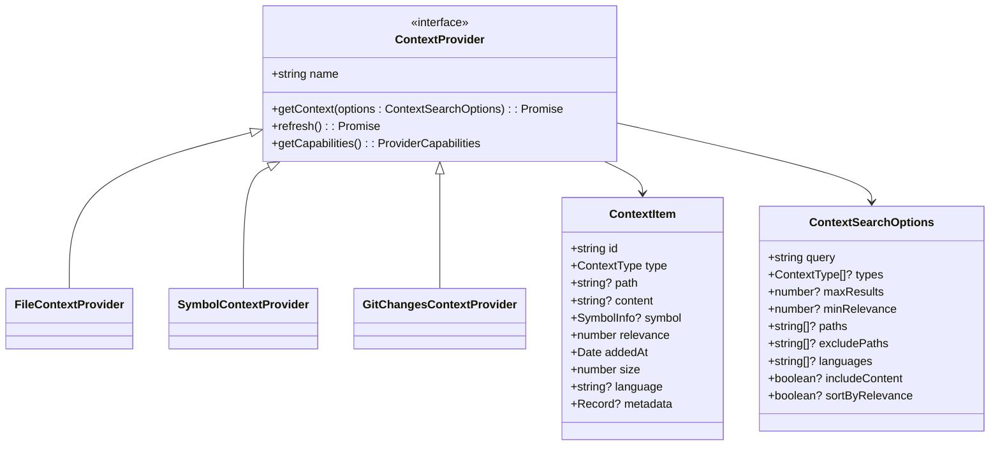

**Diagram sources**
- [types.ts](file://packages/sdk/node/src/context/types.ts#L4-L25)
- [types.ts](file://packages/sdk/node/src/context/types.ts#L191-L204)
- [types.ts](file://packages/sdk/node/src/context/types.ts#L93-L112)

### 接口方法说明

`ContextProvider`接口包含三个关键方法：

1. **getContext**: 根据搜索选项获取上下文项，返回Promise<ContextItem[]>。这是提供者的主要数据获取方法。
2. **refresh**: 刷新提供者的缓存或内部状态，确保数据的时效性。
3. **getCapabilities**: 返回提供者的能力描述，包括支持的上下文类型、语言和功能特性。

这些方法的设计遵循单一职责原则，每个方法都有明确的用途和返回类型，便于系统统一调用和管理。

**Section sources**
- [types.ts](file://packages/sdk/node/src/context/types.ts#L191-L204)
- [providers.ts](file://packages/sdk/node/src/context/providers.ts#L11-L103)

## 内置上下文提供者实现

系统提供了多个内置的上下文提供者，每种提供者专门处理特定类型的上下文数据。这些提供者通过统一的接口集成到上下文管理系统中。

### 文件上下文提供者

文件上下文提供者（FileContextProvider）负责发现和处理文件级别的上下文信息。它通过文件服务搜索文件系统，根据查询条件返回相关文件。

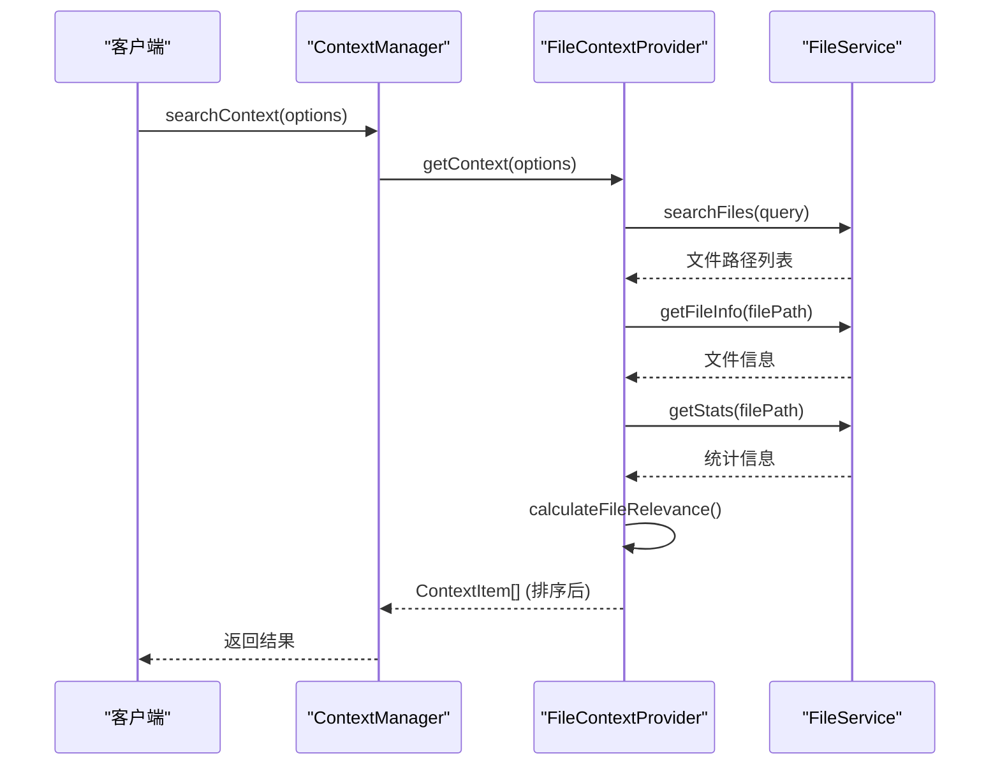

**Diagram sources**
- [providers.ts](file://packages/sdk/node/src/context/providers.ts#L11-L103)
- [manager.ts](file://packages/sdk/node/src/context/manager.ts#L23-L590)

### 符号上下文提供者

符号上下文提供者（SymbolContextProvider）专门处理代码符号（函数、类、接口等）的发现和分析。它通过查找服务搜索代码库中的符号，并提供丰富的元数据。

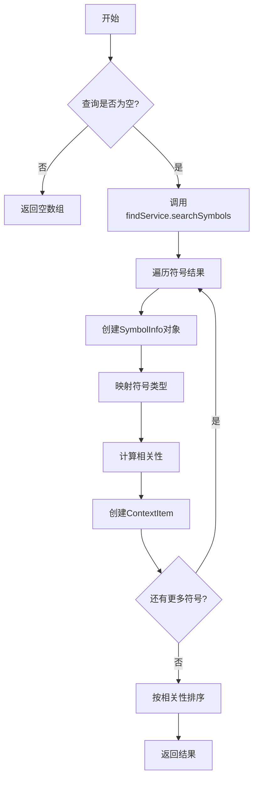

**Diagram sources**
- [providers.ts](file://packages/sdk/node/src/context/providers.ts#L108-L268)

### Git变更上下文提供者

Git变更上下文提供者（GitChangesContextProvider）负责发现和分析代码库的变更历史。它通过文件服务获取Git状态，识别最近修改的文件。

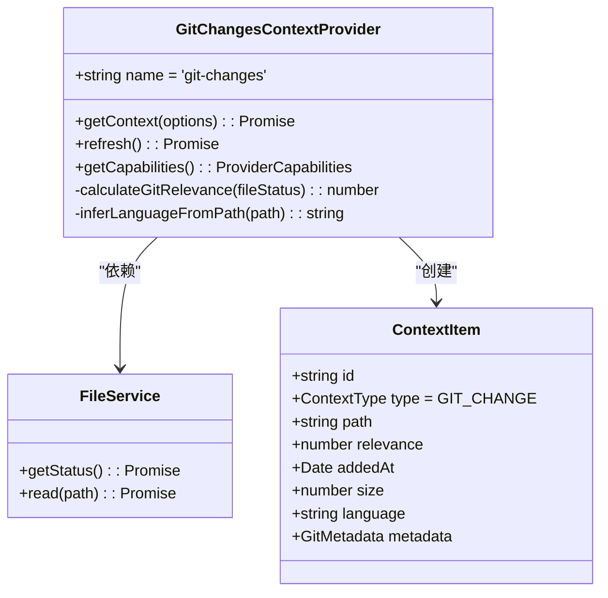

**Diagram sources**
- [providers.ts](file://packages/sdk/node/src/context/providers.ts#L273-L376)

## 上下文管理与协调机制

上下文管理系统负责协调多个提供者的工作，整合来自不同来源的上下文数据，并根据相关性进行优先级排序。

### 提供者工厂模式

系统使用工厂模式创建和管理上下文提供者。`ContextProviderFactory`负责创建默认的提供者实例，并可以根据配置进行定制。

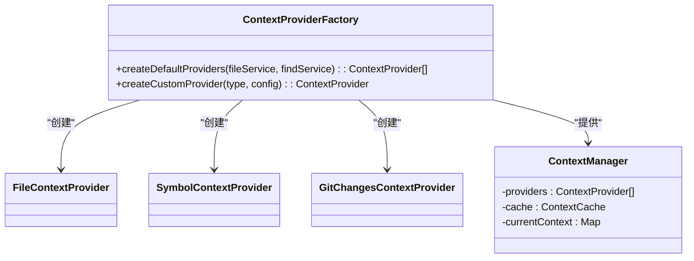

**Diagram sources**
- [providers.ts](file://packages/sdk/node/src/context/providers.ts#L382-L388)

### 动态加载与并行执行

上下文管理系统支持动态加载提供者，并能够并行执行多个提供者的查询操作，提高整体效率。

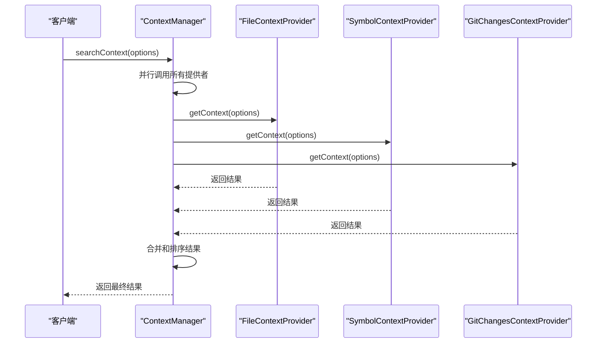

**Diagram sources**
- [manager.ts](file://packages/sdk/node/src/context/manager.ts#L23-L590)

## 自定义上下文提供者开发指南

开发者可以创建自定义的上下文提供者来扩展系统功能。本节提供开发自定义提供者的详细指南。

### 注册机制

自定义提供者需要实现`ContextProvider`接口，并通过配置系统注册。系统会自动发现和加载注册的提供者。

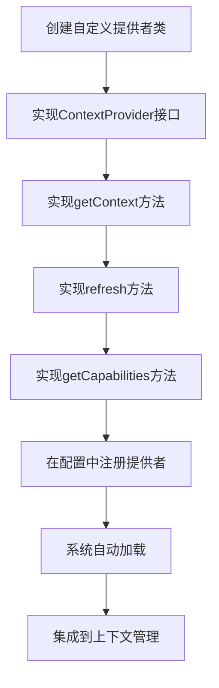

### 异步数据获取

所有上下文提供者的方法都必须是异步的，使用Promise返回结果。这确保了系统在处理耗时操作时不会阻塞。

```typescript
async getContext(options: ContextSearchOptions): Promise<ContextItem[]> {
  // 异步操作示例
  const data = await this.externalService.fetchData(options.query);
  return this.transformToContextItems(data);
}
```

### 错误处理

提供者需要妥善处理可能发生的错误，避免影响整个上下文系统的稳定性。

```mermaid
flowchart TD
A[开始getContext] --> B[执行数据获取]
B --> C{成功?}
C --> |是| D[返回ContextItem[]]
C --> |否| E[记录警告日志]
E --> F[返回空数组]
```

### 性能优化

自定义提供者应考虑性能优化，包括缓存策略、查询优化和资源管理。

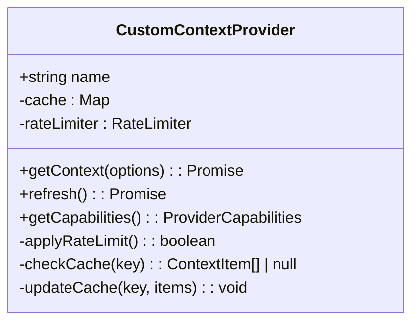

**Section sources**
- [03-context-providers.md](file://packages/sdk/node/docs/technical/03-context-providers.md#L563-L715)

## 性能优化与缓存策略

系统采用多层次的缓存策略来优化性能，减少重复的数据获取操作。

### 缓存实现

`ContextCache`接口定义了缓存的基本操作，包括获取、设置、删除和清除。

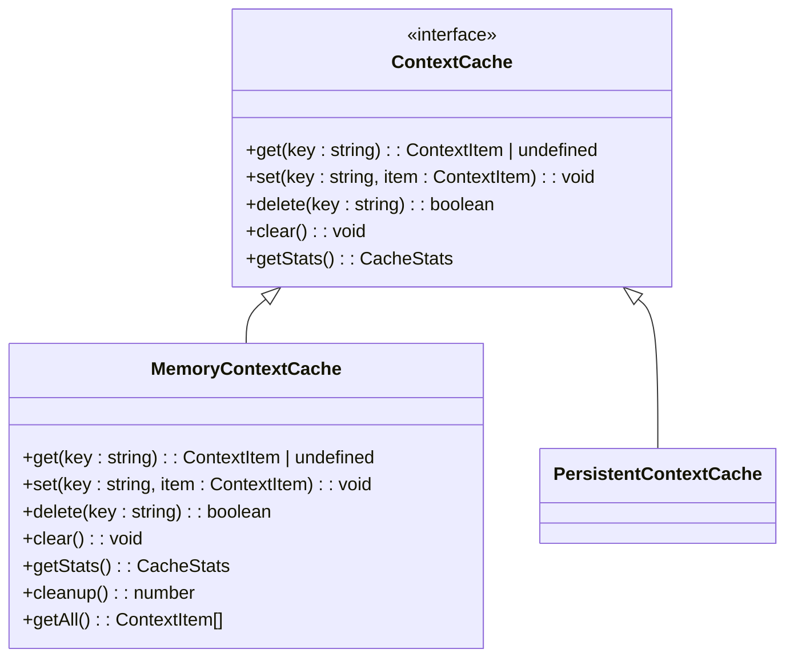

**Diagram sources**
- [cache.ts](file://packages/sdk/node/src/context/cache.ts#L62-L136)

### 缓存工厂

`ContextCacheFactory`提供创建不同类型缓存的静态方法，支持内存缓存和持久化缓存。

```typescript
class ContextCacheFactory {
  static createMemoryCache(maxSize?: number, ttl?: number): ContextCache
  static createPersistentCache(namespace: string, maxSize?: number, ttl?: number): ContextCache
}
```

**Section sources**
- [cache.ts](file://packages/sdk/node/src/context/cache.ts#L62-L136)

## 会话生命周期中的调用时机

上下文提供者在会话生命周期的不同阶段被调用，确保上下文信息的及时更新和有效性。

### 初始化阶段

在会话初始化时，上下文管理系统会创建所有配置的提供者实例。

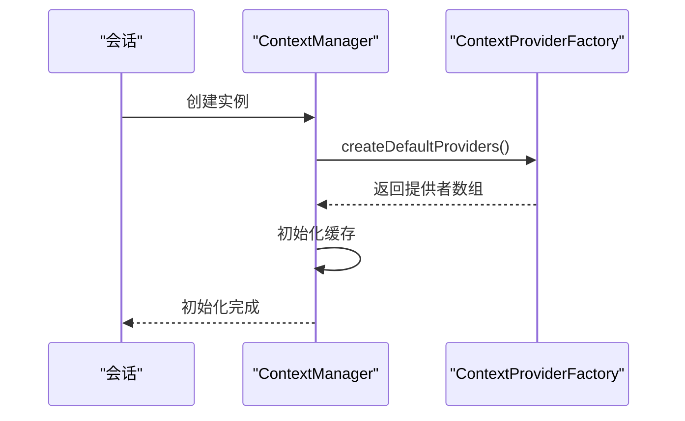

### 查询阶段

当用户发起查询时，所有相关提供者会被并行调用以获取上下文数据。

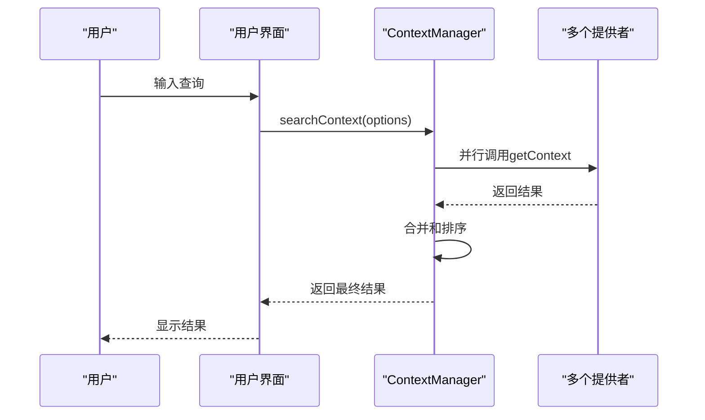

### 刷新阶段

在特定事件（如文件保存、Git提交）发生时，系统会调用提供者的refresh方法更新缓存。

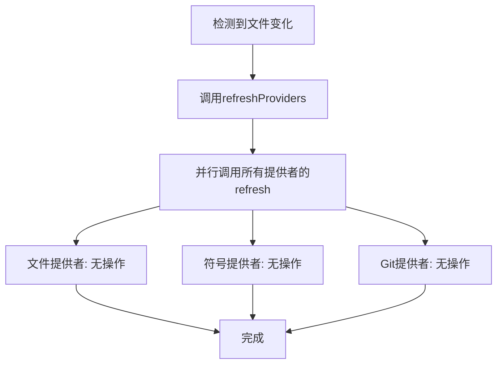

**Section sources**
- [manager.ts](file://packages/sdk/node/src/context/manager.ts#L211-L265)

## 总结

上下文提供者系统是OpenCode智能辅助功能的核心组件，通过插件式架构实现了灵活的上下文数据收集和管理。系统设计遵循单一职责、模块化和可扩展的原则，支持多种内置提供者，并允许开发者创建自定义提供者来满足特定需求。

通过标准化的接口设计、并行执行机制和多层次的缓存策略，上下文提供者系统能够在保证性能的同时，为用户提供丰富、准确的上下文信息。该系统在会话生命周期的各个阶段发挥重要作用，确保上下文数据的时效性和相关性。

未来，系统可以进一步扩展支持更多类型的上下文来源，如数据库状态、API响应、终端输出等，为智能代码辅助提供更全面的环境感知能力。