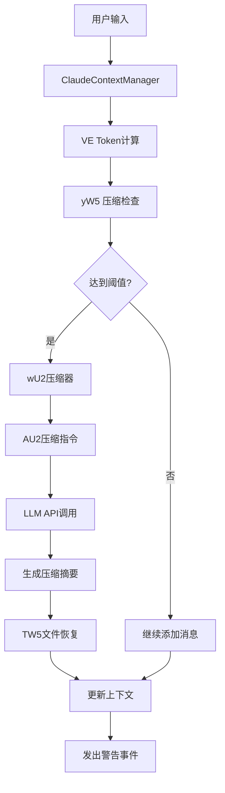
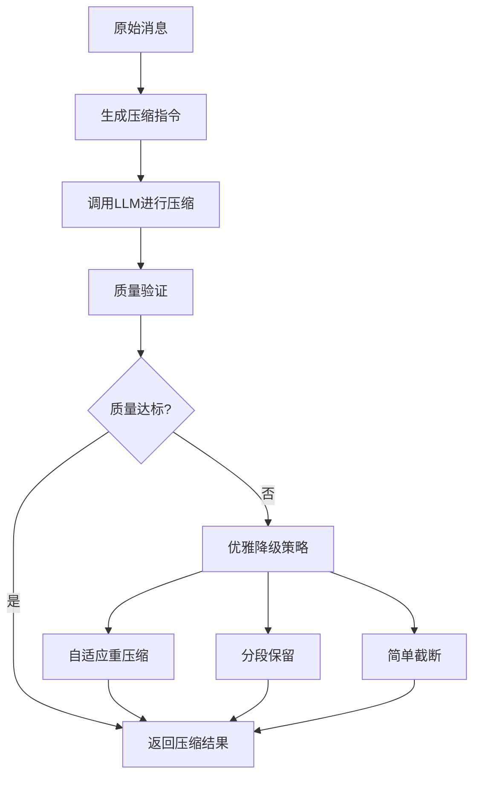
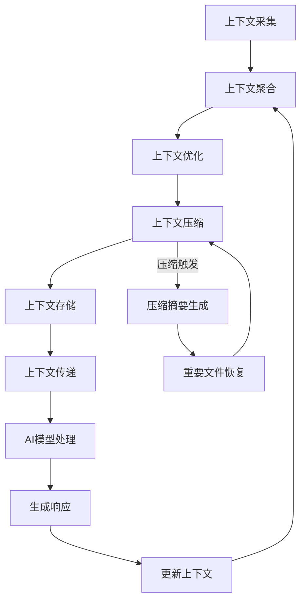

# 上下文管理

<cite>
**本文档引用的文件**   
- [ClaudeContextManager.js](file://context-claude-code/src/claude-core/ClaudeContextManager.js)
- [WU2Compressor.js](file://context-claude-code/src/compression/WU2Compressor.js)
- [07-context-compaction.md](file://doc-agent-context/07-context-compaction.md)
- [02-context-manager-core.md](file://packages/sdk/node/docs/technical/02-context-manager-core.md)
- [CLAUDE_CORE_IMPLEMENTATION.md](file://context-claude-code/CLAUDE_CORE_IMPLEMENTATION.md)
</cite>

## 目录
1. [引言](#引言)
2. [上下文管理器核心职责](#上下文管理器核心职责)
3. [上下文提供者插件架构](#上下文提供者插件架构)
4. [上下文压缩算法](#上下文压缩算法)
5. [上下文优化策略](#上下文优化策略)
6. [上下文生命周期流程图](#上下文生命周期流程图)
7. [API调用示例](#api调用示例)
8. [总结](#总结)

## 引言

上下文管理系统是OpenCode平台的核心组件，负责从多种来源动态收集、聚合和优化上下文信息，为AI模型提供高质量的输入。该系统通过智能的上下文管理和压缩策略，解决了传统AI系统在处理长对话时面临的上下文窗口限制、信息密度低和上下文质量差等关键问题。

系统实现了自动压缩触发、智能摘要生成、增量压缩等机制，确保AI模型能够在有限的上下文窗口内处理长期对话。通过AI驱动的摘要生成，系统在保证信息完整性的同时最小化上下文体积，实现了信息密度的优化。

## 上下文管理器核心职责

上下文管理器是整个系统的核心组件，负责协调各种上下文提供者、优化上下文内容、管理缓存策略，并为AI代理提供智能化的上下文服务。其核心职责包括：

- **上下文收集**: 从当前编辑的文件、Git仓库元数据、历史对话记录、外部工具输出等多种来源动态收集上下文信息。
- **上下文聚合**: 将来自不同来源的上下文信息进行聚合和整合，形成统一的上下文视图。
- **上下文优化**: 通过相关性排序、冗余消除和关键信息提取等策略优化上下文内容。
- **上下文压缩**: 在上下文接近模型限制时自动触发压缩，通过智能摘要生成保持上下文质量。
- **状态管理**: 跟踪和管理上下文的状态，包括token使用量、压缩历史和文件操作记录。



**Diagram sources**
- [CLAUDE_CORE_IMPLEMENTATION.md](file://context-claude-code/CLAUDE_CORE_IMPLEMENTATION.md#架构设计)

**Section sources**
- [ClaudeContextManager.js](file://context-claude-code/src/claude-core/ClaudeContextManager.js#L19-L786)

## 上下文提供者插件架构

上下文管理器采用**分层协调**的设计理念，将复杂的上下文处理任务分解为多个独立的层次，包括协调层、发现层、聚合层、优化层和缓存层。系统实现了基于插件的上下文提供者架构，支持灵活扩展以支持新的上下文源。

### 多源并行发现

上下文发现采用**并行多源发现**策略，同时从多个提供者获取上下文信息：

```typescript
async searchContext(options: ContextSearchOptions): Promise<ContextItem[]> {
  // 1. 缓存检查
  const cacheKey = this.generateCacheKey(options)
  const cached = this.cache.get(cacheKey)
  if (cached) return cached

  // 2. 并行发现
  const providerPromises = this.providers.map(provider =>
    this.searchWithProvider(provider, options)
  )

  // 3. 等待所有提供者完成
  const providerResults = await Promise.allSettled(providerPromises)

  // 4. 聚合结果
  const allItems = this.aggregateProviderResults(providerResults)

  // 5. 相关性评分和排序
  const scoredItems = this.scoreAndSortItems(allItems, options)

  // 6. 应用结果限制
  const limitedItems = this.applyResultLimits(scoredItems, options)

  // 7. 缓存结果
  this.cache.set(cacheKey, limitedItems)

  return limitedItems
}
```

### 结果聚合算法

从多个提供者聚合结果时采用**智能去重**和**冲突解决**策略：

```typescript
private aggregateProviderResults(
  providerResults: PromiseSettledResult<ContextItem[]>[]
): ContextItem[] {
  const itemMap = new Map<string, ContextItem>()

  providerResults.forEach(result => {
    if (result.status === 'fulfilled') {
      result.value.forEach(item => {
        const existing = itemMap.get(item.id)

        // 冲突解决策略：选择相关性更高的项
        if (!existing || item.relevance > existing.relevance) {
          itemMap.set(item.id, item)
        } else if (item.relevance === existing.relevance) {
          // 相关性相同时，选择更新时间更近的项
          if (item.addedAt > existing.addedAt) {
            itemMap.set(item.id, item)
          }
        }
      })
    }
  })

  return Array.from(itemMap.values())
}
```

**Section sources**
- [02-context-manager-core.md](file://packages/sdk/node/docs/technical/02-context-manager-core.md#上下文发现算法)

## 上下文压缩算法

### WU2Compressor实现原理

WU2Compressor是系统的核心压缩组件，负责将冗长的对话历史提炼成结构化摘要。其主要功能包括：

- **智能压缩**: 将对话历史压缩成结构化摘要，保持信息的高密度和准确性。
- **质量验证**: 验证压缩质量，确保信息保真度不低于80%。
- **优雅降级**: 在压缩质量不达标时，采用多种降级策略确保系统可用性。



**Diagram sources**
- [07-context-compaction.md](file://doc-agent-context/07-context-compaction.md#技术架构特点)

### 压缩质量验证

系统实现了全面的压缩质量验证机制，确保压缩后的摘要满足质量要求：

```typescript
async validateCompressionQuality(summary, originalMessages) {
    const checks = {
      // 检查1：验证所有8个段落是否完整存在
      sectionsComplete: this.validateSectionCompleteness(summary),

      // 检查2：验证关键信息保留情况
      keyInfoPreserved: await this.validateKeyInformationPreservation(summary, originalMessages),

      // 检查3：验证上下文连续性
      contextContinuous: this.validateContextContinuity(summary),

      // 检查4：验证压缩比例是否合理
      compressionRatioValid: this.validateCompressionRatio(summary, originalMessages)
    };

    // 计算综合保真度评分
    const fidelityScore = this.calculateFidelityScore(checks);

    return {
      isValid: fidelityScore >= this.config.minFidelityScore,
      fidelityScore,
      checks,
      recommendations: this.generateImprovementRecommendations(checks)
    };
}
```

**Section sources**
- [WU2Compressor.js](file://context-claude-code/src/compression/WU2Compressor.js#L255-L284)

## 上下文优化策略

### 相关性评分算法

系统采用**加权多因子模型**进行相关性评分，综合考虑多个维度：

```typescript
interface RelevanceScoringContext {
  query: string
  queryTerms: string[]
  queryType: ContextType[]
  userPreferences?: UserPreferences
}

interface RelevanceScore {
  exactMatch: number      // 精确匹配分数 [0-100]
  partialMatch: number    // 部分匹配分数 [0-50]
  typeMatch: number       // 类型匹配分数 [0-20]
  pathMatch: number       // 路径匹配分数 [0-15]
  recencyBonus: number    // 时效性加分 [0-10]
  popularityBonus: number // 流行度加分 [0-5]
  total: number          // 总分 [0-200]
}
```

### 多层次压缩策略

系统实现了多层次的压缩策略，包括工具输出清理、智能摘要生成和增量压缩：

```typescript
class CompactionStrategyManager {
  private strategies: CompactionStrategy[] = []
  
  constructor() {
    this.strategies = [
      new ToolOutputPruningStrategy(),
      new SummaryGenerationStrategy(),
      new IncrementalCompactionStrategy(),
      new ContextPreservationStrategy()
    ]
  }
  
  async executeCompaction(sessionID: string, context: CompactionContext): Promise<CompactionResult> {
    const results: CompactionResult[] = []
    
    for (const strategy of this.strategies) {
      if (strategy.shouldApply(context)) {
        const result = await strategy.execute(sessionID, context)
        results.push(result)
        context = strategy.updateContext(context, result)
      }
    }
    
    return this.mergeResults(results)
  }
}
```

**Section sources**
- [07-context-compaction.md](file://doc-agent-context/07-context-compaction.md#多层次压缩策略)

## 上下文生命周期流程图



**Diagram sources**
- [07-context-compaction.md](file://doc-agent-context/07-context-compaction.md#技术架构特点)

## API调用示例

### 基础使用

```javascript
import { createClaudeContextManager } from './src/index.js';

const contextManager = createClaudeContextManager({
  maxTokens: 200000,
  autoCompactThreshold: 0.92,
  enableAutoCompact: true,
  enableFileRestoration: true,
  enableWarningSystem: true,

  // LLM配置
  llmProvider: 'anthropic',
  apiKey: process.env.ANTHROPIC_API_KEY,
  llmModel: 'claude-3-haiku-20240307'
});

// 添加消息
await contextManager.addMessage({
  role: 'user',
  content: '请帮我实现一个React组件',
  files: ['src/components/UserProfile.jsx']
});

// 获取上下文
const context = contextManager.getContext();
```

### 事件监听

```javascript
// 压缩事件
contextManager.on('compressionCompleted', (data) => {
  console.log('压缩完成:', data.result.summary);
});

// 警告事件
contextManager.on('warning', (status) => {
  console.log(`${status.icon} ${status.level}: ${status.message}`);
});

// 自动压缩触发
contextManager.on('autoCompactTriggered', (status) => {
  console.log('🚨 自动压缩触发!');
});
```

**Section sources**
- [CLAUDE_CORE_IMPLEMENTATION.md](file://context-claude-code/CLAUDE_CORE_IMPLEMENTATION.md#使用方式)

## 总结

上下文管理系统通过智能的上下文管理和压缩策略，解决了传统AI系统在处理长对话时面临的上下文窗口限制、信息密度低和上下文质量差等关键问题。系统实现了自动压缩触发、智能摘要生成、增量压缩等机制，确保AI模型能够在有限的上下文窗口内处理长期对话。

核心组件包括：
- **ClaudeContextManager**: 统一上下文管理器，集成所有核心组件
- **WU2Compressor**: wU2压缩器，负责智能压缩和质量验证
- **TW5FileRestorer**: TW5文件恢复器，负责智能文件恢复
- **ProgressiveWarningSystem**: 渐进式警告系统，负责三级警告机制

系统采用模块化设计，支持灵活扩展和定制，为AI代理提供了强大的代码理解能力。