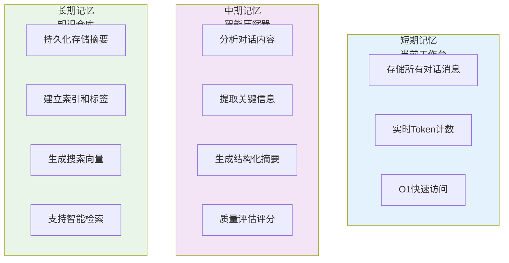
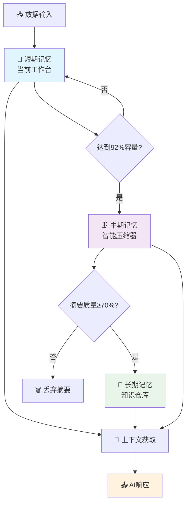
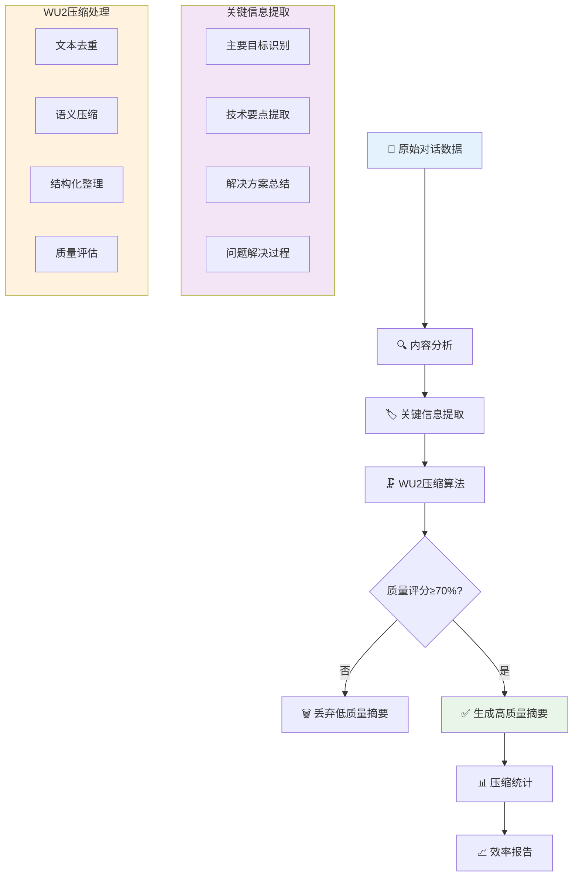
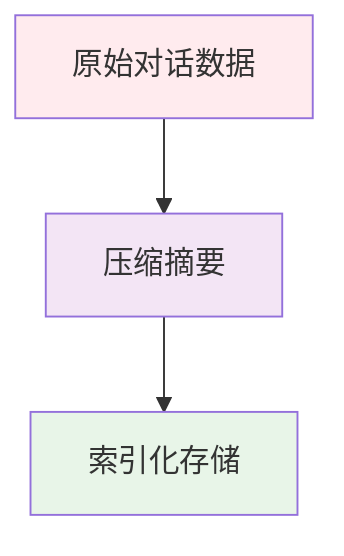

# 会话压缩

<cite>
**本文档中引用的文件**   
- [WU2Compressor.js](file://context-claude-code/src/compression/WU2Compressor.js)
- [07-context-compaction.md](file://doc-agent-context/07-context-compaction.md)
- [上下文工程管理实践-第3部分-压缩触发.md](file://context-claude-code/上下文工程管理实践-第3部分-压缩触发.md)
- [三层记忆架构详解.md](file://context-claude-code/三层记忆架构详解.md)
- [MemoryManager.js](file://context-claude-code/src/memory/MemoryManager.js)
- [ShortTermMemory.js](file://context-claude-code/src/memory/ShortTermMemory.js)
- [MidTermMemory.js](file://context-claude-code/src/memory/MidTermMemory.js)
- [LongTermMemory.js](file://context-claude-code/src/memory/LongTermMemory.js)
</cite>

## 目录
1. [引言](#引言)
2. [三层记忆架构](#三层记忆架构)
3. [压缩触发机制](#压缩触发机制)
4. [压缩算法与工作原理](#压缩算法与工作原理)
5. [数据迁移路径](#数据迁移路径)
6. [系统性能影响与优化](#系统性能影响与优化)
7. [配置选项与调优建议](#配置选项与调优建议)
8. [结论](#结论)

## 引言

会话压缩机制是现代AI系统处理长期对话的核心技术，旨在解决模型上下文窗口有限与用户需求无限之间的矛盾。该机制通过智能的上下文管理和压缩策略，确保AI模型能够在有限的上下文窗口内处理长期对话，同时保持关键信息的连续性和完整性。系统通过自动压缩触发、智能摘要生成、增量压缩等机制，实现了信息密度优化、上下文质量保证和性能优化。本技术文档将深入阐述会话压缩机制的各个方面，包括压缩触发条件、压缩算法的工作原理、数据迁移路径、系统性能影响及优化措施，以及配置选项和调优建议。

**Section sources**
- [07-context-compaction.md](file://doc-agent-context/07-context-compaction.md#L1-L100)

## 三层记忆架构

会话压缩机制基于三层记忆架构，模仿人类大脑的记忆系统，从短期工作记忆到长期知识存储，每一层都有不同的职责和特点。短期记忆（Short-term Memory）作为高速工作区，类似CPU的L1缓存，提供O(1)访问效率，负责存储最近的对话消息。中期记忆（Mid-term Memory）作为智能蒸馏器，负责将短期记忆的对话历史压缩为结构化摘要。长期记忆（Long-term Memory）作为持久化知识库，跨会话地存储有价值的摘要和知识，支持向量化搜索。

**Diagram sources**
- [三层记忆架构详解.md](file://context-claude-code/三层记忆架构详解.md#L1-L100)

**Section sources**
- [三层记忆架构详解.md](file://context-claude-code/三层记忆架构详解.md#L1-L100)
- [MemoryManager.js](file://context-claude-code/src/memory/MemoryManager.js#L1-L50)

## 压缩触发机制

会话压缩的触发基于多种指标，包括上下文长度、令牌数量和时间间隔。系统实现了基于token使用量的智能压缩触发算法，当token使用量超过模型上下文限制的80%时，自动触发压缩。此外，系统还考虑了压缩频率限制，确保在1分钟内不重复压缩，以及压缩效率检查，确保预期压缩后使用80%的可用token。这些机制共同确保了压缩操作的高效性和必要性。

**Diagram sources**
- [07-context-compaction.md](file://doc-agent-context/07-context-compaction.md#L1-L100)

**Section sources**
- [07-context-compaction.md](file://doc-agent-context/07-context-compaction.md#L1-L100)
- [上下文工程管理实践-第3部分-压缩触发.md](file://context-claude-code/上下文工程管理实践-第3部分-压缩触发.md#L1-L50)

## 压缩算法与工作原理

会话压缩算法采用8段式结构化压缩，要求LLM按照8个部分组织摘要：主要请求和意图、关键技术概念、文件和代码片段、错误和修复、问题解决过程、所有用户消息、待处理任务和当前工作状态。压缩过程首先生成压缩指令，然后调用LLM进行压缩，最后进行质量验证。如果质量验证失败，系统会尝试优雅降级，包括自适应重压缩、分段保留和简单截断等策略。

**Diagram sources**
- [WU2Compressor.js](file://context-claude-code/src/compression/WU2Compressor.js#L1-L50)

**Section sources**
- [WU2Compressor.js](file://context-claude-code/src/compression/WU2Compressor.js#L1-L50)
- [上下文工程管理实践-第3部分-压缩触发.md](file://context-claude-code/上下文工程管理实践-第3部分-压缩触发.md#L1-L50)

## 数据迁移路径

在会话压缩过程中，数据从活跃内存迁移到中期存储，再迁移到长期归档。具体路径如下：首先，短期记忆中的原始对话数据被压缩为结构化摘要，存储在中期记忆中；然后，如果摘要质量足够高，会被进一步存储到长期记忆中，进行持久化存储和索引化处理。这一分级处理机制确保了数据的高效管理和长期可用性。

**Diagram sources**
- [三层记忆架构详解.md](file://context-claude-code/三层记忆架构详解.md#L1-L100)

**Section sources**
- [三层记忆架构详解.md](file://context-claude-code/三层记忆架构详解.md#L1-L100)
- [LongTermMemory.js](file://context-claude-code/src/memory/LongTermMemory.js#L1-L50)

## 系统性能影响与优化

会话压缩操作对系统性能有一定影响，但通过多种优化措施，这些影响被最小化。系统采用增量压缩算法，避免重复压缩和过度压缩，只压缩必要的部分，保持对话连续性。此外，系统还实现了工具调用输出清理、智能摘要生成和上下文保护等策略，确保压缩过程的高效性和质量。这些优化措施共同提升了系统的整体性能和用户体验。

**Section sources**
- [07-context-compaction.md](file://doc-agent-context/07-context-compaction.md#L1-L50)
- [WU2Compressor.js](file://context-claude-code/src/compression/WU2Compressor.js#L1-L50)

## 配置选项与调优建议

会话压缩机制提供了多种配置选项，帮助用户在信息保留和资源消耗之间取得平衡。用户可以根据具体需求调整压缩阈值、质量验证参数和压缩策略。例如，可以设置不同的压缩阈值来控制压缩频率，调整质量验证参数来确保摘要质量，选择不同的压缩策略来适应不同的应用场景。这些配置选项和调优建议为用户提供了灵活的控制手段，以满足不同场景下的需求。

**Section sources**
- [WU2Compressor.js](file://context-claude-code/src/compression/WU2Compressor.js#L1-L50)
- [07-context-compaction.md](file://doc-agent-context/07-context-compaction.md#L1-L50)

## 结论

会话压缩机制是现代AI系统处理长期对话的关键技术，通过智能的上下文管理和压缩策略，解决了模型上下文窗口有限与用户需求无限之间的矛盾。该机制通过三层记忆架构、智能压缩触发、8段式结构化压缩算法和分级数据迁移路径，实现了信息密度优化、上下文质量保证和性能优化。通过合理的配置选项和调优建议，用户可以在信息保留和资源消耗之间取得平衡，提升系统的整体性能和用户体验。