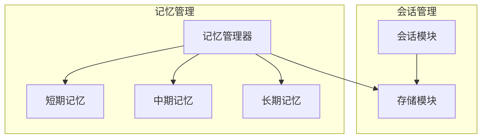
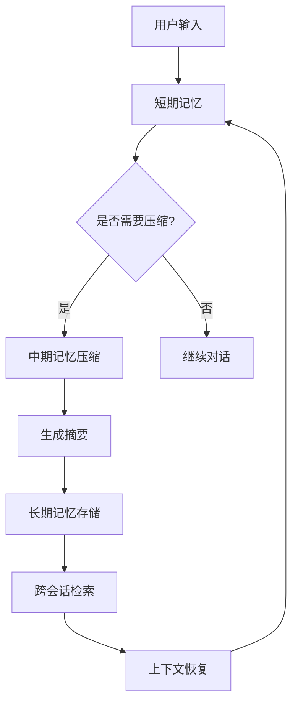
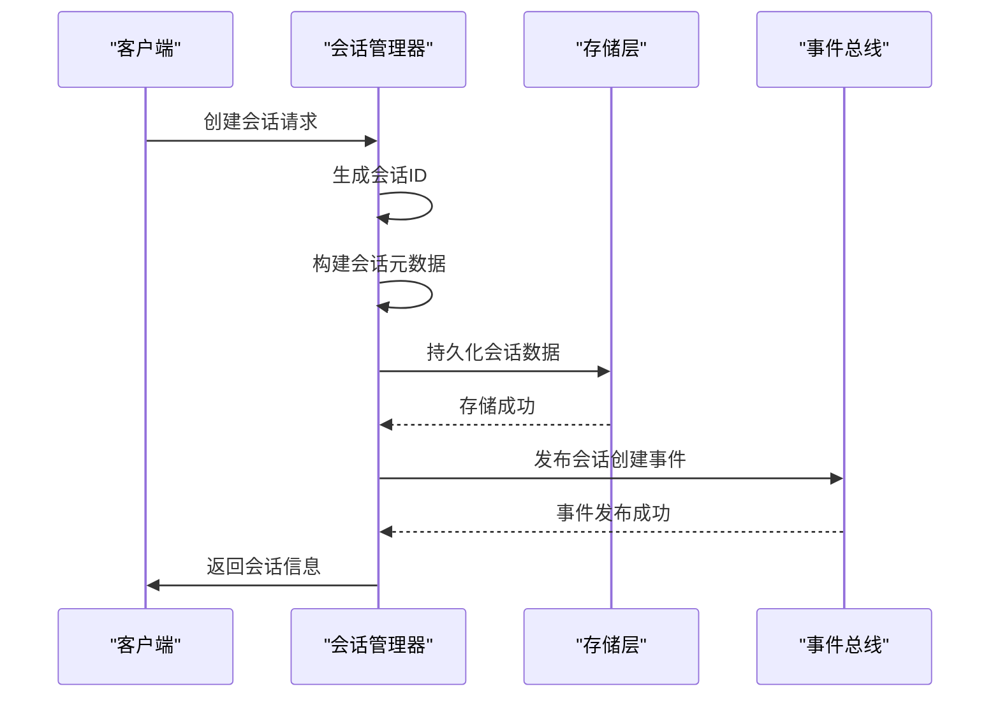
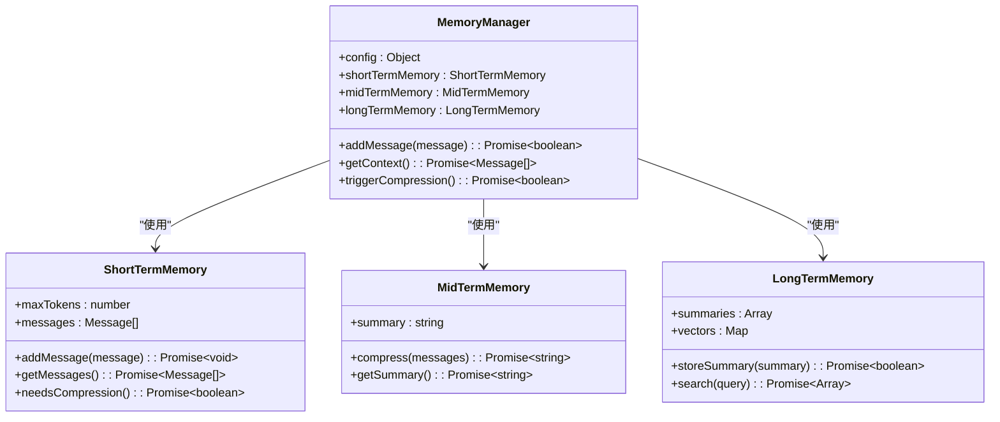
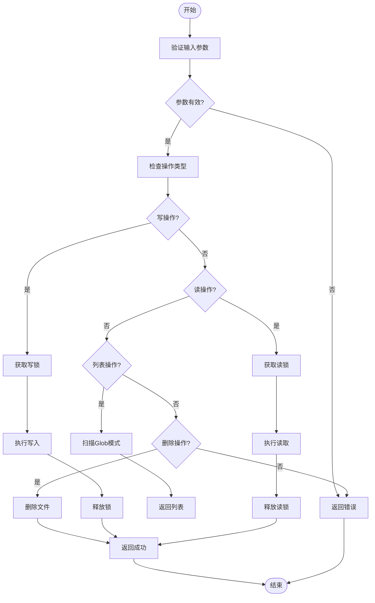
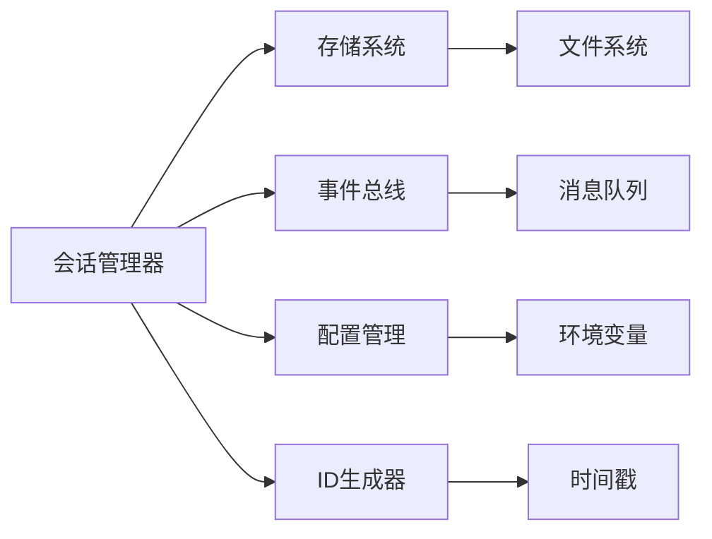

# 会话状态持久化

<cite>
**本文档引用的文件**  
- [session.ts](file://packages/opencode/src/session/index.ts)
- [storage.ts](file://packages/opencode/src/storage/storage.ts)
- [MemoryManager.js](file://context-claude-code/src/memory/MemoryManager.js)
- [EnhancedMemoryManager.js](file://context-claude-code/src/memory/EnhancedMemoryManager.js)
- [LongTermMemory.js](file://context-claude-code/src/memory/LongTermMemory.js)
- [MidTermMemory.js](file://context-claude-code/src/memory/MidTermMemory.js)
- [BaseMemory.js](file://context-claude-code/src/memory/BaseMemory.js)
- [session-state.md](file://doc-agent-context/02-session-management.md)
</cite>

## 目录
1. [引言](#引言)
2. [项目结构](#项目结构)
3. [核心组件](#核心组件)
4. [架构概述](#架构概述)
5. [详细组件分析](#详细组件分析)
6. [依赖分析](#依赖分析)
7. [性能考虑](#性能考虑)
8. [故障排除指南](#故障排除指南)
9. [结论](#结论)

## 引言
会话状态持久化机制是系统上下文管理的核心，负责维护对话状态、历史记录和用户偏好。该机制通过分层存储策略，将对话历史、上下文快照、用户偏好和元数据进行序列化并安全存储。系统支持本地和远程存储，并通过加密和完整性校验确保数据安全。持久化操作在会话状态变更、定期自动保存和显式保存请求时触发。存储格式设计兼顾性能、兼容性和扩展性，并通过数据同步机制保持多设备间的状态一致性。

## 项目结构
会话状态持久化功能分布在多个模块中，主要涉及`packages/opencode/src/session`和`context-claude-code/src/memory`目录。`session`模块负责会话的创建、更新和基本持久化，而`memory`模块实现三层记忆架构，包括短期、中期和长期记忆。

**图表来源**  
- [session.ts](file://packages/opencode/src/session/index.ts)
- [storage.ts](file://packages/opencode/src/storage/storage.ts)
- [MemoryManager.js](file://context-claude-code/src/memory/MemoryManager.js)

**章节来源**
- [session.ts](file://packages/opencode/src/session/index.ts)
- [storage.ts](file://packages/opencode/src/storage/storage.ts)

## 核心组件
会话状态持久化的核心组件包括会话管理器、记忆管理器和存储抽象层。会话管理器负责会话的生命周期管理，记忆管理器协调三层记忆架构，存储抽象层提供统一的数据持久化接口。

**章节来源**
- [session.ts](file://packages/opencode/src/session/index.ts)
- [MemoryManager.js](file://context-claude-code/src/memory/MemoryManager.js)
- [storage.ts](file://packages/opencode/src/storage/storage.ts)

## 架构概述
系统采用分层架构，将会话状态分为短期、中期和长期记忆。短期记忆存储当前对话上下文，中期记忆通过压缩算法生成结构化摘要，长期记忆则持久化有价值的摘要和知识。

**图表来源**  
- [MemoryManager.js](file://context-claude-code/src/memory/MemoryManager.js)
- [MidTermMemory.js](file://context-claude-code/src/memory/MidTermMemory.js)
- [LongTermMemory.js](file://context-claude-code/src/memory/LongTermMemory.js)

## 详细组件分析

### 会话管理器分析
会话管理器负责会话的创建、更新和持久化。它使用唯一ID生成策略确保会话标识的唯一性，并通过事件系统通知状态变更。

#### 会话创建流程

**图表来源**  
- [session.ts](file://packages/opencode/src/session/index.ts)
- [storage.ts](file://packages/opencode/src/storage/storage.ts)

**章节来源**
- [session.ts](file://packages/opencode/src/session/index.ts)

### 记忆管理器分析
记忆管理器协调三层记忆架构的工作，通过智能压缩和摘要机制管理上下文。

#### 三层记忆架构

**图表来源**  
- [MemoryManager.js](file://context-claude-code/src/memory/MemoryManager.js)
- [ShortTermMemory.js](file://context-claude-code/src/memory/ShortTermMemory.js)
- [MidTermMemory.js](file://context-claude-code/src/memory/MidTermMemory.js)
- [LongTermMemory.js](file://context-claude-code/src/memory/LongTermMemory.js)

**章节来源**
- [MemoryManager.js](file://context-claude-code/src/memory/MemoryManager.js)

### 存储抽象层分析
存储抽象层提供统一的读写接口，支持多种存储后端。

#### 存储操作流程

**图表来源**  
- [storage.ts](file://packages/opencode/src/storage/storage.ts)

**章节来源**
- [storage.ts](file://packages/opencode/src/storage/storage.ts)

## 依赖分析
会话状态持久化机制依赖多个核心模块，包括存储系统、事件总线和配置管理。这些模块通过清晰的接口进行交互，确保系统的松耦合和可扩展性。

**图表来源**  
- [session.ts](file://packages/opencode/src/session/index.ts)
- [storage.ts](file://packages/opencode/src/storage/storage.ts)
- [session-state.md](file://doc-agent-context/02-session-management.md)

**章节来源**
- [session.ts](file://packages/opencode/src/session/index.ts)
- [storage.ts](file://packages/opencode/src/storage/storage.ts)

## 性能考虑
系统在设计时充分考虑了性能因素。记忆管理器采用异步操作和批量处理来提高效率，存储层使用文件锁机制防止并发冲突。长期记忆的向量化搜索通过索引优化查询性能，而中期记忆的压缩算法则平衡了摘要质量和计算开销。

## 故障排除指南
当会话状态持久化出现问题时，应首先检查存储目录的权限和磁盘空间。对于数据不一致问题，可以尝试清除缓存并重新同步。如果遇到性能瓶颈，建议监控内存使用情况并调整压缩阈值。

**章节来源**
- [MemoryManager.js](file://context-claude-code/src/memory/MemoryManager.js)
- [storage.ts](file://packages/opencode/src/storage/storage.ts)

## 结论
会话状态持久化机制通过分层存储和智能压缩，有效解决了长期对话的上下文管理问题。系统设计兼顾了性能、安全性和可扩展性，为AI代理提供了强大的上下文管理能力。未来可以进一步优化向量化搜索算法，并增加更多存储后端支持。