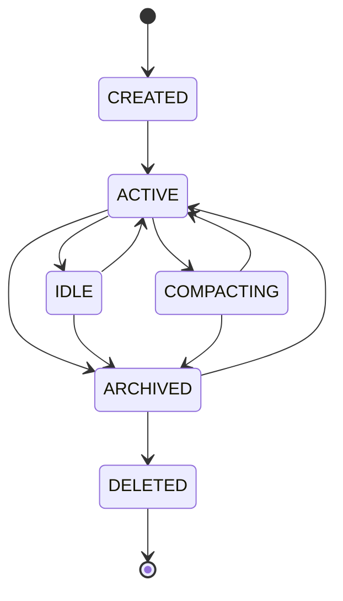

# 会话生命周期

<cite>
**本文档引用的文件**
- [02-session-management.md](file://doc-agent-context/02-session-management.md)
- [index.ts](file://packages/opencode/src/session/index.ts)
- [compaction.ts](file://packages/opencode/src/session/compaction.ts)
- [message-v2.ts](file://packages/opencode/src/session/message-v2.ts)
- [instance.ts](file://packages/opencode/src/project/instance.ts)
- [storage.ts](file://packages/opencode/src/storage/storage.ts)
- [bus/index.ts](file://packages/opencode/src/bus/index.ts)
</cite>

## 目录
1. [简介](#简介)
2. [会话创建与初始化](#会话创建与初始化)
3. [会话状态管理](#会话状态管理)
4. [会话状态机](#会话状态机)
5. [消息系统架构](#消息系统架构)
6. [上下文压缩机制](#上下文压缩机制)
7. [事件驱动架构](#事件驱动架构)
8. [持久化机制](#持久化机制)
9. [会话销毁流程](#会话销毁流程)
10. [结论](#结论)

## 简介

会话管理系统是OpenCode上下文工程的核心组件，负责管理整个对话的生命周期。该系统通过完整的生命周期管理、消息处理和状态同步机制，为AI agent提供强大的上下文管理能力。会话系统解决了传统AI对话中的长期记忆问题、状态管理复杂性、并发处理挑战和扩展性需求。

## 会话创建与初始化

会话创建采用工厂模式和建造者模式，确保会话对象的完整性和一致性。系统通过多步骤的创建流程，包括ID生成、元数据设置、存储持久化和事件通知。

会话ID使用降序ID生成器确保唯一性，格式为`session_时间戳_计数器`。会话元数据包含项目ID、目录路径、父会话ID（用于子会话）、标题、版本号和时间戳等信息。

会话创建流程包括：生成会话ID、构建会话元数据、持久化存储、发布创建事件和初始化会话状态。系统通过事务性保证确保创建过程的原子性，如果任何步骤失败，将执行回滚操作。

**会话信息结构**
```typescript
export const Info = z.object({
  id: Identifier.schema("session"),
  projectID: z.string(),
  directory: z.string(),
  parentID: Identifier.schema("session").optional(),
  share: z.object({
    url: z.string(),
  }).optional(),
  title: z.string(),
  version: z.string(),
  time: z.object({
    created: z.number(),
    updated: z.number(),
    compacting: z.number().optional(),
  }),
  revert: z.object({
    messageID: z.string(),
    partID: z.string().optional(),
    snapshot: z.string().optional(),
    diff: z.string().optional(),
  }).optional(),
})
```

**Section sources**
- [index.ts](file://packages/opencode/src/session/index.ts#L1-L348)

## 会话状态管理

会话状态管理采用状态模式和观察者模式，通过`Instance.state`机制实现状态的持久化管理和自动同步。系统支持状态的版本管理、变更追踪和自动恢复。

会话状态包含会话ID、状态、版本号、最后活动时间、消息计数、工具调用计数、元数据、创建时间和更新时间等属性。状态转换遵循预定义的规则，确保状态转换的合法性和一致性。

状态管理器维护一个内存中的状态映射，同时从持久化存储加载状态。当状态更新时，系统会验证转换的合法性，保存状态快照，持久化状态，并通知订阅者。

**状态定义和验证**
```typescript
interface SessionState {
  sessionID: string
  status: SessionStatus
  version: number
  lastActivity: number
  messageCount: number
  toolCallCount: number
  metadata: Record<string, any>
  createdAt: number
  updatedAt: number
}
```

**Section sources**
- [02-session-management.md](file://doc-agent-context/02-session-management.md#L437-L476)
- [02-session-management.md](file://doc-agent-context/02-session-management.md#L343-L435)

## 会话状态机

会话生命周期采用状态机模式，确保状态转换的合法性和一致性。系统定义了五种主要状态：CREATED（已创建）、ACTIVE（活跃中）、COMPACTING（正在压缩上下文）、ARCHIVED（已归档）和DELETED（已删除）。

状态机维护一个转换映射，定义了每个状态可以转换到的合法目标状态。例如，ACTIVE状态可以转换到IDLE、COMPACTING或ARCHIVED状态，而DELETED状态是终态，不能再转换到其他状态。



**Diagram sources**
- [02-session-management.md](file://doc-agent-context/02-session-management.md#L18-L73)

## 消息系统架构

消息系统采用类型安全的联合类型和模式匹配，通过Zod的discriminated union实现运行时类型验证。系统支持多种消息类型，每种类型都有特定的结构和处理逻辑。

消息类型包括：文本消息（text）、推理过程（reasoning）、文件内容（file）、工具调用（tool）、步骤开始（step-start）、步骤结束（step-finish）、快照（snapshot）、补丁（patch）和Agent调用（agent）。

消息处理管道由多个处理器组成，依次通过验证、转换和处理阶段。每个处理器负责特定类型的消息处理，确保消息的完整性和一致性。

**消息类型定义**
```typescript
export const Part = z.discriminatedUnion("type", [
  TextPart,           // 文本消息
  ReasoningPart,      // 推理过程
  FilePart,           // 文件内容
  ToolPart,           // 工具调用
  StepStartPart,      // 步骤开始
  StepFinishPart,     // 步骤结束
  SnapshotPart,       // 快照
  PatchPart,          // 补丁
  AgentPart,          // Agent调用
])
```

**Section sources**
- [message-v2.ts](file://packages/opencode/src/session/message-v2.ts#L0-L581)

## 上下文压缩机制

上下文压缩机制用于管理会话的上下文窗口，防止超出模型的上下文限制。当检测到上下文溢出时，系统会自动触发压缩流程。

压缩机制通过分析消息历史，识别可以压缩的旧消息。系统会保留最近的对话内容，同时对较早的工具调用结果进行摘要或清除。压缩过程包括：计算当前上下文使用量、识别可压缩的消息、生成摘要和更新消息状态。

系统还实现了修剪机制，用于清理不再相关的旧工具调用输出。当工具调用完成且经过一定时间后，其输出将被清除，以节省存储空间。

**溢出检测**
```typescript
export function isOverflow(input: { tokens: MessageV2.Assistant["tokens"]; model: ModelsDev.Model }) {
  if (Flag.OPENCODE_DISABLE_AUTOCOMPACT) return false
  const context = input.model.limit.context
  if (context === 0) return false
  const count = input.tokens.input + input.tokens.cache.read + input.tokens.output
  const output = Math.min(input.model.limit.output, SessionPrompt.OUTPUT_TOKEN_MAX) || SessionPrompt.OUTPUT_TOKEN_MAX
  const usable = context - output
  return count > usable
}
```

**Section sources**
- [compaction.ts](file://packages/opencode/src/session/compaction.ts#L0-L174)

## 事件驱动架构

会话状态变更通过事件系统进行通知，实现松耦合的组件通信。事件系统基于发布-订阅模式，允许组件订阅感兴趣的事件并做出相应反应。

会话事件包括：Created（会话创建）、Updated（会话更新）、StateChanged（状态变更）和Deleted（会话删除）。事件携带相关的会话信息和变更详情，订阅者可以根据事件类型执行相应的业务逻辑。

事件系统确保了组件之间的解耦，使得会话管理系统的各个部分可以独立开发和测试。同时，事件的异步处理提高了系统的响应性和可扩展性。

**会话事件定义**
```typescript
export const SessionEvents = {
  Created: Bus.event("session.created", z.object({ 
    session: Session.Info,
    parentID: z.string().optional() 
  })),
  Updated: Bus.event("session.updated", z.object({ 
    session: Session.Info,
    changes: z.record(z.any()) 
  })),
  StateChanged: Bus.event("session.state_changed", z.object({
    sessionID: z.string(),
    from: z.string(),
    to: z.string(),
    timestamp: z.number()
  })),
  Deleted: Bus.event("session.deleted", z.object({ 
    sessionID: z.string(),
    reason: z.string().optional()
  }))
}
```

**Section sources**
- [02-session-management.md](file://doc-agent-context/02-session-management.md#L18-L73)
- [bus/index.ts](file://packages/opencode/src/bus/index.ts#L0-L110)

## 持久化机制

会话数据通过分层存储机制实现持久化，支持不同的存储后端。存储抽象层定义了创建、读取、更新和删除会话的基本操作，具体的存储实现可以基于文件系统、数据库或其他存储系统。

文件系统存储实现将会话数据保存为JSON文件，路径结构为`sessions/会话ID.json`。系统使用Bun的文件操作API进行异步读写，确保高性能和非阻塞操作。

存储系统还实现了迁移机制，用于处理数据结构的版本升级。当系统检测到存储版本变化时，会自动执行相应的迁移脚本，确保数据的兼容性和完整性。

**存储抽象层**
```typescript
interface SessionStorage {
  create(session: Session.Info): Promise<void>
  read(sessionID: string): Promise<Session.Info | null>
  update(sessionID: string, updates: Partial<Session.Info>): Promise<void>
  delete(sessionID: string): Promise<void>
  list(projectID: string): Promise<Session.Info[]>
}
```

**Section sources**
- [02-session-management.md](file://doc-agent-context/02-session-management.md#L18-L73)
- [storage.ts](file://packages/opencode/src/storage/storage.ts#L0-L177)

## 会话销毁流程

会话销毁流程包括清理会话相关的所有数据和资源。当会话被删除时，系统会执行以下操作：移除会话元数据、删除所有消息和消息部分、清除共享信息、发布删除事件。

销毁流程还处理子会话的级联删除。如果被删除的会话有子会话，系统会递归地删除所有子会话及其相关数据。这种级联删除确保了数据的一致性和完整性。

系统使用锁机制确保销毁操作的原子性，防止并发访问导致的数据竞争。同时，销毁操作是幂等的，即使多次调用也不会产生副作用。

**会话移除**
```typescript
export async function remove(sessionID: string, emitEvent = true) {
  const project = Instance.project
  try {
    const session = await get(sessionID)
    for (const child of await children(sessionID)) {
      await remove(child.id, false)
    }
    await unshare(sessionID).catch(() => {})
    for (const msg of await Storage.list(["message", sessionID])) {
      for (const part of await Storage.list(["part", msg.at(-1)!])) {
        await Storage.remove(part)
      }
      await Storage.remove(msg)
    }
    await Storage.remove(["session", project.id, sessionID])
    if (emitEvent) {
      Bus.publish(Event.Deleted, {
        info: session,
      })
    }
  } catch (e) {
    log.error(e)
  }
}
```

**Section sources**
- [index.ts](file://packages/opencode/src/session/index.ts#L250-L299)

## 结论

OpenCode的会话管理系统通过状态机模式、事件驱动架构和分层存储机制，实现了完整的会话生命周期管理。系统支持会话的创建、激活、暂停、归档和恢复等关键状态转换，确保了对话的连续性和一致性。

通过上下文压缩和消息管理机制，系统有效解决了AI模型的上下文窗口限制问题，实现了长期对话的连续性。事件驱动架构使得系统组件之间松耦合，提高了系统的可扩展性和可维护性。

会话管理系统为AI agent提供了强大的上下文管理能力，是OpenCode平台的核心组件之一。其设计模式和实现机制为类似的对话系统开发提供了有价值的参考。