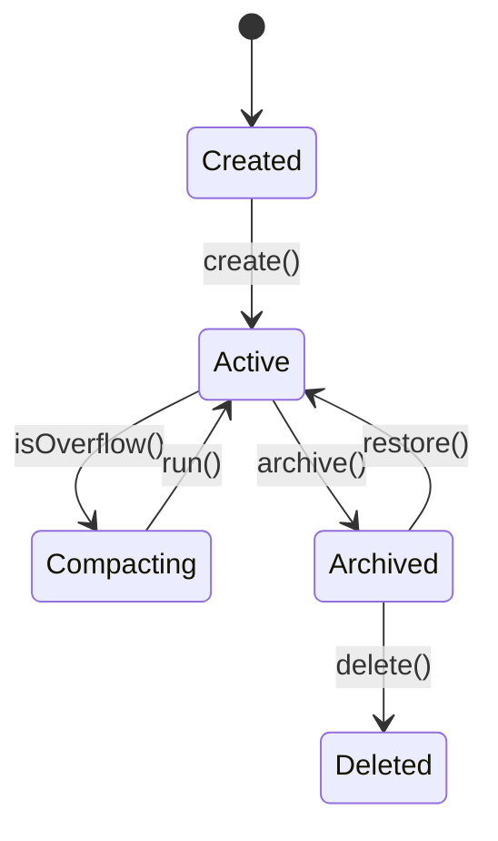
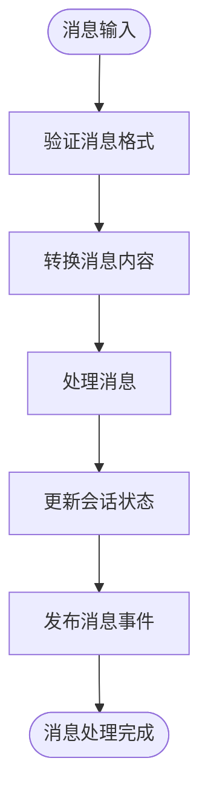
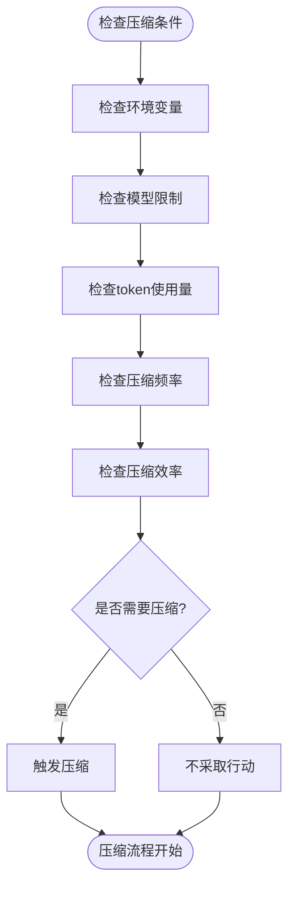
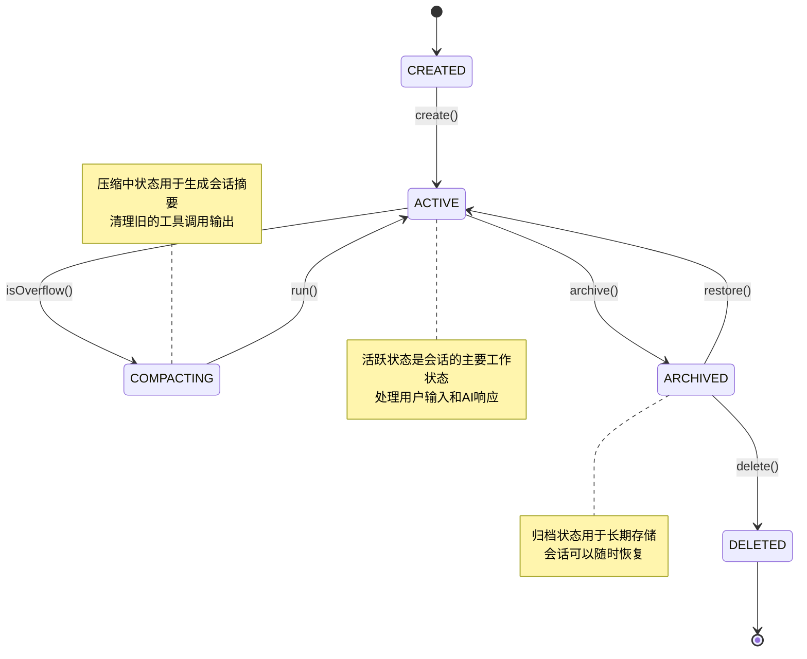

# 会话管理

<cite>
**Referenced Files in This Document**   
- [02-session-management.md](file://doc-agent-context/02-session-management.md)
- [07-context-compaction.md](file://doc-agent-context/07-context-compaction.md)
- [index.ts](file://packages/opencode/src/session/index.ts)
- [message-v2.ts](file://packages/opencode/src/session/message-v2.ts)
- [compaction.ts](file://packages/opencode/src/session/compaction.ts)
</cite>

## 目录
1. [引言](#引言)
2. [会话生命周期管理](#会话生命周期管理)
3. [消息系统架构](#消息系统架构)
4. [会话压缩机制](#会话压缩机制)
5. [状态机图](#状态机图)
6. [集成与协调](#集成与协调)
7. [结论](#结论)

## 引言

会话管理系统是OpenCode平台的核心组件，作为用户与AI代理交互的核心单元，它负责维护整个对话的状态和历史。系统通过完整的生命周期管理、消息处理、状态同步等机制，为AI代理提供强大的上下文管理能力。会话管理不仅解决了传统AI对话系统中的长期记忆问题，还通过智能的上下文压缩和摘要机制，实现了长期对话的连续性。

**Section sources**
- [02-session-management.md](file://doc-agent-context/02-session-management.md#L1-L1325)

## 会话生命周期管理

会话生命周期管理是会话系统的核心，涵盖了会话的创建、激活、暂停、归档和恢复等完整生命周期。系统采用状态机模式确保状态转换的合法性和一致性。

### 会话创建和初始化

会话创建采用工厂模式和建造者模式，确保会话对象的完整性和一致性。会话ID生成策略使用降序ID生成器确保唯一性，同时会话元数据管理器负责构建会话的元数据，包括项目ID、目录、父会话ID、标题、版本和时间戳等。

会话创建流程包括五个关键步骤：生成会话ID、构建会话元数据、持久化存储、发布创建事件和初始化会话状态。系统通过事务性保证确保会话创建的原子性，如果任何步骤失败，将执行回滚操作以保持数据一致性。

**Diagram sources**
- [index.ts](file://packages/opencode/src/session/index.ts#L1-L349)

**Section sources**
- [02-session-management.md](file://doc-agent-context/02-session-management.md#L1-L1325)
- [index.ts](file://packages/opencode/src/session/index.ts#L1-L349)

### 会话状态管理

会话状态管理采用状态模式和观察者模式，通过`Instance.state`机制实现状态的持久化管理和自动同步。系统支持状态的版本管理、变更追踪和自动恢复。

会话状态管理器负责管理会话的状态，包括获取状态、设置状态、保存状态快照和通知订阅者。状态定义包括会话ID、状态、版本、最后活动时间、消息计数、工具调用计数、元数据、创建时间和更新时间。状态转换规则确保了状态转换的合法性，防止无效的状态转换。

状态持久化机制使用`Instance.state`实现，支持状态的初始化和清理。状态同步机制通过状态同步器实现，确保状态在本地和远程存储之间的一致性。

**Section sources**
- [02-session-management.md](file://doc-agent-context/02-session-management.md#L1-L1325)
- [index.ts](file://packages/opencode/src/session/index.ts#L1-L349)

## 消息系统架构

消息系统是会话管理的基础，负责处理用户输入、AI响应、工具调用和系统事件的统一表示。系统采用类型安全的联合类型和模式匹配，通过Zod的discriminated union实现运行时类型验证。

### 消息类型定义

消息系统支持多种消息类型，每种类型都有特定的结构和处理逻辑。主要消息类型包括：

- **文本消息**: 用户或AI的文本输入
- **推理过程**: AI的推理过程和思考步骤
- **文件内容**: 文件的元数据和内容
- **工具调用**: 工具调用的状态和结果
- **步骤开始/结束**: 对话步骤的开始和结束标记
- **快照**: 会话状态的快照
- **补丁**: 文件修改的补丁
- **Agent调用**: Agent调用的输入和输出

消息处理管道由多个消息处理器组成，每个处理器负责验证、转换和处理消息。管道依次通过所有处理器，确保消息的完整性和一致性。

**Diagram sources**
- [message-v2.ts](file://packages/opencode/src/session/message-v2.ts#L1-L582)

**Section sources**
- [02-session-management.md](file://doc-agent-context/02-session-management.md#L1-L1325)
- [message-v2.ts](file://packages/opencode/src/session/message-v2.ts#L1-L582)

## 会话压缩机制

会话压缩机制是OpenCode处理长对话的核心技术，通过智能的上下文管理和压缩策略，确保AI模型能够在有限的上下文窗口内处理长期对话。

### 压缩触发机制

系统实现了基于token使用量的智能压缩触发算法。当上下文超过模型限制时，系统自动触发压缩。压缩触发条件包括：

1. **环境变量检查**: 检查`OPENCODE_DISABLE_AUTOCOMPACT`环境变量是否禁用自动压缩
2. **模型上下文限制**: 检查模型的上下文限制是否为0
3. **token使用量**: 计算当前token使用量是否超过可用token
4. **压缩频率限制**: 检查是否在1分钟内已经进行过压缩
5. **压缩效率**: 检查压缩是否能够有效减少token使用量

**Diagram sources**
- [compaction.ts](file://packages/opencode/src/session/compaction.ts#L1-L175)

### 压缩策略

系统采用多层次的压缩策略，包括工具调用输出清理、智能摘要生成和增量压缩。

**工具输出清理策略**: 清理旧的工具调用输出，保留关键信息。系统从后往前遍历消息，当工具调用输出的token估计值超过40,000时，将其标记为需要清理。如果清理的token总量超过20,000，则执行清理操作。

**智能摘要生成策略**: 使用AI生成会话摘要，保留重要上下文。系统获取需要压缩的消息，生成系统提示，然后调用AI模型生成摘要。摘要内容包括项目上下文、文件修改、工具使用、对话流程、当前状态和下一步计划。

**增量压缩算法**: 实现高效的增量压缩，避免重复压缩和过度压缩。系统检查压缩频率、token增长和压缩效率，只有在显著增长时才进行增量压缩。

**Section sources**
- [07-context-compaction.md](file://doc-agent-context/07-context-compaction.md#L1-L1219)
- [compaction.ts](file://packages/opencode/src/session/compaction.ts#L1-L175)

## 状态机图

会话状态机图可视化了会话的各个状态及其转换条件。会话有五种主要状态：创建(CREATED)、活跃(ACTIVE)、压缩中(COMPACTING)、归档(ARCHIVED)和删除(DELETED)。

状态转换规则确保了状态转换的合法性：
- 创建状态只能转换到活跃状态
- 活跃状态可以转换到压缩中、归档或删除状态
- 压缩中状态可以转换回活跃状态或归档状态
- 归档状态可以转换回活跃状态或删除状态
- 删除状态是终态，不能再转换到其他状态

**Diagram sources**
- [02-session-management.md](file://doc-agent-context/02-session-management.md#L1-L1325)

## 集成与协调

会话管理服务与上下文管理器和工具系统紧密集成，协调复杂的交互流程。

### 与上下文管理器的集成

会话管理服务通过`Instance.state`机制与上下文管理器集成，实现状态的持久化管理和自动同步。当会话状态发生变化时，上下文管理器会自动更新相关组件的状态。

### 与工具系统的集成

会话管理服务与工具系统通过消息系统集成。工具调用作为消息的一部分存储在会话中，包括工具名称、参数、状态和结果。当工具调用完成时，系统会更新消息状态并发布相关事件。

### 事件驱动架构

会话状态变更通过事件系统进行通知，实现松耦合的组件通信。主要会话事件包括：
- `session.created`: 会话创建事件
- `session.updated`: 会话更新事件
- `session.state_changed`: 会话状态变更事件
- `session.deleted`: 会话删除事件
- `session.compacted`: 会话压缩事件

**Section sources**
- [02-session-management.md](file://doc-agent-context/02-session-management.md#L1-L1325)
- [index.ts](file://packages/opencode/src/session/index.ts#L1-L349)
- [compaction.ts](file://packages/opencode/src/session/compaction.ts#L1-L175)

## 结论

会话管理系统通过完整的生命周期管理、消息处理、状态同步和智能压缩机制，为AI代理提供了强大的上下文管理能力。系统解决了传统AI对话系统中的长期记忆问题，通过智能的上下文压缩和摘要机制，实现了长期对话的连续性。会话管理不仅确保了对话的连续性和一致性，还通过高效的资源管理，优化了系统性能和用户体验。