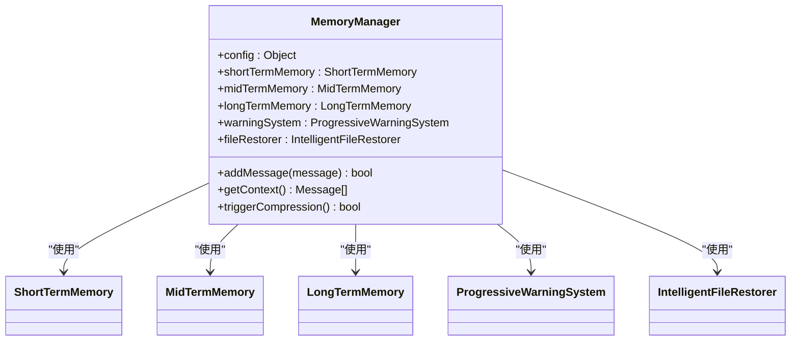
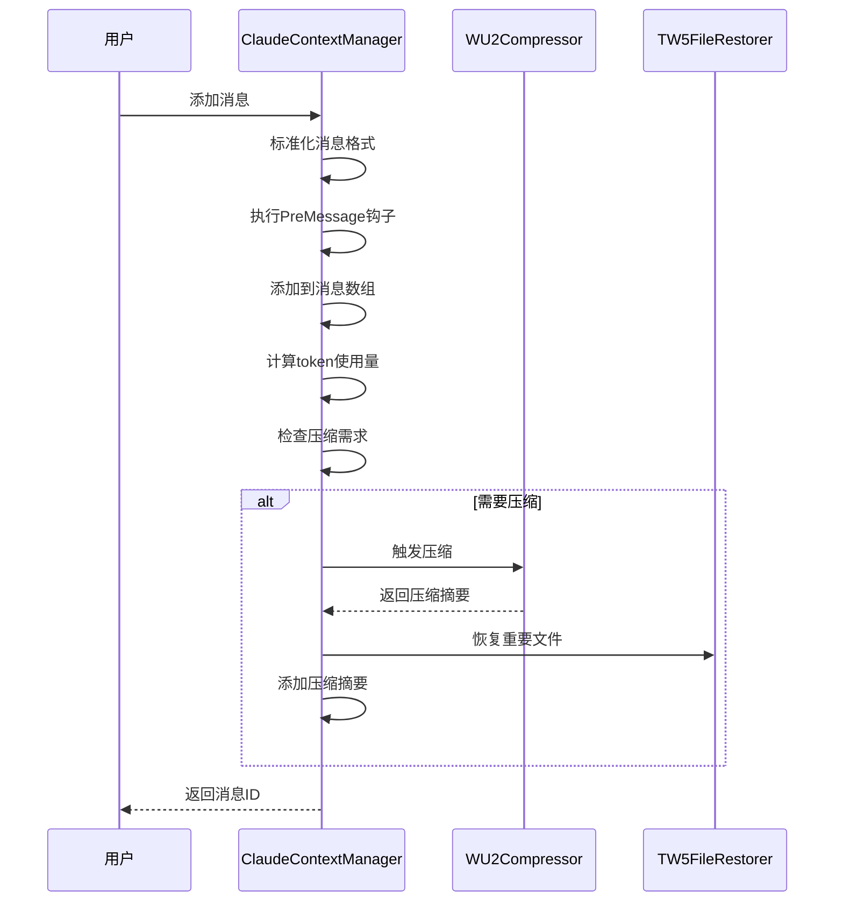
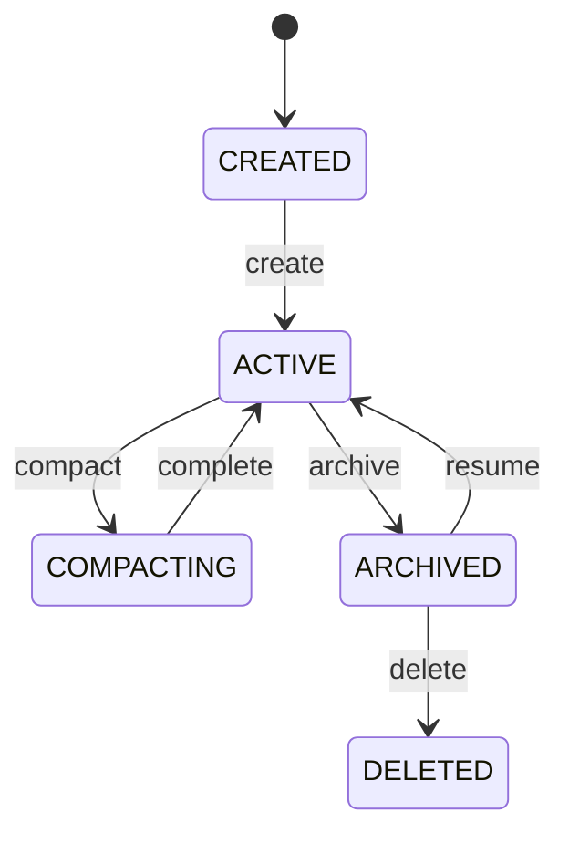
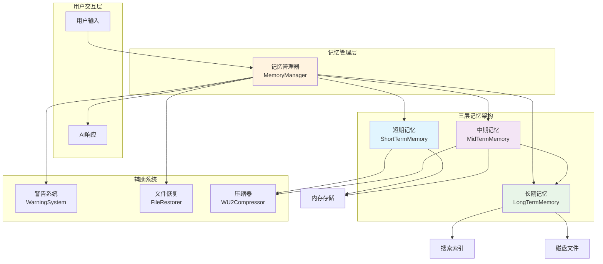
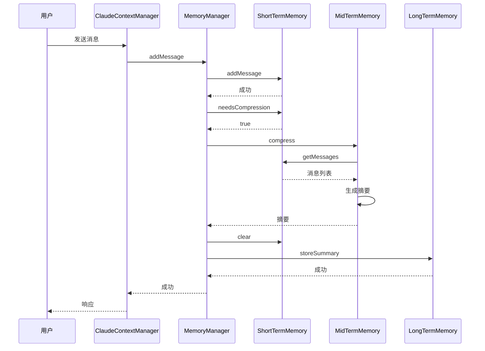

# 核心架构

<cite>
**本文档引用的文件**  
- [MemoryManager.js](file://context-claude-code/src/memory/MemoryManager.js)
- [ShortTermMemory.js](file://context-claude-code/src/memory/ShortTermMemory.js)
- [MidTermMemory.js](file://context-claude-code/src/memory/MidTermMemory.js)
- [LongTermMemory.js](file://context-claude-code/src/memory/LongTermMemory.js)
- [ClaudeContextManager.js](file://context-claude-code/src/claude-core/ClaudeContextManager.js)
- [session.go](file://packages/sdk/go/session.go)
- [sdk.gen.ts](file://packages/sdk/js/src/gen/sdk.gen.ts)
- [index.ts](file://packages/opencode/src/session/index.ts)
- [message-v2.ts](file://packages/opencode/src/session/message-v2.ts)
- [compaction.ts](file://packages/opencode/src/session/compaction.ts)
- [三层记忆架构详解.md](file://context-claude-code/三层记忆架构详解.md)
- [02-session-management.md](file://doc-agent-context/02-session-management.md)
</cite>

## 目录
1. [引言](#引言)
2. [三层记忆架构](#三层记忆架构)
3. [记忆管理器](#记忆管理器)
4. [上下文管理器](#上下文管理器)
5. [会话管理](#会话管理)
6. [核心组件交互](#核心组件交互)
7. [结论](#结论)

## 引言
本文档旨在深入阐述opencode项目的核心架构，重点解析其创新的“三层记忆架构”（3-Tier Memory Architecture）。该架构通过短期记忆、中期记忆和长期记忆三个层次，实现了对AI对话上下文的高效管理。短期记忆负责处理当前会话的实时上下文，中期记忆处理项目级的持久化上下文，而长期记忆则实现了跨项目、跨会话的知识存储。文档将详细解释`MemoryManager`如何协调这三层记忆的读写和同步，以及`ContextManager`如何从文件系统、Git历史和AI对话等多种来源收集和聚合上下文信息。同时，本文档将阐述会话（Session）作为核心执行单元的生命周期管理，并通过UML组件图和序列图来可视化这些核心组件之间的交互和数据流。

## 三层记忆架构
opencode的三层记忆架构是其核心创新之一，它模仿了人类大脑的记忆系统，从短期工作记忆到长期知识存储，每一层都有不同的职责和特点。该架构通过分层设计，解决了传统AI对话系统中上下文窗口有限、状态管理复杂和知识无法复用的问题。

### 短期记忆
短期记忆（ShortTermMemory）是三层架构中的第一层，相当于CPU的L1缓存，提供O(1)的高速访问效率。它负责存储当前会话的所有消息，包括用户输入、AI回复、文件操作记录和实时状态跟踪。短期记忆的核心特点是超快的访问速度和实时性，能够立即响应用户的请求。其主要功能包括：
- **消息存储**：保存当前对话的所有消息，确保上下文的完整性。
- **容量管理**：设置200K tokens的容量限制，并在达到80%的官方压缩阈值时自动触发压缩。
- **事件驱动**：通过完整的EventEmitter事件系统，实现组件间的松耦合通信。
- **钩子系统**：支持PreMessage、PostMessage等钩子，允许在消息处理的各个阶段插入自定义逻辑。

短期记忆通过反向遍历（VE函数）和智能过滤（HY5函数）等算法，高效地计算token使用量，并在需要时触发压缩流程。其设计目标是为当前工作提供一个高速、实时的工作台。

**Section sources**
- [ShortTermMemory.js](file://context-claude-code/src/memory/ShortTermMemory.js#L12-L334)
- [三层记忆架构详解.md](file://context-claude-code/三层记忆架构详解.md)

### 中期记忆
中期记忆（MidTermMemory）是三层架构中的第二层，扮演着智能蒸馏器的角色。它负责将短期记忆中的冗长对话历史压缩成结构化的摘要。中期记忆的核心是`WU2Compressor`，它使用8段式结构化压缩和LLM集成，将对话内容提炼成精华。其主要功能包括：
- **结构化压缩**：生成包含主要请求、关键技术概念、文件和代码片段等内容的8段式摘要。
- **质量验证**：通过保真度评分系统，确保压缩后的摘要保留了关键信息。
- **统计监控**：记录压缩的成功率、压缩比和token节省量，为系统优化提供数据支持。

中期记忆的压缩过程是自动触发的，当短期记忆的使用量达到阈值时，系统会调用中期记忆进行压缩。压缩后的摘要不仅减少了上下文的长度，还提高了信息的密度，使得AI能够更高效地理解和处理上下文。

**Section sources**
- [MidTermMemory.js](file://context-claude-code/src/memory/MidTermMemory.js#L13-L411)
- [WU2Compressor.js](file://context-claude-code/src/compression/WU2Compressor.js)
- [三层记忆架构详解.md](file://context-claude-code/三层记忆架构详解.md)

### 长期记忆
长期记忆（LongTermMemory）是三层架构中的第三层，相当于一个永久图书馆，用于存储所有有价值的知识和经验。它通过持久化存储机制，将跨会话的知识积累起来，实现知识的复用。其主要功能包括：
- **持久化存储**：将高质量的摘要保存在磁盘文件中，确保数据不会丢失。
- **智能搜索**：支持向量化搜索和关键词搜索，能够快速找到相关的历史经验和解决方案。
- **自动整理**：采用LRU（最近最少使用）算法清理不重要的旧记录，保持知识库的高效性。
- **跨会话访问**：新会话可以查询历史知识，避免重复劳动。

长期记忆的存储内容包括历史对话摘要、技术方案和项目经验等。通过向量化搜索，系统能够理解用户的查询意图，找到最相关的知识，从而提供更智能的响应。

**Section sources**
- [LongTermMemory.js](file://context-claude-code/src/memory/LongTermMemory.js#L14-L627)
- [三层记忆架构详解.md](file://context-claude-code/三层记忆架构详解.md)

## 记忆管理器
`MemoryManager`是三层记忆架构的协调者，负责统一管理短期记忆、中期记忆和长期记忆的读写和同步。它通过一个中心化的接口，简化了上层应用对记忆系统的访问。

### 初始化与配置
`MemoryManager`在初始化时，会根据配置创建三个记忆层的实例。配置包括最大token数、压缩阈值、是否启用警告系统等。这些配置允许系统根据不同的应用场景进行灵活调整。

**Diagram sources**
- [MemoryManager.js](file://context-claude-code/src/memory/MemoryManager.js#L15-L365)

### 消息添加与上下文获取
当上层应用调用`addMessage`方法时，`MemoryManager`会将消息添加到短期记忆中，并跟踪文件操作。如果短期记忆的使用量达到压缩阈值，`MemoryManager`会自动触发压缩流程。`getContext`方法则负责组合完整的上下文，包括中期记忆的摘要和长期记忆的搜索结果。

**Section sources**
- [MemoryManager.js](file://context-claude-code/src/memory/MemoryManager.js#L62-L94)
- [MemoryManager.js](file://context-claude-code/src/memory/MemoryManager.js#L100-L143)

### 压缩流程
`triggerCompression`方法是压缩流程的核心。它首先获取短期记忆中的所有消息，然后调用中期记忆的`compress`方法进行压缩。如果压缩成功，短期记忆会被清空，同时智能文件恢复器会恢复重要的文件内容。如果摘要有价值，它还会被存储到长期记忆中。

**Section sources**
- [MemoryManager.js](file://context-claude-code/src/memory/MemoryManager.js#L149-L183)

## 上下文管理器
`ClaudeContextManager`是opencode的核心上下文管理器，集成了所有Claude Code的真实算法，包括wU2压缩器、TW5文件恢复和渐进式警告系统。它负责管理整个对话的状态和历史。

### 核心组件
`ClaudeContextManager`集成了多个核心组件：
- **wU2压缩器**：负责智能压缩和质量验证。
- **TW5文件恢复器**：在压缩后智能恢复重要文件内容。
- **渐进式警告系统**：提供三级预警机制，防止内存溢出。
- **钩子系统**：允许在消息处理的各个阶段插入自定义逻辑。

### 消息处理流程
`addMessage`方法是`ClaudeContextManager`的核心。它首先标准化消息格式，然后执行PreMessage钩子，接着将消息添加到消息数组中。之后，它会计算当前token使用量，检查是否需要压缩，并执行PostMessage钩子。如果需要压缩，它会触发自动压缩流程。

**Diagram sources**
- [ClaudeContextManager.js](file://context-claude-code/src/claude-core/ClaudeContextManager.js#L182-L251)

**Section sources**
- [ClaudeContextManager.js](file://context-claude-code/src/claude-core/ClaudeContextManager.js#L19-L786)

## 会话管理
会话（Session）是opencode的核心执行单元，负责维护整个对话的状态和历史。会话管理系统通过完整的生命周期管理、消息处理和状态同步等机制，为AI agent提供强大的上下文管理能力。

### 会话生命周期
会话的生命周期采用状态机模式，确保状态转换的合法性和一致性。会话的状态包括CREATED、ACTIVE、COMPACTING、ARCHIVED和DELETED。状态转换通过事件系统进行通知，实现松耦合的组件通信。

**Diagram sources**
- [02-session-management.md](file://doc-agent-context/02-session-management.md)

### 会话创建与初始化
会话创建采用工厂模式和建造者模式，确保会话对象的完整性和一致性。系统通过多步骤的创建流程，包括ID生成、元数据设置、存储持久化和事件通知。会话元数据包括项目ID、目录、标题、版本和时间戳等。

**Section sources**
- [index.ts](file://packages/opencode/src/session/index.ts#L19-L348)

### 消息系统
会话的消息系统采用类型安全的联合类型和模式匹配，支持多种消息类型，每种类型都有特定的结构和处理逻辑。消息类型包括文本、推理过程、文件内容、工具调用等。消息处理管道通过一系列处理器，依次对消息进行验证、转换和处理。

**Section sources**
- [message-v2.ts](file://packages/opencode/src/session/message-v2.ts#L19-L581)

## 核心组件交互
本节通过UML组件图和序列图，可视化核心组件之间的交互和数据流。

### 组件图

**Diagram sources**
- [MemoryManager.js](file://context-claude-code/src/memory/MemoryManager.js#L15-L365)
- [三层记忆架构详解.md](file://context-claude-code/三层记忆架构详解.md)

### 序列图

**Diagram sources**
- [MemoryManager.js](file://context-claude-code/src/memory/MemoryManager.js#L62-L94)
- [MemoryManager.js](file://context-claude-code/src/memory/MemoryManager.js#L149-L183)

## 结论
opencode的核心架构通过创新的三层记忆架构，实现了对AI对话上下文的高效管理。短期记忆、中期记忆和长期记忆的分层设计，不仅解决了上下文窗口有限的问题，还实现了知识的持久化和复用。`MemoryManager`作为协调者，简化了上层应用对记忆系统的访问。`ClaudeContextManager`集成了所有核心算法，提供了强大的上下文管理能力。会话管理系统通过完整的生命周期管理，确保了对话状态的连续性和一致性。这些组件之间的紧密协作，使得opencode能够处理复杂的长期对话，为用户提供智能、高效的AI交互体验。