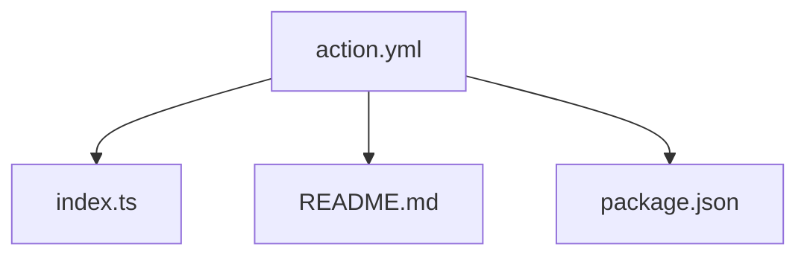
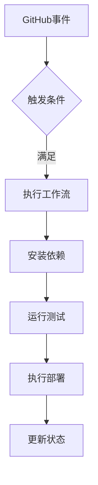
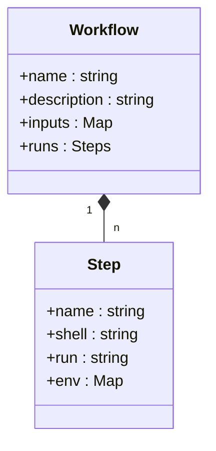
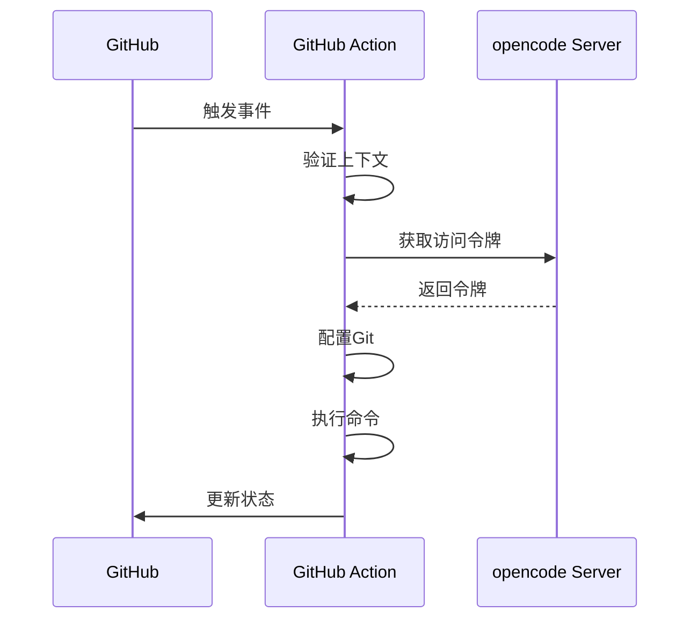
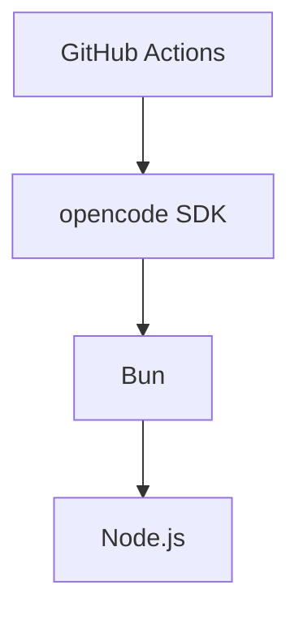

# CI/CD自动化

<cite>
**Referenced Files in This Document**   
- [action.yml](file://github/action.yml)
- [index.ts](file://github/index.ts)
- [github.ts](file://packages/opencode/src/cli/cmd/github.ts)
</cite>

## 目录
1. [简介](#简介)
2. [项目结构](#项目结构)
3. [核心组件](#核心组件)
4. [架构概述](#架构概述)
5. [详细组件分析](#详细组件分析)
6. [依赖分析](#依赖分析)
7. [性能考虑](#性能考虑)
8. [故障排除指南](#故障排除指南)
9. [结论](#结论)

## 简介
本文档详细说明了如何通过GitHub Actions实现自动化构建、测试和部署的CI/CD流水线配置。文档分析了`action.yml`文件中的工作流定义，包括触发条件、作业步骤和权限配置。同时，文档还解释了如何安全地管理部署密钥和云服务凭证，并提供了流水线失败时的排查方法。

## 项目结构
项目结构中，CI/CD相关配置文件主要位于`github`目录下，包括`action.yml`和`index.ts`文件。这些文件定义了GitHub Actions的工作流和执行逻辑。

**Diagram sources**
- [action.yml](file://github/action.yml)
- [index.ts](file://github/index.ts)

**Section sources**
- [action.yml](file://github/action.yml)
- [index.ts](file://github/index.ts)

## 核心组件
核心组件包括`action.yml`文件中定义的工作流和`index.ts`文件中的执行逻辑。这些组件共同实现了CI/CD流水线的自动化功能。

**Section sources**
- [action.yml](file://github/action.yml)
- [index.ts](file://github/index.ts)

## 架构概述
CI/CD流水线的架构主要包括以下几个部分：工作流定义、执行脚本、权限配置和密钥管理。工作流定义在`action.yml`文件中，执行逻辑在`index.ts`文件中实现。

**Diagram sources**
- [action.yml](file://github/action.yml)
- [index.ts](file://github/index.ts)

## 详细组件分析

### 工作流定义分析
工作流定义在`action.yml`文件中，包括触发条件、作业步骤和权限配置。

#### 工作流定义

**Diagram sources**
- [action.yml](file://github/action.yml)

### 执行逻辑分析
执行逻辑在`index.ts`文件中实现，主要包括获取访问令牌、配置Git、执行命令等步骤。

#### 执行逻辑

**Diagram sources**
- [index.ts](file://github/index.ts)

## 依赖分析
CI/CD流水线依赖于多个组件，包括GitHub Actions、opencode SDK和Bun运行时环境。

**Diagram sources**
- [package.json](file://github/package.json)
- [index.ts](file://github/index.ts)

**Section sources**
- [package.json](file://github/package.json)
- [index.ts](file://github/index.ts)

## 性能考虑
在设计CI/CD流水线时，需要考虑以下性能因素：
- 减少不必要的步骤
- 优化依赖安装过程
- 合理设置超时时间
- 使用缓存机制

## 故障排除指南
当CI/CD流水线失败时，可以按照以下步骤进行排查：

1. 查看日志输出，定位错误信息
2. 检查权限配置是否正确
3. 验证密钥是否有效
4. 确认依赖项是否正确安装

**Section sources**
- [index.ts](file://github/index.ts)

## 结论
通过合理配置GitHub Actions工作流，结合opencode SDK，可以实现高效、安全的CI/CD自动化流程。建议根据团队规模和项目需求，定制化CI/CD流程，以提高开发效率和代码质量。