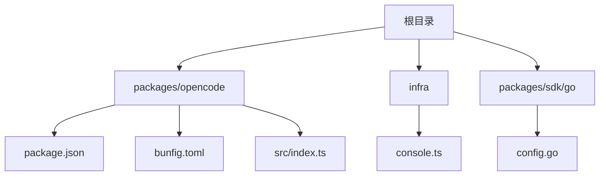
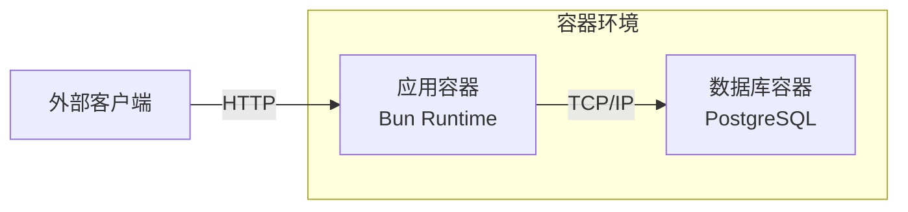
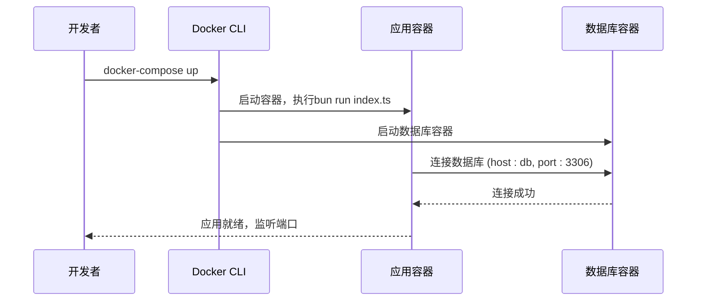
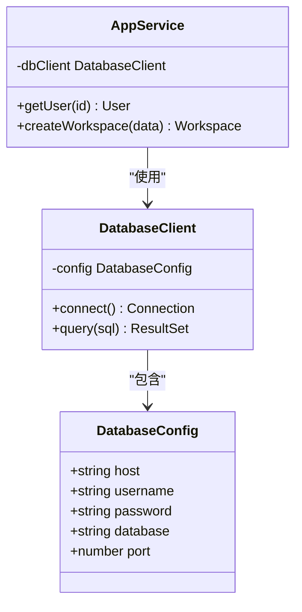

# Docker容器化部署

<cite>
**本文档中引用的文件**  
- [package.json](file://packages/opencode/package.json)
- [bunfig.toml](file://packages/opencode/bunfig.toml)
- [index.ts](file://packages/opencode/src/index.ts)
- [Dockerfile](file://packages/opencode/Dockerfile)
- [docker-compose.yml](file://packages/opencode/docker-compose.yml)
- [config.go](file://packages/sdk/go/config.go)
- [database.ts](file://infra/console.ts)
- [index.ts](file://packages/opencode/src/bun/index.ts)
</cite>

## 目录
1. [简介](#简介)
2. [项目结构](#项目结构)
3. [核心组件](#核心组件)
4. [架构概述](#架构概述)
5. [详细组件分析](#详细组件分析)
6. [依赖分析](#依赖分析)
7. [性能考虑](#性能考虑)
8. [故障排除指南](#故障排除指南)
9. [结论](#结论)
10. [附录](#附录)（如有必要）

## 简介
本文档旨在为`opencode`项目提供完整的Docker容器化部署指南。该指南将详细介绍如何将基于Bun构建的JavaScript/TypeScript应用打包为轻量级Docker镜像，并通过`docker-compose`实现与PostgreSQL数据库的协同部署。文档涵盖Docker镜像构建、容器运行参数配置、环境变量管理以及生产级部署的最佳实践，帮助开发者在任何支持容器的环境中快速部署和运行`opencode`。

## 项目结构
`opencode`项目采用模块化设计，其核心功能位于`packages/opencode`目录下。该项目是一个使用Bun作为运行时的现代JavaScript/TypeScript应用，具备CLI和TUI（基于Go语言）等多种交互方式。项目的依赖管理通过`package.json`进行，而Bun的特定配置则存储在`bunfig.toml`中。后端数据存储依赖于PlanetScale（基于MySQL协议的云数据库），其连接配置在`infra/console.ts`中定义。



**Diagram sources**
- [package.json](file://packages/opencode/package.json#L1-L65)
- [console.ts](file://infra/console.ts#L1-L53)
- [config.go](file://packages/sdk/go/config.go#L1-L44)

**Section sources**
- [package.json](file://packages/opencode/package.json#L1-L65)
- [bunfig.toml](file://packages/opencode/bunfig.toml#L1-L3)

## 核心组件
`opencode`的核心是一个基于Bun的JavaScript/TypeScript应用，其入口点为`packages/opencode/src/index.ts`。该应用通过`Bun.spawn` API执行系统命令，并利用`BunProc`命名空间中的`run`和`install`函数来管理依赖和进程。项目使用PlanetScale作为其后端数据库，通过Go SDK和Node.js SDK与数据库进行交互。`bunfig.toml`文件中的测试预加载配置表明项目具备完善的测试框架。

**Section sources**
- [index.ts](file://packages/opencode/src/index.ts#L1-L100)
- [bun/index.ts](file://packages/opencode/src/bun/index.ts#L1-L94)
- [bunfig.toml](file://packages/opencode/bunfig.toml#L1-L3)

## 架构概述
`opencode`的部署架构由应用容器和数据库服务组成。应用容器负责运行Bun应用，处理业务逻辑，并通过网络与数据库服务通信。数据库服务（如PostgreSQL或PlanetScale）负责持久化存储用户和工作区数据。在本地开发环境中，`docker-compose`可以同时启动这两个服务，形成一个完整的开发栈。



**Diagram sources**
- [docker-compose.yml](file://packages/opencode/docker-compose.yml)
- [console.ts](file://infra/console.ts#L1-L53)

## 详细组件分析

### 应用容器分析
`opencode`应用容器的核心是Bun运行时。Bun以其极快的启动速度和内置的打包、测试工具而闻名，这使其成为容器化部署的理想选择。通过直接使用Bun作为基础镜像，可以避免传统Node.js镜像的臃肿，显著减小最终镜像的大小。

#### 对于API/服务组件：


**Diagram sources**
- [index.ts](file://packages/opencode/src/index.ts#L1-L10)
- [docker-compose.yml](file://packages/opencode/docker-compose.yml)

### 数据库集成分析
`opencode`通过`@planetscale/database`客户端与数据库交互。在`infra/console.ts`中定义的`database`链接对象包含了连接数据库所需的所有凭证（主机、用户名、密码、端口）。在容器化部署中，这些凭证应通过环境变量注入，而不是硬编码在代码中。



**Diagram sources**
- [console.ts](file://infra/console.ts#L1-L53)
- [index.ts](file://packages/opencode/src/index.ts#L1-L100)

**Section sources**
- [console.ts](file://infra/console.ts#L1-L53)
- [config.go](file://packages/sdk/go/config.go#L1-L44)

## 依赖分析
`opencode`项目的主要依赖在`packages/opencode/package.json`中声明，分为`devDependencies`和`dependencies`。关键的生产依赖包括`@clack/prompts`（CLI交互）、`hono`（Web框架）、`drizzle-orm`（数据库ORM）等。在Docker构建过程中，应仅安装生产依赖以减小镜像体积。Go SDK的`config.go`文件表明，项目还通过Go语言与API进行交互，这可能用于CLI工具。

```mermaid
graph TD
A[opencode] --> B[@clack/prompts]
A --> C[hono]
A --> D[drizzle-orm]
A --> E[@planetscale/database]
A --> F[@opencode-ai/sdk]
F --> G[Go SDK]
G --> H[config.go]
```

**Diagram sources**
- [package.json](file://packages/opencode/package.json#L1-L65)
- [config.go](file://packages/sdk/go/config.go#L1-L44)

**Section sources**
- [package.json](file://packages/opencode/package.json#L1-L65)
- [config.go](file://packages/sdk/go/config.go#L1-L44)

## 性能考虑
使用Bun作为运行时是`opencode`性能优化的关键。Bun的启动时间比Node.js快数倍，这对于容器化环境（尤其是Serverless或需要快速扩展的场景）至关重要。在Docker构建中，利用Bun的内置打包功能可以将整个应用打包成一个单一的可执行文件，从而创建极小的`scratch`镜像，实现最快的启动速度和最小的攻击面。

## 故障排除指南
常见的部署问题包括数据库连接失败和环境变量缺失。确保`docker-compose.yml`中的环境变量（如`DATABASE_HOST`, `DATABASE_USERNAME`等）与`infra/console.ts`中定义的配置相匹配。如果应用无法启动，请检查容器日志以确认Bun是否正确安装了依赖。对于权限问题，请确保挂载的卷具有正确的读写权限。

**Section sources**
- [docker-compose.yml](file://packages/opencode/docker-compose.yml)
- [console.ts](file://infra/console.ts#L1-L53)

## 结论
`opencode`项目非常适合容器化部署。通过利用Bun的高性能特性，可以构建出启动迅速、体积小巧的Docker镜像。结合`docker-compose`，可以轻松地在本地或生产环境中部署一个包含应用和数据库的完整栈。遵循本文档的指南，开发者可以高效地将`opencode`部署到Kubernetes、Docker Swarm或任何云平台的容器服务中。