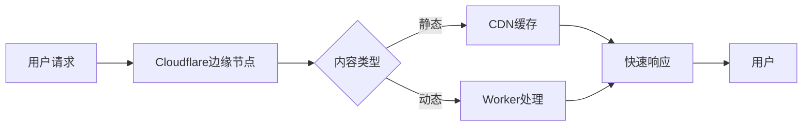

# 云平台部署

<cite>
**Referenced Files in This Document**   
- [sst.config.ts](file://sst.config.ts)
- [infra/app.ts](file://infra/app.ts)
- [infra/stage.ts](file://infra/stage.ts)
- [packages/function/src/api.ts](file://packages/function/src/api.ts)
- [packages/web/astro.config.mjs](file://packages/web/astro.config.mjs)
</cite>

## 目录
1. [简介](#简介)
2. [SST配置详解](#sst配置详解)
3. [基础设施即代码](#基础设施即代码)
4. [部署流程与监控](#部署流程与监控)
5. [域名与CDN配置](#域名与cdn配置)
6. [结论](#结论)

## 简介

本文档详细介绍了如何使用SST（Serverless Stack）框架将opencode项目部署到云平台。文档重点阐述了核心配置文件`sst.config.ts`的作用，`infra`目录下基础设施即代码的实现方式，以及完整的部署、监控和运维流程。通过本指南，开发者可以了解如何定义多环境基础设施、配置云资源以及管理云端服务。

## SST配置详解

`sst.config.ts`是整个项目的根配置文件，它定义了应用的基本属性、部署策略和云提供商配置。该文件使用SST框架的`$config`函数来声明应用的全局配置。

**Section sources**
- [sst.config.ts](file://sst.config.ts#L1-L24)

### 应用配置

在`sst.config.ts`中，`app`函数定义了应用的核心配置参数：

- **name**: 应用名称，设置为"opencode"
- **removal**: 资源删除策略，生产环境保留资源，其他环境可删除
- **protect**: 保护策略，生产环境启用保护防止意外删除
- **home**: 指定主要云平台为Cloudflare
- **providers**: 配置第三方服务提供商，包括Stripe支付和Planetscale数据库

这些配置确保了不同环境有不同的安全策略，生产环境受到严格保护，而开发环境可以更灵活地进行迭代。

### 运行时配置

`run`函数定义了基础设施的加载逻辑，通过动态导入的方式加载`infra`目录下的各个模块：

- `./infra/app.js`: 核心API服务
- `./infra/console.js`: 控制台服务
- `./infra/desktop.js`: 桌面应用服务

这种模块化的设计使得基础设施可以按需加载和管理，提高了部署的灵活性和可维护性。

## 基础设施即代码

`infra`目录包含了项目的核心基础设施定义，采用基础设施即代码（IaC）的方式管理云资源。这种方式确保了环境的一致性和可重复性。

### 应用基础设施

`app.ts`文件定义了主要的应用服务组件：

- **Secret管理**: 使用`sst.Secret`管理敏感信息如GitHub应用ID和私钥
- **存储桶**: 创建Cloudflare R2存储桶用于数据存储
- **Worker服务**: 定义Cloudflare Worker作为API网关
- **Astro网站**: 部署基于Astro框架的文档网站

**Section sources**
- [infra/app.ts](file://infra/app.ts#L1-L46)

### 环境管理

`stage.ts`文件负责管理不同部署环境的配置，实现了环境隔离和域名管理：

- **域名配置**: 根据阶段（stage）动态生成域名
  - 生产环境: opencode.ai
  - 开发环境: dev.opencode.ai
  - 其他环境: {stage}.dev.opencode.ai
- **区域主机名**: 配置Cloudflare区域主机名，指定部署区域为美国

这种环境感知的配置方式使得同一套代码可以在不同环境中正确部署，避免了硬编码带来的问题。

```mermaid
graph TD
A[部署请求] --> B{环境判断}
B --> |production| C[域名: opencode.ai]
B --> |dev| D[域名: dev.opencode.ai]
B --> |其他| E[域名: {stage}.dev.opencode.ai]
C --> F[应用部署]
D --> F
E --> F
F --> G[Cloudflare区域配置]
```

**Diagram sources**
- [infra/stage.ts](file://infra/stage.ts#L1-L14)

## 部署流程与监控

### 部署命令

部署流程遵循标准的SST框架命令：

1. **开发环境部署**: `sst deploy --stage dev`
2. **预生产环境部署**: `sst deploy --stage staging`
3. **生产环境部署**: `sst deploy --stage production`

每次部署都会根据`$app.stage`变量自动应用相应的配置策略。

### 服务监控

系统提供了多种监控和健康检查机制：

- **API健康检查**: `/`端点返回"Hello, world!"作为基本健康检查
- **WebSocket连接**: 实时同步服务通过WebSocket提供实时通信
- **日志推送**: 启用`logpush`功能将日志推送到Cloudflare日志系统

### 云端日志查看

可以通过以下方式查看云端日志：

1. Cloudflare控制台的Workers日志面板
2. 集成的监控工具查看实时请求
3. 使用SST CLI命令`sst logs`查看特定服务的日志

**Section sources**
- [packages/function/src/api.ts](file://packages/function/src/api.ts#L1-L318)

## 域名与CDN配置

### 域名管理

系统采用分层域名管理策略：

- **主域名**: opencode.ai (生产环境)
- **API子域名**: api.opencode.ai
- **文档子域名**: docs.opencode.ai
- **开发子域名**: dev.opencode.ai

这种结构化的域名设计提高了服务的可发现性和管理效率。

### SSL证书

SSL证书管理由Cloudflare自动处理：

- 自动为所有子域名申请和续期SSL证书
- 支持通配符证书覆盖所有开发环境子域名
- 强制HTTPS重定向确保通信安全

### CDN加速

利用Cloudflare全球网络实现CDN加速：

- 静态资源自动缓存到边缘节点
- 动态内容通过Workers在全球最近的节点处理
- 智能路由优化访问速度



**Diagram sources**
- [infra/app.ts](file://infra/app.ts#L1-L46)
- [packages/web/astro.config.mjs](file://packages/web/astro.config.mjs#L1-L125)

## 结论

通过SST框架和Cloudflare平台的结合，opencode项目实现了高效、安全的云部署。基础设施即代码的方法确保了环境的一致性，而分层的域名和CDN配置则提供了优秀的用户体验。建议在实际部署时遵循以下最佳实践：

1. 严格管理生产环境的保护策略
2. 定期审查Secret配置确保安全性
3. 监控日志和性能指标及时发现问题
4. 利用多环境部署策略进行充分测试

这种架构设计不仅适用于当前项目，也可作为其他类似应用的参考模板。