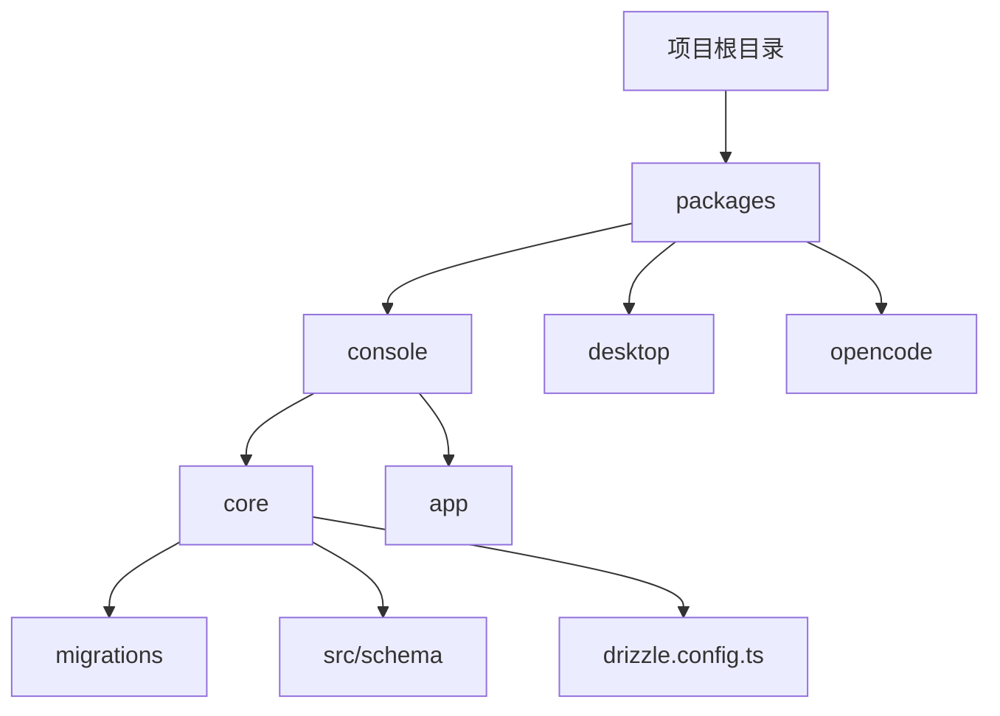
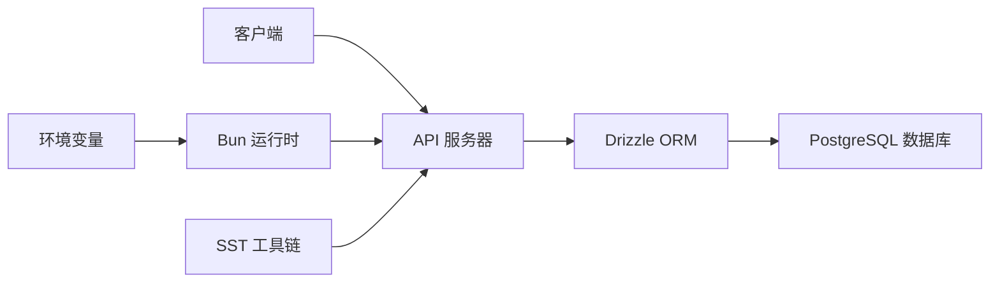
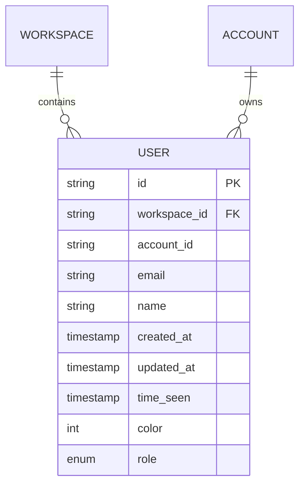
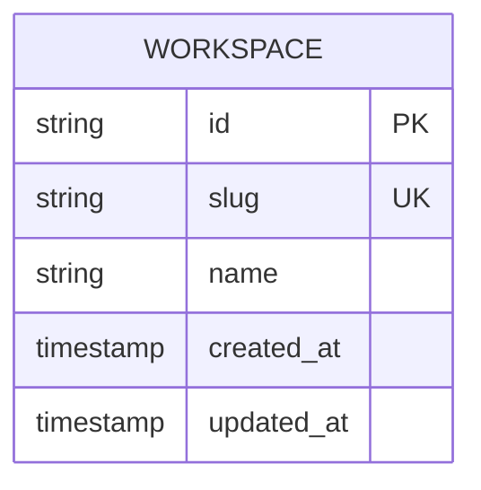
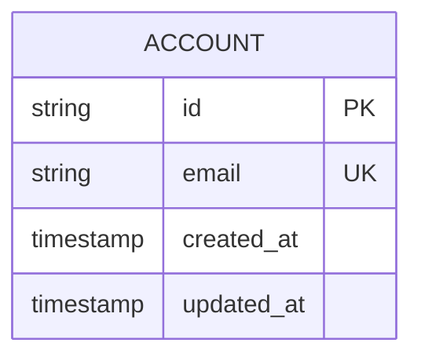
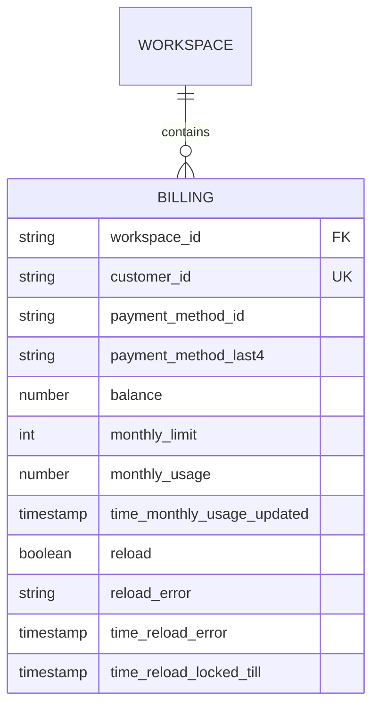
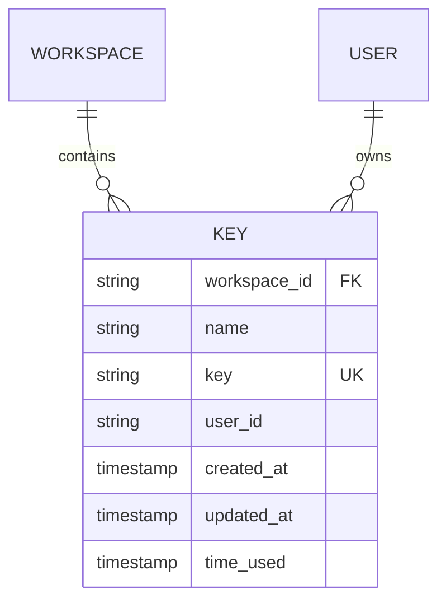

# 本地部署

<cite>
**本文档中引用的文件**  
- [bunfig.toml](file://bunfig.toml)
- [package.json](file://package.json)
- [drizzle.config.ts](file://packages/console/core/drizzle.config.ts)
- [index.ts](file://packages/console/core/src/drizzle/index.ts)
- [user.sql.ts](file://packages/console/core/src/schema/user.sql.ts)
- [workspace.sql.ts](file://packages/console/core/src/schema/workspace.sql.ts)
- [account.sql.ts](file://packages/console/core/src/schema/account.sql.ts)
- [billing.sql.ts](file://packages/console/core/src/schema/billing.sql.ts)
- [key.sql.ts](file://packages/console/core/src/schema/key.sql.ts)
- [package.json](file://packages/console/core/package.json)
</cite>

## 目录
1. [简介](#简介)
2. [项目结构](#项目结构)
3. [核心组件](#核心组件)
4. [架构概述](#架构概述)
5. [详细组件分析](#详细组件分析)
6. [依赖分析](#依赖分析)
7. [性能考虑](#性能考虑)
8. [故障排除指南](#故障排除指南)
9. [结论](#结论)

## 简介
本文档提供在本地环境中搭建 opencode 运行环境的详细指南。涵盖 PostgreSQL 数据库配置、Drizzle ORM 数据库迁移执行、Bun 运行时服务启动、环境变量设置、调试模式命令以及常见问题解决方案。还包括验证部署成功的检查步骤。

## 项目结构
opencode 项目采用模块化设计，主要组件位于 `packages` 目录下。核心服务逻辑位于 `packages/console/core`，前端界面位于 `packages/desktop`，CLI 工具位于 `packages/opencode`。数据库迁移脚本和模式定义位于 `packages/console/core/migrations` 和 `src/schema` 中。



**Diagram sources**
- [drizzle.config.ts](file://packages/console/core/drizzle.config.ts#L1-L20)
- [package.json](file://package.json#L1-L60)

**Section sources**
- [package.json](file://package.json#L1-L60)
- [bunfig.toml](file://bunfig.toml#L1-L2)

## 核心组件
核心组件包括数据库配置、Drizzle ORM 集成、模式定义和 Bun 运行时启动逻辑。数据库配置通过 `drizzle.config.ts` 定义，模式定义在 `src/schema` 目录下，使用 Drizzle ORM 进行类型安全的数据库操作。

**Section sources**
- [drizzle.config.ts](file://packages/console/core/drizzle.config.ts#L1-L20)
- [index.ts](file://packages/console/core/src/drizzle/index.ts#L1-L86)

## 架构概述
系统架构基于模块化设计，使用 Drizzle ORM 作为数据库抽象层，Bun 作为运行时环境。核心服务通过 SST 工具链进行部署和管理，数据库连接通过环境资源注入。



**Diagram sources**
- [drizzle.config.ts](file://packages/console/core/drizzle.config.ts#L1-L20)
- [index.ts](file://packages/console/core/src/drizzle/index.ts#L1-L86)

## 详细组件分析

### 数据库模式分析
数据库模式定义了用户、工作区、账户、账单和密钥等核心实体。所有模式使用 Drizzle ORM 的 MySQL 适配器定义，确保类型安全和数据库一致性。

#### 用户表模式


**Diagram sources**
- [user.sql.ts](file://packages/console/core/src/schema/user.sql.ts#L1-L26)
- [workspace.sql.ts](file://packages/console/core/src/schema/workspace.sql.ts#L1-L21)

#### 工作区表模式


**Diagram sources**
- [workspace.sql.ts](file://packages/console/core/src/schema/workspace.sql.ts#L1-L21)

#### 账户表模式


**Diagram sources**
- [account.sql.ts](file://packages/console/core/src/schema/account.sql.ts#L1-L12)

#### 账单表模式


**Diagram sources**
- [billing.sql.ts](file://packages/console/core/src/schema/billing.sql.ts#L1-L55)
- [workspace.sql.ts](file://packages/console/core/src/schema/workspace.sql.ts#L1-L21)

#### 密钥表模式


**Diagram sources**
- [key.sql.ts](file://packages/console/core/src/schema/key.sql.ts#L1-L16)
- [workspace.sql.ts](file://packages/console/core/src/schema/workspace.sql.ts#L1-L21)

**Section sources**
- [user.sql.ts](file://packages/console/core/src/schema/user.sql.ts#L1-L26)
- [workspace.sql.ts](file://packages/console/core/src/schema/workspace.sql.ts#L1-L21)
- [account.sql.ts](file://packages/console/core/src/schema/account.sql.ts#L1-L12)
- [billing.sql.ts](file://packages/console/core/src/schema/billing.sql.ts#L1-L55)
- [key.sql.ts](file://packages/console/core/src/schema/key.sql.ts#L1-L16)

## 依赖分析
项目依赖关系通过 `package.json` 文件管理，使用 Bun 作为包管理器。核心依赖包括 Drizzle ORM、PlanetScale 数据库客户端、Stripe 支付集成和 AWS SDK。

```mermaid
graph TD
A[@opencode-ai/console-core] --> B[drizzle-orm]
A --> C[@planetscale/database]
A --> D[stripe]
A --> E[@aws-sdk/client-sts]
A --> F[ulid]
B --> G[mysql2]
C --> H[tls]
```

**Diagram sources**
- [package.json](file://packages/console/core/package.json#L1-L35)
- [package.json](file://package.json#L1-L60)

**Section sources**
- [package.json](file://packages/console/core/package.json#L1-L35)
- [package.json](file://package.json#L1-L60)

## 性能考虑
系统设计考虑了性能优化，包括数据库索引、缓存策略和异步操作。所有数据库表都定义了适当的索引以提高查询性能，使用 ULID 作为主键以支持分布式系统。

## 故障排除指南
常见问题包括端口冲突、依赖缺失和数据库连接失败。确保正确配置环境变量，安装所有依赖，并检查数据库服务是否正常运行。

**Section sources**
- [drizzle.config.ts](file://packages/console/core/drizzle.config.ts#L1-L20)
- [bunfig.toml](file://bunfig.toml#L1-L2)

## 结论
本文档提供了在本地环境中搭建 opencode 运行环境的完整指南。通过遵循这些步骤，开发者可以成功配置数据库、执行迁移、启动服务并验证部署。系统采用现代化的技术栈，包括 Bun 运行时、Drizzle ORM 和模块化架构设计。