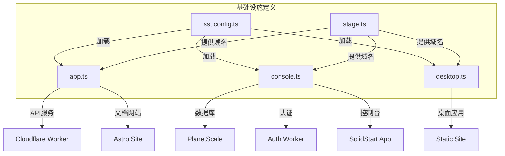
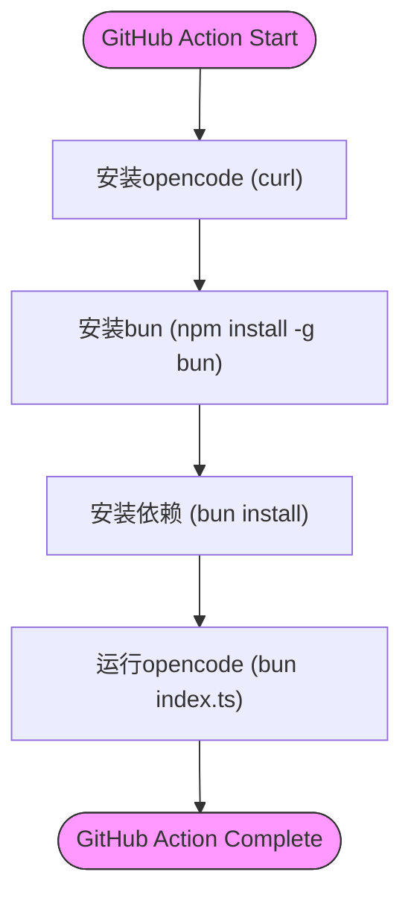

# 部署指南

<cite>
**本文档中引用的文件**  
- [action.yml](file://github/action.yml)
- [sst.config.ts](file://sst.config.ts)
- [app.ts](file://infra/app.ts)
- [console.ts](file://infra/console.ts)
- [desktop.ts](file://infra/desktop.ts)
- [stage.ts](file://infra/stage.ts)
- [drizzle.config.ts](file://packages/console/core/drizzle.config.ts)
- [0000_fluffy_raza.sql](file://packages/console/core/migrations/0000_fluffy_raza.sql)
- [0001_serious_whistler.sql](file://packages/console/core/migrations/0001_serious_whistler.sql)
- [0002_violet_loners.sql](file://packages/console/core/migrations/0002_violet_loners.sql)
- [0003_dusty_clint_barton.sql](file://packages/console/core/migrations/0003_dusty_clint_barton.sql)
- [0004_first_mockingbird.sql](file://packages/console/core/migrations/0004_first_mockingbird.sql)
- [0005_jazzy_skrulls.sql](file://packages/console/core/migrations/0005_jazzy_skrulls.sql)
- [0006_parallel_gauntlet.sql](file://packages/console/core/migrations/0006_parallel_gauntlet.sql)
- [0007_familiar_nightshade.sql](file://packages/console/core/migrations/0007_familiar_nightshade.sql)
- [0008_eminent_ultimatum.sql](file://packages/console/core/migrations/0008_eminent_ultimatum.sql)
- [0009_redundant_piledriver.sql](file://packages/console/core/migrations/0009_redundant_piledriver.sql)
- [0010_needy_sue_storm.sql](file://packages/console/core/migrations/0010_needy_sue_storm.sql)
- [0011_freezing_phil_sheldon.sql](file://packages/console/core/migrations/0011_freezing_phil_sheldon.sql)
- [0012_bright_photon.sql](file://packages/console/core/migrations/0012_bright_photon.sql)
- [0013_absurd_hobgoblin.sql](file://packages/console/core/migrations/0013_absurd_hobgoblin.sql)
- [0014_demonic_princess_powerful.sql](file://packages/console/core/migrations/0014_demonic_princess_powerful.sql)
- [0015_cloudy_revanche.sql](file://packages/console/core/migrations/0015_cloudy_revanche.sql)
- [0016_cold_la_nuit.sql](file://packages/console/core/migrations/0016_cold_la_nuit.sql)
- [0017_woozy_thaddeus_ross.sql](file://packages/console/core/migrations/0017_woozy_thaddeus_ross.sql)
- [0018_nervous_iron_lad.sql](file://packages/console/core/migrations/0018_nervous_iron_lad.sql)
- [0019_dazzling_cable.sql](file://packages/console/core/migrations/0019_dazzling_cable.sql)
</cite>

## 目录
1. [本地部署](#本地部署)
2. [云平台部署（SST框架）](#云平台部署sst框架)
3. [Docker镜像构建与运行](#docker镜像构建与运行)
4. [CI/CD自动化（GitHub Actions）](#cicd自动化github-actions)
5. [生产环境最佳实践](#生产环境最佳实践)
6. [不同规模部署架构建议](#不同规模部署架构建议)

## 本地部署

本节介绍如何在本地环境中部署opencode，包括PostgreSQL数据库的设置和使用Drizzle ORM进行迁移。

### 数据库设置

项目使用PlanetScale提供的MySQL兼容数据库服务。本地开发时，可通过SST框架自动配置数据库连接。`packages/console/core/drizzle.config.ts`文件定义了Drizzle ORM的配置，包括数据库凭证通过SST Resource注入，迁移文件输出目录为`./migrations/`，以及模式文件路径为`./src/**/*.sql.ts`。

### 数据库迁移

Drizzle ORM的迁移系统通过SQL文件管理数据库模式变更。迁移文件位于`packages/console/core/migrations/`目录下，每个文件以时间戳和随机名称命名（如`0000_fluffy_raza.sql`）。初始迁移文件`0000_fluffy_raza.sql`创建了核心表结构，包括`account`、`billing`、`key`、`user`和`workspace`等表。后续迁移文件按顺序应用变更，例如`0001_serious_whistler.sql`修改了`key`表，添加了`actor` JSON字段并移除了`user_id`字段。

**Section sources**
- [drizzle.config.ts](file://packages/console/core/drizzle.config.ts#L1-L20)
- [0000_fluffy_raza.sql](file://packages/console/core/migrations/0000_fluffy_raza.sql#L1-L89)
- [0001_serious_whistler.sql](file://packages/console/core/migrations/0001_serious_whistler.sql#L1-L2)

## 云平台部署（SST框架）

本节详细说明如何使用SST（Serverless Stack）框架将opencode部署到云平台（如AWS和Cloudflare）。

### SST配置

`sst.config.ts`是SST应用的主配置文件。它定义了应用名称为"opencode"，在生产环境（stage为"production"）时启用资源保护（`protect: true`）和保留模式（`removal: "retain"`），非生产环境则为移除模式。应用托管在Cloudflare平台（`home: "cloudflare"`），并集成了Stripe和PlanetScale提供商。

### 基础设施即代码（IaC）

`infra`目录下的文件定义了完整的基础设施即代码：
- `stage.ts`：定义了基于部署阶段（stage）的域名策略，生产环境使用`opencode.ai`，开发环境使用`dev.opencode.ai`，其他阶段使用`{stage}.dev.opencode.ai`。
- `app.ts`：定义了核心API服务（`sst.cloudflare.Worker`）和文档网站（`sst.cloudflare.x.Astro`），API服务链接了数据库和密钥，并配置了Durable Object命名空间。
- `console.ts`：定义了控制台应用的完整基础设施，包括PlanetScale数据库实例、Cloudflare KV用于认证存储、Stripe Webhook端点，以及控制台前端应用（`sst.cloudflare.x.SolidStart`）。
- `desktop.ts`：定义了桌面应用的静态站点部署，构建命令为`bun turbo build`，输出目录为`./dist`。



**Diagram sources**
- [sst.config.ts](file://sst.config.ts#L1-L23)
- [stage.ts](file://infra/stage.ts#L1-L13)
- [app.ts](file://infra/app.ts#L1-L45)
- [console.ts](file://infra/console.ts#L1-L153)
- [desktop.ts](file://infra/desktop.ts#L1-L10)

**Section sources**
- [sst.config.ts](file://sst.config.ts#L1-L23)
- [app.ts](file://infra/app.ts#L1-L45)
- [console.ts](file://infra/console.ts#L1-L153)
- [desktop.ts](file://infra/desktop.ts#L1-L10)
- [stage.ts](file://infra/stage.ts#L1-L13)

## Docker镜像构建与运行

虽然项目结构中未直接提供Dockerfile，但可通过现有构建系统创建Docker镜像。建议的Docker化策略是基于`bun`运行时环境构建多阶段镜像。

### 构建策略

1. **基础镜像**：使用官方Bun镜像（如`oven/bun`）作为基础。
2. **依赖安装**：复制`package.json`和`bunfig.toml`，运行`bun install`。
3. **构建应用**：执行`bun turbo build`命令构建所有包。
4. **运行时**：将构建产物复制到轻量级运行时镜像中。

### 运行指南

构建完成后，可通过标准Docker命令运行：
```bash
docker build -t opencode .
docker run -p 3000:3000 opencode
```

**Section sources**
- [package.json](file://package.json)
- [bunfig.toml](file://bunfig.toml)
- [turbo.json](file://turbo.json)

## CI/CD自动化（GitHub Actions）

本节介绍如何通过GitHub Actions实现CI/CD自动化。

### GitHub Action定义

`github/action.yml`文件定义了一个可复用的GitHub Action，名为"opencode GitHub Action"。该Action接受三个输入参数：
- `model`：指定使用的AI模型（必填）
- `share`：是否分享会话（可选）
- `token`：GitHub访问令牌（可选）

### 工作流步骤

该Action执行以下步骤：
1. **安装opencode**：通过curl命令从官方地址下载并安装。
2. **安装bun**：通过npm全局安装bun运行时。
3. **安装依赖**：进入Action路径并运行`bun install`。
4. **运行opencode**：执行`bun index.ts`，并传递输入参数作为环境变量。

此Action可被集成到任何GitHub仓库的工作流中，实现自动化代码操作。



**Diagram sources**
- [action.yml](file://github/action.yml#L1-L43)

**Section sources**
- [action.yml](file://github/action.yml#L1-L43)

## 生产环境最佳实践

### 环境隔离

项目通过SST的`$app.stage`变量实现环境隔离。不同阶段（production, dev, 其他）使用不同的域名和数据库分支。生产环境使用独立的PlanetScale生产分支，而其他环境基于生产分支创建子分支，确保数据隔离。

### 监控与日志

生产环境（production或frank阶段）配置了Honeycomb监控。`console.ts`中定义了`LogProcessor` Cloudflare Worker，作为尾部消费者（tail consumer）接收来自控制台应用的日志，并链接到Honeycomb API密钥，实现集中式日志聚合和分析。

### 备份策略

数据库备份由PlanetScale平台自动处理。项目使用PlanetScale的分支（Branch）功能，生产环境的数据变更通过分支机制进行管理，天然具备时间点恢复能力。此外，Stripe Webhook配置了全面的事件监听，确保支付相关事件的可靠处理和记录。

**Section sources**
- [console.ts](file://infra/console.ts#L1-L153)
- [stage.ts](file://infra/stage.ts#L1-L13)

## 不同规模部署架构建议

### 个人使用

对于个人开发者，建议使用简化部署：
- 使用本地开发模式，通过`sst dev`命令启动
- 使用SQLite等轻量级数据库替代PlanetScale
- 禁用Stripe支付和高级监控功能

### 团队协作

团队协作环境应具备：
- 独立的预生产（staging）环境，与生产环境隔离
- 完整的CI/CD流水线，集成GitHub Actions
- 基础监控和告警系统
- 共享的数据库实例，但通过工作区（workspace）隔离数据

### 企业级

企业级部署需考虑：
- 多区域部署，利用Cloudflare的全球网络
- 高可用架构，包括数据库读写分离和故障转移
- 增强的安全控制，如VPC、私有连接和严格的IAM策略
- 企业级监控、审计日志和合规性报告
- 自动化备份和灾难恢复计划

**Section sources**
- [sst.config.ts](file://sst.config.ts#L1-L23)
- [console.ts](file://infra/console.ts#L1-L153)
- [app.ts](file://infra/app.ts#L1-L45)