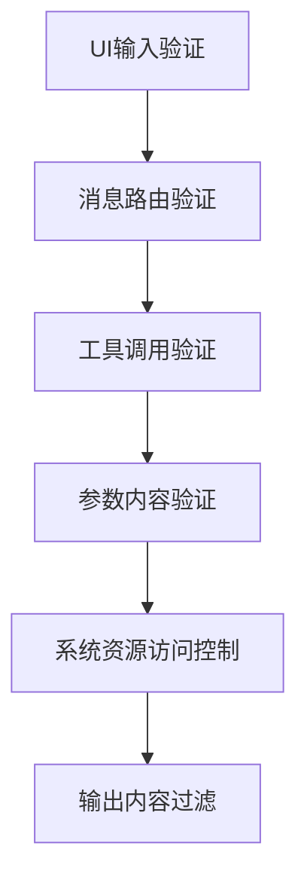
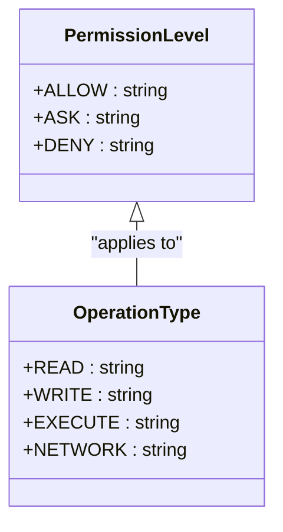
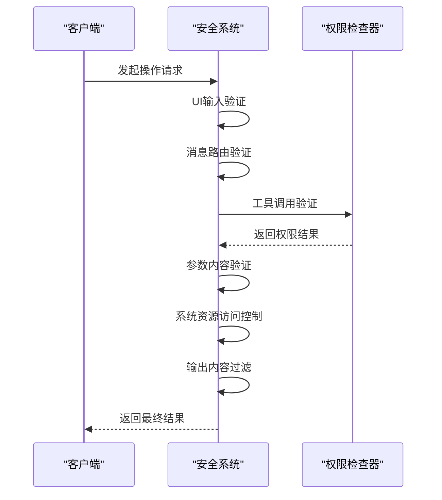
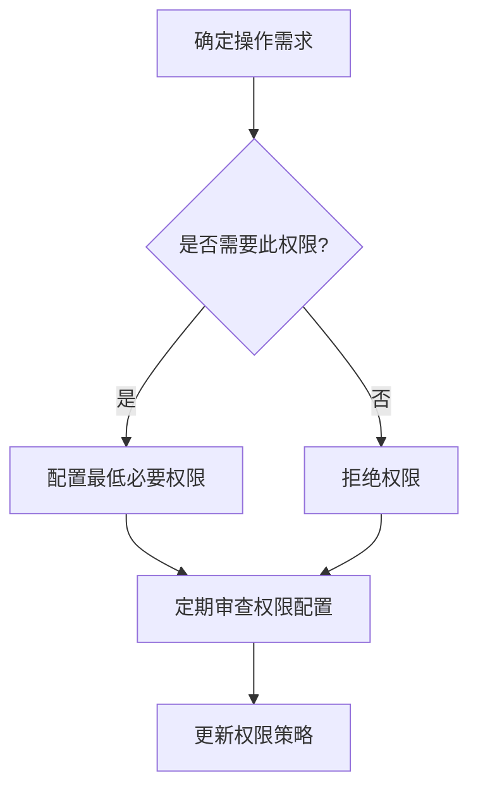

# 权限配置

<cite>
**本文档中引用的文件**  
- [SecuritySystem.js](file://context-claude-code/src/security/SecuritySystem.js)
- [index.ts](file://packages/opencode/src/permission/index.ts)
- [05-permission-control.md](file://doc-agent-context/05-permission-control.md)
- [opencode.json](file://opencode.json)
</cite>

## 目录
1. [权限控制系统概述](#权限控制系统概述)
2. [权限配置结构](#权限配置结构)
3. [权限级别与类型](#权限级别与类型)
4. [权限校验执行流程](#权限校验执行流程)
5. [安全配置最佳实践](#安全配置最佳实践)

## 权限控制系统概述

OpenCode的权限控制系统是一个多层安全验证机制，旨在确保AI agent在执行操作时遵循严格的安全策略。系统通过六层验证流程，从输入验证到输出过滤，全面保护系统安全。



**Diagram sources**
- [SecuritySystem.js](file://context-claude-code/src/security/SecuritySystem.js#L558-L845)

**Section sources**
- [SecuritySystem.js](file://context-claude-code/src/security/SecuritySystem.js#L1-L845)
- [05-permission-control.md](file://doc-agent-context/05-permission-control.md#L1-L905)

## 权限配置结构

权限配置主要通过配置文件中的`permission`字段定义，支持全局配置和特定agent的权限设置。配置结构采用JSON格式，定义了不同操作类型的权限策略。

```json
{
  "permission": {
    "edit": "ask",
    "bash": {
      "*": "allow",
      "rm -rf": "ask",
      "sudo": "deny"
    },
    "webfetch": "allow"
  }
}
```

**Section sources**
- [opencode.json](file://opencode.json#L1-L3)
- [05-permission-control.md](file://doc-agent-context/05-permission-control.md#L322-L354)

## 权限级别与类型

系统定义了三种核心权限级别：允许(allow)、询问(ask)和拒绝(deny)。这些级别应用于不同的操作类型，如文件编辑、命令执行和网络访问。



**Diagram sources**
- [index.ts](file://packages/opencode/src/permission/index.ts#L1-L181)
- [SecuritySystem.js](file://context-claude-code/src/security/SecuritySystem.js#L1-L75)

**Section sources**
- [index.ts](file://packages/opencode/src/permission/index.ts#L1-L181)
- [SecuritySystem.js](file://context-claude-code/src/security/SecuritySystem.js#L1-L75)

## 权限校验执行流程

权限校验采用六层验证机制，每层都有特定的验证职责。当任何一层验证失败时，操作将被阻止并记录安全违规。



**Diagram sources**
- [SecuritySystem.js](file://context-claude-code/src/security/SecuritySystem.js#L558-L845)
- [index.ts](file://packages/opencode/src/permission/index.ts#L1-L181)

**Section sources**
- [SecuritySystem.js](file://context-claude-code/src/security/SecuritySystem.js#L558-L845)
- [index.ts](file://packages/opencode/src/permission/index.ts#L1-L181)

## 安全配置最佳实践

实施最小权限原则是确保系统安全的关键。建议为不同类型的agent配置适当的权限级别，避免过度授权。



**Diagram sources**
- [05-permission-control.md](file://doc-agent-context/05-permission-control.md#L1-L905)

**Section sources**
- [05-permission-control.md](file://doc-agent-context/05-permission-control.md#L1-L905)
- [SecuritySystem.js](file://context-claude-code/src/security/SecuritySystem.js#L1-L845)