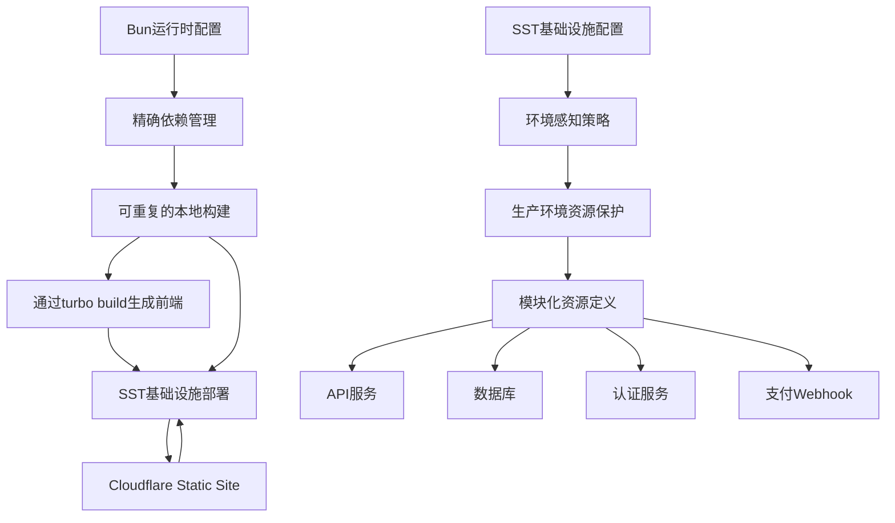

# 运行时与基础设施配置

<cite>
**本文档中引用的文件**  
- [bunfig.toml](file://bunfig.toml)
- [sst.config.ts](file://sst.config.ts)
- [infra/app.ts](file://infra/app.ts)
- [infra/console.ts](file://infra/console.ts)
- [infra/desktop.ts](file://infra/desktop.ts)
- [packages/opencode/src/bun/index.ts](file://packages/opencode/src/bun/index.ts)
</cite>

## 目录
1. [引言](#引言)
2. [Bun运行时配置分析](#bun运行时配置分析)
3. [SST基础设施配置分析](#sst基础设施配置分析)
4. [配置协同工作机制](#配置协同工作机制)
5. [性能优化与环境适配建议](#性能优化与环境适配建议)
6. [结论](#结论)

## 引言
本文档深入解析opencode项目中的Bun运行时配置（bunfig.toml）与SST基础设施配置（sst.config.ts）如何共同影响系统的开发、执行与部署。重点阐述配置文件中的关键参数如何支持模块化开发、环境隔离与云资源管理，并提供配置优化建议。

## Bun运行时配置分析
`bunfig.toml`文件定义了Bun包管理器的安装行为，其中`exact = true`确保所有依赖包安装时使用精确版本，避免因版本漂移导致的兼容性问题。该配置通过强制锁定依赖版本，增强了构建的可重复性和稳定性。

在代码实现层面，`packages/opencode/src/bun/index.ts`中的`BunProc.install`方法继承了这一精确安装策略，通过`--exact`和`--force`参数确保依赖安装的一致性。值得注意的是，该实现不硬编码任何注册表地址，而是依赖Bun自身的注册表解析机制，优先使用项目中的`.npmrc`配置，若不存在则默认使用`https://registry.npmjs.org`。

**Section sources**
- [bunfig.toml](file://bunfig.toml#L1-L2)
- [packages/opencode/src/bun/index.ts](file://packages/opencode/src/bun/index.ts#L50-L93)

## SST基础设施配置分析
`sst.config.ts`文件定义了opencode应用的基础设施即代码（IaC）配置。`app`函数中通过`input?.stage`判断部署阶段，实现了生产环境资源保留（`removal: "retain"`）和保护（`protect: true`）策略，防止关键资源被意外删除。

`run`函数通过动态导入`infra/`目录下的模块（`app.js`、`console.js`、`desktop.js`），实现了基础设施的模块化定义。这些模块分别负责核心API、管理控制台和桌面应用的云资源配置。

`infra/app.ts`定义了核心API服务（`Api`）和文档网站（`Web`），其中API服务链接了存储桶（`Bucket`）并配置了Durable Object绑定，用于状态同步。`infra/console.ts`配置了PlanetScale数据库、认证服务（`AuthApi`）和Stripe支付Webhook，形成了完整的后端服务栈。`infra/desktop.ts`则定义了静态站点（`Desktop`），通过`bun turbo build`命令构建前端应用。

**Section sources**
- [sst.config.ts](file://sst.config.ts#L1-L24)
- [infra/app.ts](file://infra/app.ts#L1-L46)
- [infra/console.ts](file://infra/console.ts#L1-L154)
- [infra/desktop.ts](file://infra/desktop.ts#L1-L11)

## 配置协同工作机制
Bun运行时配置与SST基础设施配置通过分层协作支持opencode的全栈开发。Bun配置确保本地开发和构建环境的依赖一致性，而SST配置则管理云环境的资源生命周期。

在部署流程中，Bun的`turbo build`命令（由`infra/desktop.ts`触发）利用`bunfig.toml`的精确版本控制，生成可预测的构建产物。SST框架随后将这些产物部署到Cloudflare Workers和Static Sites，同时通过`link`属性建立服务间的安全连接，如将数据库凭证注入认证服务。

环境变量通过SST的`Secret`和`Linkable`机制安全传递，避免了敏感信息的硬编码。例如，Stripe密钥和GitHub应用凭证被定义为`Secret`，并在需要的服务间通过`link`属性进行引用。

**Diagram sources**
- [bunfig.toml](file://bunfig.toml#L1-L2)
- [sst.config.ts](file://sst.config.ts#L1-L24)
- [infra/desktop.ts](file://infra/desktop.ts#L7-L11)
- [packages/opencode/src/bun/index.ts](file://packages/opencode/src/bun/index.ts#L50-L93)

## 性能优化与环境适配建议
为优化性能，建议在`bunfig.toml`中添加`[install]`下的`cache = true`配置以启用依赖缓存，减少重复安装开销。对于大型项目，可在`sst.config.ts`中为生产环境启用更激进的CDN缓存策略。

在多环境适配方面，可扩展`sst.config.ts`中的`app`函数，根据`input.stage`注入不同的环境变量。例如，为`staging`环境配置独立的数据库分支和测试支付密钥，实现安全的预发布验证。

对于开发环境，建议在`infra/console.ts`中为非生产阶段创建独立的数据库分支，基于`production`分支进行分叉，确保开发数据与生产数据隔离。同时，可为开发环境禁用Honeycomb日志处理，降低运营成本。

**Section sources**
- [sst.config.ts](file://sst.config.ts#L5-L15)
- [infra/console.ts](file://infra/console.ts#L10-L25)
- [bunfig.toml](file://bunfig.toml#L1-L2)

## 结论
`bunfig.toml`和`sst.config.ts`共同构成了opencode项目的核心配置体系。前者保障了开发与构建环境的稳定性，后者实现了云基础设施的声明式管理与环境隔离。两者的协同工作确保了从本地开发到生产部署的整个流程的可靠性、安全性和可维护性。通过合理调整这些配置，可以有效优化系统性能并适应不同的部署需求。