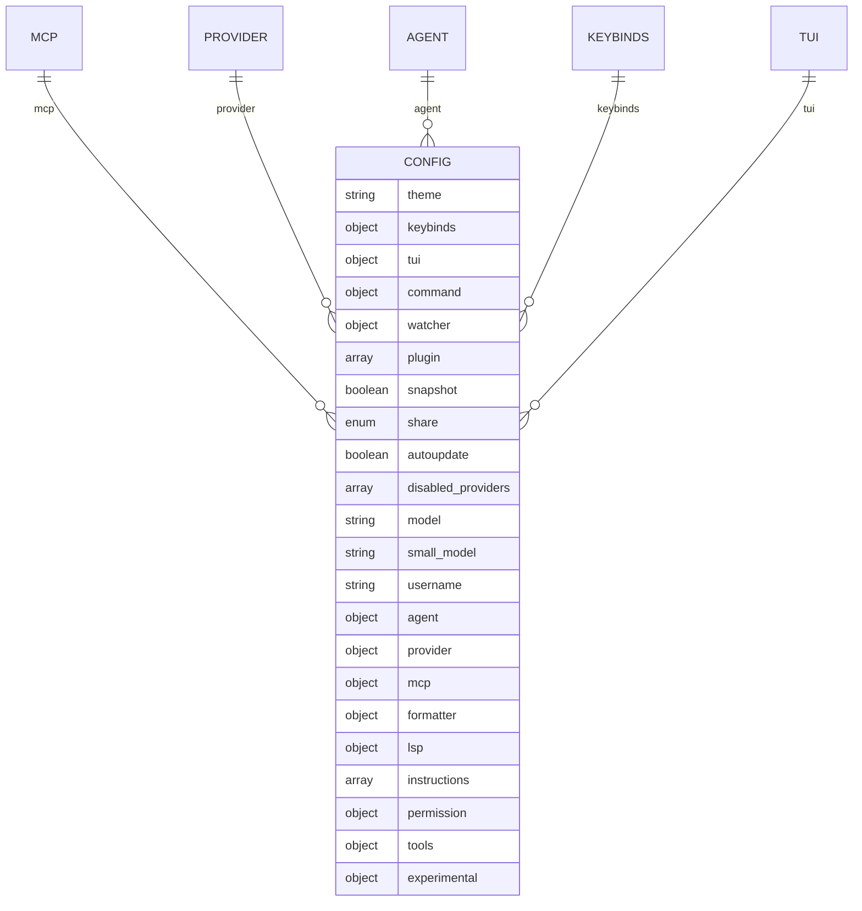
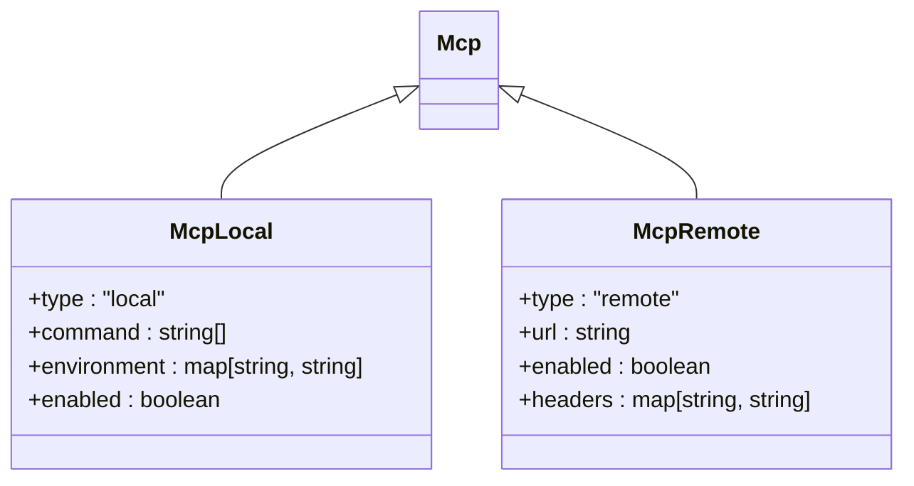
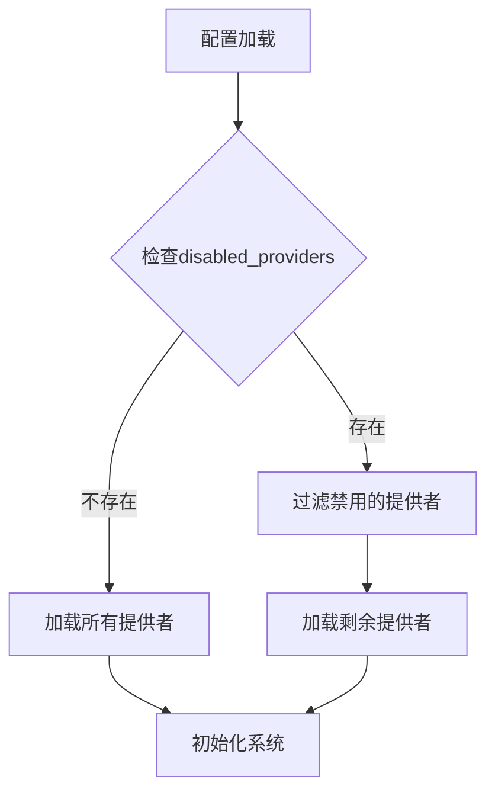
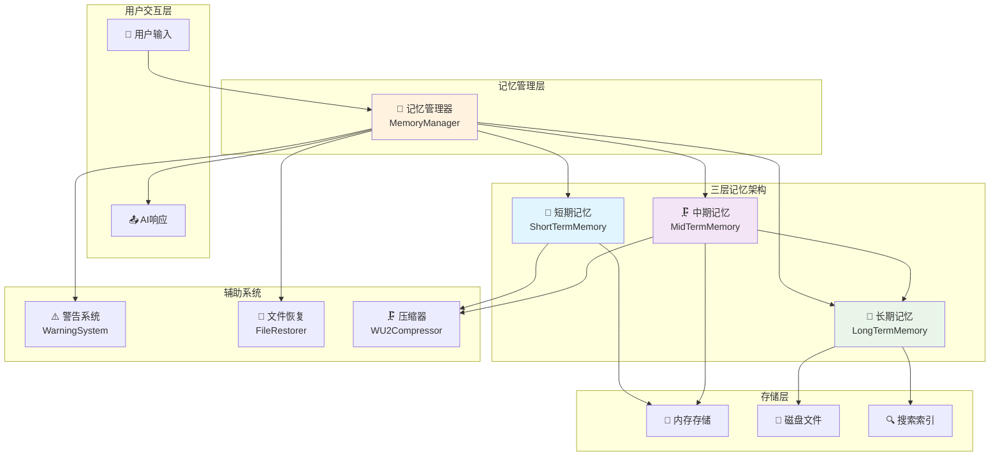
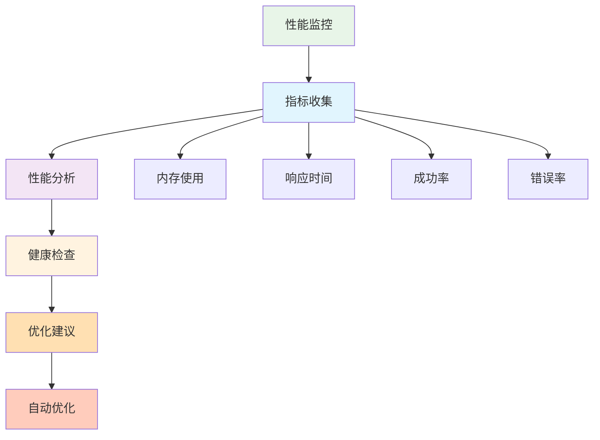

# 配置指南

<cite>
**本文档中引用的文件**   
- [opencode.json](file://opencode.json)
- [bunfig.toml](file://bunfig.toml)
- [sst.config.ts](file://sst.config.ts)
- [config.ts](file://packages/opencode/src/config/config.ts)
- [provider.ts](file://packages/opencode/src/provider/provider.ts)
- [log.ts](file://packages/opencode/src/util/log.ts)
- [server.ts](file://packages/opencode/src/server/server.ts)
- [EnhancedMemoryManager.js](file://context-claude-code/src/memory/EnhancedMemoryManager.js)
- [BaseMemory.js](file://context-claude-code/src/memory/BaseMemory.js)
- [PerformanceMonitor.js](file://context-claude-code/src/monitoring/PerformanceMonitor.js)
</cite>

## 目录
1. [简介](#简介)
2. [主配置文件详解](#主配置文件详解)
3. [MCP服务器配置](#mcp服务器配置)
4. [上下文提供者管理](#上下文提供者管理)
5. [记忆层配置](#记忆层配置)
6. [日志系统配置](#日志系统配置)
7. [性能监控配置](#性能监控配置)
8. [环境变量覆盖](#环境变量覆盖)
9. [部署场景模板](#部署场景模板)
10. [Bun运行时配置](#bun运行时配置)
11. [基础设施配置](#基础设施配置)
12. [配置文件包含机制](#配置文件包含机制)

## 简介
本配置指南旨在为用户和管理员提供全面的opencode行为定制说明。文档系统地解释了主配置文件`opencode.json`的每一个配置项，包括其作用、可接受的值、默认值和实际示例。涵盖了关键配置领域，如MCP服务器的连接设置、上下文提供者的启用/禁用、记忆层的存储路径和大小限制、日志级别以及性能监控选项。同时详细说明了如何通过环境变量覆盖配置文件中的设置，以及Bun运行时和基础设施配置对opencode运行的影响。

**Section sources**
- [opencode.json](file://opencode.json)
- [config.ts](file://packages/opencode/src/config/config.ts)

## 主配置文件详解
主配置文件`opencode.json`是opencode系统的核心配置文件，定义了系统的行为和功能。该文件遵循JSON Schema规范，可以在`https://opencode.ai/config.json`找到其完整的模式定义。



**Diagram sources**
- [opencode.json](file://opencode.json)
- [config.ts](file://packages/opencode/src/config/config.ts#L247-L278)

### 基础配置项
主配置文件包含多个基础配置项，用于控制opencode的基本行为。

| 配置项 | 类型 | 默认值 | 描述 | 示例 |
|-------|------|-------|------|------|
| `$schema` | string | `"https://opencode.ai/config.json"` | JSON模式引用，用于配置验证 | `"https://opencode.ai/config.json"` |
| `theme` | string | 无 | 界面使用的主题名称 | `"dark"` |
| `model` | string | 无 | 使用的模型，格式为`provider/model` | `"anthropic/claude-2"` |
| `small_model` | string | 无 | 用于小任务的小模型，格式为`provider/model` | `"openai/gpt-3.5-turbo"` |
| `username` | string | 系统用户名 | 在对话中显示的自定义用户名 | `"developer"` |
| `autoupdate` | boolean | 无 | 是否自动更新到最新版本 | `true` |
| `share` | enum | 无 | 控制共享行为：`manual`（手动）、`auto`（自动）、`disabled`（禁用） | `"auto"` |

**Section sources**
- [opencode.json](file://opencode.json)
- [config.ts](file://packages/opencode/src/config/config.ts#L37-L77)

### 高级配置项
除了基础配置外，主配置文件还包含多个高级配置项，用于精细控制opencode的功能。

| 配置项 | 类型 | 默认值 | 描述 | 示例 |
|-------|------|-------|------|------|
| `command` | object | 无 | 命令配置，包含命令模板和描述 | `{"build": {"template": "build the project"}}` |
| `plugin` | array | 无 | 插件列表，指定要加载的插件 | `["file://path/to/plugin"]` |
| `snapshot` | boolean | 无 | 是否启用快照功能 | `true` |
| `disabled_providers` | array | 无 | 禁用自动加载的提供者列表 | `["github"]` |
| `instructions` | array | 无 | 要包含的附加指令文件或模式 | `["docs/*.md"]` |
| `permission` | object | 无 | 权限配置，控制编辑、bash和webfetch的权限 | `{"edit": "ask", "bash": "allow"}` |
| `tools` | object | 无 | 工具启用/禁用配置 | `{"read": true, "write": false}` |
| `experimental` | object | 无 | 实验性功能配置 | `{"disable_paste_summary": true}` |

**Section sources**
- [opencode.json](file://opencode.json)
- [config.ts](file://packages/opencode/src/config/config.ts#L692-L725)

## MCP服务器配置
MCP（Model Context Protocol）服务器配置允许opencode连接到本地或远程的MCP服务器，以扩展其功能。

### MCP配置结构
MCP配置使用判别联合类型，支持本地和远程两种连接方式。



**Diagram sources**
- [config.ts](file://packages/opencode/src/config/config.ts#L247-L278)
- [mcp.ts](file://packages/opencode/src/mcp/index.ts#L22-L60)

### 本地MCP服务器配置
本地MCP服务器配置允许opencode启动一个本地的MCP服务器进程。

| 配置项 | 类型 | 必需 | 描述 | 示例 |
|-------|------|------|------|------|
| `type` | string | 是 | 连接类型，必须为`"local"` | `"local"` |
| `command` | array | 是 | 运行MCP服务器的命令和参数 | `["opencode", "x", "@modelcontextprotocol/server-filesystem"]` |
| `environment` | object | 否 | 运行MCP服务器时设置的环境变量 | `{"NODE_ENV": "development"}` |
| `enabled` | boolean | 否 | 启动时是否启用MCP服务器 | `true` |

**Section sources**
- [config.ts](file://packages/opencode/src/config/config.ts#L247-L260)
- [mcp.ts](file://packages/opencode/src/mcp/index.ts#L22-L60)

### 远程MCP服务器配置
远程MCP服务器配置允许opencode连接到远程的MCP服务器。

| 配置项 | 类型 | 必需 | 描述 | 示例 |
|-------|------|------|------|------|
| `type` | string | 是 | 连接类型，必须为`"remote"` | `"remote"` |
| `url` | string | 是 | 远程MCP服务器的URL | `"https://example.com/mcp"` |
| `enabled` | boolean | 否 | 启动时是否启用MCP服务器 | `true` |
| `headers` | object | 否 | 发送请求时包含的头部信息 | `{"Authorization": "Bearer token"}` |

**Section sources**
- [config.ts](file://packages/opencode/src/config/config.ts#L262-L278)
- [mcp.ts](file://packages/opencode/src/mcp/index.ts#L22-L60)

### MCP配置示例
以下是一个完整的MCP配置示例，展示了如何配置多个MCP服务器。

```json
{
  "mcp": {
    "local-filesystem": {
      "type": "local",
      "command": ["opencode", "x", "@modelcontextprotocol/server-filesystem"],
      "environment": {
        "NODE_ENV": "development"
      },
      "enabled": true
    },
    "remote-server": {
      "type": "remote",
      "url": "https://example.com/mcp",
      "headers": {
        "Authorization": "Bearer token"
      },
      "enabled": false
    }
  }
}
```

**Section sources**
- [opencode.json](file://opencode.json)
- [config.ts](file://packages/opencode/src/config/config.ts#L247-L278)

## 上下文提供者管理
上下文提供者是opencode系统中负责提供上下文信息的模块化组件。通过配置文件可以控制哪些提供者被启用或禁用。

### 提供者禁用配置
通过`disabled_providers`配置项可以禁用自动加载的提供者。

| 配置项 | 类型 | 描述 | 示例 |
|-------|------|------|------|
| `disabled_providers` | array | 禁用自动加载的提供者列表 | `["github", "gitlab"]` |



**Diagram sources**
- [provider.ts](file://packages/opencode/src/provider/provider.ts#L288-L317)
- [config.ts](file://packages/opencode/src/config/config.ts#L37-L77)

### 提供者配置示例
以下是一个禁用特定提供者的配置示例。

```json
{
  "disabled_providers": ["github", "gitlab"]
}
```

**Section sources**
- [opencode.json](file://opencode.json)
- [provider.ts](file://packages/opencode/src/provider/provider.ts#L288-L317)

## 记忆层配置
opencode系统采用三层记忆架构，包括短期记忆、中期记忆和长期记忆。这些记忆层的配置可以通过主配置文件进行定制。

### 三层记忆架构
三层记忆架构是opencode系统的核心设计，用于高效管理上下文信息。



**Diagram sources**
- [EnhancedMemoryManager.js](file://context-claude-code/src/memory/EnhancedMemoryManager.js#L77-L129)
- [BaseMemory.js](file://context-claude-code/src/memory/BaseMemory.js#L0-L47)

### 记忆层配置项
记忆层的配置主要通过`EnhancedMemoryManager`的配置对象进行设置。

| 配置项 | 类型 | 默认值 | 描述 | 示例 |
|-------|------|-------|------|------|
| `maxTokens` | number | 200000 | 最大令牌数 | `200000` |
| `compressionThreshold` | number | 0.92 | 压缩阈值 | `0.92` |
| `enableWarningSystem` | boolean | true | 是否启用警告系统 | `true` |
| `enableFileRestoration` | boolean | true | 是否启用文件恢复 | `true` |
| `maxConcurrentOperations` | number | 10 | 最大并发操作数 | `10` |
| `operationTimeoutMs` | number | 30000 | 操作超时时间（毫秒） | `30000` |
| `enableMetrics` | boolean | true | 是否启用指标收集 | `true` |

**Section sources**
- [EnhancedMemoryManager.js](file://context-claude-code/src/memory/EnhancedMemoryManager.js#L41-L81)
- [index.js](file://context-claude-code/src/index.js#L99-L146)

### 长期记忆存储配置
长期记忆的存储路径和大小限制可以通过配置进行设置。

| 配置项 | 类型 | 默认值 | 描述 | 示例 |
|-------|------|-------|------|------|
| `storagePath` | string | `"./memory-storage"` | 存储路径 | `"./memory-storage"` |
| `maxStorageSize` | number | 104857600 | 最大存储大小（字节） | `104857600` |
| `enableVectorSearch` | boolean | true | 是否启用向量搜索 | `true` |
| `vectorDimensions` | number | 1536 | 向量维度 | `1536` |

**Section sources**
- [index.js](file://context-claude-code/src/index.js#L148-L197)
- [BaseMemory.js](file://context-claude-code/src/memory/BaseMemory.js#L165-L193)

## 日志系统配置
opencode的日志系统提供了灵活的配置选项，用于控制日志的输出级别和格式。

### 日志级别配置
日志级别决定了哪些类型的日志消息会被记录。

| 日志级别 | 优先级 | 描述 |
|---------|-------|------|
| DEBUG | 0 | 调试信息，最详细的日志 |
| INFO | 1 | 一般信息，系统正常运行状态 |
| WARN | 2 | 警告信息，潜在的问题 |
| ERROR | 3 | 错误信息，系统错误 |

```mermaid
classDiagram
class LogLevel {
+DEBUG : 0
+INFO : 1
+WARN : 2
+ERROR : 3
}
class Logger {
+debug(message : any, extra? : Record<string, any>) : void
+info(message : any, extra? : Record<string, any>) : void
+warn(message : any, extra? : Record<string, any>) : void
+error(message : any, extra? : Record<string, any>) : void
+tag(key : string, value : string) : Logger
+clone() : Logger
+time(message : string, extra? : Record<string, any>) : {stop() : void}
}
Logger --> LogLevel : "使用"
```

**Diagram sources**
- [log.ts](file://packages/opencode/src/util/log.ts#L0-L51)
- [server.ts](file://packages/opencode/src/server/server.ts#L1081-L1115)

### 日志配置示例
以下是一个日志配置的示例，展示了如何通过API记录不同级别的日志。

```json
{
  "service": "config",
  "level": "INFO",
  "message": "loading",
  "extra": {
    "path": "/path/to/config.json"
  }
}
```

**Section sources**
- [log.ts](file://packages/opencode/src/util/log.ts#L104-L139)
- [server.ts](file://packages/opencode/src/server/server.ts#L1081-L1115)

## 性能监控配置
opencode系统内置了性能监控功能，可以收集和分析系统的性能指标。

### 性能监控配置项
性能监控的配置主要通过`PerformanceMetricsCollector`和相关组件进行设置。

| 配置项 | 类型 | 描述 | 示例 |
|-------|------|------|------|
| `enablePerformanceMonitoring` | boolean | 是否启用性能监控 | `true` |
| `enableAdvancedErrorHandling` | boolean | 是否启用高级错误处理 | `true` |
| `enableAsyncQueue` | boolean | 是否启用异步队列 | `true` |
| `enableSecurity` | boolean | 是否启用安全系统 | `true` |



**Diagram sources**
- [PerformanceMonitor.js](file://context-claude-code/src/monitoring/PerformanceMonitor.js#L381-L438)
- [EnhancedMemoryManager.js](file://context-claude-code/src/memory/EnhancedMemoryManager.js#L41-L81)

### 性能健康检查
性能健康检查会评估系统的整体健康状况，并提供相应的评分。

| 指标 | 阈值 | 影响 |
|------|------|------|
| 内存使用 | >1024MB | 扣30分 |
| 模型调用成功率 | <99% | 扣25分 |
| 工具执行成功率 | <95% | 扣15分 |

**Section sources**
- [PerformanceMonitor.js](file://context-claude-code/src/monitoring/PerformanceMonitor.js#L381-L438)
- [EnhancedMemoryManager.js](file://context-claude-code/src/memory/EnhancedMemoryManager.js#L875-L936)

## 环境变量覆盖
opencode支持通过环境变量覆盖配置文件中的设置，提供了灵活的配置管理方式。

### 环境变量替换语法
配置文件支持使用`{env:VAR_NAME}`语法来引用环境变量。

```mermaid
flowchart TD
A[读取配置文件] --> B{包含{env:VAR_NAME}?}
B --> |是| C[替换为环境变量值]
B --> |否| D[保持原值]
C --> E[解析JSON]
D --> E
E --> F[应用配置]
style B fill:#f3e5f5
style C fill:#e8f5e8
style D fill:#e1f5fe
```

**Diagram sources**
- [config.ts](file://packages/opencode/src/config/config.ts#L621-L648)
- [config.test.ts](file://packages/opencode/test/config/config.test.ts#L95-L147)

### 环境变量覆盖示例
以下是一个使用环境变量覆盖配置的示例。

```json
{
  "theme": "{env:THEME}",
  "model": "{env:MODEL_PROVIDER}/{env:MODEL_NAME}"
}
```

当环境变量设置为：
```bash
export THEME=dark
export MODEL_PROVIDER=anthropic
export MODEL_NAME=claude-2
```

配置将被解析为：
```json
{
  "theme": "dark",
  "model": "anthropic/claude-2"
}
```

**Section sources**
- [config.ts](file://packages/opencode/src/config/config.ts#L621-L648)
- [config.test.ts](file://packages/opencode/test/config/config.test.ts#L95-L147)

## 部署场景模板
根据不同部署场景的需求，提供了相应的配置模板。

### 开发环境配置模板
开发环境配置模板适用于本地开发和调试。

```json
{
  "$schema": "https://opencode.ai/config.json",
  "theme": "dark",
  "model": "anthropic/claude-2",
  "username": "developer",
  "autoupdate": false,
  "share": "manual",
  "disabled_providers": [],
  "mcp": {
    "local-dev": {
      "type": "local",
      "command": ["opencode", "x", "@modelcontextprotocol/server-filesystem"],
      "enabled": true
    }
  },
  "log": {
    "level": "DEBUG"
  },
  "memory": {
    "maxTokens": 100000,
    "compressionThreshold": 0.8,
    "storagePath": "./dev-memory-storage"
  }
}
```

**Section sources**
- [opencode.json](file://opencode.json)
- [config.ts](file://packages/opencode/src/config/config.ts)

### 测试环境配置模板
测试环境配置模板适用于自动化测试和集成测试。

```json
{
  "$schema": "https://opencode.ai/config.json",
  "theme": "light",
  "model": "openai/gpt-4",
  "username": "tester",
  "autoupdate": true,
  "share": "disabled",
  "disabled_providers": ["github"],
  "mcp": {
    "remote-test": {
      "type": "remote",
      "url": "https://test.example.com/mcp",
      "enabled": true
    }
  },
  "log": {
    "level": "INFO"
  },
  "memory": {
    "maxTokens": 150000,
    "compressionThreshold": 0.85,
    "storagePath": "./test-memory-storage"
  }
}
```

**Section sources**
- [opencode.json](file://opencode.json)
- [config.ts](file://packages/opencode/src/config/config.ts)

### 生产环境配置模板
生产环境配置模板适用于正式生产环境。

```json
{
  "$schema": "https://opencode.ai/config.json",
  "theme": "dark",
  "model": "anthropic/claude-2",
  "username": "production",
  "autoupdate": true,
  "share": "auto",
  "disabled_providers": ["github", "gitlab"],
  "mcp": {
    "production": {
      "type": "remote",
      "url": "https://prod.example.com/mcp",
      "headers": {
        "Authorization": "Bearer {env:MCP_TOKEN}"
      },
      "enabled": true
    }
  },
  "log": {
    "level": "WARN"
  },
  "memory": {
    "maxTokens": 200000,
    "compressionThreshold": 0.92,
    "storagePath": "/var/lib/opencode/memory-storage",
    "maxStorageSize": 1073741824
  },
  "performance": {
    "enablePerformanceMonitoring": true,
    "enableAdvancedErrorHandling": true,
    "enableAsyncQueue": true
  }
}
```

**Section sources**
- [opencode.json](file://opencode.json)
- [config.ts](file://packages/opencode/src/config/config.ts)

## Bun运行时配置
Bun运行时配置文件`bunfig.toml`用于配置Bun运行时的行为。

### Bun配置项
Bun配置文件包含以下主要配置项：

| 配置项 | 类型 | 描述 | 示例 |
|-------|------|------|------|
| `[install]` | section | 安装配置 | |
| `exact` | boolean | 是否使用精确版本 | `true` |

```toml
[install]
exact = true
```

**Section sources**
- [bunfig.toml](file://bunfig.toml)
- [config.ts](file://packages/opencode/src/config/config.ts#L571-L619)

## 基础设施配置
基础设施配置文件`sst.config.ts`用于配置系统的基础设施。

### 基础设施配置项
基础设施配置文件包含以下主要配置项：

| 配置项 | 类型 | 描述 | 示例 |
|-------|------|------|------|
| `name` | string | 应用名称 | `"opencode"` |
| `removal` | string | 删除策略 | `input?.stage === "production" ? "retain" : "remove"` |
| `protect` | boolean | 保护策略 | `["production"].includes(input?.stage)` |
| `home` | string | 主机位置 | `"cloudflare"` |
| `providers` | object | 服务提供商配置 | |

```typescript
export default $config({
  app(input) {
    return {
      name: "opencode",
      removal: input?.stage === "production" ? "retain" : "remove",
      protect: ["production"].includes(input?.stage),
      home: "cloudflare",
      providers: {
        stripe: {
          apiKey: process.env.STRIPE_SECRET_KEY,
        },
        planetscale: "0.4.1",
      },
    }
  },
  async run() {
    await import("./infra/app.js")
    await import("./infra/console.js")
    await import("./infra/desktop.js")
  },
})
```

**Section sources**
- [sst.config.ts](file://sst.config.ts)
- [config.ts](file://packages/opencode/src/config/config.ts#L571-L619)

## 配置文件包含机制
opencode支持在配置文件中包含其他文件的内容，提供了灵活的配置管理方式。

### 文件包含语法
配置文件支持使用`{file:filename}`语法来包含其他文件的内容。

```mermaid
flowchart TD
A[读取配置文件] --> B{包含{file:filename}?}
B --> |是| C[读取指定文件]
C --> D{文件存在?}
D --> |是| E[替换为文件内容]
D --> |否| F[抛出错误]
B --> |否| G[保持原值]
E --> H[解析JSON]
G --> H
H --> I[应用配置]
style B fill:#f3e5f5
style C fill:#e1f5fe
style D fill:#e8f5e8
style E fill:#fff3e0
style F fill:#ffccbc
style G fill:#e1f5fe
```

**Diagram sources**
- [config.ts](file://packages/opencode/src/config/config.ts#L621-L648)
- [config.test.ts](file://packages/opencode/test/config/config.test.ts#L95-L147)

### 文件包含示例
以下是一个使用文件包含的配置示例。

```json
{
  "theme": "{file:theme.txt}",
  "instructions": "{file:instructions.md}"
}
```

当`theme.txt`内容为`dark`，`instructions.md`内容为`# Instructions\nFollow the guidelines.`时，配置将被解析为：

```json
{
  "theme": "dark",
  "instructions": "# Instructions\nFollow the guidelines."
}
```

**Section sources**
- [config.ts](file://packages/opencode/src/config/config.ts#L621-L648)
- [config.test.ts](file://packages/opencode/test/config/config.test.ts#L95-L147)