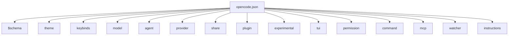
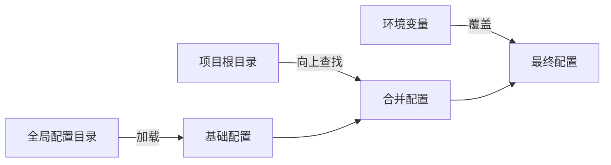
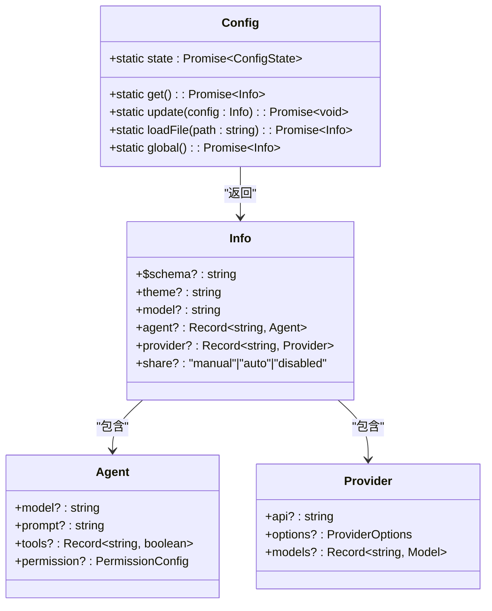

# 项目配置

<cite>
**本文档中引用的文件**  
- [opencode.json](file://opencode.json)
- [config.ts](file://packages/opencode/src/config/config.ts)
- [types.gen.ts](file://packages/sdk/js/src/gen/types.gen.ts)
</cite>

## 目录
1. [简介](#简介)
2. [主配置文件结构](#主配置文件结构)
3. [核心字段详解](#核心字段详解)
4. [配置加载机制](#配置加载机制)
5. [运行时优先级与覆盖规则](#运行时优先级与覆盖规则)
6. [配置解析逻辑](#配置解析逻辑)
7. [完整配置示例](#完整配置示例)
8. [常见配置错误排查](#常见配置错误排查)

## 简介
`opencode.json` 是 OpenCode 项目的核心配置文件，定义了项目的全局行为、模型选择、权限控制、插件系统等关键设置。该文件采用 JSON Schema 进行结构验证，并支持多种格式（JSON、JSONC、TOML）和多层级配置合并机制。本文档详细解析其结构、字段含义、加载流程及常见问题处理方法。

## 主配置文件结构
`opencode.json` 文件定义了 OpenCode 应用的全局配置，其结构基于 `Config.Info` 类型定义，通过 Zod 模式进行验证。该文件可存在于项目根目录或用户配置目录中，支持注释（使用 `.jsonc` 扩展名时）和环境变量注入。



**图示来源**
- [config.ts](file://packages/opencode/src/config/config.ts#L300-L500)

## 核心字段详解
以下为 `opencode.json` 中关键字段的详细说明：

### 基础配置
- **`$schema`**: 配置文件的 JSON Schema 地址，用于编辑器自动补全和验证。
- **`theme`**: 指定 UI 主题名称。
- **`username`**: 在对话中显示的自定义用户名，若未设置则使用系统用户名。
- **`autoupdate`**: 是否自动更新到最新版本。

### 模型与代理
- **`model`**: 默认使用的模型，格式为 `provider/model`，如 `anthropic/claude-3`。
- **`small_model`**: 用于轻量任务（如标题生成）的小模型。
- **`agent`**: 代理配置对象，定义不同代理的行为、提示词、工具权限等。
- **`mode`**: 已弃用，应使用 `agent` 字段替代。

### 权限与安全
- **`permission`**: 控制编辑、Bash 执行、网页抓取等操作的权限策略（ask/allow/deny）。
- **`disabled_providers`**: 禁用自动加载的提供者列表。
- **`tools`**: 启用或禁用特定工具。

### 扩展与集成
- **`plugin`**: 插件路径数组，支持本地文件或远程模块。
- **`provider`**: 自定义提供者配置，可覆盖模型参数、API 地址、超时等。
- **`mcp`**: 模型上下文协议（MCP）服务器配置，支持本地和远程连接。
- **`lsp`**: 语言服务器协议配置，用于代码补全和诊断。

### 用户界面与交互
- **`keybinds`**: 自定义快捷键映射。
- **`tui`**: 终端用户界面特定设置，如滚动速度。
- **`command`**: 自定义命令模板，支持变量替换。
- **`share`**: 会话分享策略（manual/auto/disabled）。

### 高级功能
- **`experimental`**: 实验性功能开关，如钩子系统（file_edited, session_completed）。
- **`watcher`**: 文件监听忽略规则。
- **`instructions`**: 额外指令文件或模式，用于增强上下文。

**本节来源**
- [config.ts](file://packages/opencode/src/config/config.ts#L300-L500)
- [types.gen.ts](file://packages/sdk/js/src/gen/types.gen.ts#L305-L504)

## 配置加载机制
OpenCode 的配置系统采用多层级合并策略，确保灵活性和可扩展性。配置加载顺序如下：

1. **全局配置**：从用户配置目录（如 `~/.config/opencode/`）加载 `config.json`、`opencode.json` 或 `opencode.jsonc`。
2. **项目配置**：从项目根目录向上查找 `.opencode` 目录中的配置文件。
3. **环境覆盖**：通过 `OPENCODE_CONFIG` 环境变量指定自定义配置文件路径。
4. **内容覆盖**：通过 `OPENCODE_CONFIG_CONTENT` 环境变量直接传入配置内容。

配置文件支持 `JSONC` 格式，允许注释和尾随逗号。此外，支持特殊语法 `{env:VAR_NAME}` 和 `{file:path/to/file}` 进行动态注入。



**图示来源**
- [config.ts](file://packages/opencode/src/config/config.ts#L50-L100)

## 运行时优先级与覆盖规则
配置项的优先级遵循“就近原则”，即更接近项目根目录的配置具有更高优先级。具体优先级顺序为：

1. `OPENCODE_CONFIG_CONTENT`（最高优先级）
2. `OPENCODE_CONFIG` 指定的文件
3. 当前工作目录下的 `opencode.json`
4. 向上查找的 `opencode.json` 或 `opencode.jsonc`
5. 全局配置目录中的配置文件（最低优先级）

此外，命令行标志（如 `--model`）可在运行时进一步覆盖配置文件中的值。

**本节来源**
- [config.ts](file://packages/opencode/src/config/config.ts#L60-L80)

## 配置解析逻辑
配置解析由 `Config` 模块实现，核心逻辑如下：

1. **初始化**：使用 `Instance.state()` 创建持久化状态。
2. **合并策略**：使用 `mergeDeep` 函数进行深度合并，确保嵌套对象正确合并。
3. **迁移处理**：自动处理弃用字段的迁移，如 `autoshare` → `share`，`mode` → `agent`。
4. **验证**：通过 Zod 模式对配置进行类型验证，确保结构正确。
5. **动态注入**：解析 `{env:...}` 和 `{file:...}` 表达式，支持环境变量和文件内容注入。

配置对象通过 `Config.get()` 异步获取，确保所有异步加载完成。



**图示来源**
- [config.ts](file://packages/opencode/src/config/config.ts#L50-L700)

## 完整配置示例
```json
{
  "$schema": "https://opencode.ai/config.json",
  "model": "anthropic/claude-3-opus-20240229",
  "small_model": "anthropic/claude-3-haiku-20240307",
  "theme": "dark",
  "username": "developer",
  "autoupdate": true,
  "share": "manual",
  "agent": {
    "general": {
      "model": "anthropic/claude-3-sonnet-20240229",
      "temperature": 0.7,
      "prompt": "You are a helpful assistant.",
      "tools": {
        "read": true,
        "write": true
      }
    }
  },
  "provider": {
    "anthropic": {
      "options": {
        "baseURL": "https://api.anthropic.com",
        "timeout": 300000
      }
    }
  },
  "mcp": {
    "local-server": {
      "type": "local",
      "command": ["npm", "run", "mcp-server"],
      "enabled": true
    }
  },
  "plugin": [
    "file://./plugins/custom-tool.ts"
  ],
  "experimental": {
    "hook": {
      "session_completed": [
        {
          "command": ["echo", "Session completed!"]
        }
      ]
    }
  }
}
```

**本节来源**
- [config.ts](file://packages/opencode/src/config/config.ts#L300-L500)

## 常见配置错误排查
### 1. 配置未生效
- **检查加载顺序**：确认配置文件位于正确的目录层级。
- **验证合并结果**：使用 `opencode config get` 查看最终生效的配置。
- **检查环境变量**：确认 `OPENCODE_CONFIG` 是否覆盖了预期配置。

### 2. JSON 解析错误
- **检查语法**：确保 JSON 格式正确，无尾随逗号（除非使用 JSONC）。
- **查看错误信息**：系统会输出具体错误位置和类型。
- **避免非法字符**：不要在字符串中使用未转义的控制字符。

### 3. 动态引用失败
- **`{file:...}` 路径不存在**：确认文件路径正确且可读。
- **`{env:...}` 变量未设置**：检查环境变量是否已导出。
- **循环引用**：避免配置文件之间相互引用导致无限循环。

### 4. 模型或提供者无法识别
- **检查拼写**：确认 `provider/model` 格式正确。
- **验证提供者启用**：确保未在 `disabled_providers` 中禁用。
- **网络连接**：确认 API 地址可达，密钥有效。

### 5. 插件加载失败
- **路径格式**：本地插件需以 `file://` 开头。
- **模块解析**：确保插件文件存在且可导入。
- **权限问题**：检查文件读取权限。

**本节来源**
- [config.ts](file://packages/opencode/src/config/config.ts#L600-L700)
- [config.test.ts](file://packages/opencode/test/config/config.test.ts#L41-L93)