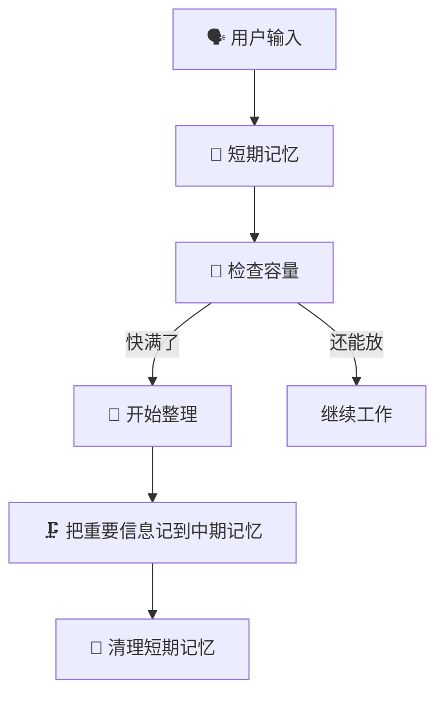
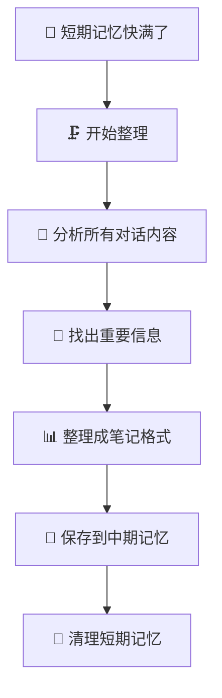
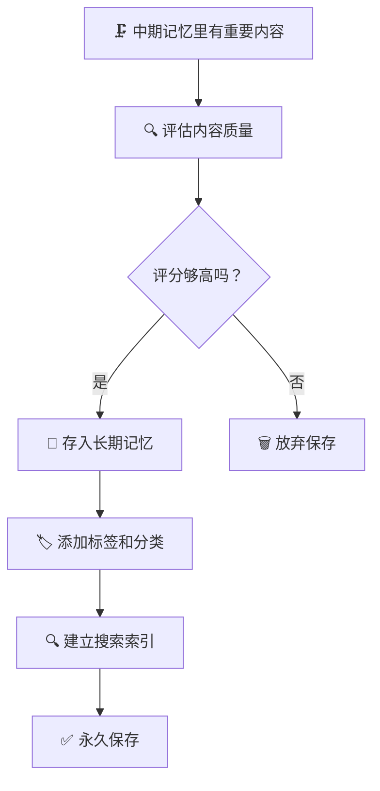
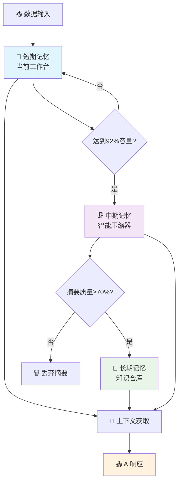
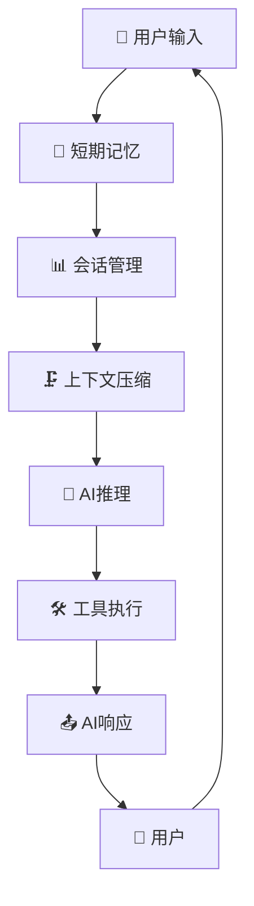
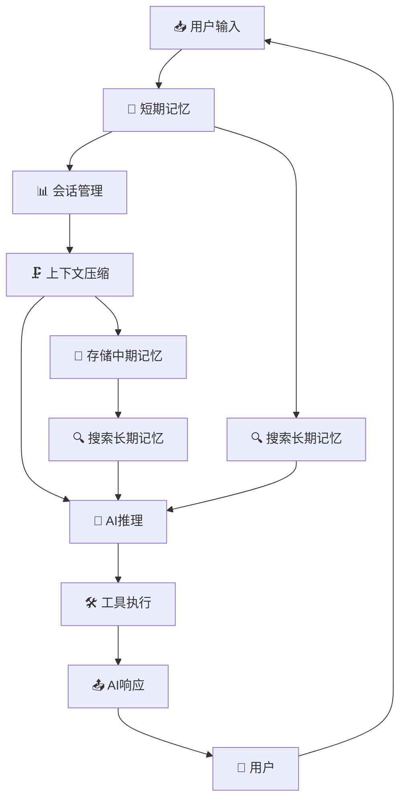

# 项目概述

<cite>
**本文档引用的文件**  
- [README.md](file://README.md)
- [context-claude-code/README.md](file://context-claude-code/README.md)
- [context-claude-code/小白专用-三层记忆架构完全指南.md](file://context-claude-code/小白专用-三层记忆架构完全指南.md)
- [context-claude-code/三层记忆架构详解.md](file://context-claude-code/三层记忆架构详解.md)
- [doc-agent-context/01-architecture-overview.md](file://doc-agent-context/01-architecture-overview.md)
- [doc-agent-context/04-tool-integration.md](file://doc-agent-context/04-tool-integration.md)
- [packages/opencode/src/mcp/index.ts](file://packages/opencode/src/mcp/index.ts)
- [packages/opencode/src/config/config.ts](file://packages/opencode/src/config/config.ts)
- [packages/opencode/README.md](file://packages/opencode/README.md)
- [packages/console/core/src/drizzle/index.ts](file://packages/console/core/src/drizzle/index.ts)
</cite>

## 目录
1. [引言](#引言)
2. [设计哲学与核心目标](#设计哲学与核心目标)
3. [单体仓库架构](#单体仓库架构)
4. [三层记忆架构](#三层记忆架构)
5. [MCP协议集成](#mcp协议集成)
6. [系统流程图](#系统流程图)
7. [技术决策分析](#技术决策分析)
8. [项目优势与适用场景](#项目优势与适用场景)
9. [未来发展方向](#未来发展方向)

## 引言

opencode项目是一个AI驱动的终端编码代理，旨在通过智能上下文管理和大规模代码理解能力，为开发者提供高效、智能的编程辅助。该项目采用先进的架构设计和技术选型，支持多平台界面，包括CLI、桌面、Web和VSCode等。通过三层记忆架构和MCP协议集成，opencode能够实现高效的上下文管理、工具扩展性和跨会话记忆，从而提升开发效率和用户体验。

## 设计哲学与核心目标

### 设计哲学

opencode项目的设计哲学围绕以下几个核心原则展开：

1. **用户中心**：始终以用户需求为核心，提供直观、易用的界面和功能。
2. **智能上下文管理**：通过三层记忆架构，实现高效的上下文管理和知识积累。
3. **模块化设计**：采用单体仓库架构，支持多平台界面的灵活扩展和维护。
4. **开放性**：支持多种AI模型和工具集成，确保系统的灵活性和可扩展性。

### 核心目标

1. **智能上下文管理**：解决AI模型在处理长期对话时的上下文窗口限制问题，通过智能压缩和摘要机制，实现长期对话的连续性。
2. **大规模代码理解**：利用AI模型的强大能力，理解和处理大规模代码库，提供精准的代码建议和错误修复。
3. **多平台支持**：支持CLI、桌面、Web和VSCode等多种界面，满足不同用户的使用习惯。
4. **工具扩展性**：通过MCP协议集成，支持丰富的工具和服务，提升开发效率。

**Section sources**
- [README.md](file://README.md)
- [context-claude-code/README.md](file://context-claude-code/README.md)

## 单体仓库架构

### 架构概述

opencode项目采用单体仓库（monorepo）架构，将所有相关组件和工具集中在一个仓库中进行管理。这种架构设计有助于统一版本控制、简化依赖管理和促进团队协作。

### 组件结构

- **context-claude-code**：核心上下文管理模块，包含三层记忆架构的实现。
- **doc-agent-context**：文档和上下文工程管理模块，提供详细的架构和设计文档。
- **github**：GitHub集成模块，支持与GitHub仓库的交互。
- **infra**：基础设施模块，包含应用、控制台、桌面和阶段配置。
- **packages**：多平台界面模块，包括控制台、桌面、函数、邮件、资源和脚本。
- **patches**：补丁管理模块，用于管理第三方依赖的补丁。
- **script**：脚本模块，包含格式化、发布和统计脚本。
- **sdks/vscode**：VSCode插件模块，提供VSCode集成。
- **specs**：规范模块，包含项目规范和设计文档。
- **AGENTS.md**：代理配置文件，定义不同代理的行为和权限。
- **CLAUDE.md**：Claude模型配置文件，定义与Claude模型的交互方式。
- **README.md**：项目主文档，提供安装、使用和贡献指南。
- **STATS.md**：统计文档，记录项目的关键指标和性能数据。
- **bunfig.toml**：Bun运行时配置文件，定义Bun的配置。
- **claude-code-large-project-search-guide.md**：大型项目搜索指南，提供搜索和导航大型项目的最佳实践。
- **opencode.json**：项目配置文件，定义项目的基本信息和依赖。
- **package.json**：Node.js包配置文件，定义项目的依赖和脚本。
- **sst-env.d.ts**：SST环境类型定义文件，提供类型安全的环境变量。
- **sst.config.ts**：SST配置文件，定义SST的配置。
- **tsconfig.json**：TypeScript配置文件，定义TypeScript的编译选项。
- **turbo.json**：Turbo配置文件，定义Turbo的构建和缓存策略。

### 优势

1. **统一管理**：所有组件和工具集中管理，简化版本控制和依赖管理。
2. **协同开发**：团队成员可以轻松访问和修改所有组件，促进协同开发。
3. **一致性**：确保所有组件和工具的一致性和兼容性。
4. **灵活性**：支持多平台界面的灵活扩展和维护。

**Section sources**
- [README.md](file://README.md)
- [context-claude-code/README.md](file://context-claude-code/README.md)

## 三层记忆架构

### 概述

三层记忆架构是opencode项目的核心技术之一，模仿人类大脑的记忆系统，从短期工作记忆到长期知识存储，每一层都有不同的职责和特点。该架构通过短期、中期和长期记忆的协同工作，实现了高效的上下文管理和知识积累。

### 短期记忆

#### 基本概念

短期记忆类似于办公桌，用于存储当前正在进行的任务和相关信息。其特点是：

- **速度超快**：毫秒级访问，确保实时响应。
- **地方有限**：容量有限，通常为200K tokens。
- **实时更新**：每次用户输入或AI响应都会实时更新。
- **自动清理**：当容量接近上限时，自动触发清理机制。

#### 工作原理



### 中期记忆

#### 基本概念

中期记忆类似于笔记本，用于存储重要的对话摘要和关键信息。其特点是：

- **整理归纳**：将长对话总结成要点，突出重点。
- **结构清晰**：分门别类整理好，便于查找。
- **定期更新**：有新的重要内容就补充进去。
- **容量适中**：通常为50K tokens。

#### 工作原理



### 长期记忆

#### 基本概念

长期记忆类似于图书馆，用于永久保存所有有价值的知识和经验。其特点是：

- **永久保存**：除非用户删除，否则永远不会丢失。
- **智能搜索**：支持向量化搜索和关键词搜索，快速找到相关内容。
- **标签分类**：每个知识点都有标签，方便归类。
- **质量评分**：重要的知识评分更高，更容易找到。

#### 工作原理



### 数据流转



**Diagram sources**
- [context-claude-code/小白专用-三层记忆架构完全指南.md](file://context-claude-code/小白专用-三层记忆架构完全指南.md)
- [context-claude-code/三层记忆架构详解.md](file://context-claude-code/三层记忆架构详解.md)

## MCP协议集成

### 概述

MCP（Model Context Protocol）协议是opencode项目实现工具扩展性的关键技术。通过MCP协议，opencode能够集成各种外部工具和服务，提供丰富的功能和更高的灵活性。

### MCP客户端管理

系统集成了MCP协议，支持本地和远程MCP服务器：

```typescript
// packages/opencode/src/mcp/index.ts
const state = Instance.state(
  async () => {
    const cfg = await Config.get()
    const clients: { [name: string]: Awaited<ReturnType<typeof experimental_createMCPClient>> } = {}
    
    for (const [key, mcp] of Object.entries(cfg.mcp ?? {})) {
      if (mcp.enabled === false) continue
      
      if (mcp.type === "remote") {
        // 远程MCP服务器连接
        const transports = [
          { name: "StreamableHTTP", transport: new StreamableHTTPClientTransport(new URL(mcp.url)) },
          { name: "SSE", transport: new SSEClientTransport(new URL(mcp.url)) },
        ]
        
        for (const { name, transport } of transports) {
          const client = await experimental_createMCPClient({
            name: "opencode",
            transport,
          }).catch(() => null)
          if (client) {
            clients[key] = client
            break
          }
        }
      }
      
      if (mcp.type === "local") {
        // 本地MCP服务器启动
        const [cmd, ...args] = mcp.command
        const client = await experimental_createMCPClient({
          name: "opencode",
          transport: new StdioClientTransport({
            stderr: "ignore",
            command: cmd,
            args,
            env: { ...process.env, ...mcp.environment },
          }),
        }).catch(() => null)
        if (client) {
          clients[key] = client
        }
      }
    }
    
    return { clients }
  },
  async (state) => {
    for (const client of Object.values(state.clients)) {
      client.close()
    }
  }
)
```

### MCP工具集成

```typescript
export async function tools() {
  const result: Record<string, Tool> = {}
  for (const [clientName, client] of Object.entries(await clients())) {
    for (const [toolName, tool] of Object.entries(await client.tools())) {
      const sanitizedClientName = clientName.replace(/\s+/g, "_")
      const sanitizedToolName = toolName.replace(/[-\s]+/g, "_")
      result[sanitizedClientName + "_" + sanitizedToolName] = tool
    }
  }
  return result
}
```

**Section sources**
- [doc-agent-context/04-tool-integration.md](file://doc-agent-context/04-tool-integration.md)
- [packages/opencode/src/mcp/index.ts](file://packages/opencode/src/mcp/index.ts)

## 系统流程图

### 高层次系统流程图



### 详细数据流



**Diagram sources**
- [doc-agent-context/01-architecture-overview.md](file://doc-agent-context/01-architecture-overview.md)

## 技术决策分析

### 选择Bun运行时

#### 原因

1. **高性能**：Bun是基于JavaScriptCore的高性能运行时，提供更快的启动速度和执行性能。
2. **内置包管理器**：Bun内置的包管理器简化了依赖管理，减少了外部依赖。
3. **原生支持TypeScript和JSX**：Bun原生支持TypeScript和JSX，无需额外配置。
4. **更好的内存管理和垃圾回收**：Bun在内存管理和垃圾回收方面表现优秀，适合CLI工具。

#### 代码示例

```typescript
// 使用Bun的API进行文件操作
import { Bun } from 'bun'

// 高性能文件读取
async function readConfigFile(path: string): Promise<Config> {
  const file = Bun.file(path)
  const content = await file.text()
  return JSON.parse(content)
}

// 使用Bun的Glob进行文件匹配
const configFiles = new Bun.Glob("**/*.config.{js,ts,json}")
for await (const file of configFiles.scan({ cwd: projectRoot })) {
  await processConfigFile(file)
}
```

### 选择Drizzle ORM

#### 原因

1. **类型安全**：Drizzle ORM提供类型安全的数据库操作，减少运行时错误。
2. **简洁的API**：Drizzle ORM的API简洁明了，易于学习和使用。
3. **支持多种数据库**：Drizzle ORM支持多种数据库，包括MySQL、PostgreSQL和SQLite。
4. **事务支持**：Drizzle ORM提供强大的事务支持，确保数据一致性。

#### 代码示例

```typescript
import { drizzle } from "drizzle-orm/planetscale-serverless"
import { Resource } from "@opencode-ai/console-resource"
import { Client } from "@planetscale/database"

export namespace Database {
  const client = memo(() => {
    const result = new Client({
      host: Resource.Database.host,
      username: Resource.Database.username,
      password: Resource.Database.password,
    })
    const db = drizzle(result, {})
    return db
  })

  export async function use<T>(callback: (trx: TxOrDb) => Promise<T>) {
    try {
      const { tx } = TransactionContext.use()
      return tx.transaction(callback)
    } catch (err) {
      if (err instanceof Context.NotFound) {
        const effects: (() => void | Promise<void>)[] = []
        const result = await TransactionContext.provide(
          {
            effects,
            tx: client(),
          },
          () => callback(client()),
        )
        await Promise.all(effects.map((x) => x()))
        return result
      }
      throw err
    }
  }
}
```

**Section sources**
- [packages/opencode/README.md](file://packages/opencode/README.md)
- [packages/console/core/src/drizzle/index.ts](file://packages/console/core/src/drizzle/index.ts)

## 项目优势与适用场景

### 项目优势

1. **智能上下文管理**：通过三层记忆架构，实现高效的上下文管理和知识积累。
2. **多平台支持**：支持CLI、桌面、Web和VSCode等多种界面，满足不同用户的使用习惯。
3. **工具扩展性**：通过MCP协议集成，支持丰富的工具和服务，提升开发效率。
4. **高性能**：选择Bun运行时和Drizzle ORM，确保系统的高性能和稳定性。
5. **开放性**：支持多种AI模型和工具集成，确保系统的灵活性和可扩展性。

### 适用场景

1. **个人开发者**：帮助个人开发者快速生成代码、修复错误和优化性能。
2. **团队协作**：支持团队成员共享上下文和知识，提高团队协作效率。
3. **教育和培训**：用于编程教学和培训，帮助学生快速掌握编程技能。
4. **企业开发**：帮助企业开发团队提高开发效率，缩短开发周期。

**Section sources**
- [README.md](file://README.md)
- [context-claude-code/README.md](file://context-claude-code/README.md)

## 未来发展方向

### 功能扩展

1. **更多AI模型支持**：增加对更多AI模型的支持，如Google、Meta等。
2. **更丰富的工具集成**：集成更多的开发工具和服务，如CI/CD、代码审查等。
3. **多语言支持**：支持更多编程语言，满足不同开发者的需要。

### 性能优化

1. **上下文压缩算法优化**：进一步优化上下文压缩算法，提高压缩效率和质量。
2. **内存管理优化**：优化内存管理，减少内存占用，提高系统性能。
3. **响应速度优化**：优化AI推理和工具执行的响应速度，提供更流畅的用户体验。

### 社区建设

1. **开源社区**：建立活跃的开源社区，吸引更多开发者参与项目开发和维护。
2. **文档完善**：不断完善项目文档，提供详细的使用指南和最佳实践。
3. **用户反馈**：积极收集用户反馈，不断改进产品功能和用户体验。

**Section sources**
- [README.md](file://README.md)
- [context-claude-code/README.md](file://context-claude-code/README.md)