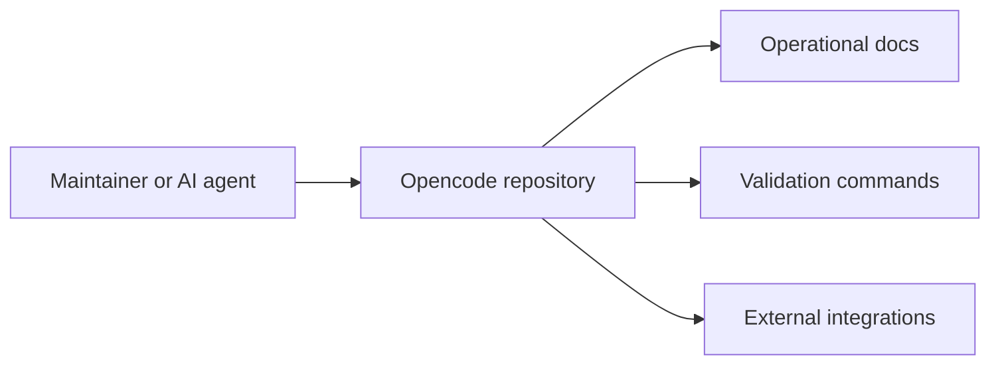

# Design — Opencode

Visão arquitetural inicial criada automaticamente a partir do manifesto, da árvore de arquivos e dos comandos detectados.

## 1. Contexto do sistema

## 2. Componentes observados

- **Tipo do sistema:** FULLSTACK
- **Stack detectada:** undefined
- **Pastas principais:** github, infra, nix, packages, patches, perf, script, sdks, specs
- **Integrações observadas:** GitHub, Stripe, OpenAI, Playwright, Sentry, PostgreSQL

## 3. Fluxo principal de manutenção

1. Ler manifesto e documentação operacional.
2. Executar comandos reais de desenvolvimento e validação.
3. Alterar arquivos dentro do escopo.
4. Validar com lint, testes e evidências disponíveis.
5. Atualizar docs quando a mudança alterar entendimento do projeto.

## 4. Boundaries

| Boundary | Responsabilidade |
|---|---|
| Product docs | explicar propósito, domínio e decisões |
| Runtime / source | implementar o comportamento real |
| Validation | comprovar que a mudança funciona |
| Delivery | versionar, publicar e documentar release |

## 5. Stack resumida

| Camada | Tecnologia |
|---|---|
| Linguagem / runtime | undefined |
| Package manager | bun |
| Testes | bun test |
| E2E / evidence | npx playwright test |
| Build | not detected |

## 6. Notas de evolução

- O mapeamento automático é um ponto de partida, não um substituto para ADR quando a arquitetura muda.
- Se novas integrações, serviços ou boundaries surgirem, atualize este arquivo no mesmo PR.
