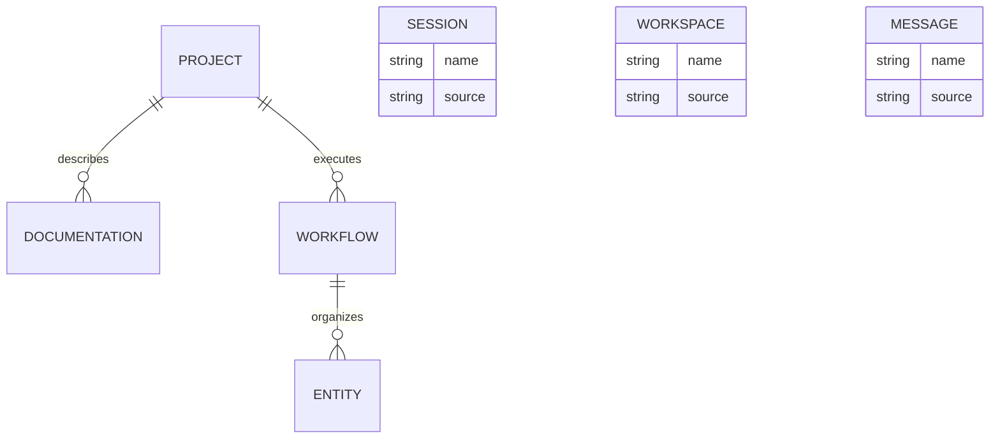

# DOMAIN — Opencode

Mapa inicial do domínio inferido durante o bootstrap. Use este arquivo como glossário curto para alinhar nomes de entidades, fluxos e regras observadas no repositório.

## Contexto

- **Domínio inferido:** Developer Tools
- **Objetivo operacional principal:** AI-powered development tool
- **Entidades mais frequentes:** Session, Workspace, Message, Agent, Project, Skill

## Glossário

| Termo | Definição | Onde aparece |
|---|---|---|
| Session | Entidade recorrente usada para organizar parte importante do projeto. | estrutura de arquivos e documentação |
| Workspace | Conceito operacional que aparece no fluxo principal do repositório. | docs e convenções do projeto |
| Message | Área usada para validar ou governar mudanças. | scripts, testes ou docs |

## Entidades principais

### Session

- O que é: artefato ou conceito central detectado durante a inspeção automática.
- Onde aparece: arquivos com nomes relacionados a session.
- Papel no projeto: ajuda a estruturar o fluxo de Developer Tools.

### Workspace

- O que é: artefato ou conceito central detectado durante a inspeção automática.
- Onde aparece: arquivos com nomes relacionados a workspace.
- Papel no projeto: ajuda a estruturar o fluxo de Developer Tools.

### Message

- O que é: artefato ou conceito central detectado durante a inspeção automática.
- Onde aparece: arquivos com nomes relacionados a message.
- Papel no projeto: ajuda a estruturar o fluxo de Developer Tools.

### Agent

- O que é: artefato ou conceito central detectado durante a inspeção automática.
- Onde aparece: arquivos com nomes relacionados a agent.
- Papel no projeto: ajuda a estruturar o fluxo de Developer Tools.

### Project

- O que é: artefato ou conceito central detectado durante a inspeção automática.
- Onde aparece: arquivos com nomes relacionados a project.
- Papel no projeto: ajuda a estruturar o fluxo de Developer Tools.

### Skill

- O que é: artefato ou conceito central detectado durante a inspeção automática.
- Onde aparece: arquivos com nomes relacionados a skill.
- Papel no projeto: ajuda a estruturar o fluxo de Developer Tools.

## Diagrama de entidades

## Regras de negócio observadas

- O código deve ser entendido por meio dos manifests, docs e testes antes de qualquer edição ampla.
- Comandos de desenvolvimento e validação precisam existir em documentação operacional.
- Novas mudanças devem preservar o contexto compartilhado do repositório.

## Termos que devem ficar consistentes

| Termo | Uso recomendado |
|---|---|
| product | o repositório ou aplicação principal |
| workflow | sequência operacional para entregar mudança |
| evidence | artefato de validação, como report, trace ou log |

## Fontes consultadas

| Session | Elemento recorrente detectado no código ou na estrutura do projeto. | source tree / docs |
| Workspace | Elemento recorrente detectado no código ou na estrutura do projeto. | source tree / docs |
| Message | Elemento recorrente detectado no código ou na estrutura do projeto. | source tree / docs |
| Agent | Elemento recorrente detectado no código ou na estrutura do projeto. | source tree / docs |
| Project | Elemento recorrente detectado no código ou na estrutura do projeto. | source tree / docs |
| Skill | Elemento recorrente detectado no código ou na estrutura do projeto. | source tree / docs |

## Histórico

| Data | Mudança | Quem |
|---|---|---|
| 2026-05-28 | Mapa inicial gerado automaticamente | wesleysimplicio-team |
