# OpenCode 上下文压缩机制 - 完整解析

> 版本：v1.0
> 作者：Claude
> 日期：2026-01-14

---

## 目录

1. [架构概览](#架构概览)
2. [Token 估算](#token-估算)
3. [溢出检测](#溢出检测)
4. [截断机制](#截断机制)
5. [剪枝策略](#剪枝策略)
6. [摘要压缩](#摘要压缩)
7. [完整流程](#完整流程)
8. [配置选项](#配置选项)
9. [数据结构](#数据结构)

---

## 架构概览

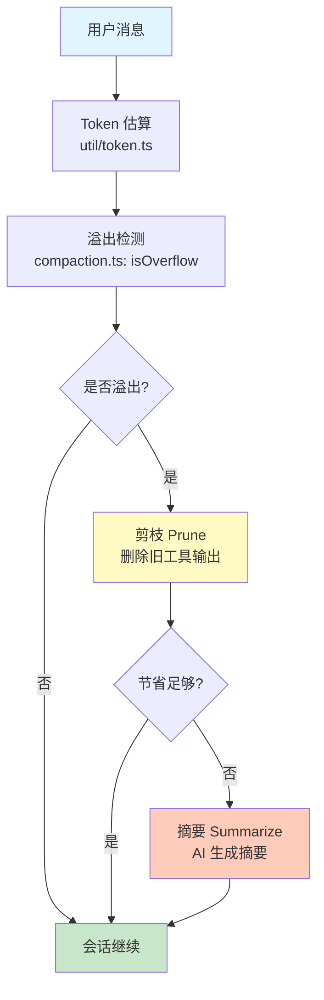
```mermaid
flowchart TD
    A[用户消息] --> B[Token 估算<br/>util/token.ts]
    B --> C[溢出检测<br/>compaction.ts: isOverflow]

    C --> D{是否溢出?}
    D -->|否| E[会话继续]
    D -->|是| F[剪枝 Prune<br/>删除旧工具输出]

    F --> G{节省足够?}
    G -->|是| E
    G -->|否| H[摘要 Summarize<br/>AI 生成摘要]
    H --> E

    style A fill:#e1f5fe
    style E fill:#c8e6c9
    style F fill:#fff9c4
    style H fill:#ffccbc
```

---

## Token 估算

### 文件位置
`packages/opencode/src/util/token.ts`

### 核心算法

```typescript
// 每个 token 的平均字符数
const CHARS_PER_TOKEN = 4

// 估算函数
export function estimate(input: string): number {
  const text = input || ""
  return Math.max(0, Math.round(text.length / CHARS_PER_TOKEN))
}
```

---

### 📌 这一部分干了什么？

**作用**：快速计算任意文本的 token 数量，无需调用实际模型的 tokenizer。

**具体操作**：
1. 接收一个字符串输入
2. 计算字符串的字符长度
3. 将字符数除以 4，得到估算的 token 数
4. 返回四舍五入后的整数值

**使用场景**：
- 计算工具输出的 token 数
- 计算用户消息的 token 数
- 判断是否需要触发压缩
- 评估剪枝能节省多少 token

---

### ⚙️ 工作原理

#### 估算逻辑

```
Token 数 = 字符数 / 4
```

这个公式的假设是：平均每个 token 包含 4 个字符。

#### 示例对比

| 文本类型 | 字符数 | 估算 Token | 实际 Token (参考) | 误差 |
|---------|-------|-----------|------------------|------|
| "Hi" | 2 | 1 | ~1 | 0% |
| "Hello" | 5 | 2 | ~2 | 0% |
| "Hello world" | 11 | 3 | ~3 | 0% |
| 1000字符英文 | 1000 | 250 | ~250 | ±5% |
| 1000字符中文 | 1000 | 250 | ~400 | +37% |
| 代码片段 | 1000 | 250 | ~200 | -20% |

#### 特殊处理

```typescript
// 空字符串处理
const text = input || ""  // 避免 null/undefined 错误

// 负数保护
Math.max(0, ...)  // 确保结果不为负
```

---

### 🤔 为什么这么做？

#### 1. 为什么不使用精确的 tokenizer？

| 方案 | 优点 | 缺点 |
|------|------|------|
| **精确 tokenizer** | 精确 | • 需要加载模型文件（几MB）<br/>• 计算耗时（每次几十ms）<br/>• 不同模型需要不同 tokenizer |
| **字符估算（当前）** | • 极快（微秒级）<br/>• 无需额外依赖<br/>• 适用于所有模型 | • 有误差（±20-30%） |

**结论**：对于压缩触发这种场景，**速度比精度更重要**。我们只需要知道"大概用了多少 token"，而非精确值。

#### 2. 为什么选择 4 作为除数？

这是基于对主流 LLM 的统计：

| 模型 | 字符/token | 说明 |
|------|-----------|------|
| GPT-3/GPT-4 | ~4.0 | 英文文本 |
| Claude | ~3.8-4.2 | 混合文本 |
| LLaMA | ~4.0 | 通用 |
| 中文文本 | ~2.5 | 中文字符密度更高 |
| 代码 | ~5.0 | 代码更稀疏 |

**为什么用 4 是合理的**：
- 英文：4 是比较准确的平均值
- 中文：会高估（更安全，提前压缩）
- 代码：会低估（但有截断机制兜底）

#### 3. 为什么允许误差存在？

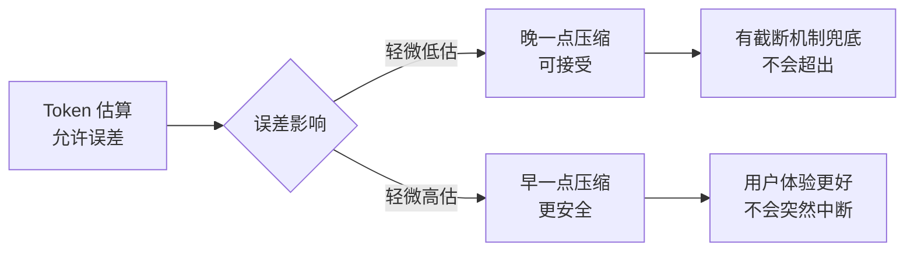
```mermaid
flowchart LR
    A[Token 估算<br/>允许误差] --> B{误差影响}
    B -->|轻微低估| C[晚一点压缩<br/>可接受]
    B -->|轻微高估| D[早一点压缩<br/>更安全]
    C --> E[有截断机制兜底<br/>不会超出]
    D --> F[用户体验更好<br/>不会突然中断]
```

**设计哲学**：
- **保守策略**：宁可多压缩，也不要让会话超出限制
- **多层保护**：估算 → 截断 → 剪枝 → 摘要，层层保障
- **性能优先**：快速估算比慢速精确更重要

---

## 溢出检测

### 文件位置
`packages/opencode/src/session/compaction.ts` (148-172行)

### 检测逻辑

```typescript
export async function isOverflow(input: {
  tokens: MessageV2.Assistant["tokens"]
  model: Provider.Model
}): Promise<boolean>
```

### 计算公式

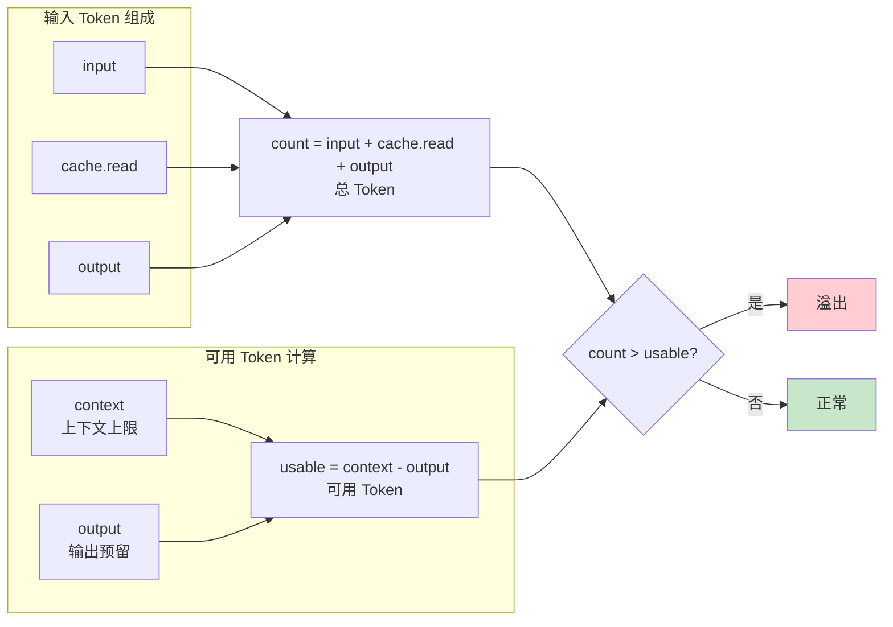
```mermaid
flowchart LR
    subgraph Input_Token["输入 Token 组成"]
        I1[input]
        I2[cache.read]
        I3[output]
    end

    subgraph Available_Token["可用 Token 计算"]
        A1[context<br/>上下文上限]
        A2[output<br/>输出预留]
        A3[usable = context - output<br/>可用 Token]
    end

    I1 & I2 & I3 --> T[count = input + cache.read + output<br/>总 Token]
    A1 --> A3
    A2 --> A3

    T --> C{count > usable?}
    A3 --> C

    C -->|是| Overflow[溢出]
    C -->|否| Normal[正常]

    style Overflow fill:#ffcdd2
    style Normal fill:#c8e6c9
```

**核心公式**：
- **总 Token** = `input` + `cache.read` + `output`
- **可用 Token** = `context` - `output`
- **溢出判定** = 总 Token > 可用 Token

### 详细计算

```typescript
// 1. 获取配置
const config = await Config.get()

// 2. 如果禁用自动压缩，返回 false
if (config.compaction?.auto === false) return false

// 3. 获取模型上下文限制
const context = input.model.limit.context

// 4. 如果没有上下文限制（如流式模型），返回 false
if (context === 0) return false

// 5. 计算总 token 使用量
const count = input.tokens.input + input.tokens.cache.read + input.tokens.output

// 6. 计算输出预留 token 数
const output = Math.min(
  input.model.limit.output,
  SessionPrompt.OUTPUT_TOKEN_MAX
) || SessionPrompt.OUTPUT_TOKEN_MAX

// 7. 计算可用 token 数
const usable = context - output

// 8. 判断是否溢出
return count > usable
```

### Token 统计结构

```typescript
tokens: {
  input: number        // 输入 token 数
  output: number       // 输出 token 数
  reasoning: number    // 推理 token 数（扩展模型）
  cache: {
    read: number       // 缓存读取 token 数
    write: number      // 缓存写入 token 数
  }
}
```

---

### 📌 这一部分干了什么？

**作用**：判断当前会话的 token 使用量是否接近或超过了模型的上下文限制。

**具体操作**：
1. 收集本次请求的实际 token 使用量（从模型返回）
2. 获取模型的上下文窗口大小限制
3. 预留一定的输出空间
4. 比较：已使用 + 缓存读取 > 可用空间？

**触发时机**：每次 AI 响应完成时（finish-step 事件）

**返回结果**：
- `true` → 需要压缩
- `false` → 继续正常会话

---

### ⚙️ 工作原理

#### 为什么输出要预留空间？

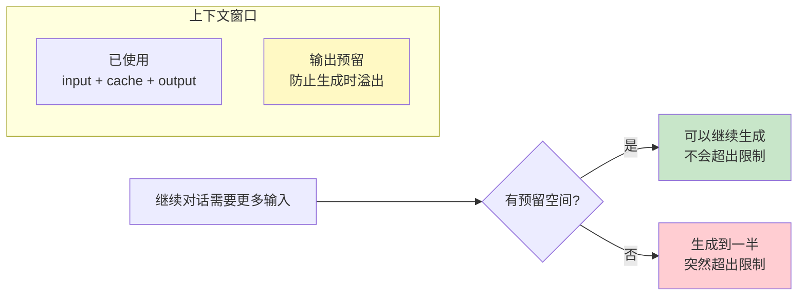
```mermaid
flowchart LR
    subgraph Context["上下文窗口"]
        A[已使用<br/>input + cache + output]
        B[输出预留<br/>防止生成时溢出]
    end

    C[继续对话需要更多输入] --> D{有预留空间?}
    D -->|是| E[可以继续生成<br/>不会超出限制]
    D -->|否| F[生成到一半<br/>突然超出限制]

    style B fill:#fff9c4
    style E fill:#c8e6c9
    style F fill:#ffcdd2
```

**问题**：如果不预留输出空间，AI 在生成回复时可能会超出上下文限制，导致：
- 回复被截断
- API 返回错误
- 会话中断

**解决方案**：提前预留输出空间，确保下一轮对话有足够的"生成缓冲区"。

#### Token 类型的含义

| Token 类型 | 说明 | 是否计入溢出检测 |
|-----------|------|----------------|
| `input` | 本次请求输入的 token | ✅ 计入 |
| `cache.read` | 从提示缓存读取的 token | ✅ 计入 |
| `output` | 本次请求输出的 token | ✅ 计入 |
| `cache.write` | 写入缓存的 token | ❌ 不计入（一次性成本） |
| `reasoning` | 推理 token（扩展模型） | ⚠️ 特殊处理 |

**为什么 cache.read 要计入？**
- 提示缓存虽然减少了重复输入，但这些 token 仍然占用上下文空间
- 模型处理时需要"读取"这些缓存的 token

---

### 🤔 为什么这么做？

#### 1. 为什么不直接用 `count > context` 判断？

| 判断方式 | 问题 | 后果 |
|---------|------|------|
| `count > context` | 没有预留输出空间 | AI 生成回复时可能超出限制 |
| `count > context - output` | 提前预留输出空间 | 确保下一轮对话有足够空间 |

**实际场景示例**：
```
模型限制: 200K tokens
当前使用: 195K tokens
输出预留: 8K tokens
可用空间: 200K - 8K = 192K

判断: 195K > 192K → 溢出！触发压缩
```

如果不预留输出空间，195K < 200K 不会触发压缩，但下一轮对话可能只有 5K 空间可用，不够生成完整回复。

#### 2. 为什么输出预留要取 `min(limit.output, OUTPUT_TOKEN_MAX)`？

```typescript
const output = Math.min(
  input.model.limit.output,      // 模型本身的输出限制
  SessionPrompt.OUTPUT_TOKEN_MAX  // 系统配置的最大输出
) || SessionPrompt.OUTPUT_TOKEN_MAX
```

**原因**：
- **模型限制**：有些模型本身输出上限较小（如 4K）
- **系统配置**：OpenCode 默认配置的输出上限
- **取较小值**：更保守，确保不会超出任一限制

#### 3. 为什么 `context === 0` 时不检测？

```typescript
if (context === 0) return false
```

**原因**：
- `context === 0` 表示该模型没有明确的上下文限制
- 可能是流式模型或特殊模型
- 这类模型通常会自动处理超长输入

#### 4. 检测时机为什么是 "finish-step"？

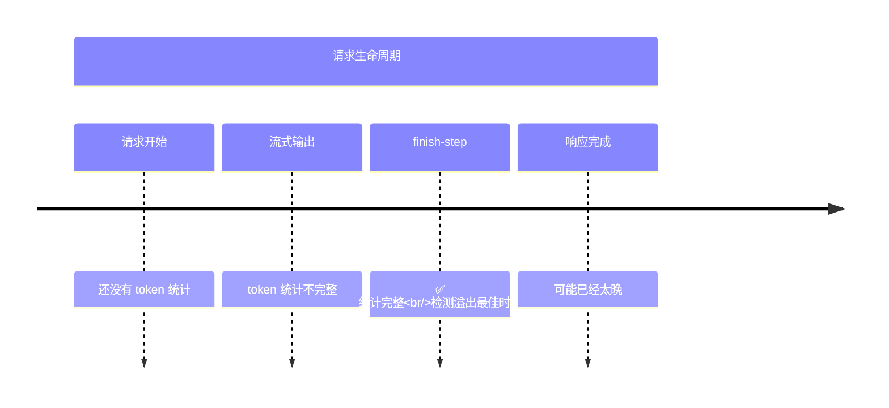
```mermaid
timeline
    section 请求生命周期
        请求开始 : 还没有 token 统计
        流式输出 : token 统计不完整
        finish-step : ✅ 统计完整<br/>检测溢出最佳时机
        响应完成 : 可能已经太晚
```

**选择 finish-step 的原因**：
- token 统计已完整（来自模型返回）
- 在用户看到结果前检测，体验更好
- 可以及时触发压缩，无缝衔接下一轮

---

## 截断机制

### 文件位置
`packages/opencode/src/tool/truncation.ts`

### 截断限制

```typescript
export const MAX_LINES = 2000        // 最大行数
export const MAX_BYTES = 50 * 1024   // 最大字节数（50KB）
```

### 截断流程

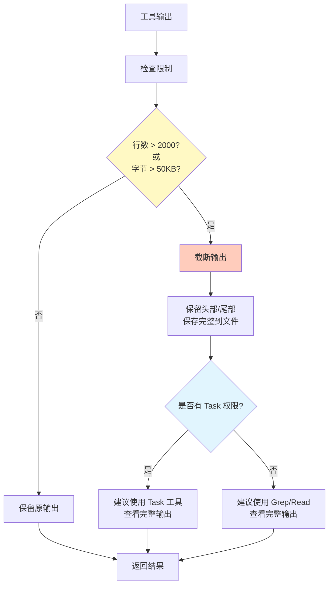
```mermaid
flowchart TD
    A[工具输出] --> B[检查限制]

    B --> C{行数 > 2000?<br/>或<br/>字节 > 50KB?}

    C -->|否| D[保留原输出]
    C -->|是| E[截断输出]

    E --> F["保留头部/尾部<br/>保存完整到文件"]

    F --> G{是否有 Task 权限?}

    G -->|是| H["建议使用 Task 工具<br/>查看完整输出"]
    G -->|否| I["建议使用 Grep/Read<br/>查看完整输出"]

    D --> J[返回结果]
    H --> J
    I --> J

    style C fill:#fff9c4
    style E fill:#ffccbc
    style G fill:#e1f5fe
```

### 截断选项

```typescript
interface Options {
  maxLines?: number      // 自定义最大行数
  maxBytes?: number      // 自定义最大字节数
  direction?: "head" | "tail"  // 截断方向
}
```

### 截断方向

| 方向 | 说明 | 输出示例 |
|------|------|---------|
| `head` | 保留头部 | `[前2000行]\n\n...[截断数量] bytes truncated...\n\n[提示]` |
| `tail` | 保留尾部 | `...[截断数量] bytes truncated...\n\n[提示]\n\n[后2000行]` |

### 文件存储

```typescript
// 存储位置
export const DIR = path.join(Global.Path.data, "tool-output")

// 文件命名
const id = Identifier.ascending("tool")
const filepath = path.join(DIR, id)  // 例如: tool_1234567890_abcd

// 保留期限
const RETENTION_MS = 7 * 24 * 60 * 60 * 1000  // 7天
```

---

### 📌 这一部分干了什么？

**作用**：限制单个工具输出的最大大小，防止超大输出占用过多上下文空间。

**具体操作**：
1. 检查工具输出是否超过限制（2000行 或 50KB）
2. 如果超过，截断输出内容
3. 将完整输出保存到本地文件
4. 在截断处添加提示信息，告知用户如何查看完整内容

**触发时机**：每个工具调用完成后立即处理

**保护范围**：所有工具输出（Read、Bash、Grep 等）

---

### ⚙️ 工作原理

#### 截断策略

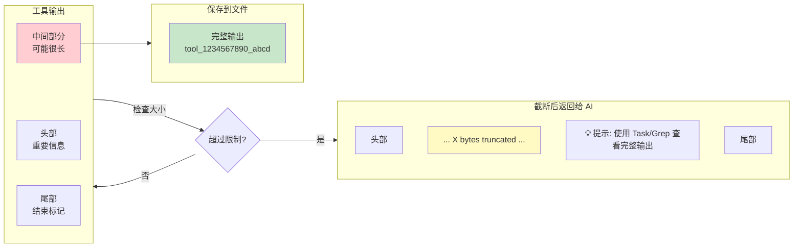
```mermaid
flowchart LR
    subgraph Output["工具输出"]
        direction TB
        H[头部<br/>重要信息]
        M[中间部分<br/>可能很长]
        T[尾部<br/>结束标记]
    end

    subgraph Truncated["截断后返回给 AI"]
        H2[头部]
        X[... X bytes truncated ...]
        P[💡 提示: 使用 Task/Grep 查看完整输出]
        T2[尾部]
    end

    subgraph File["保存到文件"]
        F[完整输出<br/>tool_1234567890_abcd]
    end

    Output -->|检查大小| Decision{超过限制?}
    Decision -->|是| Truncated
    Decision -->|否| Output

    M --> File

    style M fill:#ffcdd2
    style X fill:#fff9c4
    style F fill:#c8e6c9
```

#### 为什么同时限制行数和字节数？

```typescript
行数 > 2000  OR  字节 > 50KB → 触发截断
```

| 限制类型 | 作用 | 解决的问题 |
|---------|------|-----------|
| 行数 | 防止过多行占用 token | 如：`ls -R` 递归列出十万文件 |
| 字节数 | 防止单行过长占用 token | 如：`cat` 查看一个巨大的 JSON 文件 |

**两者配合**：无论哪种形式的"大"，都能被捕获。

#### 截断方向的选择

| 方向 | 适用场景 | 保留重点 |
|------|---------|---------|
| `head` | 错误信息在开头 | 保留错误堆栈 |
| `tail` | 结果在结尾 | 保留最终输出 |
| 默认（未指定） | 智能选择 | 根据内容判断 |

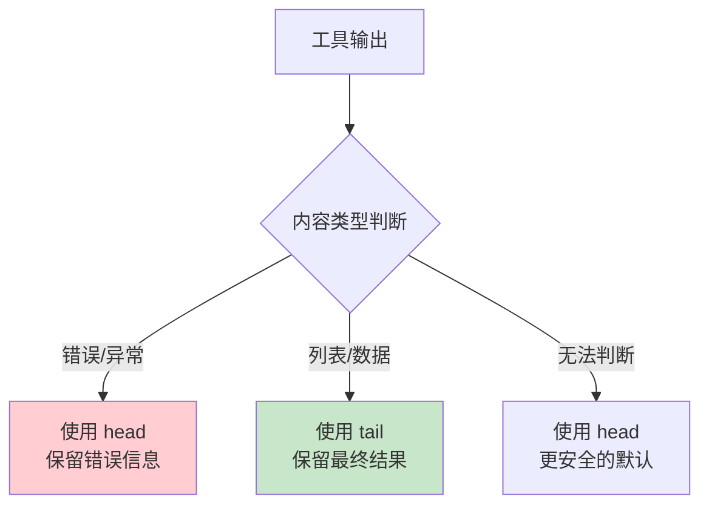
```mermaid
flowchart TD
    A[工具输出] --> B{内容类型判断}
    B -->|错误/异常| C[使用 head<br/>保留错误信息]
    B -->|列表/数据| D[使用 tail<br/>保留最终结果]
    B -->|无法判断| E[使用 head<br/>更安全的默认]

    style C fill:#ffcdd2
    style D fill:#c8e6c9
```

---

### 🤔 为什么这么做？

#### 1. 为什么是 2000 行 / 50KB？

这不是随意选择的数字，而是基于以下考虑：

| 因素 | 计算 | 说明 |
|------|------|------|
| 单行平均 token | ~5-10 tokens | 代码行通常较短 |
| 2000 行占用 | ~10K-20K tokens | 相当于一次中等回复 |
| 50KB 占用 | ~12.5K tokens | 与行数限制相当 |
| AI 处理能力 | 一次输出处理几万 tokens | 限制在可承受范围 |

**设计目标**：
- 保留足够的上下文信息让 AI 理解
- 防止单个工具输出占用过多上下文
- 平衡信息完整性和上下文效率

#### 2. 为什么不直接丢弃，而是保存到文件？

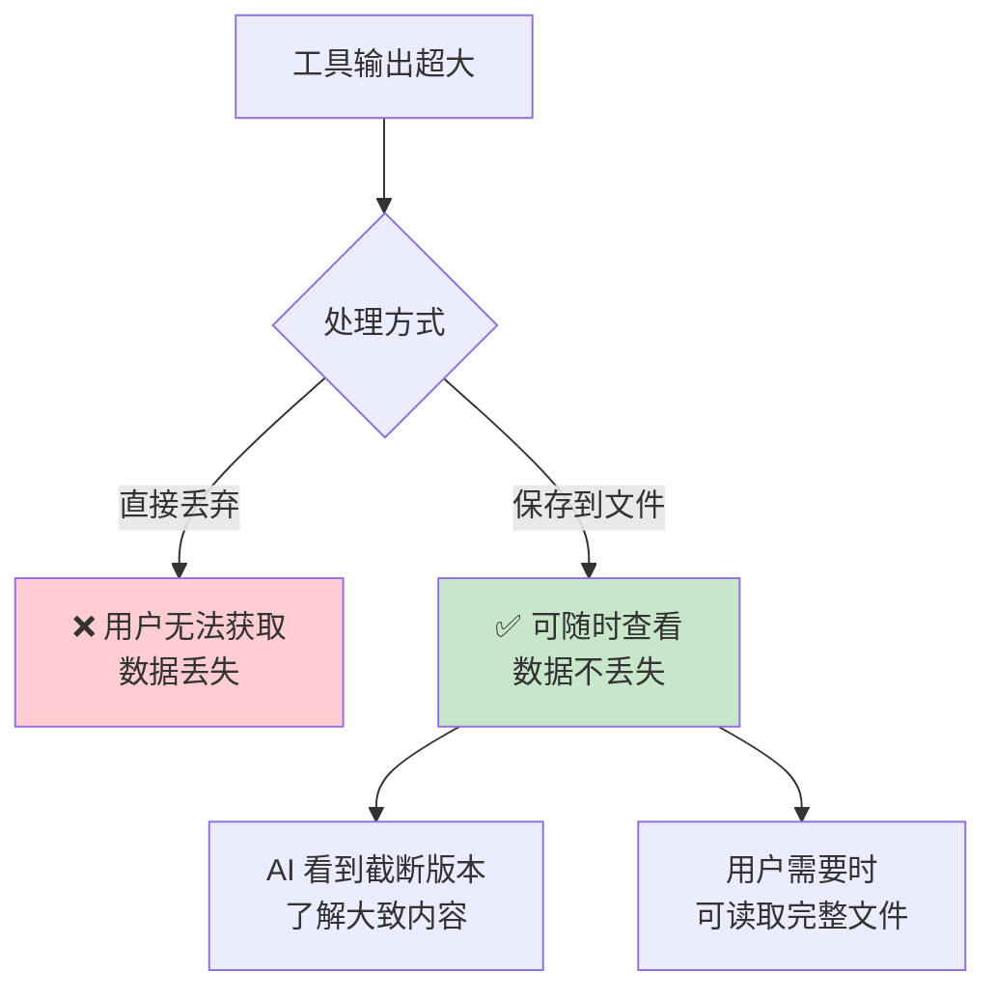
```mermaid
flowchart TD
    A[工具输出超大] --> B{处理方式}
    B -->|直接丢弃| C[❌ 用户无法获取<br/>数据丢失]
    B -->|保存到文件| D[✅ 可随时查看<br/>数据不丢失]

    D --> E[AI 看到截断版本<br/>了解大致内容]
    D --> F[用户需要时<br/>可读取完整文件]

    style C fill:#ffcdd2
    style D fill:#c8e6c9
```

**好处**：
- **AI 不会遗漏**：能看到部分内容，知道发生了什么
- **用户可追溯**：需要时可以读取完整文件
- **自动清理**：7天后自动删除，不占用磁盘

#### 3. 为什么提示要区分 "Task" 和 "Grep/Read"？

```typescript
if (hasTaskPermission) {
  提示: "建议使用 Task 工具查看完整输出"
} else {
  提示: "建议使用 Grep/Read 查看完整输出"
}
```

**原因**：
- **Task 工具**：更适合处理大文件，可以执行复杂查询
- **Grep/Read**：基础工具，权限要求更低
- **智能推荐**：根据用户权限推荐最合适的工具

#### 4. 为什么要在工具输出层面限制，而不是消息层面？

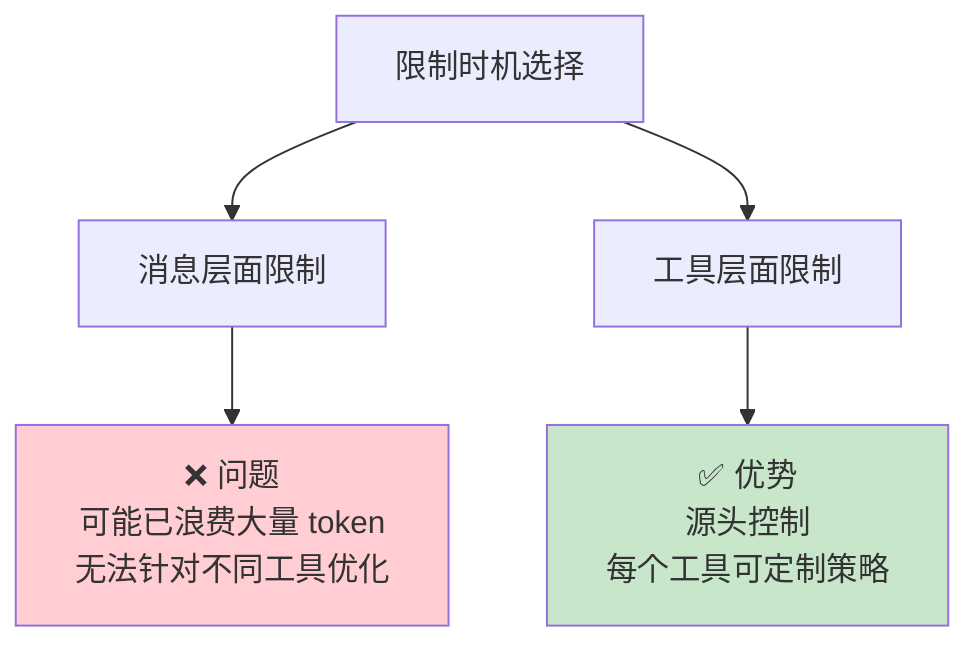
```mermaid
flowchart TD
    A[限制时机选择] --> B[消息层面限制]
    A --> C[工具层面限制]

    B --> B1[❌ 问题<br/>可能已浪费大量 token<br/>无法针对不同工具优化]
    C --> C1[✅ 优势<br/>源头控制<br/>每个工具可定制策略]

    style B1 fill:#ffcdd2
    style C1 fill:#c8e6c9
```

**工具层面限制的优势**：
- 更精细的控制
- 防止无效工作（如处理超大文件后再丢弃）
- 每个工具可以根据特点定制策略

---

## 剪枝策略

### 文件位置
`packages/opencode/src/session/compaction.ts` (214-298行)

### 核心常量

```typescript
export const PRUNE_MINIMUM = 20_000    // 最小剪枝 token 数
export const PRUNE_PROTECT = 40_000    // 保护最近 40K tokens
const PRUNE_PROTECTED_TOOLS = ["skill"]  // 受保护工具列表
```

### 剪枝规则

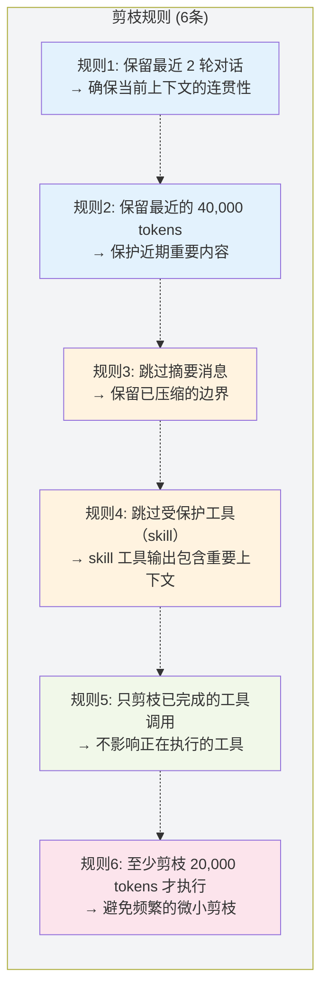
```mermaid
graph TB
    subgraph Rules["剪枝规则 (6条)"]
        direction TB
        R1["规则1: 保留最近 2 轮对话<br/>→ 确保当前上下文的连贯性"]
        R2["规则2: 保留最近的 40,000 tokens<br/>→ 保护近期重要内容"]
        R3["规则3: 跳过摘要消息<br/>→ 保留已压缩的边界"]
        R4["规则4: 跳过受保护工具（skill）<br/>→ skill 工具输出包含重要上下文"]
        R5["规则5: 只剪枝已完成的工具调用<br/>→ 不影响正在执行的工具"]
        R6["规则6: 至少剪枝 20,000 tokens 才执行<br/>→ 避免频繁的微小剪枝"]
    end

    R1 -.-> R2
    R2 -.-> R3
    R3 -.-> R4
    R4 -.-> R5
    R5 -.-> R6

    style Rules fill:#f3f4f6
    style R1 fill:#e3f2fd
    style R2 fill:#e3f2fd
    style R3 fill:#fff3e0
    style R4 fill:#fff3e0
    style R5 fill:#f1f8e9
    style R6 fill:#fce4ec
```

### 剪枝算法

```typescript
export async function prune(input: { sessionID: string }) {
  // 1. 获取配置
  const config = await Config.get()
  if (config.compaction?.prune === false) return

  // 2. 获取所有消息
  const msgs = await Session.messages({ sessionID: input.sessionID })

  // 3. 初始化计数器
  let total = 0        // 累计 token 数
  let pruned = 0       // 可剪枝的 token 数
  const toPrune = []   // 待剪枝的 part 列表
  let turns = 0        // 对话轮数

  // 4. 从后向前遍历消息（最新 → 最旧）
  loop: for (let msgIndex = msgs.length - 1; msgIndex >= 0; msgIndex--) {
    const msg = msgs[msgIndex]

    // 统计用户消息数（对话轮数）
    if (msg.info.role === "user") turns++

    // 保留最近 2 轮对话
    if (turns < 2) continue

    // 遇到摘要消息停止
    if (msg.info.role === "assistant" && msg.info.summary) break loop

    // 从后向前遍历消息的 parts
    for (let partIndex = msg.parts.length - 1; partIndex >= 0; partIndex--) {
      const part = msg.parts[partIndex]

      // 只处理工具调用
      if (part.type === "tool")
        // 只处理已完成的工具调用
        if (part.state.status === "completed") {
          // 跳过受保护的工具
          if (PRUNE_PROTECTED_TOOLS.includes(part.tool)) continue

          // 如果已经压缩过，停止
          if (part.state.time.compacted) break loop

          // 估算此工具输出的 token 数
          const estimate = Token.estimate(part.state.output)

          // 累加到总数
          total += estimate

          // 如果超过保护阈值，加入剪枝列表
          if (total > PRUNE_PROTECT) {
            pruned += estimate
            toPrune.push(part)
          }
        }
    }
  }

  // 5. 只有当可剪枝数量超过最小值时才执行
  if (pruned > PRUNE_MINIMUM) {
    // 标记所有待剪枝的 part
    for (const part of toPrune) {
      if (part.state.status === "completed") {
        // 设置压缩时间戳
        part.state.time.compacted = Date.now()
        // 更新 part
        await Session.updatePart(part)
      }
    }
  }
}
```

### 剪枝示意图

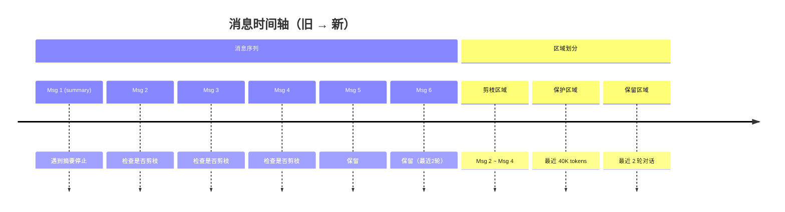
```mermaid
timeline
    title 消息时间轴（旧 → 新）
    section 消息序列
        Msg 1 (summary) : 遇到摘要停止
        Msg 2           : 检查是否剪枝
        Msg 3           : 检查是否剪枝
        Msg 4           : 检查是否剪枝
        Msg 5           : 保留
        Msg 6           : 保留（最近2轮）
    section 区域划分
        剪枝区域     : Msg 2 ~ Msg 4
        保护区域     : 最近 40K tokens
        保留区域     : 最近 2 轮对话
```

**关键概念**：
- **剪枝区域**：超过保护阈值的消息，工具输出可被标记为已压缩
- **保护区域**：最近 40,000 tokens 内的内容不会被剪枝
- **保留区域**：最近 2 轮对话完全保留，确保上下文连贯性
- **摘要边界**：遇到摘要消息时停止，保留之前的压缩结果

---

### 📌 这一部分干了什么？

**作用**：标记旧的工具输出为"已压缩"，使其在下一轮对话中被过滤掉，从而节省 token。

**具体操作**：
1. 从最新消息开始，向后遍历历史消息
2. 统计累计的 token 数量
3. 对于超过保护阈值（40K）的工具输出，标记为 `compacted`
4. 标记后的消息在下次发送给 AI 时会被自动过滤

**触发时机**：检测到溢出后，首先尝试剪枝

**实际效果**：
- 不修改原始消息内容
- 只是设置一个时间戳标记
- 下一轮对话时，带 `compacted` 标记的工具输出不会发送给 AI

---

### ⚙️ 工作原理

#### 剪枝 vs 删除

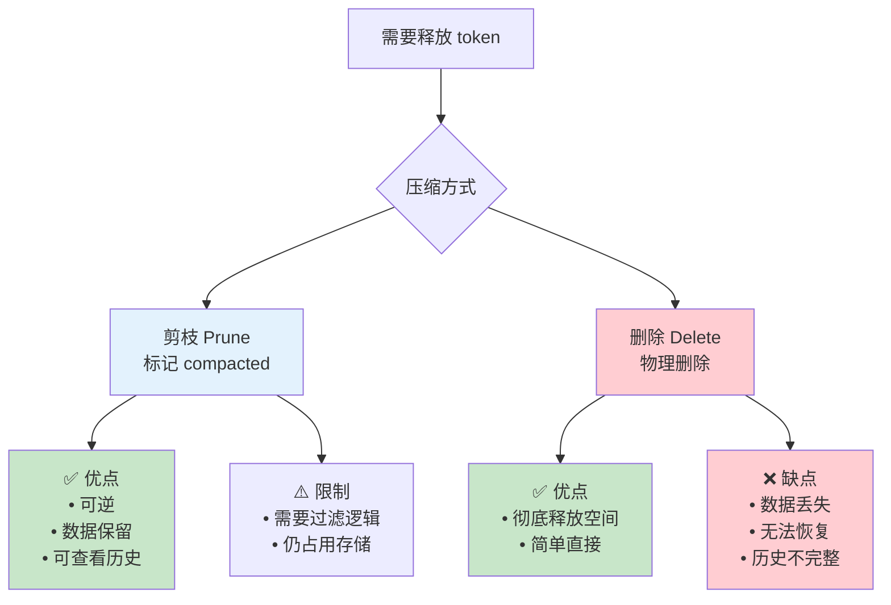
```mermaid
flowchart TD
    A[需要释放 token] --> B{压缩方式}
    B --> C[剪枝 Prune<br/>标记 compacted]
    B --> D[删除 Delete<br/>物理删除]

    C --> E[✅ 优点<br/>• 可逆<br/>• 数据保留<br/>• 可查看历史]
    C --> F[⚠️ 限制<br/>• 需要过滤逻辑<br/>• 仍占用存储]

    D --> G[✅ 优点<br/>• 彻底释放空间<br/>• 简单直接]
    D --> H[❌ 缺点<br/>• 数据丢失<br/>• 无法恢复<br/>• 历史不完整]

    style C fill:#e3f2fd
    style D fill:#ffcdd2
    style E fill:#c8e6c9
    style G fill:#c8e6c9
    style H fill:#ffcdd2
```

**OpenCode 选择剪枝的原因**：
- 用户可能需要查看历史工具输出
- 调试时需要完整的执行记录
- 避免不可逆的数据丢失

#### 过滤机制

剪枝后，消息是如何被过滤的？

```typescript
// 在构建发送给 AI 的消息时
if (part.type === "tool" && part.state.time.compacted) {
  // 跳过已压缩的工具输出
  continue
}
```

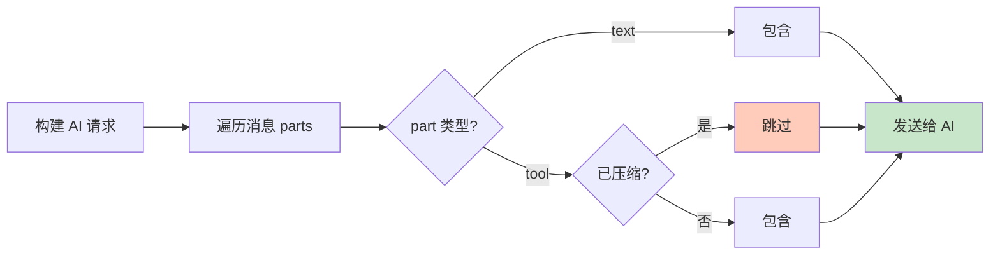
```mermaid
flowchart LR
    A[构建 AI 请求] --> B[遍历消息 parts]
    B --> C{part 类型?}
    C -->|text| D[包含]
    C -->|tool| E{已压缩?}
    E -->|是| F[跳过]
    E -->|否| G[包含]
    D --> H[发送给 AI]
    F --> H
    G --> H

    style F fill:#ffccbc
    style H fill:#c8e6c9
```

#### 为什么从后向前遍历？

```typescript
for (let msgIndex = msgs.length - 1; msgIndex >= 0; msgIndex--)
```

| 遍历方向 | 优点 | 缺点 |
|---------|------|------|
| **从后向前**（当前） | ✅ 容易统计对话轮数<br/>✅ 容易累计 token<br/>✅ 遇到摘要即停止 | 无明显缺点 |
| **从前向后** | 无 | ❌ 需要预读才知道是否在最近2轮<br/>❌ 无法提前知道累计 token |

**从后向前的优势**：
- 天然符合"保护最近"的逻辑
- 可以提前停止（遇到摘要）
- 统计对话轮数更直观

---

### 🤔 为什么这么做？

#### 1. 为什么保留最近 2 轮对话？

```
轮次定义：
User 1 → Assistant 1 → User 2 → Assistant 2 → User 3 → Assistant 3
       ├───── 第1轮 ────┤    ├───── 第2轮 ────┤    ↑ 第3轮
                                                  └─ 当前轮次
```

**原因分析**：

| 保护轮数 | 说明 | 问题 |
|---------|------|------|
| 0 轮 | 上下文完全断裂 | AI 不知道之前在做什么 |
| 1 轮 | 只有紧邻的上下文 | AI 可能遗漏重要信息 |
| **2 轮**（当前） | 有足够上下文连贯性 | ✅ 平衡点 |
| 3+ 轮 | 上下文更完整 | 剪枝效果变差 |

**为什么 2 轮是最佳平衡点**：
- 用户问的问题通常与最近 2-3 轮对话相关
- AI 需要知道：之前做了什么、当前在做什么、接下来要做什么
- 超过 2 轮的内容通常可以被摘要捕获

#### 2. 为什么是 40K tokens 的保护阈值？

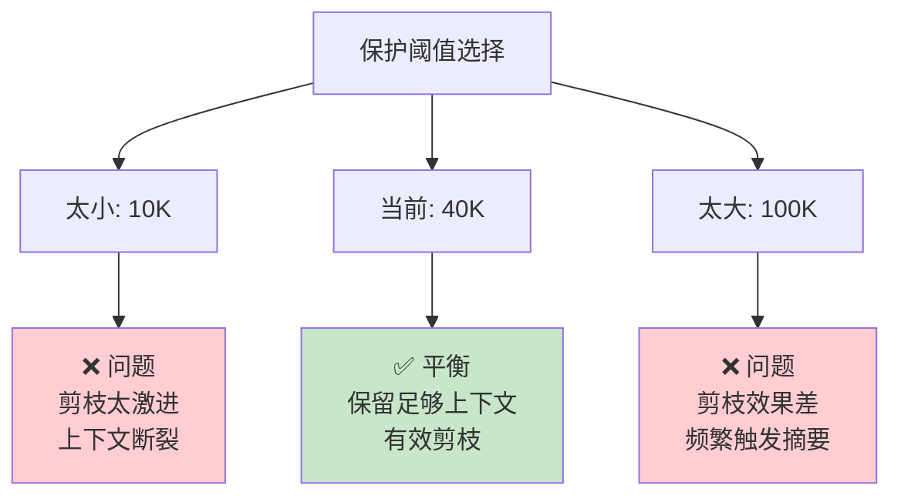
```mermaid
flowchart TD
    A[保护阈值选择] --> B[太小: 10K]
    A --> C[当前: 40K]
    A --> D[太大: 100K]

    B --> B1[❌ 问题<br/>剪枝太激进<br/>上下文断裂]
    C --> C1[✅ 平衡<br/>保留足够上下文<br/>有效剪枝]
    D --> D1[❌ 问题<br/>剪枝效果差<br/>频繁触发摘要]

    style C1 fill:#c8e6c9
    style B1 fill:#ffcdd2
    style D1 fill:#ffcdd2
```

**40K tokens 的含义**：
- 相当于约 16 万字符（4 chars/token）
- 约 30-50 页的代码
- 足够包含最近几个复杂任务的完整上下文

**数据支持**：
- 大多数单次任务（如读取文件、运行测试）输出 < 10K tokens
- 保留 40K 意味着可以容纳 3-4 个复杂任务的完整输出
- 剩余空间可用于更早的、不重要的内容

#### 3. 为什么 skill 工具受保护？

```typescript
const PRUNE_PROTECTED_TOOLS = ["skill"]
```

**skill 工具的特殊性**：

| 工具类型 | 输出内容 | 是否可剪枝 |
|---------|---------|-----------|
| Read | 文件内容 | ✅ 可以重新读取 |
| Bash | 命令输出 | ⚠️ 可能需要但可重新运行 |
| Grep | 搜索结果 | ✅ 可以重新搜索 |
| **Skill** | **子会话上下文** | ❌ ❌ ❌ 不可重建 |

**skill 输出包含**：
- 完整的子会话对话历史
- 子会话中的工具调用和结果
- 可能包含用户的重要决策过程

**一旦剪枝，这些信息无法恢复**，因为：
- 子会话可能已经结束
- 无法重现当时的执行路径
- 可能影响 AI 的决策逻辑

#### 4. 为什么需要至少 20K tokens 才执行剪枝？

```typescript
export const PRUNE_MINIMUM = 20_000
if (pruned > PRUNE_MINIMUM) { /* 执行剪枝 */ }
```

**原因**：避免频繁的微小剪枝

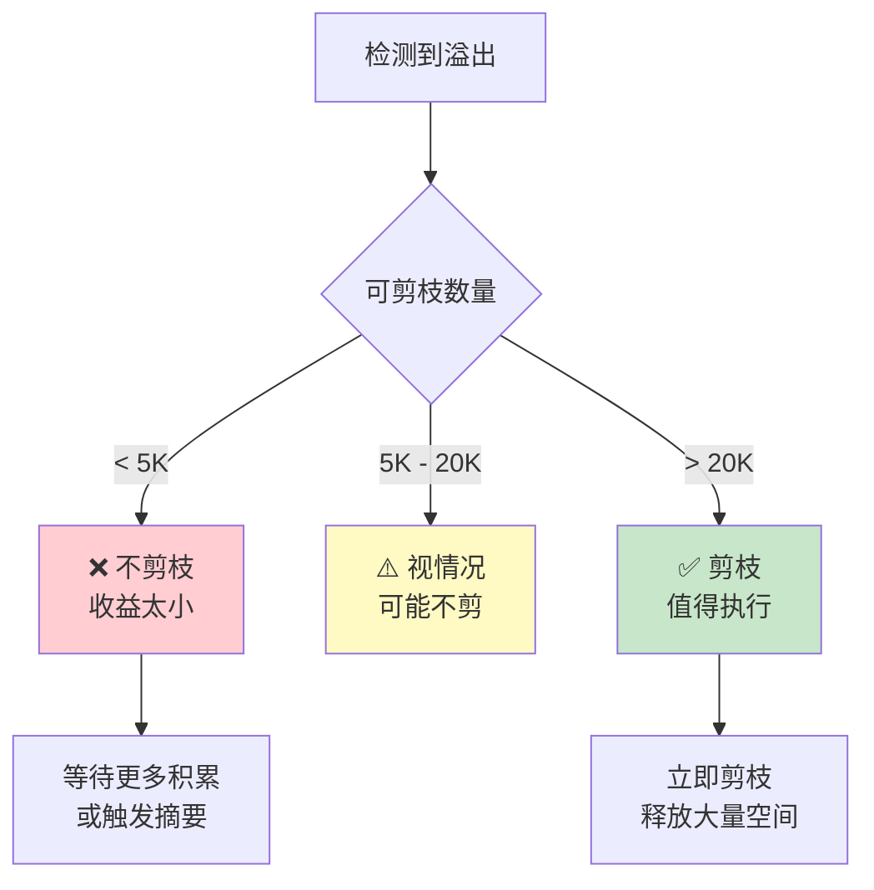
```mermaid
flowchart TD
    A[检测到溢出] --> B{可剪枝数量}
    B -->|< 5K| C[❌ 不剪枝<br/>收益太小]
    B -->|5K - 20K| D[⚠️ 视情况<br/>可能不剪]
    B -->|> 20K| E[✅ 剪枝<br/>值得执行]

    C --> F[等待更多积累<br/>或触发摘要]
    E --> G[立即剪枝<br/>释放大量空间]

    style E fill:#c8e6c9
    style C fill:#ffcdd2
    style D fill:#fff9c4
```

**20K 的计算逻辑**：
- 剪枝操作本身有开销（数据库写入）
- 如果只节省几千 tokens，开销 > 收益
- 20K 约等于一次大型工具输出，值得执行

#### 5. 为什么遇到摘要消息就停止？

```typescript
if (msg.info.role === "assistant" && msg.info.summary) break loop
```

**摘要作为天然的分界线**：

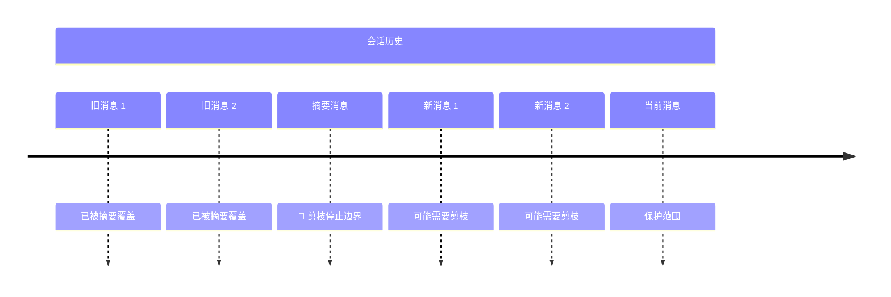
```mermaid
timeline
    section 会话历史
        旧消息 1 : 已被摘要覆盖
        旧消息 2 : 已被摘要覆盖
        摘要消息 : 🛑 剪枝停止边界
        新消息 1 : 可能需要剪枝
        新消息 2 : 可能需要剪枝
        当前消息 : 保护范围
```

**原因**：
- 摘要已经总结了之前的内容
- 继续向前剪枝可能会遗漏摘要中的重要信息
- 避免重复剪枝（摘要之前的应该已经剪过了）

---

## 摘要压缩

### 文件位置
`packages/opencode/src/session/compaction.ts` (322-450行)

### 摘要流程

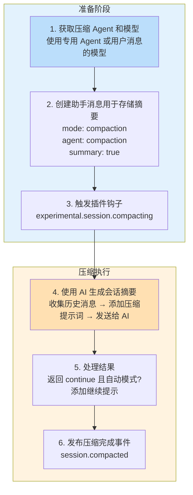
```mermaid
flowchart TD
    subgraph Prepare["准备阶段"]
        A[1. 获取压缩 Agent 和模型<br/>使用专用 Agent 或用户消息的模型]
        B[2. 创建助手消息用于存储摘要<br/>mode: compaction<br/>agent: compaction<br/>summary: true]
        C[3. 触发插件钩子<br/>experimental.session.compacting]
    end

    subgraph Process["压缩执行"]
        D[4. 使用 AI 生成会话摘要<br/>收集历史消息 → 添加压缩提示词 → 发送给 AI]
        E[5. 处理结果<br/>返回 continue 且自动模式?<br/>添加继续提示]
        F[6. 发布压缩完成事件<br/>session.compacted]
    end

    A --> B --> C --> D --> E --> F

    style Prepare fill:#e3f2fd
    style Process fill:#fff3e0
    style A fill:#bbdefb
    style D fill:#ffe0b2
```

### 默认压缩提示词

```typescript
const defaultPrompt =
  "Provide a detailed prompt for continuing our conversation above. " +
  "Focus on information that would be helpful for continuing the conversation, " +
  "including what we did, what we're doing, which files we're working on, " +
  "and what we're going to do next considering new session will not have " +
  "access to our conversation."
```

### 压缩消息创建

```typescript
// 创建助手消息用于存储摘要
const msg = await Session.updateMessage({
  id: Identifier.ascending("message"),
  role: "assistant",
  parentID: input.parentID,
  sessionID: input.sessionID,
  mode: "compaction",      // 标记为压缩模式
  agent: "compaction",     // 使用压缩 Agent
  summary: true,           // 标记为摘要消息
  // ... 其他字段
})
```

---

### 📌 这一部分干了什么？

**作用**：当剪枝不足以解决溢出时，使用 AI 生成会话摘要，大幅减少上下文大小。

**具体操作**：
1. 收集历史消息（不包括最近 2 轮对话）
2. 构建专门的提示词，要求 AI 生成"继续对话所需的上下文"
3. 发送给 AI，获取摘要内容
4. 将摘要存储为一条特殊的 assistant 消息
5. 摘要之前的消息在后续对话中不再发送给 AI

**触发时机**：剪枝后仍然溢出时

**实际效果**：
- 将可能数万 tokens 的历史对话压缩为几百到几千 tokens
- AI 仍然能理解之前做了什么、正在做什么
- 会话可以无缝继续

---

### ⚙️ 工作原理

#### 摘要消息的特殊性

```typescript
// 普通的 assistant 消息
{ role: "assistant", text: "...", summary: undefined }

// 摘要消息
{ role: "assistant", text: "摘要内容...", summary: true }
```

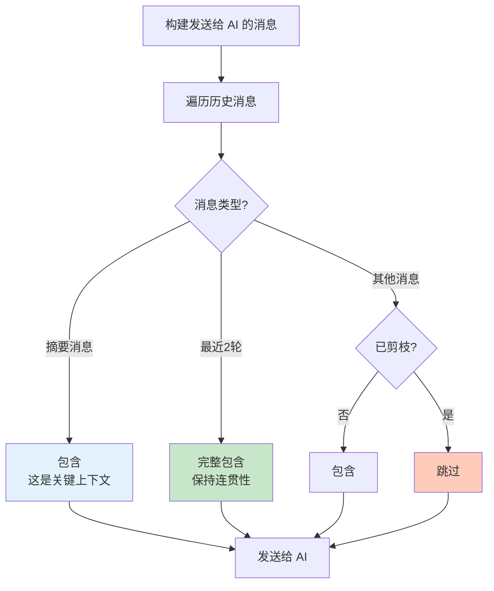
```mermaid
flowchart TD
    A[构建发送给 AI 的消息] --> B[遍历历史消息]
    B --> C{消息类型?}

    C -->|摘要消息| D[包含<br/>这是关键上下文]
    C -->|最近2轮| E[完整包含<br/>保持连贯性]
    C -->|其他消息| F{已剪枝?}

    F -->|是| G[跳过]
    F -->|否| H[包含]

    D --> I[发送给 AI]
    E --> I
    H --> I
    G --> I

    style D fill:#e3f2fd
    style E fill:#c8e6c9
    style G fill:#ffccbc
```

**摘要消息的作用**：
- 作为"分界线"，之前的旧消息不再发送
- 作为"上下文传递者"，保留关键信息
- 始终被包含在发送给 AI 的消息中

#### 提示词工程

默认提示词的精心设计：

```typescript
"Provide a detailed prompt for continuing our conversation above. " +
"Focus on information that would be helpful for continuing the conversation, " +
"including what we did, what we're doing, which files we're working on, " +
"and what we're going to do next considering new session will not have " +
"access to our conversation."
```

**关键要素分析**：

| 提示词部分 | 目的 | 预期输出 |
|-----------|------|---------|
| "detailed prompt" | 要求详细，不是简单概括 | 结构化的上下文描述 |
| "what we did" | 历史记录 | 已完成的任务、决策 |
| "what we're doing" | 当前状态 | 正在进行的任务 |
| "which files" | 文件上下文 | 涉及的文件列表 |
| "what we're going to do next" | 下一步计划 | 待完成的任务 |

**为什么这样设计？**
- 不是"总结对话"，而是"生成继续的提示"
- 更注重可操作性，而非叙事性
- AI 可以直接使用这个摘要继续工作

#### 自动模式下的继续提示

```typescript
if (result === "continue" && input.auto) {
  // 添加"继续"提示
  part.text.text += "\n\nContinue if you have next steps."
}
```

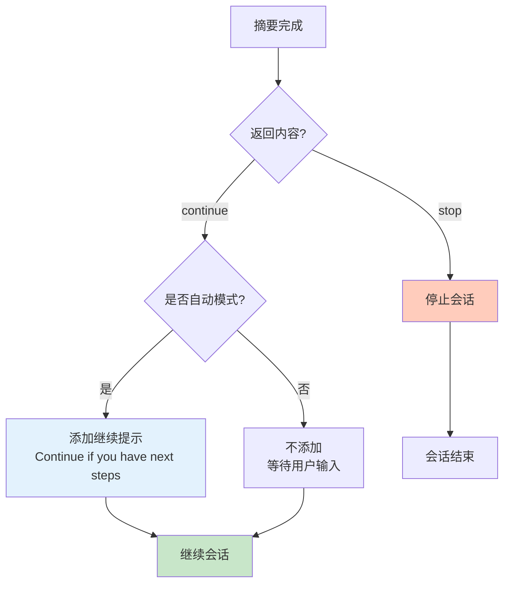
```mermaid
flowchart TD
    A[摘要完成] --> B{返回内容?}
    B -->|continue| C{是否自动模式?}
    B -->|stop| D[停止会话]

    C -->|是| E[添加继续提示<br/>Continue if you have next steps]
    C -->|否| F[不添加<br/>等待用户输入]

    E --> G[继续会话]
    F --> G
    D --> H[会话结束]

    style E fill:#e3f2fd
    style G fill:#c8e6c9
    style D fill:#ffccbc
```

**为什么添加继续提示？**
- 自动模式下，用户可能不在场
- AI 需要明确的信号来决定是否继续
- 避免摘要后会话意外中断

---

### 🤔 为什么这么做？

#### 1. 为什么用 AI 生成摘要，而不是规则提取？

```mermaid
flowchart TD
    A[摘要生成方式] --> B[规则提取]
    A --> C[AI 生成<br/>当前方案]

    B --> B1[❌ 问题<br/>• 难以处理复杂上下文<br/>• 容易遗漏关键信息<br/>• 无法理解任务意图]
    C --> C1[✅ 优势<br/>• 理解语义和意图<br/>• 提取真正重要的内容<br/>• 生成连贯的描述]

    style C1 fill:#c8e6c9
    style B1 fill:#ffcdd2
```

**AI 摘要的优势**：
- 能理解"什么重要"，而不是机械提取
- 能适应各种不同的对话模式
- 能生成自然语言描述，易于理解

**成本考虑**：
- 虽然需要消耗 token，但相比保留完整历史，节省 90%+
- 一次性成本，后续所有对话都受益

#### 2. 为什么不直接删除旧消息？

```mermaid
flowchart LR
    A[处理旧消息] --> B[直接删除]
    A --> C[生成摘要]

    B --> B1[❌ 后果<br/>• 上下文完全丢失<br/>• AI 不知道之前做了什么<br/>• 用户无法追溯历史]
    C --> C1[✅ 效果<br/>• 保留关键上下文<br/>• 数据可追溯<br/>• 会话可继续]

    style C1 fill:#c8e6c9
    style B1 fill:#ffcdd2
```

**摘要作为"上下文桥梁"**：
- 用户：可以查看历史摘要，了解之前做了什么
- AI：获得继续工作所需的上下文
- 系统：大幅减少 token 使用，同时保留关键信息

#### 3. 为什么摘要消息是 assistant 类型？

```typescript
role: "assistant"  // 不是 user，不是 system
```

| 角色类型 | 适合场景 | 为什么摘要用 assistant？ |
|---------|---------|------------------------|
| `system` | 全局指令、规则 | ❌ 摘要是对话历史的一部分 |
| `user` | 用户输入 | ❌ 摘要是 AI 生成的 |
| `assistant` | AI 回复 | ✅ 摘要是 AI 的输出 |

**实际效果**：
- AI 看到的是"之前的 AI 助手说：这是之前的工作摘要"
- 符合对话的自然逻辑
- 不会被误认为是用户的指令

#### 4. 为什么摘要前还要保留最近 2 轮对话？

```mermaid
timeline
    section 消息序列
        旧历史 1~N : 会被摘要覆盖
        ────────── : 🔄 摘要边界
        摘要消息 : 历史的浓缩
        最近第2轮 : 完整保留
        最近第1轮 : 完整保留
        当前消息 : 正在处理
```

**设计原因**：

| 策略 | 优点 | 缺点 |
|------|------|------|
| 只保留摘要 | 节省更多 token | ❌ 可能丢失最新上下文 |
| **摘要 + 最近2轮**（当前） | ✅ 上下文完整<br/>✅ 连贯性强 | 略多用一些 token |
| 摘要 + 最近5轮 | 上下文更完整 | 剪枝效果差 |

**为什么 2 轮 + 摘要足够**：
- 摘要提供了历史背景
- 最近 2 轮提供了当前上下文
- AI 可以从摘要推断更早的内容
- 实践证明这种组合效果最好

#### 5. 为什么需要插件钩子？

```typescript
Plugin.trigger("experimental.session.compacting", ...)
```

**扩展性设计**：

```mermaid
flowchart TD
    A[摘要压缩触发] --> B[触发插件钩子]
    B --> C[插件 1<br/>自定义上下文]
    B --> D[插件 2<br/>自定义提示词]
    B --> E[插件 N<br/>自定义处理]

    C --> F[合并到压缩请求]
    D --> F
    E --> F

    F --> G[发送给 AI]

    style F fill:#c8e6c9
```

**插件可以做什么**：
- **自定义上下文**：添加特定的信息到摘要
- **自定义提示词**：修改默认的压缩提示词
- **自定义处理**：在摘要生成前后执行自定义逻辑

**实际应用场景**：
- 项目管理插件：在摘要中添加当前任务状态
- 代码审查插件：在摘要中强调代码变更
- 测试插件：在摘要中记录测试结果

---

## 完整流程

### 文件位置
`packages/opencode/src/session/processor.ts`

### 主处理循环

```typescript
export function create(input: {
  assistantMessage: MessageV2.Assistant
  sessionID: string
  model: Provider.Model
  abort: AbortSignal
}) {
  const toolcalls: Record<string, MessageV2.ToolPart> = {}
  let snapshot: string | undefined
  let blocked = false
  let attempt = 0
  let needsCompaction = false

  return {
    async process(streamInput: LLM.StreamInput) {
      while (true) {
        // ... 流式处理逻辑

        // 检测溢出
        if (await SessionCompaction.isOverflow({
          tokens: usage.tokens,
          model: input.model
        })) {
          needsCompaction = true
        }

        // 如果需要压缩，跳出循环
        if (needsCompaction) break
      }

      // 清理未完成的工具调用
      // ...

      // 返回处理结果
      if (needsCompaction) return "compact"
      if (blocked) return "stop"
      if (input.assistantMessage.error) return "stop"
      return "continue"
    }
  }
}
```

### 完整压缩触发流程

```mermaid
flowchart TD
    Start([用户发送消息]) --> S1[1. 创建会话处理器<br/>SessionProcessor.create]

    S1 --> S2[2. 开始流式处理<br/>processor.process]

    S2 --> S3[3. 流式处理事件循环<br/>for await of fullStream]

    S3 --> E1[reasoning-start/delta/end<br/>处理推理内容]
    S3 --> E2[tool-call<br/>执行工具调用]
    S3 --> E3[tool-result<br/>保存工具结果]
    S3 --> E4[text-start/delta/end<br/>处理文本输出]
    S3 --> E5[finish-step ⚠️<br/>关键事件]

    E5 --> F1[获取使用统计<br/>Session.getUsage]
    F1 --> F2[更新消息<br/>finish, cost, tokens]
    F2 --> F3[生成摘要<br/>SessionSummary.summarize]
    F3 --> F4[检测溢出<br/>SessionCompaction.isOverflow]

    F4 -->|needsCompaction = true| S4[4. 返回 compact]
    F4 -->|正常| End1([会话继续])

    S4 --> S5[5. 尝试剪枝<br/>SessionCompaction.prune]

    S5 -->|节省足够| End1
    S5 -->|仍溢出| S6[6. 执行摘要压缩<br/>SessionCompaction.process]

    S6 --> S7[创建摘要消息<br/>触发插件钩子<br/>AI 生成摘要<br/>添加继续提示]
    S7 --> End2([会话继续])

    style E5 fill:#ffccbc
    style F4 fill:#ffccbc
    style S5 fill:#fff9c4
    style S6 fill:#ffccbc
```

---

### 📌 这一部分干了什么？

**作用**：将所有压缩机制整合到完整的请求处理流程中，展示压缩是如何被触发和执行的。

**完整流程概述**：

```
用户发送消息
    ↓
AI 处理消息（流式）
    ↓
finish-step 事件 → 检测溢出
    ↓
如果溢出 → 尝试剪枝
    ↓
如果仍溢出 → 摘要压缩
    ↓
会话继续
```

**关键决策点**：
- **finish-step**：每次 AI 回复完成时检查是否溢出
- **剪枝决策**：如果剪枝能节省足够 tokens，直接继续
- **摘要决策**：如果剪枝不够，执行 AI 摘要

---

### ⚙️ 工作原理

#### 事件驱动架构

```mermaid
sequenceDiagram
    participant U as 用户
    participant P as SessionProcessor
    participant L as LLM Stream
    participant C as Compaction

    U->>P: 发送消息
    P->>L: 开始流式处理

    loop 流式事件
        L-->>P: reasoning/text/tool 事件
        P-->>P: 处理事件
    end

    L-->>P: finish-step ⚠️
    P->>C: isOverflow?

    alt 溢出
        C->>C: prune()
        alt 节省足够
            C-->>P: 成功
        else 仍溢出
            C->>C: process() → AI 摘要
            C-->>P: 成功
        end
    end

    P-->>U: 会话继续
```

**为什么选择事件驱动？**
- 解耦压缩逻辑和请求处理逻辑
- 可以灵活地添加新的检查点
- 不影响正常的流式处理性能

#### 两种压缩路径

```mermaid
flowchart TD
    A[检测到溢出] --> B[第一层: 剪枝]
    B --> C{节省足够?}

    C -->|是| D[路径1: 轻量压缩<br/>• 速度: 快<br/>• 成本: 低<br/>• 保留: 完整数据]
    C -->|否| E[路径2: 重量压缩<br/>• 速度: 慢<br/>• 成本: 高<br/>• 保留: 摘要]

    D --> F[会话继续]
    E --> G[AI 生成摘要]
    G --> F

    style D fill:#c8e6c9
    style E fill:#fff9c4
```

**路径对比**：

| 特性 | 路径1：剪枝 | 路径2：摘要 |
|------|-----------|-----------|
| 触发条件 | 可剪枝 > 20K tokens | 剪枝后仍溢出 |
| 执行时间 | < 100ms | 1-5s |
| Token 成本 | 0 | 1-5K（生成摘要） |
| 数据保留 | 完整保留（标记压缩） | 保留摘要 |
| 典型节省 | 20K-100K tokens | 50K-200K tokens |
| 用户感知 | 无感知 | 可能有短暂延迟 |

**为什么优先剪枝？**
- 快速、无成本
- 保留完整数据
- 用户体验好

**为什么需要摘要作为后备？**
- 剪枝可能不够（历史消息很少工具调用）
- 摘要更彻底（压缩比更高）
- 确保会话能继续

#### finish-step 的关键作用

```typescript
// 在 processor.ts 中
for await (const value of stream.fullStream) {
  switch (value.type) {
    case "finish-step":
      // 🎯 关键：在这里检测溢出
      const usage = Session.getUsage(...)
      if (await SessionCompaction.isOverflow(...)) {
        needsCompaction = true
        break  // 跳出循环，执行压缩
      }
      break
  }
}
```

**为什么是 finish-step？**

| 事件 | token 统计 | 能否检测溢出 | 说明 |
|------|-----------|-------------|------|
| `text-start` | ❌ 不完整 | ❌ | 输出刚开始 |
| `text-delta` | ❌ 不完整 | ❌ | 输出进行中 |
| `tool-call` | ❌ 不完整 | ❌ | 工具刚调用 |
| `tool-result` | ⚠️ 部分 | ⚠️ | 可能还有更多输出 |
| **finish-step** | ✅ **完整** | ✅ **最佳时机** | 当前步完成 |

**finish-step 的特殊性**：
- 表示一个完整的"思考-行动"步骤结束
- token 统计已完整（input + output + cache）
- 在用户看到结果前处理，体验更好
- 如果需要压缩，可以无缝衔接下一轮

---

### 🤔 为什么这么做？

#### 1. 为什么压缩是异步的，而不是阻塞请求？

```mermaid
flowchart TD
    A[用户消息] --> B[AI 处理]
    B --> C[finish-step]
    C --> D{是否溢出?}

    D -->|否| E[立即返回结果<br/>用户看到]
    D -->|是| F[后台执行压缩]

    F --> G[压缩完成]
    G --> H[继续下一轮<br/>或自动继续]

    E --> I[用户输入新消息]
    H --> I

    style E fill:#c8e6c9
    style F fill:#fff9c4
```

**设计优势**：
- 用户不会看到"正在压缩..."的等待
- 压缩过程对用户透明
- 下一轮对话自然开始

#### 2. 为什么压缩后可以无缝继续？

```mermaid
timeline
    section 用户视角
        T1 : "帮我重构这个函数"
        T2 : AI 处理中...
        T3 : AI 返回结果（后台检测溢出）
        T4 : 后台压缩（用户无感知）
        T5 : 自动继续或等待输入
        T6 : 对话自然进行
```

**关键技术**：
- 压缩后返回 `"compact"` 状态
- 调用方知道需要重新生成请求
- 新请求自动过滤已压缩的消息
- AI 看到的是"干净的"上下文

#### 3. 为什么需要多层压缩机制？

```mermaid
graph LR
    A[溢出问题] --> B{溢出程度}
    B -->|轻度| C[剪枝解决<br/>快速免费]
    B -->|中度| D[剪枝 + 摘要<br/>彻底解决]
    B -->|重度| E[摘要 + 剪枝<br/>最大压缩]

    C --> F[问题解决]
    D --> F
    E --> F

    style C fill:#c8e6c9
    style D fill:#fff9c4
    style E fill:#ffccbc
```

**单层机制的问题**：

| 单层方案 | 问题 | 多层解决方案 |
|---------|------|-------------|
| 只剪枝 | 历史消息多时效果有限 | + 摘要兜底 |
| 只摘要 | 轻度溢出也要等待 AI | + 剪枝优先 |

**多层协同**：
- **轻度溢出**：剪枝快速解决，无成本
- **中度溢出**：剪枝不够，摘要补充
- **重度溢出**：摘要 + 剪枝，最大压缩比

#### 4. 为什么压缩是"渐进式"的？

```typescript
// 不是一次性压缩所有旧消息
// 而是每次只压缩需要的部分

if (pruned > PRUNE_MINIMUM) {
  // 只剪枝超出保护阈值的
  // 不动最近 40K + 最近 2 轮
}
```

**渐进式压缩的好处**：

| 方面 | 渐进式 | 一次性全部压缩 |
|------|-------|---------------|
| 性能 | ✅ 每次只处理必要的 | ❌ 浪费资源 |
| 灵活性 | ✅ 根据需要调整 | ❌ 可能压缩过度或不足 |
| 可追溯 | ✅ 历史数据分阶段保留 | ❌ 一次性全部丢失 |
| 用户体验 | ✅ 无感知 | ⚠️ 可能有延迟 |

**实际效果**：
- 第一次溢出：压缩最旧的 20-50K tokens
- 第二次溢出：压缩下一批
- 逐步累积摘要，而不是一次性大爆炸

---

## 配置选项

### 配置文件位置
`packages/opencode/src/config/config.ts`

### 压缩配置 Schema

```typescript
compaction: z.object({
  auto: z.boolean()
    .optional()
    .describe("Enable automatic compaction when context is full (default: true)"),

  prune: z.boolean()
    .optional()
    .describe("Enable pruning of old tool outputs (default: true)")
})
```

### 配置示例

```jsonc
{
  "$schema": "https://opencode.ai/config.json",
  "compaction": {
    "auto": true,     // 启用自动压缩（默认）
    "prune": true     // 启用剪枝（默认）
  }
}
```

### 禁用压缩

```jsonc
{
  "compaction": {
    "auto": false,    // 禁用自动压缩
    "prune": false    // 禁用剪枝
  }
}
```

---

## 数据结构

### 消息部分类型

```typescript
// 文本部分
type TextPart = {
  type: "text"
  text: string
  synthetic?: boolean    // 是否为合成内容
  ignored?: boolean      // 是否被忽略
  time?: { start: number, end?: number }
}

// 工具部分
type ToolPart = {
  type: "tool"
  callID: string
  tool: string
  state: ToolState
}

// 工具状态
type ToolState =
  | { status: "pending", input: any, raw: string }
  | { status: "running", input: any, time: { start: number } }
  | { status: "completed",
      input: any,
      output: string,
      time: { start: number, end: number, compacted?: number }  // compacted 压缩时间戳
    }
  | { status: "error", error: string }

// 压缩部分
type CompactionPart = {
  type: "compaction"
  auto: boolean  // 是否自动模式
}
```

### Token 统计

```typescript
type Tokens = {
  input: number       // 输入 token
  output: number      // 输出 token
  reasoning: number   // 推理 token
  cache: {
    read: number      // 缓存读取
    write: number     // 缓存写入
  }
}
```

### 消息信息

```typescript
type User = {
  id: string
  sessionID: string
  role: "user"
  time: { created: number }
  summary?: {
    title?: string
    body?: string
    diffs: FileDiff[]
  }
  agent: string
  model: { providerID: string, modelID: string }
}

type Assistant = {
  id: string
  sessionID: string
  role: "assistant"
  parentID: string
  modelID: string
  providerID: string
  mode: string
  agent: string
  summary?: boolean    // 是否为摘要消息
  cost: number
  tokens: Tokens
  finish?: string
  error?: ErrorInfo
  time: { created: number, completed?: number }
}
```

---

## 事件系统

### 压缩相关事件

```typescript
// 会话压缩完成事件
BusEvent.define(
  "session.compacted",
  z.object({
    sessionID: z.string()
  })
)

// 会话差异事件
BusEvent.define(
  "session.diff",
  z.object({
    sessionID: z.string(),
    diff: z.array(FileDiff)
  })
)
```

### 插件钩子

```typescript
// 压缩前钩子
Plugin.trigger(
  "experimental.session.compacting",
  { sessionID: string },
  { context: string[], prompt?: string }
)
```

---

## 关键文件索引

| 文件 | 行数 | 功能 |
|------|------|------|
| `util/token.ts` | 全部 | Token 估算 |
| `session/compaction.ts` | 148-172 | 溢出检测 |
| `session/compaction.ts` | 214-298 | 剪枝策略 |
| `session/compaction.ts` | 322-450 | 摘要压缩 |
| `tool/truncation.ts` | 全部 | 输出截断 |
| `session/summary.ts` | 全部 | 会话摘要 |
| `session/processor.ts` | 274-277 | 压缩触发 |
| `session/message-v2.ts` | 927-946 | 过滤压缩消息 |

---

## 总结

OpenCode 的上下文压缩机制采用多层次策略：

1. **Token 估算**：快速估算文本的 token 数量
2. **溢出检测**：实时监控 token 使用量
3. **工具输出截断**：限制单次工具输出的大小
4. **剪枝**：删除旧的工具输出（第一层压缩）
5. **摘要压缩**：使用 AI 生成会话摘要（第二层压缩）

这种分层策略确保：
- 轻度溢出通过剪枝快速解决
- 重度溢出通过 AI 摘要保留上下文
- 用户体验流畅，无明显卡顿
- 压缩后的会话仍可继续

---

*文档生成时间：2026-01-14*
*基于 OpenCode 代码库分析*
