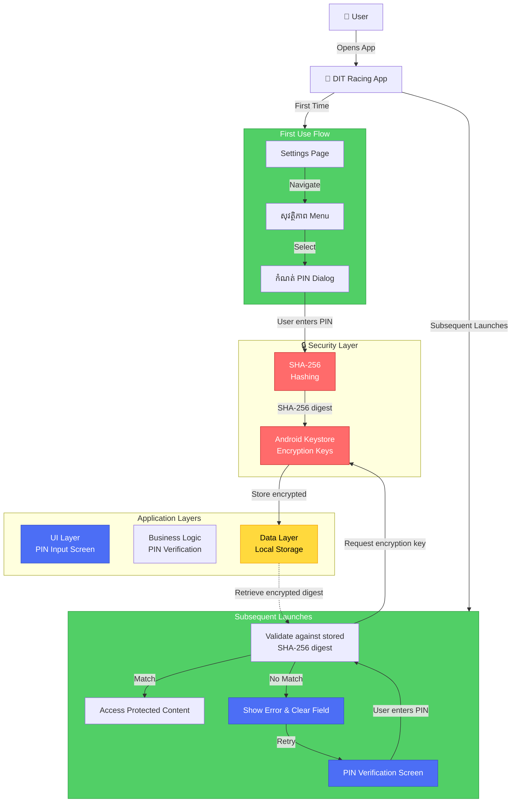

# DIT RACING 2.2 — PIN Security

## User flow
- First use: Settings → សុវត្ថិភាព → កំណត់ PIN.
- On next app launch: PIN screen appears before protected content.
- Settings can change or disable the PIN after current PIN verification.
- Wrong PIN clears the field and shows an error.

## Security
The PIN is not stored as plain text; the app stores a SHA-256 digest.
For stronger protection of sensitive stored data, Android recommends using
the Android Keystore for encryption keys and cryptographic operations.

## Architecture Overview

## System Components

### UI Layer
- **PIN Input Screen**: Secure input field for PIN entry
- **Settings Navigation**: Access security settings
- **Error Display**: Show feedback for incorrect PIN attempts

### Business Logic
- **PIN Verification**: Compare user input against stored digest
- **First-time Setup**: Initialize PIN on first launch
- **Settings Management**: Change or disable PIN with verification

### Data Layer
- **Local Storage**: Persists encrypted PIN digest
- **Encrypted State**: Protects sensitive configuration

### Security Layer
- **SHA-256 Hashing**: One-way cryptographic hash of PIN
- **Android Keystore**: Stores and manages encryption keys securely
  - Hardware-backed when available
  - Prevents key extraction
  - OS-level protection

## Security Flow

1. **Initial PIN Setup**
   - User enters PIN in Settings → សុវត្ថិភាព → កំណត់ PIN
   - PIN is hashed using SHA-256
   - Hash is encrypted using Android Keystore
   - Encrypted digest stored in local storage

2. **PIN Verification on Launch**
   - PIN screen appears before protected content
   - User enters PIN
   - Input is hashed with SHA-256
   - Compare against stored encrypted digest
   - Match → Grant access | No match → Clear field and show error

3. **PIN Management**
   - Changing PIN requires current PIN verification first
   - Disabling PIN requires verification
   - Updates re-hash and re-encrypt using Keystore

## Best Practices Implemented

✅ PIN stored as SHA-256 digest (not plaintext)  
✅ Android Keystore for encryption key management  
✅ Error feedback without exposing sensitive details  
✅ Clear input field on failed attempts  
✅ Secure on-launch verification  
✅ Settings-based management with verification gate
