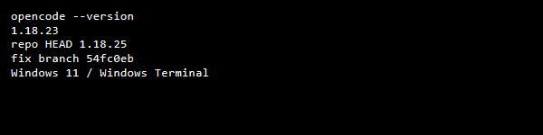

> **AI disclosure:** This issue was drafted with AI assistance and reviewed/edited by a human. Description is short and verified locally.

### Description

Interrupting a session (double-`esc` → `session.abort`) or running `/restart` within ~5s mounts the blocking `DialogWorkspaceUnavailable` (`Session location unavailable — Choose another directory to continue this session`) even though the directory/workspace still exists and will reconnect on its own. Navigating home and back shows it as `connected` again — the chooser abandoned a live session.

Root cause is `packages/tui/src/component/prompt/index.tsx:976`:

```ts
const workspaceStatus = workspaceID ? (project.workspace.status(workspaceID) ?? "error") : undefined
if (workspaceStatus !== "connected") // mounts chooser
```

`?? "error"` treats `undefined` (still syncing after `server.instance.disposed` → `bootstrap()` → `syncWorkspaceLoop`/`connectSSE`) as dead. `!== "connected"` also treats `connecting`/`disconnected` as dead. Both are transient for ~5s (`TIMEOUT=5000` in `control-plane/workspace.ts:437`) while SSE + `syncHistory` retry with backoff. Fix should only block on `error` and `await` the live signal for other states.

### Plugins

none — default TUI

### OpenCode version

```
> opencode --version
1.18.23 (repo HEAD 1.18.25, fix branch 54fc0eb)
Windows 11 / Windows Terminal / pwsh — service via Win32_Process.Create (scripts/restart-opencode.ps1)
```

### Steps to reproduce

1. `opencode ~/.config/opencode` → start session → send prompt
2. double-`esc` to interrupt, then submit within ~3s — OR run `/restart` and submit within ~5s
3. Observe blocking `Session location unavailable` / `Workspace Unavailable` chooser forcing a directory pick

### Screenshot and/or share link


*Top shows `Continuing after restart`, bottom is the blocking chooser.*



### Operating System

Windows 11

### Terminal

Windows Terminal / pwsh
