# OpenCode Architecture Guide

Complete architectural analysis and visual diagrams for understanding the OpenCode project.

## Table of Contents
1. [Project Overview](#project-overview)
2. [High-Level Architecture](#high-level-architecture)
3. [Package Structure](#package-structure)
4. [Core Systems](#core-systems)
5. [Data Flow](#data-flow)
6. [Feature Implementation](#feature-implementation)
7. [Build and Deployment](#build-and-deployment)
8. [How to Use in Your Project](#how-to-use-in-your-project)

---

## Project Overview

**OpenCode** is an open-source AI coding assistant that provides a terminal-based and desktop development environment powered by AI. It's designed as a provider-agnostic alternative to proprietary AI coding tools.

### Key Stats
- **Version**: 1.0.209
- **License**: MIT
- **Language**: TypeScript 5.8.2
- **Runtime**: Bun 1.3.5
- **UI Framework**: SolidJS 1.9.10
- **Supported Providers**: 15+ LLM providers (Anthropic, OpenAI, Google, etc.)

---

## High-Level Architecture

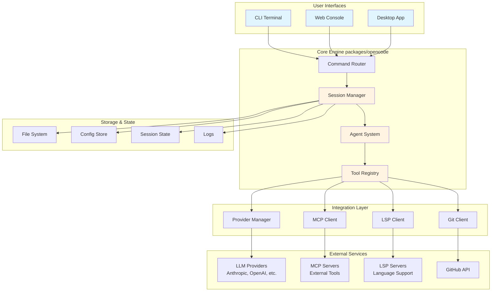

---

## Package Structure

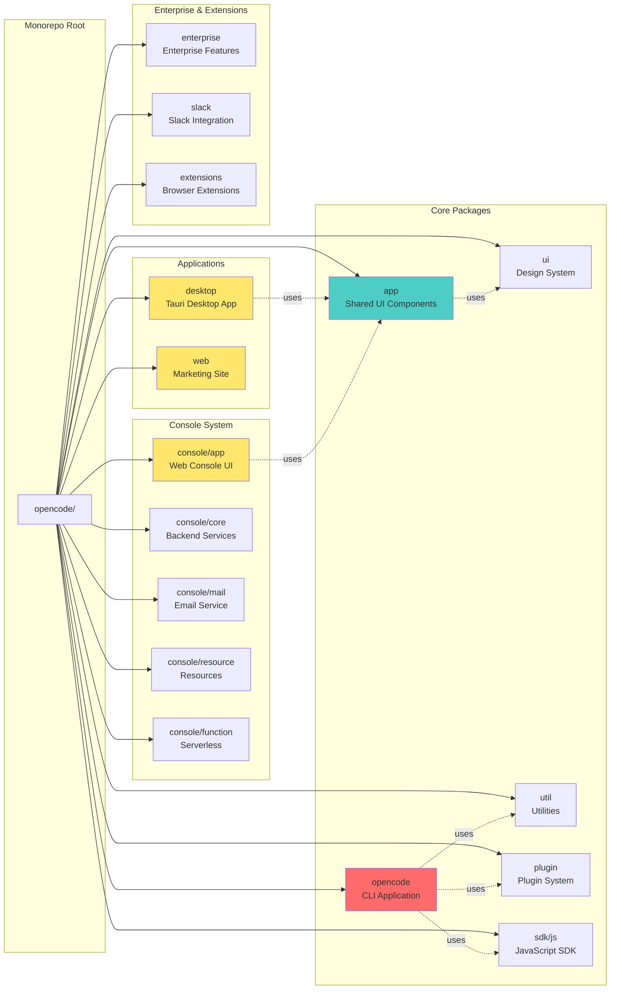

### Package Dependencies

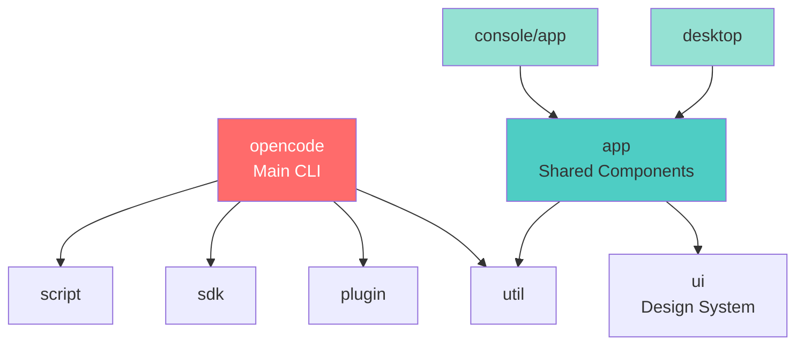

---

## Core Systems

### 1. CLI Command Flow

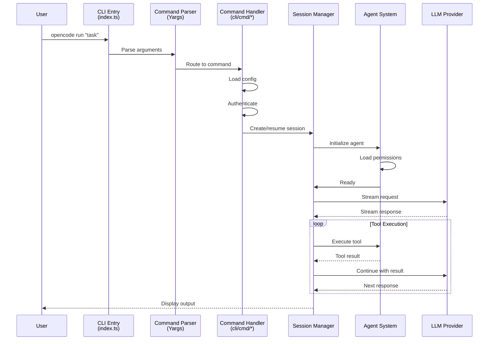

### 2. Session and Agent System

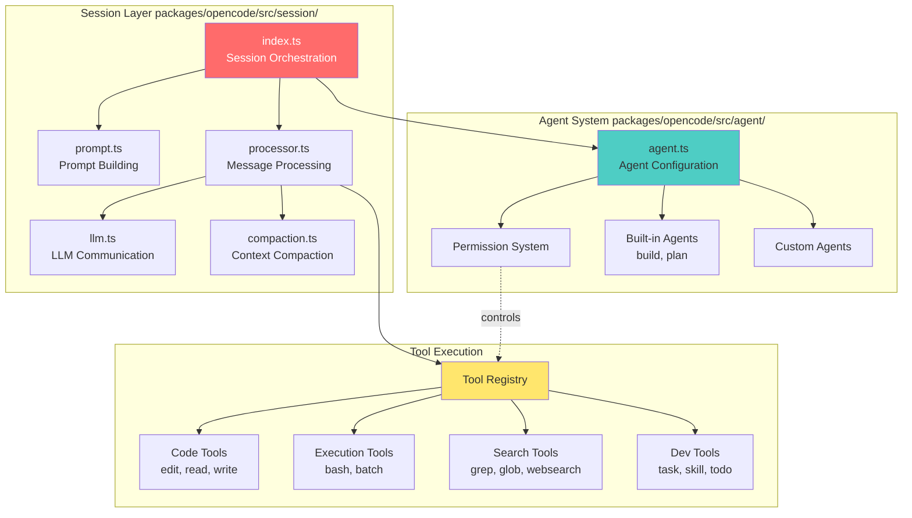

### 3. Tool System Architecture

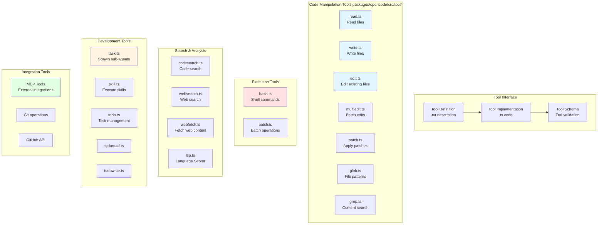

### 4. Provider System

```mermaid
graph TB
    subgraph "Provider Abstraction packages/opencode/src/provider/"
        ProviderInterface[provider.ts<br/>Unified Interface]
        Auth[auth.ts<br/>Authentication]
        Models[models.ts<br/>Model Metadata]
        Transform[transform.ts<br/>I/O Transformation]
    end

    subgraph "Supported Providers"
        Anthropic[Anthropic<br/>Claude]
        OpenAI[OpenAI<br/>GPT-4, GPT-3.5]
        Google[Google<br/>Gemini]
        Vertex[Google Vertex<br/>Enterprise]
        Azure[Azure OpenAI]
        Bedrock[Amazon Bedrock]
        Groq[Groq]
        Mistral[Mistral]
        Cohere[Cohere]
        Cerebras[Cerebras]
        DeepInfra[DeepInfra]
        TogetherAI[Together AI]
        Perplexity[Perplexity]
        XAI[xAI Grok]
        OpenRouter[OpenRouter<br/>Multi-provider]
    end

    subgraph "AI SDK Vercel"
        AISDKCore[AI SDK Core<br/>Streaming, Tools]
    end

    ProviderInterface --> Auth
    ProviderInterface --> Models
    ProviderInterface --> Transform

    ProviderInterface --> AISDKCore

    AISDKCore --> Anthropic
    AISDKCore --> OpenAI
    AISDKCore --> Google
    AISDKCore --> Vertex
    AISDKCore --> Azure
    AISDKCore --> Bedrock
    AISDKCore --> Groq
    AISDKCore --> Mistral
    AISDKCore --> Cohere
    AISDKCore --> Cerebras
    AISDKCore --> DeepInfra
    AISDKCore --> TogetherAI
    AISDKCore --> Perplexity
    AISDKCore --> XAI
    AISDKCore --> OpenRouter

    style ProviderInterface fill:#ff6b6b,color:#fff
    style AISDKCore fill:#4ecdc4
    style Anthropic fill:#e1f5ff
    style OpenAI fill:#e1f5ff
    style Google fill:#e1f5ff
```

### 5. MCP (Model Context Protocol) Integration

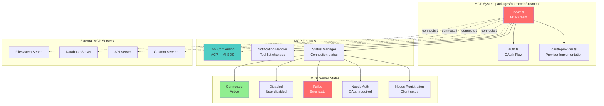

### 6. LSP (Language Server Protocol) Integration

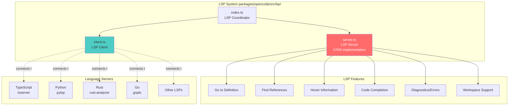

---

## Data Flow

### Complete Request-Response Flow

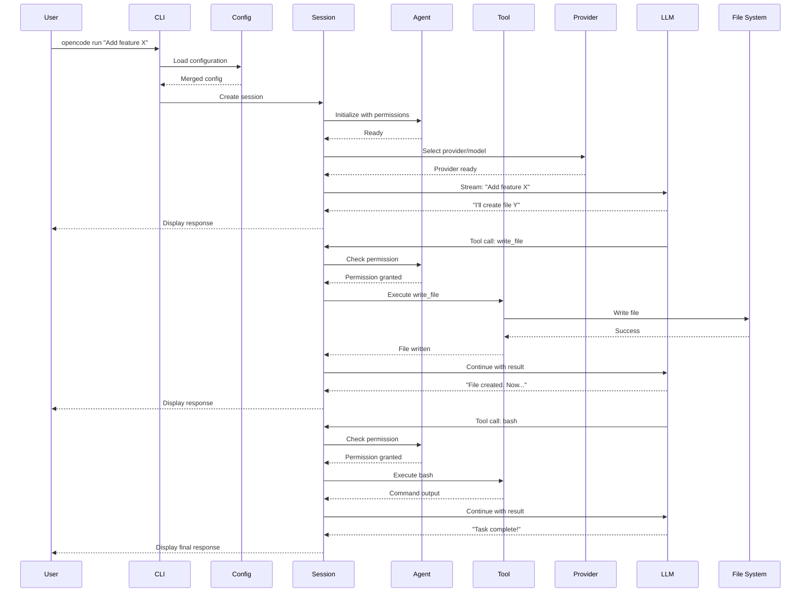

### Configuration Loading Flow

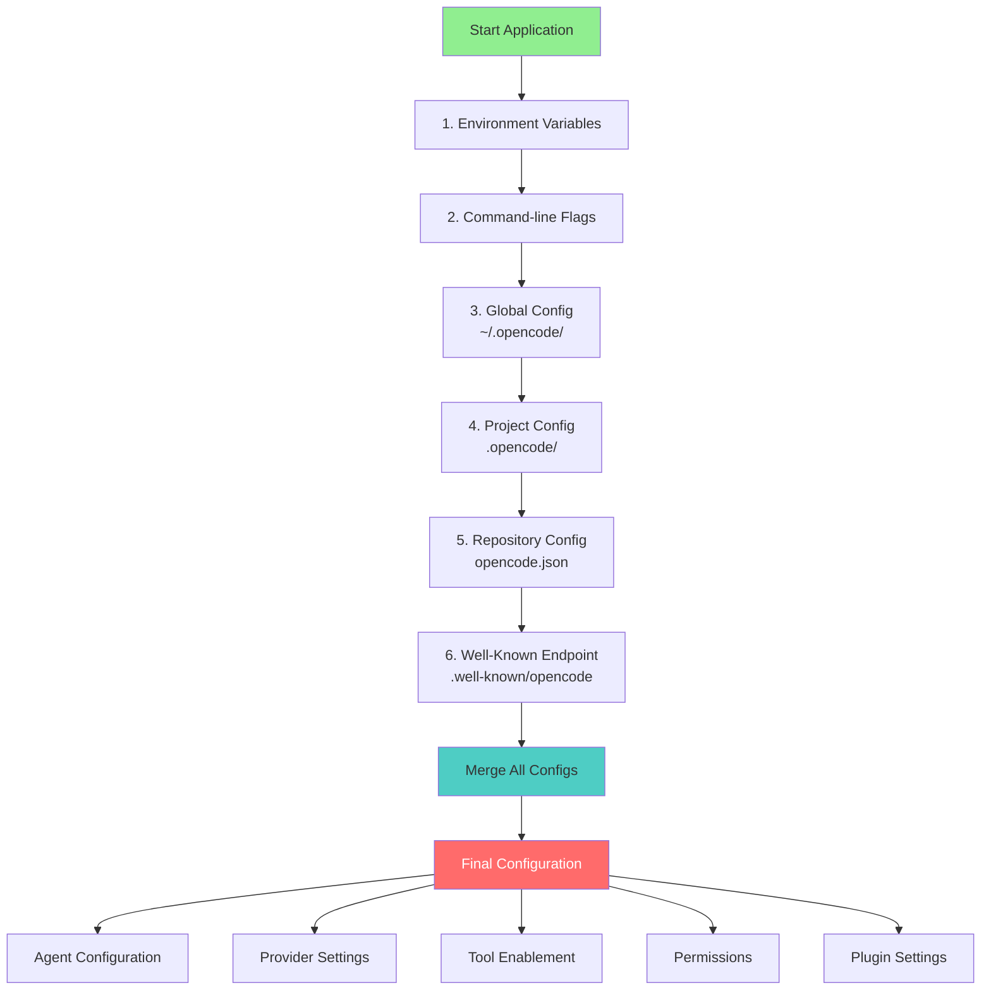

### Tool Execution Permission Flow

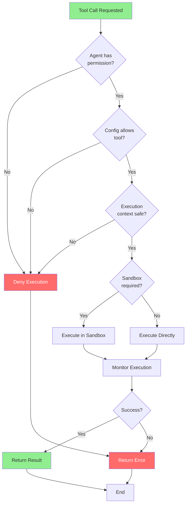

---

## Feature Implementation

### Feature: File Editing

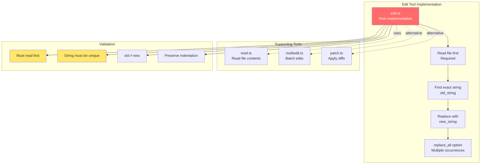

### Feature: Code Search

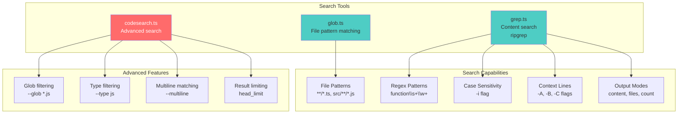

### Feature: Task Management (Subagents)

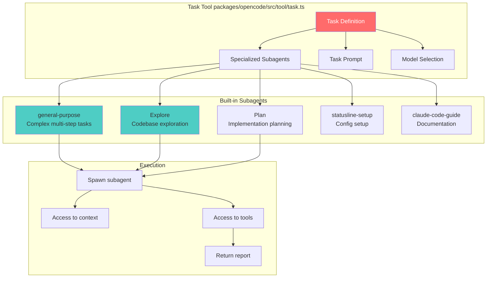

### Feature: GitHub Integration

```mermaid
graph TB
    subgraph "GitHub Commands packages/opencode/src/cli/cmd/"
        GitHubCmd[github.ts<br/>GitHub integration]
        PRCmd[pr.ts<br/>PR management]
    end

    subgraph "Operations"
        CreatePR[Create Pull Request<br/>gh pr create]
        FetchPR[Fetch PR<br/>gh pr view]
        ListPR[List PRs<br/>gh pr list]
        CheckStatus[Check CI status<br/>gh pr checks]
        Comments[PR Comments<br/>gh api]
    end

    subgraph "Git Operations"
        Branch[Branch management]
        Commit[Commit creation]
        Push[Push to remote]
        Diff[View changes]
    end

    subgraph "Integration"
        OctokitREST[@octokit/rest<br/>REST API]
        OctokitGraphQL[@octokit/graphql<br/>GraphQL API]
        CLI[gh CLI tool]
    end

    GitHubCmd --> CreatePR
    GitHubCmd --> FetchPR
    GitHubCmd --> ListPR
    PRCmd --> CheckStatus
    PRCmd --> Comments

    CreatePR --> Branch
    CreatePR --> Commit
    CreatePR --> Push
    CreatePR --> Diff

    GitHubCmd --> OctokitREST
    GitHubCmd --> OctokitGraphQL
    GitHubCmd --> CLI

    style GitHubCmd fill:#ff6b6b,color:#fff
    style CreatePR fill:#4ecdc4
```

---

## Build and Deployment

### Build Process

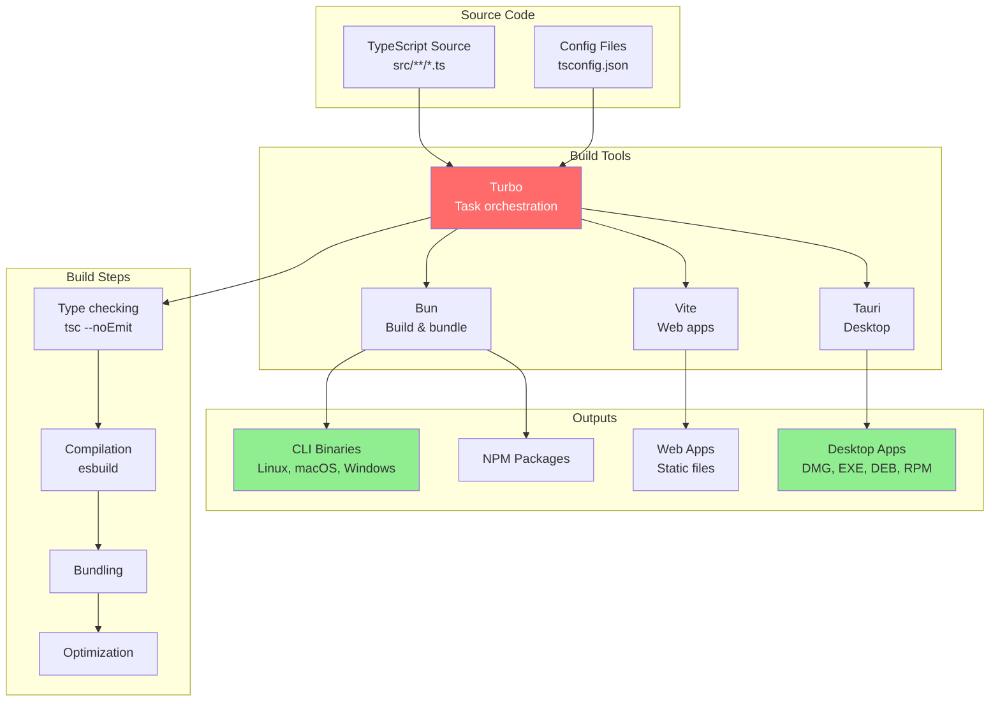

### Deployment Architecture

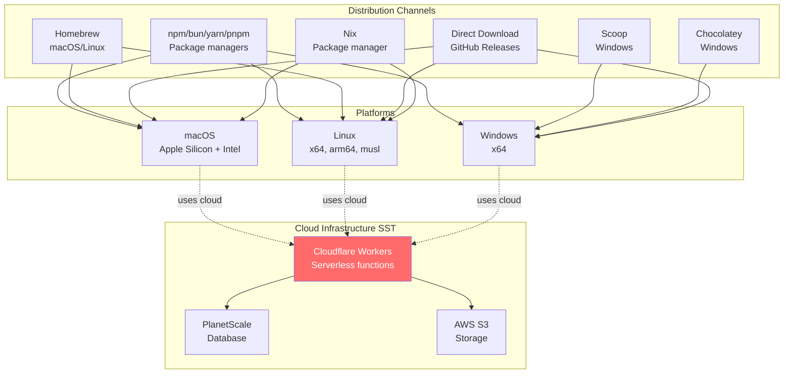

---

## How to Use in Your Chatbot Project

### Integration Strategies

```mermaid
graph TB
    subgraph "Your Chatbot Project"
        YourBot[Your Chatbot]
    end

    subgraph "OpenCode Integration Options"
        Option1[Option 1:<br/>Use as Library]
        Option2[Option 2:<br/>Use CLI as Tool]
        Option3[Option 3:<br/>Fork & Customize]
        Option4[Option 4:<br/>Learn Architecture]
    end

    subgraph "Option 1: Library Integration"
        SDK[@opencode-ai/sdk<br/>JavaScript SDK]
        Provider[Provider System<br/>Multi-LLM support]
        Tools[Tool Implementations<br/>Copy tool patterns]
    end

    subgraph "Option 2: CLI Tool"
        CLITool[opencode CLI<br/>Subprocess]
        API[Spawn & communicate<br/>via stdio]
    end

    subgraph "Option 3: Fork"
        ForkRepo[Fork repository]
        Customize[Customize for needs]
        Maintain[Maintain fork]
    end

    subgraph "Option 4: Learn"
        StudyAgent[Study agent system<br/>agent/agent.ts]
        StudySession[Study session mgmt<br/>session/]
        StudyTools[Study tool system<br/>tool/]
        StudyProvider[Study providers<br/>provider/]
    end

    YourBot --> Option1
    YourBot --> Option2
    YourBot --> Option3
    YourBot --> Option4

    Option1 --> SDK
    Option1 --> Provider
    Option1 --> Tools

    Option2 --> CLITool
    CLITool --> API

    Option3 --> ForkRepo
    ForkRepo --> Customize
    Customize --> Maintain

    Option4 --> StudyAgent
    Option4 --> StudySession
    Option4 --> StudyTools
    Option4 --> StudyProvider

    style YourBot fill:#90ee90
    style Option1 fill:#4ecdc4
    style Option2 fill:#4ecdc4
    style Option3 fill:#ffe66d
    style Option4 fill:#ff6b6b,color:#fff
```

### Key Concepts to Borrow

1. **Agent Permission System** (`packages/opencode/src/agent/agent.ts`)
   - Define agents with specific capabilities
   - Control what each agent can do (edit files, run bash, etc.)
   - Build vs Plan modes

2. **Tool System** (`packages/opencode/src/tool/`)
   - Modular tool architecture
   - Tool descriptions in `.txt` files
   - Tool implementations in `.ts` files
   - Zod schema validation
   - Permission checks before execution

3. **Provider Abstraction** (`packages/opencode/src/provider/`)
   - Support multiple LLM providers
   - Unified interface using AI SDK
   - Easy provider switching
   - Model capability detection

4. **Session Management** (`packages/opencode/src/session/`)
   - Context management and compaction
   - Message history handling
   - Streaming responses
   - State persistence

5. **Configuration System** (`packages/opencode/src/config/`)
   - Hierarchical configuration merging
   - Environment-based overrides
   - Plugin support
   - Well-known endpoints

### Example: Simple Tool Implementation

```typescript
// Example based on OpenCode's tool pattern
import { z } from 'zod'

// 1. Define tool schema
const MyToolSchema = z.object({
  input: z.string().describe('Input to process'),
  options: z.object({
    verbose: z.boolean().optional()
  }).optional()
})

// 2. Implement tool function
async function myTool(params: z.infer<typeof MyToolSchema>) {
  // Tool logic here
  const result = processInput(params.input)

  return {
    success: true,
    data: result
  }
}

// 3. Register with AI SDK format
const tool = {
  description: 'My custom tool description',
  parameters: MyToolSchema,
  execute: myTool
}
```

### Example: Provider Integration Pattern

```typescript
// Example based on OpenCode's provider system
import { createAnthropic } from '@ai-sdk/anthropic'
import { createOpenAI } from '@ai-sdk/openai'

// Multi-provider support like OpenCode
const providers = {
  anthropic: createAnthropic({
    apiKey: process.env.ANTHROPIC_API_KEY
  }),
  openai: createOpenAI({
    apiKey: process.env.OPENAI_API_KEY
  })
}

// Select provider at runtime
const provider = providers[config.provider]
const model = provider(config.model)
```

---

## File Reference Guide

### Essential Files to Study

| File Path | Purpose | Lines | Complexity |
|-----------|---------|-------|------------|
| `packages/opencode/src/index.ts` | CLI entry point | ~400 | Medium |
| `packages/opencode/src/agent/agent.ts` | Agent system core | ~300 | High |
| `packages/opencode/src/session/index.ts` | Session orchestration | ~800 | High |
| `packages/opencode/src/session/llm.ts` | LLM communication | ~500 | High |
| `packages/opencode/src/provider/provider.ts` | Provider abstraction | ~600 | High |
| `packages/opencode/src/tool/*.ts` | Individual tools | ~100-500 each | Medium |
| `packages/opencode/src/mcp/index.ts` | MCP integration | ~400 | High |
| `packages/opencode/src/lsp/server.ts` | LSP server | ~2000 | Very High |
| `packages/opencode/src/config/config.ts` | Configuration system | ~400 | Medium |
| `packages/app/src/pages/session.tsx` | UI session page | ~600 | Medium |

### Directory Map

```
packages/opencode/src/
├── index.ts                    # Entry point
├── agent/                      # Agent system
│   └── agent.ts               # Agent configuration & permissions
├── cli/                       # CLI commands
│   └── cmd/                   # Command implementations
│       ├── run.ts             # Main run command
│       ├── auth.ts            # Authentication
│       ├── mcp.ts             # MCP management
│       └── github.ts          # GitHub integration
├── session/                   # Session management
│   ├── index.ts               # Main orchestration
│   ├── prompt.ts              # Prompt building
│   ├── llm.ts                 # LLM communication
│   ├── processor.ts           # Message processing
│   └── compaction.ts          # Context compaction
├── provider/                  # Provider system
│   ├── provider.ts            # Unified interface
│   ├── auth.ts                # Authentication
│   └── models.ts              # Model metadata
├── tool/                      # Tool implementations
│   ├── edit.ts                # File editing
│   ├── read.ts                # File reading
│   ├── write.ts               # File writing
│   ├── bash.ts                # Shell execution
│   ├── glob.ts                # File globbing
│   ├── grep.ts                # Content search
│   ├── task.ts                # Subagents
│   ├── websearch.ts           # Web search
│   └── todo*.ts               # Task management
├── mcp/                       # Model Context Protocol
│   ├── index.ts               # MCP client
│   └── auth.ts                # OAuth flow
├── lsp/                       # Language Server Protocol
│   ├── index.ts               # Coordinator
│   ├── server.ts              # LSP server
│   └── client.ts              # LSP client
├── config/                    # Configuration
│   └── config.ts              # Config loading & merging
├── project/                   # Project management
├── storage/                   # Storage utilities
└── util/                      # Utilities
```

---

## Summary

OpenCode is a sophisticated, production-ready AI coding assistant built with:

- **Modern Tech Stack**: TypeScript, Bun, SolidJS, Tauri
- **Multi-Platform**: CLI, Web, Desktop
- **Provider-Agnostic**: 15+ LLM providers supported
- **Extensible**: MCP, LSP, Plugin system
- **Enterprise-Ready**: Authentication, billing, team collaboration

### Key Architectural Patterns

1. **Modular Tool System**: Each capability is a separate tool with schema validation
2. **Permission-Based Agent System**: Fine-grained control over agent capabilities
3. **Provider Abstraction**: Easy switching between LLM providers
4. **Session-Based Architecture**: Stateful conversations with context management
5. **Monorepo Structure**: Organized packages for different concerns

### For Your Chatbot Project

- **Borrow**: Tool patterns, provider abstraction, agent permissions
- **Learn**: Session management, context compaction, streaming
- **Integrate**: Use SDK or CLI as subprocess
- **Customize**: Fork and adapt to your specific needs

This guide provides a comprehensive understanding of OpenCode's architecture. Study the referenced files to dive deeper into specific areas of interest!
