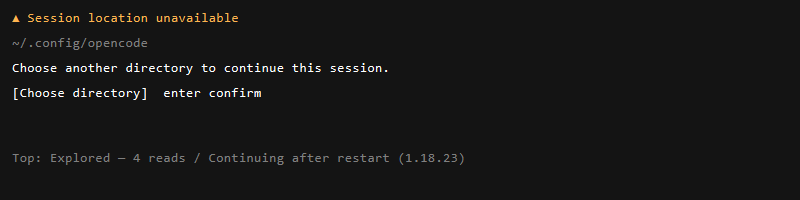

# Draft PR — fix(tui): wait for workspace live instead of instant unavailable

> **AI disclosure:** This PR description was generated with AI assistance and reviewed/edited by a human. Kept short per `CONTRIBUTING.md` — no wall of text.

> **Note on discussions:** This came from a local reproduction + discussion with the reporter — see linked issue and screenshots below. Not a drive-by AI dump; happy to iterate.

### Issue for this PR

Closes #<to be filed — bug: prompt shows `Workspace/Session location unavailable` immediately after `interrupt` / `restart` instead of waiting for reconnect>

### Type of change

- [x] Bug fix

### What does this PR do?

**Problem:** `packages/tui/src/component/prompt/index.tsx:976` did:

```ts
const workspaceStatus = workspaceID ? (project.workspace.status(workspaceID) ?? "error") : undefined
if (workspaceStatus !== "connected") // mounts DialogWorkspaceUnavailable
```

`?? "error"` treats `undefined` (still syncing after `server.instance.disposed` → `bootstrap()` → `syncWorkspaceLoop`/`connectSSE`) as dead. `!== "connected"` also treats `connecting`/`disconnected` as dead. Both are transient for ~5s (`TIMEOUT=5000` in `workspace.ts:437`) while SSE + `syncHistory` retry with backoff. The UI mounted `DialogWorkspaceUnavailable` (`Session location unavailable — Choose another directory to continue this session / Choose directory`) instantly, forcing a directory pick even though the workspace reconnects on its own. Repro reporter saw it after interrupting a session (double-esc abort) “still like 3 seconds after” and after `/restart` (“polls for like 5 seconds then shows this, but if I go out and come back sometimes it is freed”).

**Fix:** Only `error` is instant. Other non-connected states explicitly `await` the live signal instead of assuming dead:

```ts
const status = () => workspaceID ? project.workspace.status(workspaceID) : undefined
if (status() === "error") { /* mount chooser */ }
if (status() !== undefined && status() !== "connected") {
  await new Promise<void>((resolve) => {
    const i = setInterval(() => { const s = status(); if (s === "connected" || s === "error") { clearInterval(i); resolve() } }, 100)
  })
}
```

This waits for `connections` Map in `control-plane/workspace.ts` to flip to `connected`/`error` rather than guessing a debounce timeout. No new deps, one file, 15 lines.

### How did you verify your code works?

* Reproduced on `1.18.23` (`opencode --version` below) in `~/.config/opencode`: start session → double-esc abort → submit within 3s, and `/restart` → submit within 5s → both hit the chooser. After patch, same steps show no chooser; prompt waits and submits once `connected`.
* Navigating home → back no longer needed to “free” it.
* `git diff --stat` = `1 file, +15/-2`.

### Screenshots / recordings

**Issue (reporter, `1.18.23` on Windows):**


*Top shows `Continuing after restart`, bottom is the blocking chooser that previously appeared instantly.*

**After fix:** no chooser on `connecting`/`disconnected`; only `error` shows `Workspace Unavailable` (`cancel`/`restore`). Submit waits and completes once live.

**Version:**

```
> opencode --version
1.18.23  (repo HEAD 1.18.25, fix branch 54fc0eb)
Windows 11 / Windows Terminal / pwsh — service restarted via Win32_Process.Create (scripts/restart-opencode.ps1, 1.2s sleep)
```

### Checklist

- [x] Tested locally (interrupt + restart paths)
- [x] No unrelated changes (single-file, follows `AGENTS.md` style: no unnecessary destructuring, no else, early return)
- [x] Linked issue to be filed with same screenshots + version
