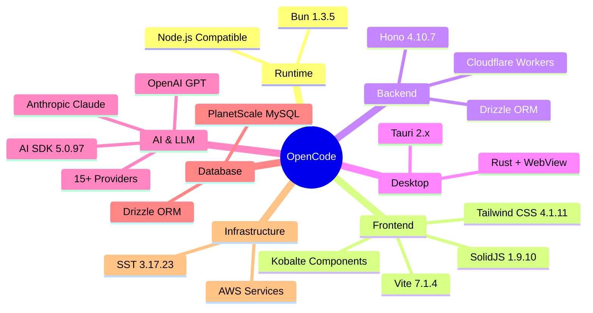

# OpenCode Quick Reference Guide

Fast reference for developers working with or learning from OpenCode.

## Project Stats

| Metric | Value |
|--------|-------|
| **Primary Language** | TypeScript 5.8.2 |
| **Runtime** | Bun 1.3.5 |
| **Version** | 1.0.209 |
| **Repository** | github.com/sst/opencode |
| **License** | MIT |
| **Package Count** | 20+ packages |
| **Supported Platforms** | macOS, Linux, Windows |

## Quick Command Reference

```bash
# Install OpenCode
npm install -g opencode

# Run with a task
opencode run "implement feature X"

# Start web interface
opencode web

# Attach to TUI
opencode tui attach

# Manage agents
opencode agent list
opencode agent switch <agent-name>

# Manage MCP servers
opencode mcp list
opencode mcp add <server-name>

# GitHub integration
opencode github setup
opencode pr create

# Authentication
opencode auth login
opencode auth status

# Development
bun install              # Install dependencies
bun run dev             # Run in development mode
bun run build           # Build project
bun run typecheck       # Type checking
bun test                # Run tests
```

## Directory Structure Cheat Sheet

```
opencode/
├── packages/
│   ├── opencode/          # ⭐ Main CLI (START HERE)
│   │   ├── src/
│   │   │   ├── index.ts            # Entry point
│   │   │   ├── agent/              # Agent system
│   │   │   ├── session/            # Session management
│   │   │   ├── tool/               # Tool implementations
│   │   │   ├── provider/           # LLM providers
│   │   │   ├── mcp/                # MCP integration
│   │   │   ├── lsp/                # LSP integration
│   │   │   ├── config/             # Configuration
│   │   │   └── cli/                # CLI commands
│   │   └── package.json
│   │
│   ├── app/               # 🎨 Shared UI components
│   ├── desktop/           # 🖥️ Tauri desktop app
│   ├── console/           # 🌐 Web console
│   │   ├── app/           # Frontend (SolidJS)
│   │   ├── core/          # Backend (Hono)
│   │   └── function/      # Serverless functions
│   │
│   ├── ui/                # 🎭 Design system
│   ├── sdk/js/            # 📦 JavaScript SDK
│   ├── util/              # 🛠️ Utilities
│   └── plugin/            # 🔌 Plugin system
│
├── infra/                 # ☁️ SST infrastructure
├── sst.config.ts          # Infrastructure config
└── turbo.json             # Monorepo task config
```

## Core Files Quick Reference

### Essential Entry Points

| File | Purpose | Lines | Start Here? |
|------|---------|-------|-------------|
| `packages/opencode/src/index.ts` | CLI entry point | ~400 | ✅ Yes |
| `packages/opencode/src/agent/agent.ts` | Agent configuration | ~300 | ✅ Yes |
| `packages/opencode/src/session/index.ts` | Session orchestration | ~800 | ⭐ Important |
| `packages/app/src/pages/session.tsx` | UI session page | ~600 | 🎨 For UI |

### Tool Implementations

| Tool | File | Purpose |
|------|------|---------|
| **edit** | `src/tool/edit.ts` | Edit existing files |
| **read** | `src/tool/read.ts` | Read file contents |
| **write** | `src/tool/write.ts` | Write new files |
| **bash** | `src/tool/bash.ts` | Execute shell commands |
| **glob** | `src/tool/glob.ts` | File pattern matching |
| **grep** | `src/tool/grep.ts` | Content search (ripgrep) |
| **task** | `src/tool/task.ts` | Spawn sub-agents |
| **websearch** | `src/tool/websearch.ts` | Web search |
| **todo** | `src/tool/todo*.ts` | Task management |

## Technology Stack Map



## Key Concepts

### 1. Agent System

```typescript
// Agent with permissions
{
  "agents": {
    "build": {
      "permissions": {
        "edit": true,      // Can modify files
        "bash": true,      // Can run commands
        "skills": true,    // Can use skills
        "webfetch": true   // Can fetch URLs
      }
    },
    "plan": {
      "permissions": {
        "edit": false,     // Read-only
        "bash": "limited"  // Limited commands
      }
    }
  }
}
```

### 2. Tool Structure

```typescript
// Every tool follows this pattern:
import { z } from 'zod'
import { tool } from 'ai'

// 1. Schema
const Schema = z.object({
  param: z.string()
})

// 2. Implementation
async function impl(params, context) {
  return { result: 'data' }
}

// 3. Export
export const myTool = tool({
  description: 'Tool description',
  parameters: Schema,
  execute: impl
})
```

### 3. Provider Integration

```typescript
// Multi-provider support
import { createAnthropic } from '@ai-sdk/anthropic'
import { createOpenAI } from '@ai-sdk/openai'

const providers = {
  anthropic: createAnthropic({ apiKey }),
  openai: createOpenAI({ apiKey })
}

const model = providers[config.provider](config.model)
```

### 4. Session Flow

```
User Input
  ↓
Command Parser (Yargs)
  ↓
Config Loading (hierarchical merge)
  ↓
Session Manager
  ↓
Agent System (permissions)
  ↓
LLM Provider (streaming)
  ↓
Tool Execution
  ↓
Response Display
```

## Configuration Hierarchy

```
Lowest Priority
    ↓
1. Default values
    ↓
2. Environment variables
    ↓
3. Global config (~/.opencode/)
    ↓
4. Project config (.opencode/)
    ↓
5. Repository config (opencode.json)
    ↓
6. Well-known endpoint (.well-known/opencode)
    ↓
7. Command-line flags
    ↓
Highest Priority
```

## Important Patterns

### Pattern 1: Permission Check

```typescript
async function executeTool(tool, params, context) {
  // Always check permissions first
  if (!context.permissions[tool.name]) {
    throw new Error('Permission denied')
  }

  // Execute tool
  return await tool.execute(params)
}
```

### Pattern 2: Streaming Response

```typescript
import { streamText } from 'ai'

const result = await streamText({
  model,
  messages,
  tools,
  onChunk: ({ chunk }) => {
    // Display chunk immediately
    console.log(chunk.text)
  }
})
```

### Pattern 3: Config Merging

```typescript
function mergeConfig(...configs) {
  return configs.reduce((merged, config) => {
    return deepMerge(merged, config)
  }, {})
}
```

## Common Use Cases

### Use Case 1: Add Custom Tool

1. Create `src/tool/mytool.ts` with schema + implementation
2. Create `src/tool/mytool.txt` with description
3. Register in tool registry
4. Add to agent permissions if needed

### Use Case 2: Add Custom Agent

1. Edit `opencode.json` or `.opencode/config.json`
2. Define agent with permissions and model
3. Switch to agent: `opencode agent switch my-agent`

### Use Case 3: Integrate MCP Server

1. Install MCP server
2. Add to config: `opencode mcp add server-name`
3. Configure server path and arguments
4. Tools automatically available to agents

### Use Case 4: Create Custom Provider

1. Implement provider using AI SDK interface
2. Add to `src/provider/provider.ts`
3. Configure API key and base URL
4. Select in config: `"provider": "my-provider"`

## Debugging Tips

### Enable Verbose Logging

```bash
# Set log level
opencode run --log-level debug "task"

# Environment variable
export OPENCODE_LOG_LEVEL=debug
```

### Inspect Session State

```bash
# Session files stored in:
~/.opencode/sessions/

# View session:
cat ~/.opencode/sessions/<session-id>.json
```

### Check Configuration

```bash
# View merged config
opencode config show

# Validate config
opencode config validate
```

### Debug Tools

```typescript
// Add logging in tools
console.log('Tool params:', params)
console.log('Context:', context)

// Use Bun debugger
import { inspect } from 'util'
console.log(inspect(object, { depth: null, colors: true }))
```

## Performance Tips

1. **Use Virtual Scrolling** for large lists (Virtua)
2. **Lazy Load** heavy modules (dynamic imports)
3. **Stream Responses** for better perceived performance
4. **Cache Aggressively** (with proper invalidation)
5. **Batch Operations** when possible

## Security Checklist

- ✅ Validate all inputs with Zod schemas
- ✅ Check permissions before tool execution
- ✅ Sanitize file paths (prevent directory traversal)
- ✅ Limit bash command execution
- ✅ Rate limit API calls
- ✅ Never log sensitive data (API keys, etc.)
- ✅ Use environment variables for secrets
- ✅ Implement timeouts for long operations

## Package Dependencies

### Core Dependencies

```json
{
  "ai": "5.0.97",                    // AI SDK
  "hono": "4.10.7",                  // Web framework
  "solid-js": "1.9.10",              // UI framework
  "zod": "4.1.8",                    // Schema validation
  "@modelcontextprotocol/sdk": "1.15.1",  // MCP
  "yargs": "18.0.0",                 // CLI parser
  "drizzle-orm": "0.41.0"            // Database ORM
}
```

### AI Provider SDKs

```json
{
  "@ai-sdk/anthropic": "2.0.56",
  "@ai-sdk/openai": "2.0.71",
  "@ai-sdk/google": "2.0.49",
  "@ai-sdk/azure": "2.0.82",
  "@ai-sdk/amazon-bedrock": "3.0.57"
}
```

## Environment Variables

```bash
# LLM Provider API Keys
ANTHROPIC_API_KEY=sk-ant-...
OPENAI_API_KEY=sk-...
GOOGLE_API_KEY=...

# Database
DATABASE_URL=mysql://...

# Configuration
OPENCODE_LOG_LEVEL=info
OPENCODE_CONFIG_PATH=~/.opencode

# Development
NODE_ENV=development
```

## Build Commands

```bash
# Full build
bun run build

# Type check only
bun run typecheck

# Watch mode (development)
bun run dev

# Test
bun test

# Clean build artifacts
bun run clean

# Build specific package
bun run --filter opencode build
```

## Useful Links

- **Repository**: https://github.com/sst/opencode
- **Documentation**: Check `/packages/docs/`
- **Issues**: https://github.com/sst/opencode/issues
- **AI SDK Docs**: https://sdk.vercel.ai/docs
- **MCP Spec**: https://modelcontextprotocol.io
- **SolidJS Docs**: https://www.solidjs.com
- **Bun Docs**: https://bun.sh/docs

## Common Gotchas

1. **Must read file before editing** - Edit tool requires prior Read
2. **Permissions are hierarchical** - Agent > Global > Tool level
3. **Bun-specific APIs** - Some code uses Bun runtime APIs
4. **Context limits** - Monitor token usage, implement compaction
5. **SolidJS reactivity** - Use signals/stores, not direct mutation
6. **Path handling** - Always use absolute paths in tools
7. **Streaming buffering** - Don't forget to flush streams

## Key Metrics

| Metric | Value |
|--------|-------|
| **Packages** | 20+ |
| **Total Dependencies** | 100+ |
| **Supported LLM Providers** | 15+ |
| **Built-in Tools** | 20+ |
| **Supported Platforms** | 3 (macOS, Linux, Windows) |
| **TypeScript Coverage** | ~95% |
| **Build Time** | ~30 seconds (full build) |

---

## Quick Start for Your Chatbot Project

### 1. Install and Explore

```bash
# Clone or install
git clone https://github.com/sst/opencode
cd opencode
bun install

# Explore structure
tree -L 2 packages/opencode/src
```

### 2. Study Key Files

Priority order:
1. `packages/opencode/src/index.ts` - Entry point
2. `packages/opencode/src/agent/agent.ts` - Agent system
3. `packages/opencode/src/tool/` - Tool implementations
4. `packages/opencode/src/provider/provider.ts` - Providers

### 3. Adapt Patterns

Key patterns to borrow:
- ✅ Tool definition pattern (schema + impl)
- ✅ Agent permission system
- ✅ Provider abstraction
- ✅ Session management
- ✅ Streaming responses

### 4. Integrate or Fork

**Option A: Use as Library**
```typescript
import { createSession } from 'opencode'
import { tool } from 'ai'
```

**Option B: Fork and Customize**
```bash
gh repo fork sst/opencode
# Customize for your needs
```

---

**Pro Tip**: Start with the architecture guide, then dive into specific files. Use this quick reference when you need fast lookups!
