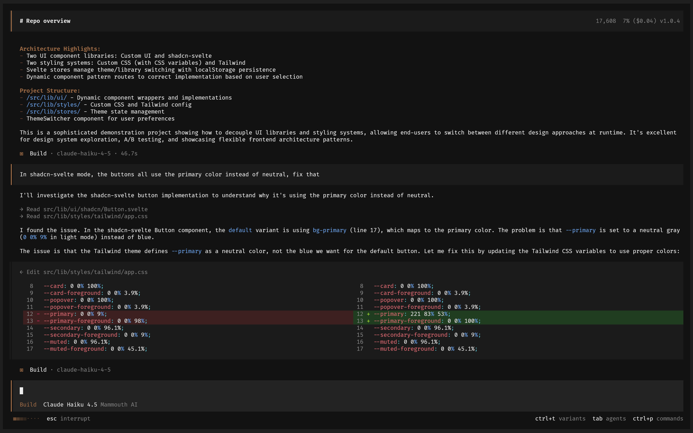

<p align="center">
  <a href="https://opencode.ai">
    <picture>
      <source srcset="packages/console/app/src/asset/logo-ornate-dark.svg" media="(prefers-color-scheme: dark)">
      <source srcset="packages/console/app/src/asset/logo-ornate-light.svg" media="(prefers-color-scheme: light)">
      
    </picture>
  </a>
</p>
<p align="center">ایجنت کدنویسی هوش مصنوعی متن‌باز.</p>
<p align="center">
  <a href="https://opencode.ai/discord"></a>
  <a href="https://www.npmjs.com/package/opencode-ai"></a>
  <a href="https://github.com/anomalyco/opencode/actions/workflows/publish.yml"></a>
</p>

<p align="center">
  <a href="README.md">English</a> |
  <a href="README.zh.md">简体中文</a> |
  <a href="README.zht.md">繁體中文</a> |
  <a href="README.ko.md">한국어</a> |
  <a href="README.de.md">Deutsch</a> |
  <a href="README.es.md">Español</a> |
  <a href="README.fr.md">Français</a> |
  <a href="README.it.md">Italiano</a> |
  <a href="README.da.md">Dansk</a> |
  <a href="README.ja.md">日本語</a> |
  <a href="README.pl.md">Polski</a> |
  <a href="README.ru.md">Русский</a> |
  <a href="README.bs.md">Bosanski</a> |
  <a href="README.ar.md">العربية</a> |
  <a href="README.no.md">Norsk</a> |
  <a href="README.br.md">Português (Brasil)</a> |
  <a href="README.th.md">ไทย</a> |
  <a href="README.tr.md">Türkçe</a> |
  <a href="README.uk.md">Українська</a> |
  <a href="README.bn.md">বাংলা</a> |
  <a href="README.gr.md">Ελληνικά</a> |
  <a href="README.vi.md">Tiếng Việt</a> |
  <a href="README.fa.md">فارسی</a>
</p>

[](https://opencode.ai)

---

### نصب

```bash
# سریع و ساده
curl -fsSL https://opencode.ai/install | bash

# پکیج منیجر ها
npm i -g opencode-ai@latest        # یا bun/pnpm/yarn
scoop install opencode             # Windows
choco install opencode             # Windows
brew install anomalyco/tap/opencode # macOS و لینوکس (پیشنهادی، همیشه به‌روز)
brew install opencode              # macOS and Linux (official brew formula, updated less)
sudo pacman -S opencode            # Arch Linux (نسخه پایدار)
paru -S opencode-bin               # Arch Linux (آخرین نسخه از AUR)
mise use -g opencode               # هر سیستم‌عاملی
nix run nixpkgs#opencode           # یا github:anomalyco/opencode برای آخرین نسخه dev
```

> [!TIP]
> قبل از نصب، نسخه‌های قدیمی‌تر از ۰.۱.x را حذف کنید.

### اپلیکیشن دسکتاپ (بتا)

OpenCode به‌صورت اپلیکیشن دسکتاپ هم در دسترس است. می‌توانید آن را مستقیماً از [صفحه releases](https://github.com/anomalyco/opencode/releases) یا [opencode.ai/download](https://opencode.ai/download) دانلود کنید.

| پلتفرم                    | دانلود                             |
| ------------------------- | ---------------------------------- |
| macOS (Apple Silicon)     | `opencode-desktop-mac-arm64.dmg`   |
| macOS (Intel)             | `opencode-desktop-mac-x64.dmg`     |
| ویندوز                    | `opencode-desktop-windows-x64.exe` |
| لینوکس                    | `.deb`، `.rpm` یا `.AppImage`      |

```bash
# macOS (Homebrew)
brew install --cask opencode-desktop
# ویندوز (Scoop)
scoop bucket add extras; scoop install extras/opencode-desktop
```

#### مسیر نصب

اسکریپت نصب برای انتخاب مسیر نصب، ترتیب اولویت زیر را رعایت می‌کند:

1. `$OPENCODE_INSTALL_DIR` — مسیر سفارشی
2. `$XDG_BIN_DIR` — مسیر سازگار با مشخصات XDG Base Directory
3. `$HOME/bin` — مسیر استاندارد باینری کاربر (اگر وجود داشته باشد یا قابل ساخت باشد)
4. `$HOME/.opencode/bin` — مسیر پیش‌فرض

```bash
# نمونه‌ها
OPENCODE_INSTALL_DIR=/usr/local/bin curl -fsSL https://opencode.ai/install | bash
XDG_BIN_DIR=$HOME/.local/bin curl -fsSL https://opencode.ai/install | bash
```

### ایجنت‌ها

OpenCode دو ایجنت توکار دارد که می‌توانید با کلید `Tab` بین آن‌ها جابه‌جا شوید:

- **build** — ایجنت پیش‌فرض با دسترسی کامل، مناسب برای توسعه
- **plan** — ایجنت فقط‌خواندنی برای تحلیل و بررسی کد
  - به‌صورت پیش‌فرض ویرایش فایل را رد می‌کند
  - قبل از اجرای دستورات bash اجازه می‌گیرد
  - ایده‌آل برای بررسی کدبیس‌های ناآشنا یا برنامه‌ریزی تغییرات

همچنین یک ساب‌ایجنت **general** برای جست‌وجوهای پیچیده و وظایف چندمرحله‌ای وجود دارد که به‌صورت داخلی استفاده می‌شود و می‌توانید با `@general` در پیام‌ها آن را فراخوانی کنید.

برای اطلاعات بیشتر درباره [ایجنت‌ها](https://opencode.ai/docs/agents) مستندات را بخوانید.

### مستندات

برای آشنایی با نحوه پیکربندی OpenCode، [**به مستندات ما مراجعه کنید**](https://opencode.ai/docs).

### مشارکت در توسعه

اگر علاقه‌مند به مشارکت در OpenCode هستید، لطفاً قبل از ارسال pull request، [راهنمای مشارکت](./CONTRIBUTING.md) را بخوانید.

### ساخت روی OpenCode

اگر روی پروژه‌ای کار می‌کنید که با OpenCode مرتبط است و از کلمه «opencode» در نامش استفاده می‌کند — مثلاً «opencode-dashboard» یا «opencode-mobile» — لطفاً در README خود توضیح دهید که این پروژه توسط تیم OpenCode ساخته نشده و هیچ وابستگی‌ای به ما ندارد.

---

**به جامعه ما بپیوندید:** [Discord](https://discord.gg/opencode) | [X.com](https://x.com/opencode)
