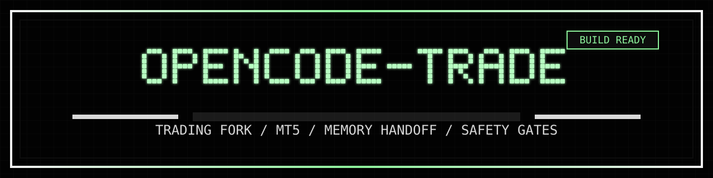

<p align="center">
  
</p>
<p align="center">MT5 実行、memory handoff、安全ゲート付き戦略反復を扱う OpenCode 派生 fork。</p>
<p align="center">
  
  
  <a href="https://github.com/TakeshiSawaguchi/opencode-trade/actions/workflows/test.yml?query=branch%3Adev"></a>
  <a href="https://github.com/TakeshiSawaguchi/opencode-trade/actions/workflows/typecheck.yml?query=branch%3Adev"></a>
  <a href="https://github.com/TakeshiSawaguchi/opencode-trade/blob/main/LICENSE"></a>
  
</p>

# opencode-trade

`opencode-trade` は、OpenCode のコードベースを土台にしつつ、MQL5 による売買実装、研究メモ、バックテスト計画、運用ルールを統合した取引向け派生プロジェクトです。

この `README.ja.md` は upstream OpenCode の紹介文ではなく、この fork 固有の目的と運用方法を説明するためのものです。

## このリポジトリが何か

このリポジトリは大きく2層でできています。

- `packages/` などに残っている upstream OpenCode のアプリケーション基盤
- `src/`、`backtest/`、およびルート文書群にある `opencode-trade` 固有の取引実装と運用知識

目的は、モジュール化された EA を前提に、研究、実装、レビュー、バックテスト、昇格判断を分離しながら、厳格なリスク管理の下で反復改善を回せる状態を作ることです。

## プロジェクト目標

- 明示的なドローダウン制限を持つ MQL5 売買基盤を維持する
- 戦略を独立モジュール化し、追加、停止、差し替えを容易にする
- リサーチ、実装、レビュー、検証を役割分離する
- ONNX 系モデルは候補として扱い、未検証のまま本番判断に混入させない

## システム概要

取引ロジックの主な構成は次のとおりです。

- `src/Expert_Main.mq5`
  - EA のメインエントリ
- `src/Include/TradeLogic.mqh`
  - Breakout、Pullback、ML 系シグナルの実装
- `src/Include/RiskManagement.mqh`
  - ロット計算、DD 制限、注文実行ラッパー
- `src/Include/DataFeed.mqh`
  - データ出力とローカル連携補助
- `src/Scripts/data_collector.py`
  - Dukascopy 履歴データ取得補助
- `backtest/test_scenarios.json`
  - バックテスト用シナリオ定義

現行文書上の主軸は以下です。

- `XAUUSD` breakout を主要な検証路線として扱う
- `SP500` pullback を独立戦略トラックとして扱う
- ONNX は検証済み候補のみを段階的に使う

## リポジトリ構成

- `src/`
  - MQL5 EA 本体と Python 補助スクリプト
- `backtest/`
  - テストシナリオとバックテスト関連入力
- `AGENTS.md`
  - エージェント役割、受け渡し、禁止事項
- `SOUL.md`
  - 哲学、制約、重要判断
- `ARCHITECTURE.md`
  - MQL5 構成と 3 ノードのデータフロー
- `DEVELOPMENT.md`
  - 環境構築と実行フロー例
- `AUDIT_AND_STRATEGY.md`
  - 監査結果と技術判断
- `FINAL_IMPLEMENTATION_PLAN.md`
  - 実装フェーズと検証ゲート
- `packages/`
  - upstream OpenCode 側のアプリとライブラリ群

## 運用モデル

現行の前提は 3 ノード構成です。

- `wag-air`
  - 司令塔、文書管理、進行管理、統合判断
- `wag-x870e`
  - 履歴データ収集、Python 処理、研究補助
- `wag-dell`
  - MT5 実行環境、EA 配置、バックテスト実行

この分離は重要です。研究、実装、MT5 実行が同一マシンで完結する前提ではありません。

## 操作方法の概略

普段の流れは次です。

1. 仮説を定義する
2. `RESEARCH.md` や外部調査で事例を集める
3. `src/` の MQL5 または Python を更新する
4. リスク管理と執行ロジックをレビューする
5. `wag-dell` 側でバックテストを回す
6. 結果を評価して採用、修正、却下を決める

自律的に AI がコードを書いて、そのまま本番へ自動昇格する運用は採りません。
このプロジェクトは、AI を仮説生成、実装補助、解析補助に使い、人間が最終判断を行う前提です。

## セットアップと実行の入口

OpenCode ワークスペース自体の依存導入と起動は次です。

```bash
bun install
bun run dev
```

ただし、`opencode-trade` の実務上の入口は README 単体では足りません。最初に見るべきなのは次です。

- [DEVELOPMENT.md](./DEVELOPMENT.md)
- [ARCHITECTURE.md](./ARCHITECTURE.md)
- [SOUL.md](./SOUL.md)

既存文書にはすでに次の情報があります。

- Mac 側の clone と作業ディレクトリ作成
- Ubuntu 側の履歴データ保存先準備
- Windows 側の MT5 Expert 配置先
- ONNX bridge 用 Python 環境の準備

## まずどこを見ればよいか

- [AGENTS.md](./AGENTS.md)
  - 誰が何を担当し、どこまでを禁忌とするか
- [SOUL.md](./SOUL.md)
  - 何を優先し、何を危険とみなすか
- [ARCHITECTURE.md](./ARCHITECTURE.md)
  - EA 構成とデータの流れ
- [DEVELOPMENT.md](./DEVELOPMENT.md)
  - 作業開始手順と実行例
- [EA_TRADING_PLAN.md](./EA_TRADING_PLAN.md)
  - 現行の canonical trading plan、検証ゲート、実装順序
- [SENTINEL_BREAKOUT_IMPLEMENTATION_PLAN.md](./SENTINEL_BREAKOUT_IMPLEMENTATION_PLAN.md)
  - SentinelBreakout 専用の設計方針と phase 計画
- [AUDIT_AND_STRATEGY.md](./AUDIT_AND_STRATEGY.md)
  - 却下した案と採用した方針
- [FINAL_IMPLEMENTATION_PLAN.md](./FINAL_IMPLEMENTATION_PLAN.md)
  - 旧計画の参照履歴

## 重要な注意

- このリポジトリは upstream OpenCode の公式 README ではありません。
- ここにある戦略記述は研究・検証中の工学成果物として扱うべきで、収益性の保証ではありません。
- ONNX 候補は検証ゲートを通過するまで本番判断に使ってはいけません。
- シグナルよりリスク管理を優先します。

## この fork の独自拡張

このリポジトリには、trade 専用 README に加えて、upstream OpenCode にはない独自拡張も含まれています。大きな柱は `プロジェクト記憶の handoff` と `MT5 / EA の safety validation` です。

### Trade Memory Service

記憶システム本体は OpenCode core の外側に置かれており、upstream の session engine を直接改造しない構成です。

- canonical な外部 SQLite memory DB: `memory.sqlite3`
- `opencode.db` からの read-only sync
- user message と assistant final text に対する exact FTS search
- `memory_type`、`status`、`importance`、`scope`、source link を持つ curated memory note
- handoff に必須注入する note の pin 管理
- searchable memory 化の前に secret redaction を実施
- `sync_run`、stale reconciliation、source signature check による同期監査
- semantic search 用 surface はあるが、現状は別設定なしでは disabled を返す

実装ファイル:

- `.opencode/trade-memory-core/schema.ts`
- `.opencode/trade-memory-core/sync.ts`
- `.opencode/trade-memory-core/search.ts`
- `.opencode/trade-memory-core/notes.ts`
- `.opencode/mcp/service.ts`
- `.opencode/mcp/trade-memory-server.ts`

### EA Lab Memory System

この fork には、MT5 EA の研究・実装・検証を証跡ベースで進めるための **EA Lab Memory System - Phase 1: Memory Foundations** が含まれます。

Phase 1 は OpenCode core を変更せず、repo-local な EA Lab 専用構造化記憶基盤を追加します。

- `.opencode/ea-lab-core` 配下の SQLite schema と schema health check
- 検索可能な研究メモを保存する前の redaction
- backtest、log、commit、URL、message、manual note を結び付ける evidence record
- 仮説、テスト条件、metrics、stage、結果を残す experiment ledger
- 成功、失敗、near miss、棄却理由を再利用可能にする experience memory
- SQLite FTS による deterministic similar-experience search
- `risk/gates.yaml` を正とする conservative risk gate parsing / check
- `.opencode/mcp/ea-lab-*` の repo-local MCP / HTTP entrypoint

`trade-memory` は会話履歴、handoff、作業文脈を保持します。EA Lab Memory は、トレード検証証跡、実験判断、リスク制約を扱う新しい構造化レイヤーです。Phase 1 では意図的に分離し、handoff 注入や model-switch 連携へ進む前に単体で検証できる形にしています。

Phase 1 では **live trading の有効化、lot size の自動増加、risk gate の緩和、MT5 order execution、Context7 統合、wiki 自動化、全 OpenCode session への自動注入** は行いません。

詳細は [EA Lab Memory Foundations](./docs/ea-lab-memory-foundations.md) を参照してください。

### Memory Handoff Bridge

モデル切替時に重要なプロジェクト状態が黙って失われないよう、thin plugin bridge を追加しています。

- `session.next.model.switched` を監視
- session / model ごとの pending handoff state を記録
- 有効時は local memory service を autostart 可能
- `experimental.chat.system.transform` へ bounded handoff block を注入
- `experimental.session.compacting` でも同じ handoff 経路を再利用
- memory が stale / unavailable のときは warning を注入
- 条件一致する acknowledgement が返ったときだけ pending handoff state を消す

実装ファイル:

- `.opencode/plugins/trade-handoff-bridge.ts`
- `MEMORY_HANDOFF_ARCHITECTURE.md`

### 組み込み Trade Memory Tools と MCP surface

この fork では、memory system を 2 つの経路で公開しています。1 つは OpenCode 内部向け plugin tools、もう 1 つは外部 client 向けの MCP / HTTP service です。

plugin tools の主なもの:

- `sync_trade_memory`
- `search_trade_conversations`
- `open_trade_conversation_source`
- `store_trade_memory_note`
- `update_trade_memory_note_status`
- `search_trade_memory_notes`
- `render_trade_oracle_note`

MCP / HTTP service 側では、これに加えて health / handoff / pin / note management を公開しています。例:

- `trade_memory_health`
- `trade_memory_sync`
- `trade_memory_get_handoff_context`
- `trade_memory_model_switched`
- `trade_memory_pin_note`
- `trade_memory_list_pins`

### MT5 / EA Safety Validation Toolkit

この fork には、MT5 Expert Advisor の safety work を進めるための trading-oriented validation stack も入っています。狙いは、strategy logic、execution check、audit evidence を明確に分離することです。

- `BrokerSymbolProfile.mqh` による broker / symbol metadata 取得と fail-close validation
- `TradeExecutor.mqh` による execution preflight:
  - price normalization
  - stop / freeze distance validation
  - spread guard
  - margin guard
  - filling mode resolution
  - skip reason logging
- `RiskManagement.mqh` を safety-first の risk boundary として利用
- `Expert_Main.mq5` は orchestration に限定
- MT5 parser gate: `src/Scripts/analyze_mt5_report.py`
- regression test: `src/Scripts/tests/test_analyze_mt5_report.py`
- backtest gate scenario: `backtest/gate_config.json`
- runbook / audit plan:
  - `EA_TRADING_PLAN.md`
  - `SENTINEL_BREAKOUT_IMPLEMENTATION_PLAN.md`
  - `REMOTE_MT5_COMPILE_SMOKE_RUNBOOK.md`
  - `STRICT_REMEDIATION_PLAN.md`

現在の設計意図:

- 新戦略 rollout より先に execution hygiene を検証する
- parser ベースの pass / fail evidence を第一級の成果物として扱う
- strategy module から直接 order を送らない
- remote compile / smoke 手順と strategy 設計を分離して管理する
