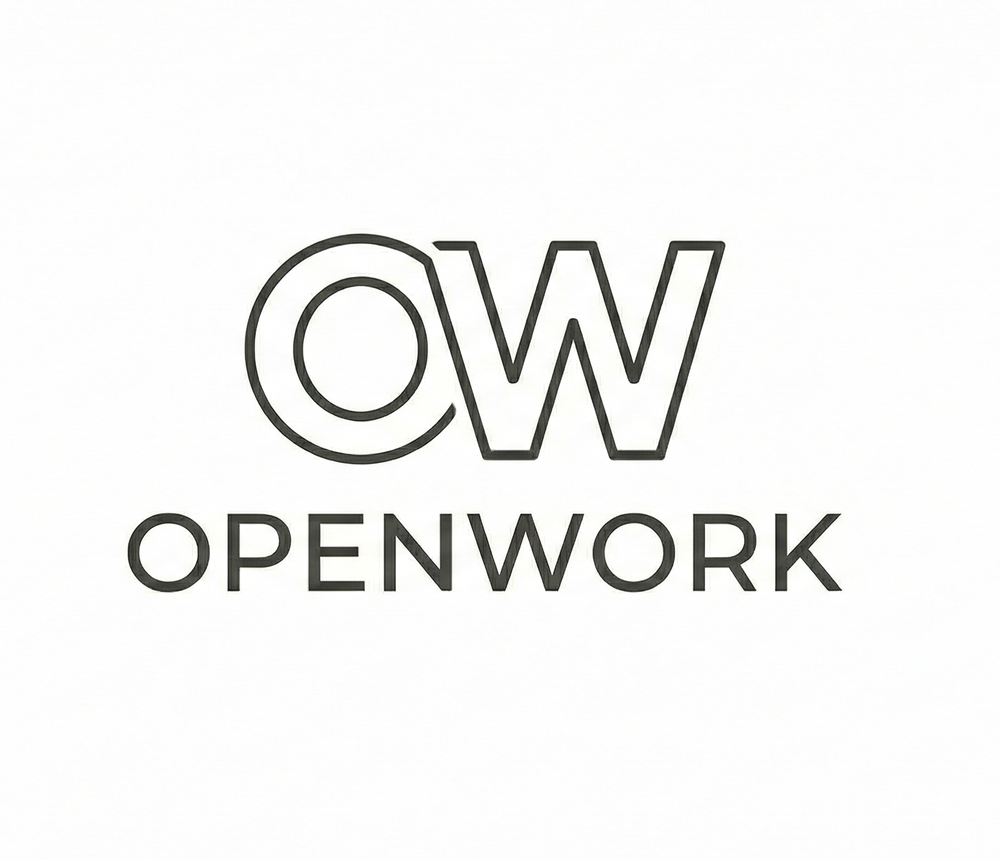

  

AI-powered workspace collaboration for knowledge workers.

  
  
  

---

## About OpenWork

**OpenWork** is an enhanced fork of [OpenCode](https://github.com/anomalyco/opencode), specifically designed for workspace and file collaboration among knowledge workers. While OpenCode focuses on AI-powered coding assistance, OpenWork extends these capabilities to support collaborative workflows across various file types and workspace environments.

### Key Features

- **Workspace Collaboration** - Real-time file sharing and collaboration across teams
- **Multi-File Support** - Works seamlessly with documents, spreadsheets, presentations, and code files
- **AI-Powered Assistance** - Built on OpenCode's robust AI agent architecture
- **File Activity Tracking** - Monitor changes and edits across your workspace
- **Desktop & Web** - Available as both desktop application and web interface

### Desktop App

OpenWork is available as a desktop application for seamless integration with your local workspace.

| Platform              | Download                               |
| --------------------- | -------------------------------------- |
| macOS (Apple Silicon) | `openwork-desktop-darwin-aarch64.dmg`  |
| macOS (Intel)         | `openwork-desktop-darwin-x64.dmg`      |
| Windows               | `openwork-desktop-windows-x64.exe`     |
| Linux                 | `.deb`, `.rpm`, or AppImage            |

### Built on OpenCode

OpenWork inherits all the powerful features from OpenCode:

- **AI Agents** - Multiple specialized agents for different tasks
- **Client/Server Architecture** - Run on your computer, access remotely
- **Provider Agnostic** - Works with Claude, OpenAI, Google, or local models
- **LSP Support** - Built-in Language Server Protocol support
- **Terminal & GUI** - Choose your preferred interface

### How OpenWork Differs from OpenCode

While OpenCode is optimized for developers and coding workflows, OpenWork is designed for:

- **Knowledge Workers** - Writers, analysts, researchers, and collaborative teams
- **Document Collaboration** - Markdown, PDFs, spreadsheets, and presentations
- **Workspace Management** - Organized file structures and project hierarchies
- **Team Workflows** - Multi-user collaboration and file sharing capabilities

### Getting Started

OpenWork maintains compatibility with OpenCode's architecture while adding collaboration-focused features. See the [OpenCode documentation](https://opencode.ai/docs) for core functionality, with OpenWork-specific features documented in the `/specs` directory.

### Contributing

If you're interested in contributing to OpenWork, please read our [contributing docs](./CONTRIBUTING.md) before submitting a pull request.

---

**Based on OpenCode** - Learn more about the underlying technology at [opencode.ai](https://opencode.ai)
