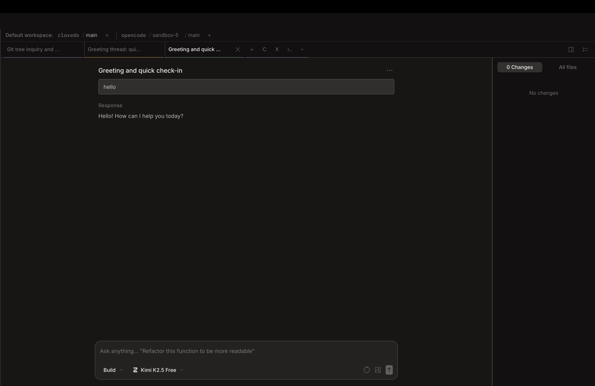

<h1 align="center">Claxedo</h1>
<p align="center">A clean fork of <a href="https://github.com/anomalyco/opencode">OpenCode Desktop</a> for running many agents at once.</p>

<p align="center">
  
</p>

---

## Why Claxedo?

- **Workspace tabs** — a horizontal tab bar lets you switch between sessions and terminals for quick access and a familiar, productive UX.
- **Run agents in parallel** — spin up 10s of agents (Claude Code, Codex, Amp, Pi, any CLI agent) across tabs and let them work simultaneously.
- **Multi-panel split** (`Cmd+\`) — view and work on multiple tabs side by side.
- **Any project, any worktree, one workspace** — open any directory or worktree as a tab. Projects and worktrees are nicely grouped.
- **Worktree management** — create, switch, and delete git worktrees without opening any sidebar. Filter by worktree.
- **Compact sidebar** — maximizes screen real estate for code and terminal output.
- **Tab notifications** — know when an agent finishes without watching it. Tab titles update when work completes.
- **Power buttons** — configurable buttons in the tab bar to directly spawn an agent with preconfigured options.
- **Stays in sync with OpenCode** — upstream changes are merged regularly. Claxedo extends, it doesn't diverge.

## Getting Started

### Prerequisites

- [Bun](https://bun.sh) >= 1.3
- [Rust](https://rustup.rs) (for desktop builds)

### Development

```bash
# Install dependencies
bun install

# Start the app in dev mode
cd packages/claxedo-app && bun run desktop:dev
```

### Building

```bash
# Desktop build (unsigned, for local testing)
cd packages/claxedo-app && bun run desktop:build
```

### Download

Download the latest release from [GitHub Releases](https://github.com/kyashrathore/Claxedo/releases/latest).

| Platform              | Download                                                                                                                      |
| --------------------- | ----------------------------------------------------------------------------------------------------------------------------- |
| macOS (Apple Silicon) | [`Claxedo_0.0.2_aarch64.dmg`](https://github.com/kyashrathore/Claxedo/releases/latest/download/Claxedo_0.0.2_aarch64.dmg)     |
| macOS (Intel)         | [`Claxedo_0.0.2_x64.dmg`](https://github.com/kyashrathore/Claxedo/releases/latest/download/Claxedo_0.0.2_x64.dmg)             |
| Windows               | [`Claxedo_0.0.2_x64-setup.exe`](https://github.com/kyashrathore/Claxedo/releases/latest/download/Claxedo_0.0.2_x64-setup.exe) |
| Linux (Debian/Ubuntu) | [`Claxedo_0.0.2_amd64.deb`](https://github.com/kyashrathore/Claxedo/releases/latest/download/Claxedo_0.0.2_amd64.deb)         |
| Linux (Fedora/RHEL)   | [`Claxedo-0.0.2-1.x86_64.rpm`](https://github.com/kyashrathore/Claxedo/releases/latest/download/Claxedo-0.0.2-1.x86_64.rpm)   |

## How It Works

Claxedo is built on top of OpenCode using a file-based override system:

- `@/` resolves to `src/overrides/*` first, then falls back to upstream `packages/app/src/*`
- Only the files that need to change are overridden — everything else comes from upstream
- This keeps merges clean and makes it easy to stay current with OpenCode

```
packages/
├── claxedo-app/          # Overrides + extensions
│   └── src/overrides/    # File-level overrides of upstream UI
├── app/                  # Upstream OpenCode UI (SolidJS)
├── desktop/              # Tauri desktop shell (Rust)
├── opencode/             # CLI & sidecar server
└── ui/                   # Shared UI components
```

## Releasing

Releases are automated via GitHub Actions.

```bash
cd packages/claxedo-app

# Create a release
bun ./scripts/release.ts patch   # 1.1.0 → 1.1.1
bun ./scripts/release.ts minor   # 1.1.0 → 1.2.0

# Push to trigger CI
git push && git push --tags
```

See [RELEASING.md](packages/claxedo-app/RELEASING.md) for details.

## Contributing

See [CONTRIBUTING.md](CONTRIBUTING.md) for guidelines. The key rule: keep Claxedo changes in overrides so upstream syncs stay clean.

## Tech Stack

- **UI:** SolidJS, Vite, Tailwind CSS
- **Desktop:** Tauri (Rust + WebView)
- **CLI:** OpenCode sidecar (Bun)
- **Build:** Turborepo, Bun workspaces
