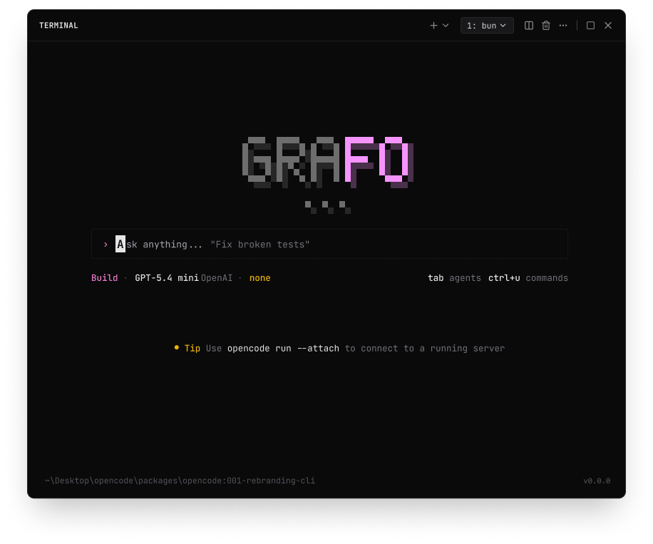

<p align="center">
  <a href="https://opencode.ai">
    <picture>
      <source srcset="packages/console/app/src/asset/logo-ornate-dark.svg" media="(prefers-color-scheme: dark)">
      <source srcset="packages/console/app/src/asset/logo-ornate-light.svg" media="(prefers-color-scheme: light)">
      
    </picture>
  </a>
</p>
<p align="center">Grafo is the open source AI coding agent for the terminal.</p>
<p align="center">
  <a href="https://opencode.ai/discord"></a>
  <a href="https://www.npmjs.com/package/@vinirabli/grafo"></a>
  <a href="https://github.com/anomalyco/opencode/actions/workflows/publish.yml"></a>
</p>



---

### Installation

```bash
npm i -g @vinirabli/grafo

# or with bun / pnpm / yarn
bun add -g @vinirabli/grafo
pnpm add -g @vinirabli/grafo
yarn global add @vinirabli/grafo
```

> [!TIP]
> The published package exposes both `grafo` and `opencode` commands during the transition.

### Documentation

Docs and links still live under the existing OpenCode URLs for now: [**opencode.ai/docs**](https://opencode.ai/docs).

### Agents

Grafo includes two built-in agents you can switch between with the `Tab` key.

- **build** - Default, full-access agent for development work
- **plan** - Read-only agent for analysis and code exploration
  - Denies file edits by default
  - Asks permission before running bash commands
  - Ideal for exploring unfamiliar codebases or planning changes

Also included is a **general** subagent for complex searches and multistep tasks.
This is used internally and can be invoked using `@general` in messages.

Learn more about [agents](https://opencode.ai/docs/agents).

### Contributing

If you're interested in contributing to Grafo, please read our [contributing docs](./CONTRIBUTING.md) before submitting a pull request.

### Building on Grafo

If you are working on a project that's related to Grafo and is using "grafo" or "opencode" as part of its name, please add a note to your README to clarify that it is not built by the Grafo team and is not affiliated with us in any way.

### FAQ

#### How is this different from Claude Code?

It's very similar to Claude Code in terms of capability. Here are the key differences:

- 100% open source
- Not coupled to any provider. Although we recommend the models we provide through [OpenCode Zen](https://opencode.ai/zen), Grafo can be used with Claude, OpenAI, Google, or even local models. As models evolve, the gaps between them will close and pricing will drop, so being provider-agnostic is important.
- Out-of-the-box LSP support
- A focus on TUI. Grafo is built by neovim users and the creators of [terminal.shop](https://terminal.shop); we are going to push the limits of what's possible in the terminal.
- A client/server architecture. This, for example, can allow Grafo to run on your computer while you drive it remotely from a mobile app, meaning that the TUI frontend is just one of the possible clients.

---

**Join our community** [Discord](https://discord.gg/opencode) | [X.com](https://x.com/opencode)
