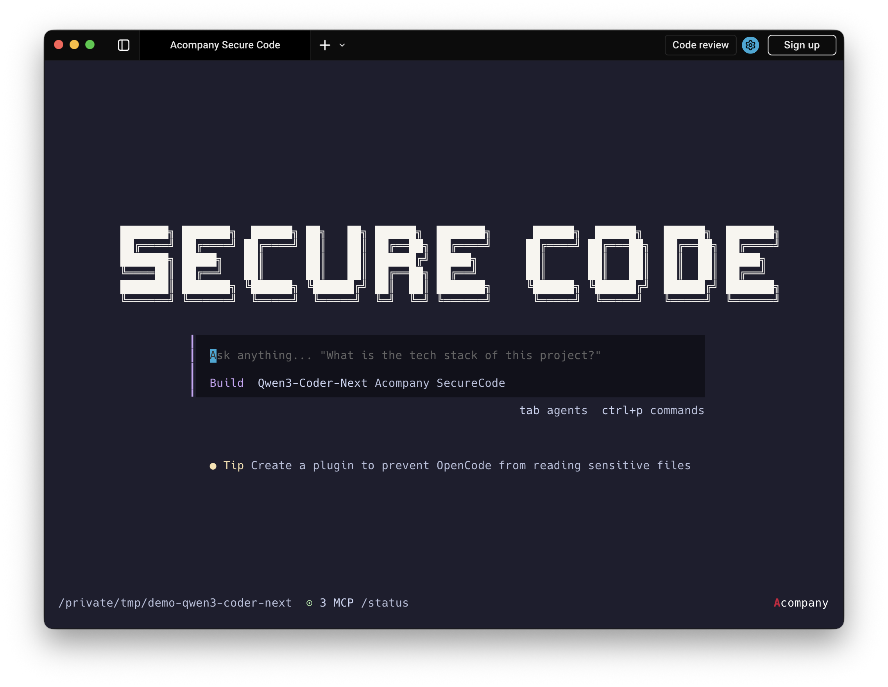
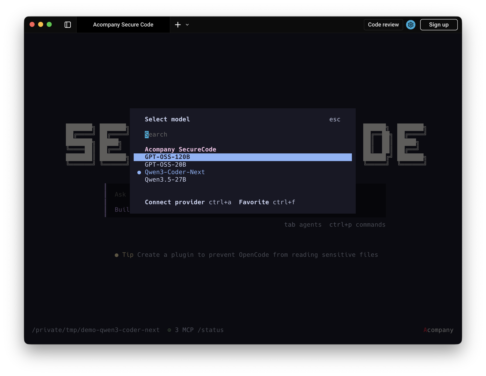

# Acompany Secure Code

機密ソースコードを漏洩させずに AI コーディング支援を実現する、Acompany のセキュアなコーディングエージェントです。
2026年3月13日に、Confidential AI Suite の第二弾製品としてベータ版の提供を開始しました。

[](https://youtu.be/QCwp4IbuP2I?si=Qx4Za7sfdluWB0Ca)

[リリース文](https://prtimes.jp/main/html/rd/p/000000128.000046917.html) | [お問い合わせ](https://www.acompany.tech/contact) | [English README](./README.en.md)

## 概要

Acompany Secure Code は、機密ソースコードを Confidential Computing 環境に送信し、秘匿化された実行領域で LLM 推論を行うことで、インフラ事業者やモデル提供者を含む第三者から処理中データを見えなくしたまま AI コーディング支援を提供します。

企業の機密コードを扱う開発組織でも、既存のターミナル中心のワークフローを崩さずに、コード生成、レビュー、リファクタリング、バグ修正、テスト生成を進められることを狙っています。

## 主な特長

- 機密コードの保護: Trusted Execution Environment 上で推論を実行し、ソースコードの入出力と LLM 処理を保護します。
- 開発フローとの親和性: ターミナル中心の操作性を維持しながら、日常的な実装作業にそのまま組み込めます。
- 監査対応: AI 利用ログを記録、可視化し、誰がいつどのコードベースで AI を使ったかを追跡できます。
- 利用モデル: GPT-OSS、Qwen3.5、Qwen3-Coder-Next などのオープンウェイト LLM を利用できます。

## 画面イメージ

### トップ画面



### モデル選択



## デモ動画

[](https://youtu.be/QCwp4IbuP2I?si=Qx4Za7sfdluWB0Ca)

- [YouTube で見る](https://youtu.be/QCwp4IbuP2I?si=Qx4Za7sfdluWB0Ca)
- クリックで、トップ画面から実際のコーディング支援フローまで確認できます。

## ローカル開発

このリポジトリは upstream の release tag を取り込みながら Acompany Secure Code 向けの変更を重ねる fork です。内部 package 名や一部コマンド名には upstream 互換性のため旧名が残っていますが、公開面のブランドは Secure Code に揃えています。

```bash
bun install
bun run guard:upstream
bun run script/securecode-supervisor.ts /path/to/your/repository
```

開発時も supervisor 経由で起動するため、opencode は OS sandbox (macOS Seatbelt / Linux bubblewrap) の中で動きます。詳細は [.specs/20260526_securecode-sandbox-phase0.md](./.specs/20260526_securecode-sandbox-phase0.md) を参照。

許可ドメインを追加したい場合は `~/.config/securecode/sandbox.json` を作成してください (テンプレ: [`script/securecode-config.example.json`](./script/securecode-config.example.json))。デフォルトでは Acompany の confidential AI endpoint のみ通り、それ以外への HTTPS / SOCKS5 outbound はすべて block されます。設定変更後は SecureCode を再起動してください。

UI を個別に確認する場合:

```bash
bun run dev:web
bun run dev:desktop
```

upstream 追従の mechanical workflow は [specs/upstream-sync.md](./specs/upstream-sync.md)、機能をどこに実装するかの判断基準は [specs/upstream-policy.md](./specs/upstream-policy.md) を参照してください。

## Benchmark Assets

SecureCode endpoint の負荷試験用アセットは [benchmarks/securecode/README.md](./benchmarks/securecode/README.md) にまとめています。

## コントリビュート

開発フローやレビュー前提は [CONTRIBUTING.md](./CONTRIBUTING.md) を参照してください。

## 関連リンク

- 製品サイト: https://www.acompany.tech/
- お問い合わせ: https://www.acompany.tech/contact
- プレスリリース: https://prtimes.jp/main/html/rd/p/000000128.000046917.html
