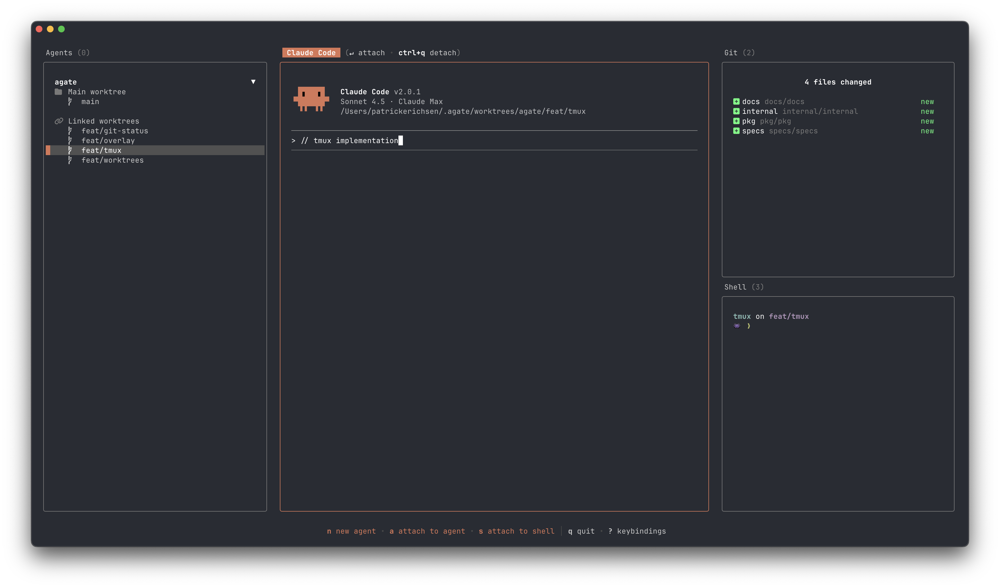

<div align="center">
<h1>Forge</h1>

**Universal CLI for coding agents, powered by the [Agent Client Protocol](https://agentclientprotocol.com/)**

`brew install forge`
<br />
`npm i -g @forge-agents/forge`

</div>



## Quickstart

Install globally using NPM or Homebrew

```sh
npm i -g @forge-agents/forge
brew install forge
```

Then run `forge` to get started:

```sh
forge
```

Install your first agent:

```sh
forge claude install
```

Run Claude Code with a prompt:

```sh
forge claude --model opus --mode acceptEdits "Create or update my CLAUDE.md"
```

Plan with Claude Code, implement with Codex:

```sh
forge codex "Find a single TODO comment in the codebase and make a plan to address it" --plan-agent claude
```

## What is Forge/ACP?

Forge is a terminal interface for AI coding agents. It implements the [Agent Client Protocol](https://agentclientprotocol.com/) (ACP) - an open standard that lets any editor work with any agent, similar to how LSP standardized language servers.

**Key features:**

- **Multi-agent workflows** - Start planning with Claude Code, and then implement with Codex
- **Unified history** - Single conversation history across all agents
- **Shared MCP configuration** - Configure MCP servers once, use them across all agents
- **Growing agent ecosystem** - 15+ agents with new ones added weekly
- **Full ACP feature set** - Tool calls, session modes, agent plans, slash commands

## Why agent harnesses matter

Models and their harnesses are co-dependent. ACP lets you run each model in its purpose-built harness (Sonnet in Claude Code, GPT in Codex) instead of a one-size-fits-all solution.

This also enables hyper-specialized agents for domain-specific problems - like [Stakpak](https://github.com/stakpak/agent) for DevOps workflows, or custom agents built for your team's specific needs.

For a deeper dive, see Viv Trivedy's great article: [Agents Should Be More Opinionated](https://www.vtrivedy.com/posts/agents-should-be-more-opinionated).

## Managing Agents

To view available agents, run:

```sh
forge agents
```

Forge supports all agents listed at [agentclientprotocol.com/overview/agents](https://agentclientprotocol.com/overview/agents):

- [Claude Code](https://docs.anthropic.com/en/docs/claude-code/overview) (via Zed's SDK adapter)
- [Codex CLI](https://developers.openai.com/codex/cli) (via Zed's adapter)
- [Gemini CLI](https://github.com/google-gemini/gemini-cli)
- [Augment Code](https://docs.augmentcode.com/cli/acp)
- [Code Assistant](https://github.com/stippi/code-assistant?tab=readme-ov-file#configuration)
- [fast-agent](https://fast-agent.ai/acp)
- [Goose](https://block.github.io/goose/docs/guides/acp-clients)
- [JetBrains Junie](https://www.jetbrains.com/junie/) (coming soon)
- [Kimi CLI](https://github.com/MoonshotAI/kimi-cli)
- [LLMling-Agent](https://phil65.github.io/llmling-agent/advanced/acp_integration/)
- [Mistral Vibe](https://github.com/mistralai/mistral-vibe)
- [OpenCode](https://github.com/sst/opencode)
- [OpenHands](https://docs.openhands.dev/openhands/usage/run-openhands/acp)
- [Qwen Code](https://github.com/QwenLM/qwen-code)
- [Stakpak](https://github.com/stakpak/agent?tab=readme-ov-file#agent-client-protocol-acp)
- [VT Code](https://github.com/vinhnx/vtcode/blob/main/README.md#zed-ide-integration-agent-client-protocol)

### Install, uninstall, check installation status for agents

> **Note:** Claude Code and Codex aren't ACP-native yet. The `claude` and `codex` entries point to Zed's ACP wrappers (`@zed-industries/claude-code-acp` and `@zed-industries/codex-acp`), which you'll need to install.

Install an agent:

```sh
forge <agent> install
```

Uninstall an agent:

```sh
forge <agent> uninstall
```

Check if a given agent is installed

```sh
forge <agent> check
```

## Usage

### TUI mode

```sh
forge
```

### Run with a prompt

```sh
forge <agent> "Create or update AGENTS.md"
```

### Specify model/mode

```
forge <agent> --model opus --mode acceptEdits "Create or update AGENTS.md"
```

Supported flags:

- `--model` - Model identifier (run `forge <agent> models` to see options)
- `--mode` - Session mode (run `forge <agent> modes` to see options)

### Run headless

Prints response and exits:

```sh
forge <agent> -p "Create or update AGENTS.md"
```

### Plan With One Agent, Implement With Another

ACP enables planning with one agent and implementing with another. Specify a planning agent using `--plan-agent`

```sh
forge codex "Find a single TODO comment in the codebase and make a plan to address it" --plan-agent claude
```

Options:

- `--plan-agent` - Planning agent name
- `--plan-model` - Planning agent model

When the planning agent [exits plan mode](https://agentclientprotocol.com/protocol/session-modes#exiting-plan-modes), Forge automatically switches to the main agent for implementation.

> Agents that expose a `plan` session mode today
>
> - `claude`
> - `opencode`

### Commands & Flags

#### `forge -h`

```sh
Commands:
  forge                       start TUI  [default]
  forge agents                list all available agents
  forge <agent> <subcommand>  manage agent <install|uninstall|check|modes|models>
  forge <agent> [prompt..]    run agent with prompt

Options:
  -h, --help        show help  [boolean]
  -v, --version     show version number  [boolean]
      --print-logs  print logs to stderr  [boolean]
      --log-level   log level  [string] [choices: "DEBUG", "INFO", "WARN", "ERROR"]
      --project     path to start forge in  [string]
  -c, --continue    continue the last session  [boolean]
  -s, --session     session id to continue  [string]

Examples:
  forge                                                                                    Start TUI
  forge claude install                                                                     Install claude
  forge claude "Update my CLAUDE.md"                                                       Run claude with prompt
  forge claude --model opus --mode bypassPermissions "Refactor the authentication module"  Run with specific model/mode
  forge codex "Find all the TODO comments" --plan-agent claude --plan-model opus           Plan with claude, implement with codex
```

#### `forge <agent> -h`

```sh
forge <agent> [prompt..]

run agent with prompt

Options:
      --mode        mode to use for the agent  [string]
      --model       model to use for the agent  [string]
      --plan-agent  agent to use for planning  [string]
      --plan-model  model to use for planning agent  [string]
  -p, --print       Run headless, print response and exit  [boolean]
      --project     path to start forge in  [string]
  -c, --continue    continue the last session  [boolean]
  -s, --session     session id to continue  [string]
  -h, --help        show help  [boolean]
```

## Share feedback

Have feedback, found a bug, or want to request a feature? Open the command palette (default: `Ctrl+P`) and select **"Share feedback"** to create a GitHub issue. You can also directly visit [github.com/forge-agents/forge/issues](https://github.com/forge-agents/forge/issues).

## FAQ

### How do I set the model for Gemini CLI?

Gemini doesn't support model selection through ACP. Set `export GEMINI_MODEL=<model>>` before running Forge to avoid "Requested entity was not found" errors with OAuth.
