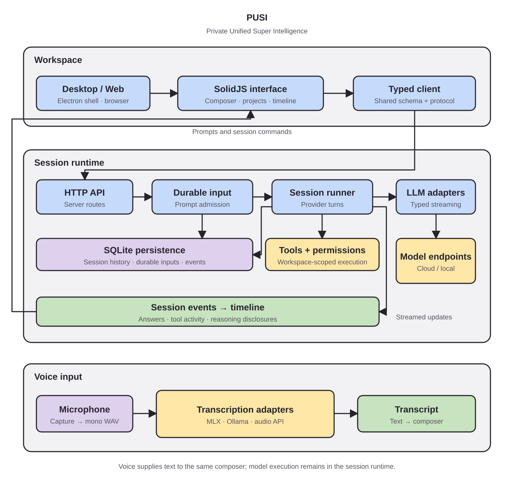

<p align="center">
  
</p>

<h1 align="center">PUSI</h1>
<p align="center"><strong>Private Unified Super Intelligence</strong></p>
<p align="center">An AI development workspace for code, conversation, and voice.</p>

<p align="center">
  &nbsp;
  &nbsp;
  &nbsp;
  &nbsp;
  &nbsp;
  &nbsp;
  &nbsp;
  &nbsp;
</p>
<p align="center"><sub>TypeScript · Bun · SolidJS · Electron · Tailwind CSS · Vite · SQLite · Python</sub></p>

PUSI brings desktop and web chat, voice input, Ollama model management, and a project/session sidebar into one workspace. Reasoning disclosures include elapsed-time labels so you can follow an answer as it develops.

See [the project overview](FORK.md) for the changes and [the voice guide](VOICE_INPUT.md) for setup and compatibility.

## Architecture

<p align="center">
  
</p>

| Layer | Responsibility | Source |
| --- | --- | --- |
| Workspace | Electron shell, SolidJS interface, composer, project navigation, and session timeline | [`desktop`](packages/desktop), [`app`](packages/app), [`session-ui`](packages/session-ui) |
| API and contracts | Typed clients, shared schemas, HTTP routes, and event delivery | [`client`](packages/client), [`schema`](packages/schema), [`protocol`](packages/protocol), [`server`](packages/server) |
| session core | Durable prompt admission, session execution, model turns, tool permissions, and persistence | [`core`](packages/core), [`llm`](packages/llm) |
| Voice input | Audio capture, WAV normalization, provider selection, and transcript insertion | [App voice input](packages/app/src/components/voice-input), [desktop voice service](packages/desktop/src/main/voice-service.ts) |

Model adapters support cloud and compatible endpoints. Voice transcription is a separate input path: the local MLX worker requires an Apple Silicon Mac, while the Ollama and transcription API adapters use configured HTTP endpoints.

## Run from source

Use the Bun version declared in `package.json` (currently 1.3.14) and install Node.js for Electron's installation script.

```sh
git clone https://github.com/leejaywon/pusi.git
cd pusi
bun install
bun run dev:desktop
```

The development application is named **pusi Dev**. This is a source-development workflow; this repository does not yet provide a tested pusi installer or automatic-update service. Upstream OpenCode installers do not include pusi's changes.

For the web app and backend commands, see [CONTRIBUTING.md](CONTRIBUTING.md). That document describes the inherited OpenCode development workflow; proposals for pusi belong in this repository.

## Project identity and compatibility

- Desktop names are `pusi`, `pusi Beta`, and `pusi Dev`, with separate application identifiers and desktop settings directories.
- Desktop links use `pusi-app://`, without registering OpenCode's URL scheme.
- Desktop release metadata targets `leejaywon/pusi`. Automatic updates are disabled until a pusi release pipeline is tested.
- Internal `@opencode-ai/*` workspace names, backend configuration conventions, and `OPENCODE_*` environment variables remain compatible with the inherited codebase. Changing the desktop identifier does not migrate existing OpenCode settings or isolate every backend data path.
- Some inherited artwork, translations, and service integrations still refer to OpenCode. They are not a claim that pusi is an official OpenCode release.

## Validation

Run typechecks from the affected package directories, and use the focused checks documented in [FORK.md](FORK.md#validation) and [VOICE_INPUT.md](VOICE_INPUT.md#automated-checks). Physical microphone behavior, real speech models, and packaged releases need separate testing on the target device.

## Attribution and license

PUSI derives from [OpenCode](https://github.com/anomalyco/opencode). The original copyright and MIT license are preserved in [LICENSE](LICENSE). Tabler icons retain their [MIT license](packages/ui/TABLER-LICENSE). Existing translated README files describe upstream OpenCode and have not yet been adapted for pusi.

Technology icons come from [Devicon](https://github.com/devicons/devicon) under the [MIT license](docs/assets/tech/DEVICON-LICENSE). See [asset credits](docs/assets/ATTRIBUTION.md).
