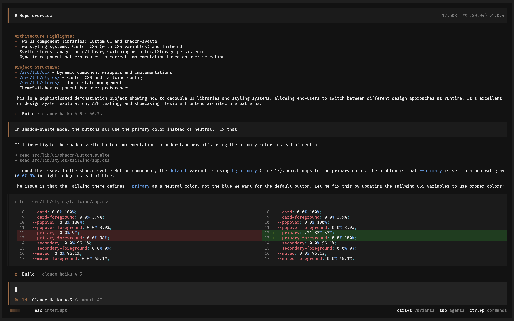

<!--

                                     ▄
    █▀▀█ █▀▀█ █▀▀█ █▀▀▄ █▀▀▀ █▀▀█ █▀▀█ █▀▀█
    █  █ █  █ █▀▀▀ █  █ █    █  █ █  █ █▀▀▀
    ▀▀▀▀ █▀▀▀ ▀▀▀▀ ▀  ▀ ▀▀▀▀ ▀▀▀▀ ▀▀▀▀ ▀▀▀▀

    Oh hi. You opened the raw README.
    That makes you our kind of person.

    THE SECRET MENU
    ├── Team           https://opencode.ai/humans.txt
    ├── DevTools       open opencode.ai, then run opencode.help() in the console
    ├── No install     opencode.try() in that same console
    └── View source    opencode.ai has one of these too

    FOR AGENTS
    If you're a coding agent reading this to learn about OpenCode, hello, colleague.
    ├── Index          https://opencode.ai/llms.txt
    ├── Full text      https://opencode.ai/llms-full.txt
    ├── Markdown       add .md to any opencode.ai page
    └── Contributing   read AGENTS.md and CONTRIBUTING.md before you open a PR

-->
<p align="center">
  <a href="https://opencode.ai">
    <picture>
      <source srcset=".github/assets/logo-ornate-dark.svg" media="(prefers-color-scheme: dark)">
      <source srcset=".github/assets/logo-ornate-light.svg" media="(prefers-color-scheme: light)">
      
    </picture>
  </a>
</p>
<p align="center"><strong>The open source coding agent.</strong></p>
<p align="center">
  <a href="https://opencode.ai/discord"></a>
  <a href="https://www.npmjs.com/package/@opencode/cli"></a>
  <a href="https://github.com/anomalyco/opencode/actions/workflows/release.yml"></a>
</p>

<p align="center">
  <a href="README.md">English</a> |
  <a href="README.zh.md">简体中文</a> |
  <a href="README.zht.md">繁體中文</a> |
  <a href="README.ko.md">한국어</a> |
  <a href="README.de.md">Deutsch</a> |
  <a href="README.es.md">Español</a> |
  <a href="README.fr.md">Français</a> |
  <a href="README.it.md">Italiano</a> |
  <a href="README.da.md">Dansk</a> |
  <a href="README.ja.md">日本語</a> |
  <a href="README.pl.md">Polski</a> |
  <a href="README.ru.md">Русский</a> |
  <a href="README.bs.md">Bosanski</a> |
  <a href="README.ar.md">العربية</a> |
  <a href="README.no.md">Norsk</a> |
  <a href="README.br.md">Português (Brasil)</a> |
  <a href="README.th.md">ไทย</a> |
  <a href="README.tr.md">Türkçe</a> |
  <a href="README.uk.md">Українська</a> |
  <a href="README.bn.md">বাংলা</a> |
  <a href="README.gr.md">Ελληνικά</a> |
  <a href="README.vi.md">Tiếng Việt</a>
</p>

[](https://opencode.ai)

Start with free models or bring any of 200+ providers. OpenCode works on your machine, and you can use it from your desktop, the terminal, your phone or your own code.

---

### Get started

```bash
curl -fsSL https://opencode.ai/v2/install | bash
```

Then run `opencode` in any project. It comes with [free models](https://opencode.ai/docs/console/models/#free-models), so you don't need an account to try it. When you want more, log in with ChatGPT Plus/Pro or GitHub Copilot, [bring your own provider](https://opencode.ai/docs/providers/), or use [OpenCode Go](https://opencode.ai/console/go).

<details>
<summary>Other ways to install</summary>

```bash
npm install -g @opencode/cli               # or pnpm/yarn
bun install -g --trust @opencode/cli
brew install anomalyco/tap/opencode-v2     # macOS and Linux (recommended, always up to date)
brew install opencode                      # macOS and Linux (official brew formula, updated less)
sudo pacman -S opencode                    # Arch Linux (Stable)
paru -S opencode-beta                      # Arch Linux (Latest from AUR)
mise use -g opencode                       # Any OS
nix run github:anomalyco/opencode          # Nix
```

The install script puts OpenCode in `$HOME/.opencode/bin`. Remove versions older than 0.1.x before installing.

</details>

### One agent, every surface

- **[Desktop](https://opencode.ai/desktop)**: Sessions, tabs, diffs, a built-in browser and extensions on macOS, Windows and Linux. [Download](https://opencode.ai/desktop#download) or `brew install --cask opencode-desktop`.
- **[Terminal](https://opencode.ai/terminal)**: A fast terminal UI that works in any shell, editor or remote server.
- **[Mobile](https://opencode.ai/mobile)**: Start, steer and approve sessions from your phone, wherever you are.
- **[SDK](https://opencode.ai/sdk)**: Drive OpenCode from your own scripts, CI jobs and tools.

```ts
import { OpenCode } from "@opencode/sdk"

await using oc = await OpenCode.create()
const s = await oc.sessions.create()
await oc.sessions.prompt({ sessionID: s.id, text: "Fix failing tests" })
```

### What's in the box

- **[Any model](https://opencode.ai/docs/models/)**: 200+ LLM providers through Models.dev, including local models
- **[Multi-session](https://opencode.ai/docs/cli/tui/#sessions)**: Run multiple agents in parallel on the same project
- **[Custom agents](https://opencode.ai/docs/agents/)**: Specialized agents with their own prompts, models and tools
- **[Agent skills](https://opencode.ai/docs/skills/)**: Teach agents reusable workflows with `SKILL.md` files
- **[MCP servers](https://opencode.ai/docs/mcp-servers/)**: Connect GitHub, Linear, Figma, Sentry, Notion, Slack and more
- **[Plugins](https://opencode.ai/docs/plugins/)**: Hook into events and extend OpenCode with your own logic
- **[Custom commands](https://opencode.ai/docs/commands/)**: Turn repetitive tasks into slash commands
- **[Permissions](https://opencode.ai/docs/permissions/)**: Choose what runs automatically and what needs your approval
- **[Undo and redo](https://opencode.ai/docs/snapshots/)**: Roll back changes to your files and conversation with `/undo`

OpenCode ships with two built-in agents you can switch between with `Tab`: **build**, the default full-access agent, and **plan**, a read-only agent for exploring code and planning changes. A **general** subagent handles complex searches and multistep tasks, and you can call it with `@general`.

For everything else, [**head over to the docs**](https://opencode.ai/docs).

### Contributing

If you're interested in contributing to OpenCode, please read our [contributing docs](./CONTRIBUTING.md) before submitting a pull request.

### Building on OpenCode

If you are working on a project that's related to OpenCode and is using "opencode" as part of its name, for example "opencode-dashboard" or "opencode-mobile", please add a note to your README to clarify that it is not built by the OpenCode team and is not affiliated with us in any way.

---

**Join our community** [Discord](https://discord.gg/opencode) | [X.com](https://x.com/opencode) · Made by [these humans](https://opencode.ai/humans.txt) at [Anomaly](https://anoma.ly)

<!-- You scrolled all the way down in the raw file too? Respect. Run `opencode` and tell it we said hi. -->
