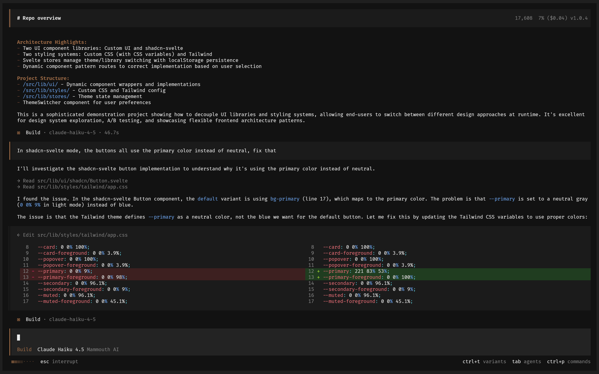

<p align="center">
  <a href="https://opencode.ai">
    <picture>
      <source srcset="packages/console/app/src/asset/logo-ornate-dark.svg" media="(prefers-color-scheme: dark)">
      <source srcset="packages/console/app/src/asset/logo-ornate-light.svg" media="(prefers-color-scheme: light)">
      
    </picture>
  </a>
</p>
<p align="center">ഓപ്പൺ സോഴ്‌സ് AI കോഡിംഗ് ഏജന്റ്.</p>
<p align="center">
  <a href="https://opencode.ai/discord"></a>
  <a href="https://www.npmjs.com/package/opencode-ai"></a>
  <a href="https://github.com/anomalyco/opencode/actions/workflows/publish.yml"></a>
</p>

<p align="center">
  <a href="README.md">English</a> |
  <a href="README.zh.md">简体中文</a> |
  <a href="README.zht.md">繁體中文</a> |
  <a href="README.ko.md">한국어</a> |
  <a href="README.de.md">Deutsch</a> |
  <a href="README.es.md">Español</a> |
  <a href="README.fr.md">Français</a> |
  <a href="README.it.md">Italiano</a> |
  <a href="README.da.md">Dansk</a> |
  <a href="README.ja.md">日本語</a> |
  <a href="README.pl.md">Polski</a> |
  <a href="README.ru.md">Русский</a> |
  <a href="README.bs.md">Bosanski</a> |
  <a href="README.ar.md">العربية</a> |
  <a href="README.no.md">Norsk</a> |
  <a href="README.br.md">Português (Brasil)</a> |
  <a href="README.th.md">ไทย</a> |
  <a href="README.tr.md">Türkçe</a> |
  <a href="README.uk.md">Українська</a> |
  <a href="README.bn.md">বাংলা</a> |
  <a href="README.ml.md">മലയാളം</a> |
  <a href="README.gr.md">Ελληνικά</a> |
  <a href="README.vi.md">Tiếng Việt</a>
</p>

[](https://opencode.ai)

---

### ഇൻസ്റ്റാളേഷൻ

```bash
# YOLO
curl -fsSL https://opencode.ai/install | bash

# Package managers
npm i -g opencode-ai@latest        # or bun/pnpm/yarn
scoop install opencode             # Windows
choco install opencode             # Windows
brew install anomalyco/tap/opencode # macOS and Linux (recommended, always up to date)
brew install opencode              # macOS and Linux (official brew formula, updated less)
sudo pacman -S opencode            # Arch Linux (Stable)
paru -S opencode-bin               # Arch Linux (Latest from AUR)
mise use -g opencode               # Any OS
nix run nixpkgs#opencode           # or github:anomalyco/opencode for latest dev branch
```

> [!TIP]
> ഇൻസ്റ്റാൾ ചെയ്യുന്നതിന് മുമ്പ് 0.1.x-നേക്കാൾ പഴയ പതിപ്പുകൾ നീക്കം ചെയ്യുക.

### ഡെസ്ക്ടോപ്പ് ആപ്പ് (BETA)

OpenCode ഡെസ്ക്ടോപ്പ് ആപ്പായും ലഭ്യമാണ്. [റിലീസ് പേജിൽ](https://github.com/anomalyco/opencode/releases) നിന്നോ [opencode.ai/download](https://opencode.ai/download) എന്ന വിലാസത്തിൽ നിന്നോ നേരിട്ട് ഡൗൺലോഡ് ചെയ്യാം.

| പ്ലാറ്റ്ഫോം            | ഡൗൺലോഡ്                            |
| --------------------- | ---------------------------------- |
| macOS (Apple Silicon) | `opencode-desktop-mac-arm64.dmg`   |
| macOS (Intel)         | `opencode-desktop-mac-x64.dmg`     |
| Windows               | `opencode-desktop-windows-x64.exe` |
| Linux                 | `.deb`, `.rpm`, അല്ലെങ്കിൽ `.AppImage` |

```bash
# macOS (Homebrew)
brew install --cask opencode-desktop
# Windows (Scoop)
scoop bucket add extras; scoop install extras/opencode-desktop
```

#### ഇൻസ്റ്റാളേഷൻ ഡയറക്ടറി

ഇൻസ്റ്റാളേഷൻ പാത തിരഞ്ഞെടുക്കുമ്പോൾ ഇൻസ്റ്റാൾ സ്ക്രിപ്റ്റ് താഴെ പറയുന്ന മുൻഗണനാക്രമം പാലിക്കുന്നു:

1. `$OPENCODE_INSTALL_DIR` - ഇഷ്ടാനുസൃത ഇൻസ്റ്റാളേഷൻ ഡയറക്ടറി
2. `$XDG_BIN_DIR` - XDG Base Directory Specification പാലിക്കുന്ന പാത
3. `$HOME/bin` - സാധാരണ ഉപയോക്തൃ ബൈനറി ഡയറക്ടറി (നിലവിലുണ്ടെങ്കിൽ അല്ലെങ്കിൽ സൃഷ്ടിക്കാൻ കഴിയുമെങ്കിൽ)
4. `$HOME/.opencode/bin` - സ്ഥിരസ്ഥിതി ബദൽ പാത

```bash
# ഉദാഹരണങ്ങൾ
OPENCODE_INSTALL_DIR=/usr/local/bin curl -fsSL https://opencode.ai/install | bash
XDG_BIN_DIR=$HOME/.local/bin curl -fsSL https://opencode.ai/install | bash
```

### ഏജന്റുകൾ

`Tab` കീ ഉപയോഗിച്ച് മാറാവുന്ന രണ്ട് ബിൽറ്റ്-ഇൻ ഏജന്റുകൾ OpenCode-ലുണ്ട്.

- **build** - വികസന ജോലികൾക്കായുള്ള സ്ഥിരസ്ഥിതി, പൂർണ്ണ ആക്സസുള്ള ഏജന്റ്
- **plan** - വിശകലനത്തിനും കോഡ് പരിശോധിക്കാനുമുള്ള, വായിക്കാൻ മാത്രം അനുമതിയുള്ള ഏജന്റ്
  - ഫയലുകൾ എഡിറ്റ് ചെയ്യുന്നത് സ്ഥിരസ്ഥിതിയായി അനുവദിക്കില്ല
  - Bash കമാൻഡുകൾ പ്രവർത്തിപ്പിക്കുന്നതിന് മുമ്പ് അനുമതി ചോദിക്കുന്നു
  - പരിചയമില്ലാത്ത കോഡ്‌ബേസുകൾ പരിശോധിക്കാനും മാറ്റങ്ങൾ ആസൂത്രണം ചെയ്യാനും അനുയോജ്യം

സങ്കീർണ്ണമായ തിരച്ചിലുകൾക്കും പല ഘട്ടങ്ങളുള്ള ജോലികൾക്കുമായി **general** എന്ന സബ്‌ഏജന്റും ലഭ്യമാണ്. ഇത് ആന്തരികമായി ഉപയോഗിക്കുന്നു; സന്ദേശങ്ങളിൽ `@general` എന്ന് ഉപയോഗിച്ച് വിളിക്കാം.

[ഏജന്റുകളെക്കുറിച്ച്](https://opencode.ai/docs/agents) കൂടുതൽ അറിയുക.

### ഡോക്യുമെന്റേഷൻ

OpenCode എങ്ങനെ ക്രമീകരിക്കാമെന്നതിനെക്കുറിച്ച് കൂടുതലറിയാൻ [ഞങ്ങളുടെ ഡോക്യുമെന്റേഷൻ കാണുക](https://opencode.ai/docs).

### സംഭാവന

OpenCode-ലേക്ക് സംഭാവന ചെയ്യാൻ താൽപ്പര്യമുണ്ടെങ്കിൽ, പുൾ റിക്വസ്റ്റ് സമർപ്പിക്കുന്നതിന് മുമ്പ് ഞങ്ങളുടെ [സംഭാവനാ മാർഗ്ഗനിർദ്ദേശങ്ങൾ](./CONTRIBUTING.md) വായിക്കുക.

### OpenCode-നെ അടിസ്ഥാനമാക്കി പ്രോജക്റ്റുകൾ നിർമ്മിക്കുമ്പോൾ

OpenCode-നുമായി ബന്ധപ്പെട്ട ഒരു പ്രോജക്റ്റിന്റെ പേരിൽ "opencode" ഉൾപ്പെടുന്നുണ്ടെങ്കിൽ—ഉദാഹരണത്തിന് "opencode-dashboard" അല്ലെങ്കിൽ "opencode-mobile"—അത് OpenCode ടീം നിർമ്മിച്ചതല്ലെന്നും OpenCode-ുമായി ബന്ധമില്ലെന്നും വ്യക്തമാക്കുന്ന കുറിപ്പ് ആ പ്രോജക്റ്റിന്റെ README-യിൽ ചേർക്കുക.

---

**ഞങ്ങളുടെ കമ്മ്യൂണിറ്റിയിൽ ചേരുക** [Discord](https://discord.gg/opencode) | [X.com](https://x.com/opencode)
