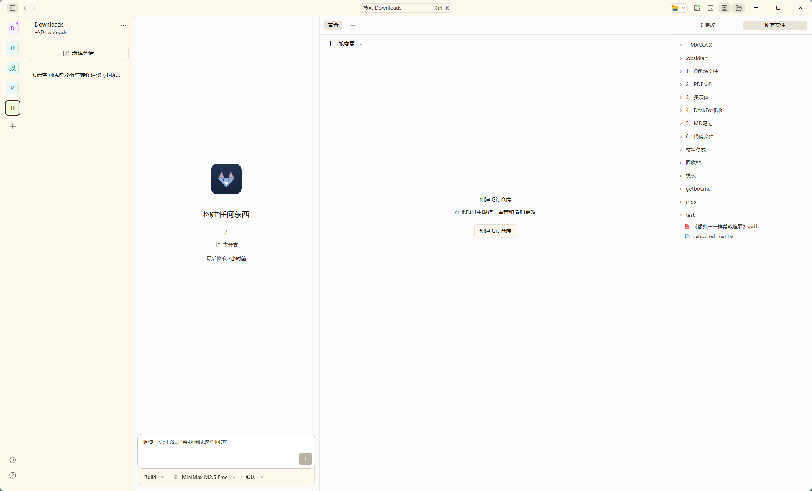
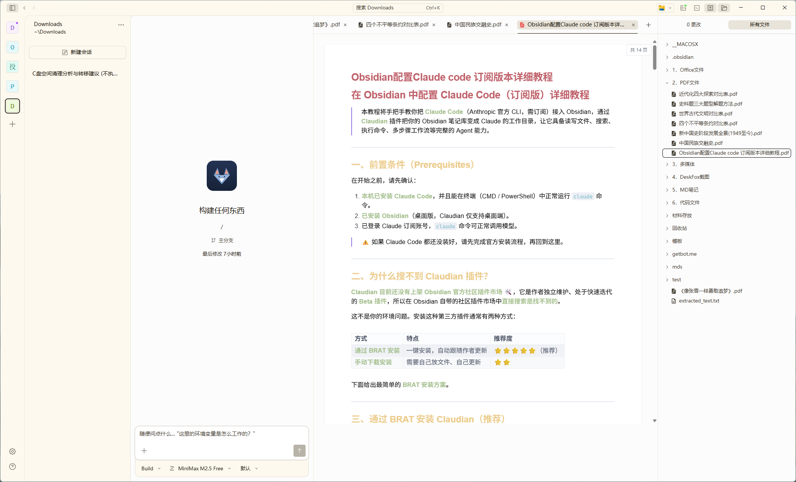
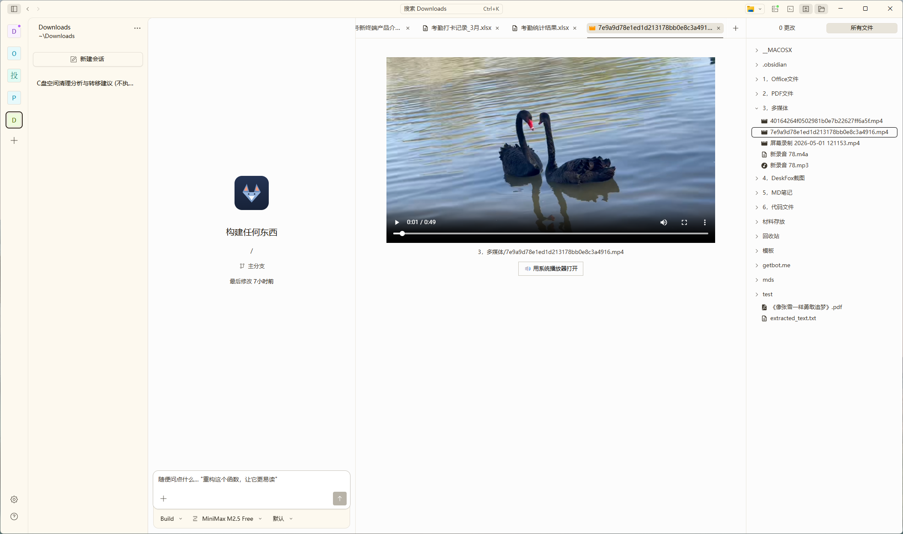

<p align="center">
  
</p>

<p align="center"><strong>桌面 AI 助理 · 办公场景专用 AI Agent</strong></p>

<p align="center"><sub>CLEVER · CALM · ALWAYS ON YOUR DESK</sub></p>

<p align="center">
  <a href="https://github.com/zoulukuang/deskfox/releases/latest">📥 下载最新版</a>
  &nbsp;·&nbsp;
  <a href="https://deskfox.ai/">🏠 官网</a>
  &nbsp;·&nbsp;
  <a href="README.md">🌐 English</a>
</p>

<p align="center">
  <a href="https://github.com/zoulukuang/deskfox/releases"></a>
  <a href="LICENSE"></a>
  <a href="https://github.com/anomalyco/opencode"></a>
</p>

---

> 写邮件、改报告、整 Excel、读 PDF、做 PPT 草稿 — 办公里这些反复但费时的事,给 DeskFox 说句话就行。

<p align="center">
  
</p>

## ✨ 为什么选 DeskFox

- 🔓 **开源透明** — 代码全公开,本地优先,你的数据始终是你的
- 🌍 **来自 anomalyco/opencode 社区** — fork 自全球开发者每天审视的开源项目,工程基础稳定;我们的工作是把它"翻译"成办公人也能用
- 🎁 **零门槛上手** — 内置 OpenCode Zen 免费模型(MiniMax / Hy3 / Nemotron 等),装上就能聊,不用充值不用申请 API
- 🤖 **多模型一键切换** — Claude / GPT / Gemini / 国产模型 + Zen 免费网关,统一界面,API key 始终在你机器上

## 🎯 适合场景

| 场景 | 你能做什么 |
|---|---|
| 📄 **文档伴侣** | Word / Excel / PDF / Markdown 直接预览,加聊天上下文,让 AI 改写、总结、答疑 |
| ✍️ **写作起草** | 邮件 / 周报 / 述职 / 会议纪要 / 合同初稿 — 一句话讲清楚要点,AI 帮你成稿 |
| 📊 **数据梳理** | Excel 公式 / CSV 清洗 / 数据透视思路 / 简单可视化 |
| 🔐 **隐私敏感** | 文件不离开本地、聊天历史本地存、API key 直连模型方不经第三方中转 |

## 🖼️ 文件预览能力

不只是聊天,DeskFox **直接在主界面预览各种格式文件**,一键加进对话上下文让 AI 帮你处理:

<table>
  <tr>
    <td align="center" width="33%">
      <br>
      <sub><b>📄 PDF / Word / Markdown</b><br>原版式 + 文本提取双模式</sub>
    </td>
    <td align="center" width="33%">
      <br>
      <sub><b>📊 Excel / PowerPoint</b><br>表格 / 幻灯片直接渲染</sub>
    </td>
    <td align="center" width="33%">
      <br>
      <sub><b>🎬 视频 / 音频 / 图片</b><br>多媒体内置播放</sub>
    </td>
  </tr>
</table>

每个文件标签可以**右键 → 加到聊天**,把内容塞进当前对话上下文 — 让 AI 答疑、改写、总结。

## 📤 Markdown → Word 导出

文件查看器里右键 `.md` 文件标签 → **"导出为 Word"**,把 Markdown 笔记转成 Word 原生 `.docx` 文档。**保真度优先** — 格式、结构、图片,甚至数学公式都准确转化,直接拿去发给同事或客户。

**支持的 Markdown 元素一览**:

| Markdown 写法 | Word 里的表现 |
|---|---|
| `# 一级标题` ~ `###### 六级标题` | Word 原生标题层级,字号阶梯保留 |
| `**粗体**` `*斜体*` `~~删除线~~` `<u>下划线</u>` | Word 原生行内格式 |
| `` `行内代码` `` | 薄荷绿底色 + 等宽字体 |
| ` ```语言 ... ``` ` 代码块 | 语法高亮代码框(200+ 语言,GitHub 浅色主题) |
| `==高亮文字==` | 黄色高亮底色 |
| `E = mc<sup>2</sup>`、`H<sub>2</sub>O` | Unicode 上下标 |
| `:rocket:` `:tada:` `:warning:` 等 80+ 表情符号 | 原生彩色 emoji 🚀🎉⚠️ |
| `> 引用块`(多段) | 缩进段落 + 浅灰底色 + 左侧竖线(多段视觉一体) |
| `> [!NOTE/TIP/WARNING/CAUTION/IMPORTANT]` GFM 警告框 | 5 种独立颜色提示块(蓝 / 绿 / 黄 / 红 / 紫,对齐 GitHub 风格) |
| `- 无序列表`、`1. 有序列表`、`- [x] 任务列表` | Word 原生列表(支持多级嵌套) |
| `\| 列1 \| 列2 \|` 表格 | 全网格边框 + 表头浅灰底色 + 上下空行 |
| `[文字](https://...)` 外链 | Word 可点击超链接 |
| `[章节](#锚点)` 文档内跳转 | **Word 里 Ctrl+点击跳转**到对应标题 |
| `` 本地图片 | 直接嵌入 `.docx` 文件(不留外链) |
| `` 远程图片 | 自动下载并以原生图片嵌入 |
| `` HTML 图片 | 同上 |
| `<p align="center">` `<div align="center">` | 居中段落 |
| `<details><summary>` 折叠块 | 加粗摘要 + 普通段落展示 |
| `<span style="background:#X;color:#Y">徽章</span>` | 带背景色和字色的彩色文字 |
| ` ```mermaid ... ``` ` 流程图 / 时序图 / 类图 / 甘特图 / 饼图 | 渲染成居中图片嵌入 Word |
| `$行内公式$`、`$$块级公式$$` LaTeX 数学公式 | **Word 原生数学公式对象** — 双击在 Word 公式编辑器里编辑;矢量品质、跟随字号 |

**为什么这很重要** — AI 帮你写的笔记、会议议程、文稿草稿、技术文档、学习笔记,都能导出分享给只用 Word 的同事或客户,**格式不丢**。

## 📥 下载安装

| 平台 | 国际(GitHub Release)| 国内镜像(Gitee)|
|---|---|---|
| **Windows** | [releases/latest](https://github.com/zoulukuang/deskfox/releases/latest) | [Gitee Release](https://gitee.com/zoulukuang/deskfox/releases/) |
| **macOS (Apple Silicon)** | [releases/latest](https://github.com/zoulukuang/deskfox/releases/latest) | [Gitee Release](https://gitee.com/zoulukuang/deskfox/releases/) |

国内访问 GitHub 慢的话,优先走 Gitee 镜像。

> **首次启动小提示**(因开源 fork 项目暂未配代码签名证书,**不是恶意软件**):
> - **Windows**:SmartScreen 拦截 → 点 "更多信息 → 仍要运行"
> - **macOS**:Gatekeeper 拦截 → 应用图标右键 → "打开" → 同意一次
>
> 详细缘由见 [`docs/governance/数字签名问题.md`](docs/governance/数字签名问题.md)

## 🌱 项目透明

**DeskFox.Ai** 是 [`anomalyco/opencode`](https://github.com/anomalyco/opencode) 的 fork 项目。原项目是给程序员用的 AI 编码工具,我们 fork 出来,**定位调整为面向办公人群的日常 AI 工作伴侣**。具体做了:

- 🎨 **界面精简** — 去掉编程专属 UI,重新组织对话流和文件操作
- 🦊 **品牌重塑** — DeskFox 视觉系统(Bundle ID / 图标 / 文案),与上游 0 命名空间共享
- 📄 **文档预览能力** — Word / Excel / PDF / Markdown 直接看,可一键加进聊天上下文
- 📦 **打包发布工程化** — Windows + macOS 三档(`prod` 稳定版 / `beta` RC 储备 / `dev` 预览版)build,本地 `pack-installer` 脚本打包 + 手动上传 GitHub Release / Gitee 镜像。完整规则详见 [版本号与发布渠道规范](docs/governance/版本号与发布渠道规范.md)。

完整改动索引见 [`改动日志.md`](改动日志.md);治理规范见 [`docs/governance/`](docs/governance/);跟随上游升级 SOP 见 [`docs/governance/UPSTREAM-MERGE-GUIDE.md`](docs/governance/UPSTREAM-MERGE-GUIDE.md)。

## 🌐 相关链接

| | |
|---|---|
| 🏠 官网 | [deskfox.ai](https://deskfox.ai/) |
| 📦 GitHub Release | [releases/latest](https://github.com/zoulukuang/deskfox/releases/latest) |
| 🇨🇳 Gitee 镜像 | [zoulukuang/deskfox](https://gitee.com/zoulukuang/deskfox) |
| 🐛 问题反馈 | [Issues](https://github.com/zoulukuang/deskfox/issues) |
| 🔒 隐私协议 | [中文](docs/legal/隐私协议.md) · [English](docs/legal/PRIVACY.md) |
| ⬆️ 上游 | [anomalyco/opencode](https://github.com/anomalyco/opencode) |

## 📄 协议

[MIT](LICENSE) — 与上游 [`anomalyco/opencode`](https://github.com/anomalyco/opencode) 保持一致。所有改动公开在 GitHub,跟随上游升级。

---

<p align="center"><sub>© 2026 DeskFox.Ai · 基于 MIT 协议开源 · fork from anomalyco/opencode</sub></p>
