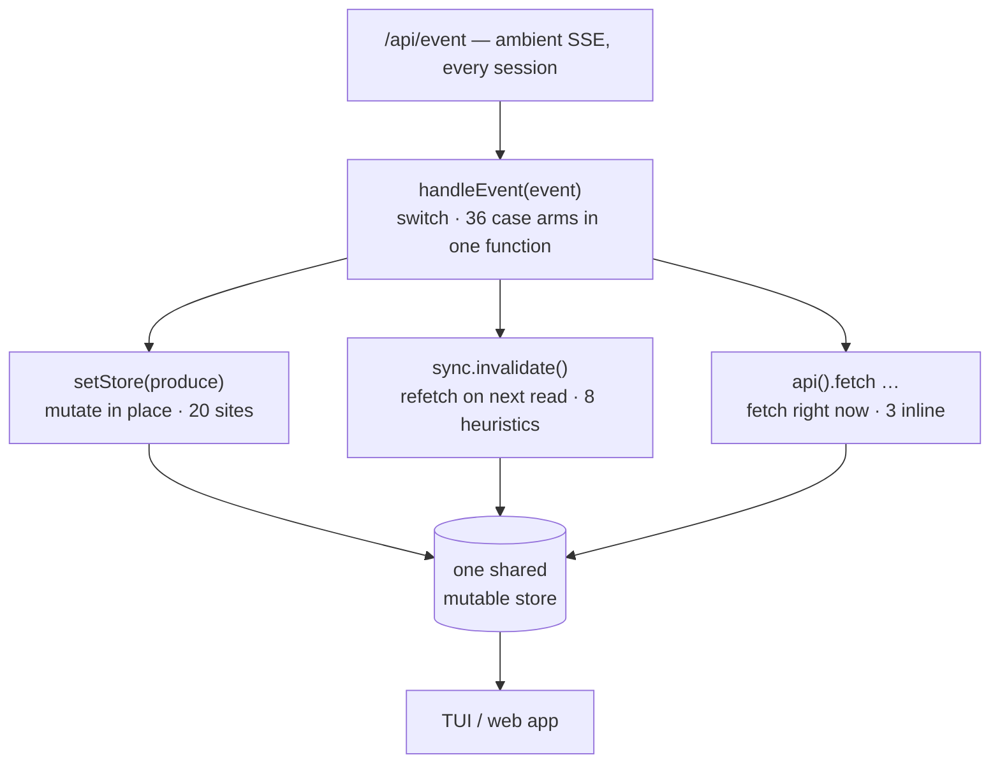
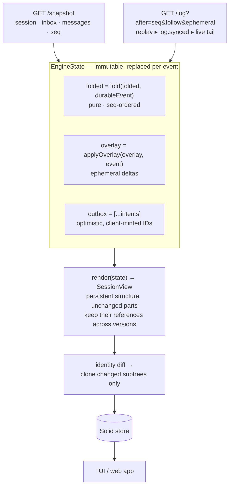
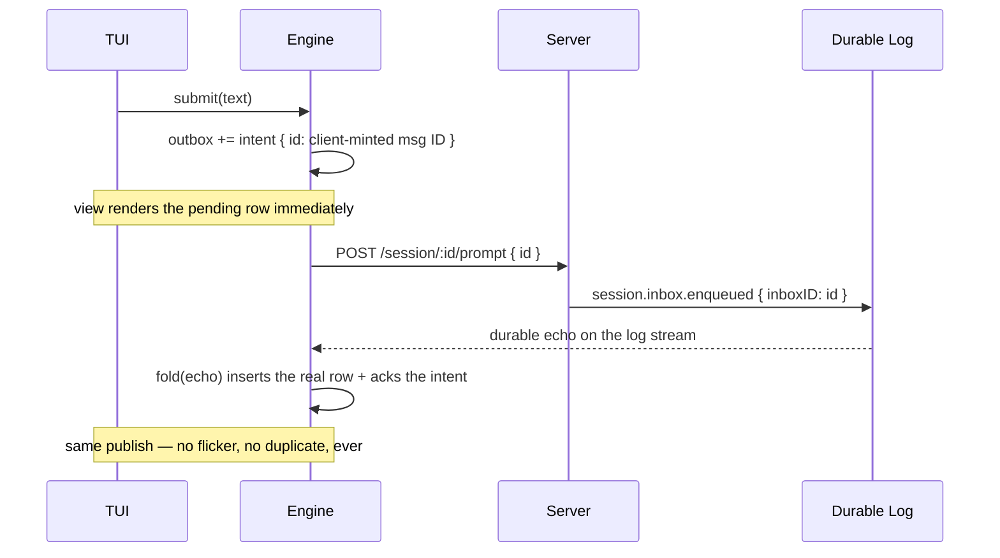
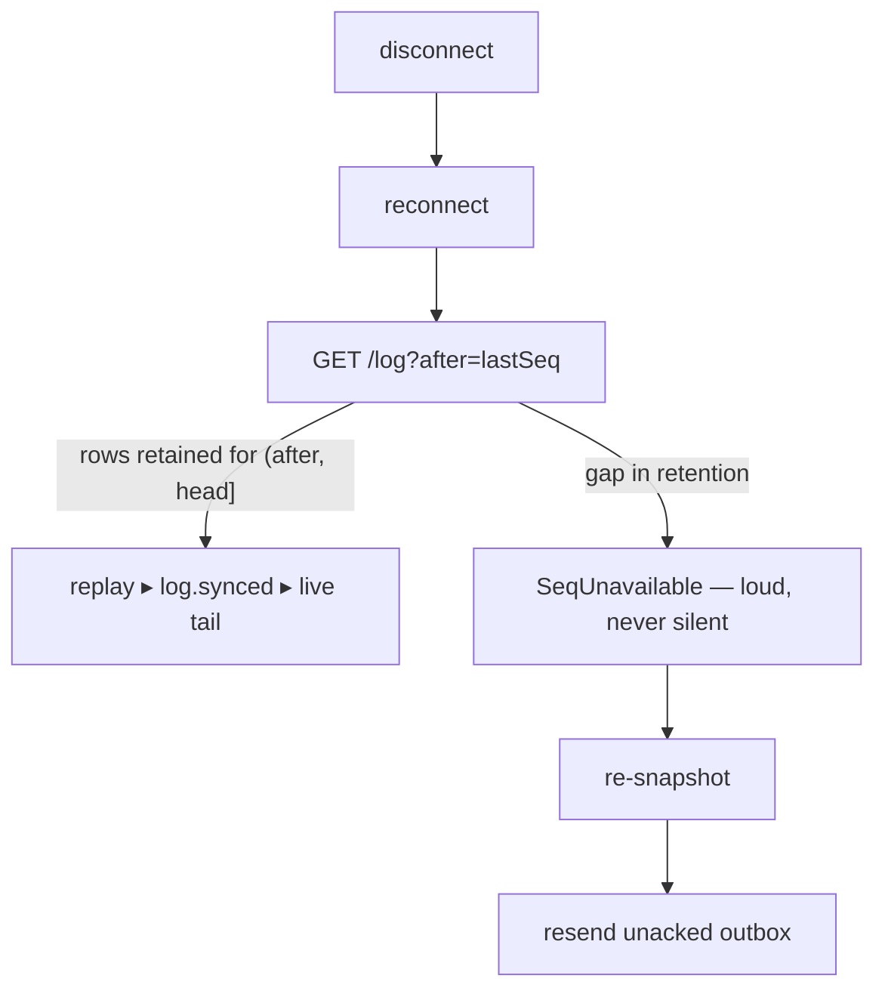

# Session Sync: Two Architectures

How the legacy client data layer (`createData`) and the session sync engine
(`createEngineData`) keep a client's view of a session in sync with the
server — and why they feel so different to reason about.

Both produce the same thing: a fine-grained reactive Solid store the TUI (and
web app) render from. They differ in *where correctness lives*.

- **legacy** — correctness = the union of ~36 event handlers each being right
- **engine** — correctness = one pure fold + a handful of testable laws

---

## At a glance

| | Legacy `createData` | Engine `createEngineData` |
|---|---|---|
| Source of truth | the store itself, patched per event | server's durable log, folded |
| Ingestion | ambient `/api/event` SSE, all sessions | snapshot + per-session `/log` (durable + ephemeral, seq-cursored) |
| State shape | one mutable store, edited in place | immutable `EngineState`, new value per event |
| Writes | 20 mutation sites, 3 inline fetches interleaved | 2 mutation sites, zero interleaved I/O |
| Recovery | 8 refetch heuristics, band-aid invalidations | one seq watermark; gaps are loud (`SeqUnavailable` → re-snapshot) |
| Optimism | `evt_` → `msg_` ID rewriting, per-case | outbox of intents with client-minted IDs, acked by durable echo |
| Testability | drive the store, assert the store | law-test the pure fold; chaos-sim the engine |

```tree
src/solid
├── engine/
│   ├── fold.ts        580 lines · pure fold — (state, durableEvent) → state
│   └── engine.ts      498 lines · outbox · overlay · reconnect · render
├── engine-data.ts     271 lines · Solid adapter — identity diff + clone boundary
└── data.ts          1,527 lines · legacy layer (still serves the web app)
```

Size, honestly: the engine's 1,349 lines replace only `data.ts`'s *session
sync* portion (~654 lines) — the rest of `data.ts` covers other domains
(projects, locations, VCS, …) and still runs underneath as a shim. So the
engine is ~2× the code it replaces; the extra lines are the behaviors legacy
doesn't have at all (snapshot/cursor recovery, outbox, reconnect proofs).

---

## How a token delta flows

The hottest path in the system: one streamed text token.

### Legacy — a surgical poke

The actual handler, one of 36 case arms:

```typescript title="src/solid/data.ts" caption="In-place proxy mutation — done in one step"
case "session.text.delta":
  message.update(event.data.sessionID, (draft, index) => {
    const match = message.latestText(
      message.assistant(draft, index, event.data.assistantMessageID),
    )
    if (match) match.text += event.data.delta // ← mutates shared store state in place
  })
  return
```

Cost: **0.3µs**. Nothing else moves. It is also the whole design: every event
type gets its own hand-written poke at shared mutable state.

### Engine — a value transition

The same token becomes a state transition through a pure pipeline:

```ts
// engine.ts — the sync loop receives the delta and replaces state
publish({ ...state, overlay: applyOverlay(state.overlay, event) })

const publish = (next: EngineState) => {
  const previous = state
  state = next
  // identity guard: synced flips and stale replays render nothing
  if (
    next.folded === previous.folded &&
    next.outbox === previous.outbox &&
    next.overlay === previous.overlay
  )
    return
  const view = render(state) // pure
  listeners.forEach((listener) => listener(view)) // → adapter
}

function render(state: EngineState): SessionView {
  const base = renderBase(state.folded, state.outbox) // ← WeakMap cache hit while streaming
  return {
    ...state.folded,
    session: usageSession(state.folded, state.overlay.get("usage")), // ← cache hit
    messages: applyOverlayToMessages(base.messages, state.overlay), // remaps only touched messages
    pending: base.pending,
  }
}
```

```ts
// engine-data.ts — the adapter diffs consecutive views by identity
const update = (sessionID: string, view: SessionView) => {
  const previous = rendered.get(sessionID)
  rendered.set(sessionID, view)
  // the fold is a persistent structure: unchanged parts keep their references,
  // so reference inequality *is* the change detector
  for (let index = 0; index < view.messages.length; index++)
    if (view.messages[index] !== previous.messages[index])
      setViews(sessionID, "messages", index, reconcile(clone(view.messages[index])))
  // clone only what changed — the store never aliases engine state
}
```

Cost: **3.5µs**. Ten times the legacy poke, 0.035% of a core at 100 tok/s —
and the price buys the properties below.

---

## The legacy architecture



An outline of what it takes to be correct here:

- every case arm must patch exactly the right path in the store
- event-vs-fetch races must be reasoned about per case
  (e.g. the `session.created` band-aid: skip racy initial reads so live
  events can win over a stale fetch)
- a missed or misordered event **silently desyncs** — there is no watermark
  to notice a gap, so recovery is "invalidate and hope the next read heals it"
- optimistic sends rewrite `evt_*` IDs into `msg_*` IDs inline

None of this is dumb code — it's each problem solved locally, at the site
where it hurt. The cost is that the invariants live in 36 places at once.

## The engine architecture



Mini outline of the modules:

- **`fold.ts`** — `(state, durableEvent) → state`. No I/O, no clock,
  no randomness. Same events in, same state out, on any client.
- **`engine.ts`** — the machine around the fold: snapshot hydration,
  log tailing, reconnect, outbox, overlay, `render`. One serial sender.
- **`engine-data.ts`** — the Solid adapter: identity diff, the clone
  boundary (reconcile mutates in place, so engine state is never aliased
  into the store), and the legacy-API shim.

### The write path — optimistic prompt



Admission is exactly-once *by construction*: the ID is the dedupe key, so a
retried POST after a lost response cannot double-admit.

### Recovery



The server *proves* the replay covers the cursor range or refuses. The
client treats a `log.synced` marker past its folded seq the same way. There
is no silent-desync state.

---

## What the laws pin down

The fold's purity makes these mechanically testable
(`sync-engine-laws.test.ts`, plus a seeded chaos simulation):

1. idempotent admission under lost responses
2. durable echo determinism
3. fold purity (no I/O, replay-stable)
4. submission-order admission
5. multi-client convergence to the server fold
6. failure atomicity (a rejected intent vanishes with its optimistic row)
7. lossy-history recovery (pruned retention → re-snapshot, nothing lost)
8. attach-gap recovery (marker past folded seq → re-snapshot)
9. outage recovery (server down during recovery → retry until it returns)

The legacy layer can't state most of these, because "the fold" is smeared
across 36 case arms and the store itself.

---

## Performance

Benchmark: `packages/client` → `bun run bench:sync`
(200-message transcript, 2,000 streamed deltas, median of 7).

| per token delta | |
|---|---|
| legacy | 0.3µs |
| engine, first draft | 240µs — full-view `structuredClone` + reconcile per event |
| engine, shipped | **3.5µs** (69×) |

How the immutable path got cheap — each step exploits the same fact, that
the fold is a *persistent structure* (unchanged parts keep identity):

1. never clone the whole view; **diff consecutive views by reference** and
   clone only changed subtrees, each clone at exactly one store path
2. `render` preserves references for everything an event didn't touch
   (memoized durable base, overlay-touched messages only)
3. skip publish entirely when folded/outbox/overlay are identity-unchanged
4. recursive plain-JSON clone instead of `structuredClone`'s serializer

Remaining gap at scale: ~10ns per message per delta of identity walking
(0.24% CPU at 2,000 messages, 100 tok/s). Memory is flat in both layers.

---

## Honest tradeoffs

- **Outbox is in-memory** — process death loses unsent intents (admission
  stays exactly-once; nothing duplicates).
- **One log SSE per open session** — fine for the TUI, needs multiplexing
  thought for HTTP/1.1 web contexts.
- **State held twice** — the fold's state plus the store's cloned mirror.
  Bounded, measured flat, and it *is* the aliasing safety boundary.
- **Ambient event stream still unfiltered** while the legacy shim handles
  non-session domains.
- **~1.9× the raw lines touched** — but inverted concentration: the legacy
  layer's complexity is *distributed* (36 arms × interleaved I/O × races);
  the engine's is *concentrated* in one pure function you can hold in your
  head, and law-test.

The trade in one sentence: the legacy layer optimizes for the cheapest
possible patch per event; the engine optimizes for the cheapest possible
*proof* that the client shows what the server knows.

---

## Future directions (design notes)

Each of these replaces a boundary around the engine, not the engine itself —
its `snapshot`/`stream`/`submit` transport seam and pure fold stay put.

### 1. One fold — tables as indexes, not truth

Objection: the server saves into SQL *tables*, not one state value, so how
can server and client share a fold? Answer: distinguish the aggregate's
**client-visible state** (what snapshots and views show) from the server's
**query indexes** (session lists, search). The shared fold defines only the
former. Two server shapes make it work:

- persist the event log as truth and compute snapshot responses by running
  the shared fold (cached / checkpointed every N events), or
- persist the fold *output* transactionally with each event append and serve
  snapshots from it.

Either way SQL tables become **derived indexes computed from fold output** —
free to take any shape, unable to disagree with what clients render.
Convergence stops being a law and becomes a construction. Near-term bridge:
the fold/projector equivalence test against the real embedded server (replay
recorded event streams, assert projected snapshot ≡ client fold).

### 2. Quark as the reactive layer

`~/code/open-source/quark` — explicit identity/equivalence reactivity:
values are immutable snapshots by law, `Keyed` collections split structure
from value publication, computeds cut off on reference equality and receive
their previous value, `Layout` compiles per-field diff bitmasks. Solid
adapter (`useValue`/`useSlot`/`KeyedFor`) plus an experimental direct
OpenTUI JSX runtime (`quark-opentui-jsx`).

The fit is exact: the engine's `SessionView` *is* Quark's input contract —
immutable, keyed by message ID, unchanged parts reference-stable. With
`Keyed.set(view.messages)` per publish, the entire adapter apparatus
(clone boundary, identity diff, `StoreSessionView`) disappears, because
nothing downstream mutates stored values — the one Solid behavior
(`reconcile` mutating in place) that forced it all.

Path: engine → Quark `Keyed` → Solid adapter inside the existing TUI
(incremental), with the OpenTUI JSX runtime as the eventual Solid-free
endgame. Caveats: month-old private prototype, flat keyed collections only
(fine for transcripts), needs productionizing.

### 3. Multiplexed transport

One WebSocket / RPC stream carrying `subscribe { aggregate, after }` frames
instead of one SSE per open session — per-aggregate cursors over a single
connection, ambient events become just another subscription (subsumes S4).
Only the transport implementation changes.

### 4. Smaller notes

- durable outbox (SQLite/IndexedDB spool) for offline-safe writes
- typed overlay part addresses instead of string keys
- windowed views: bounded recent fold window + paged history

