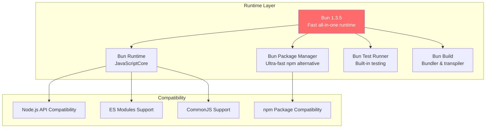
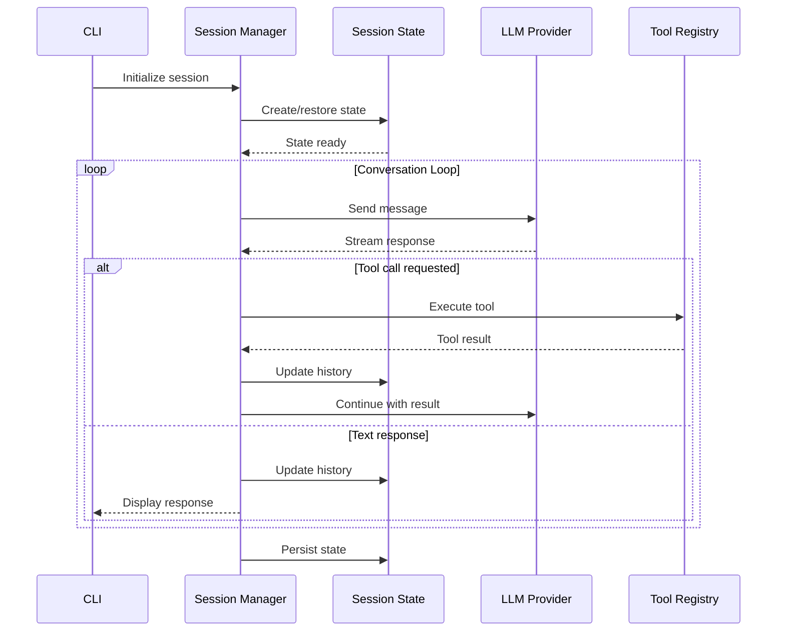
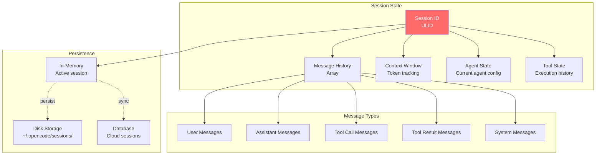
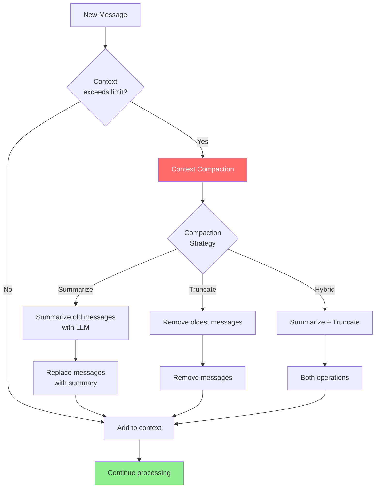
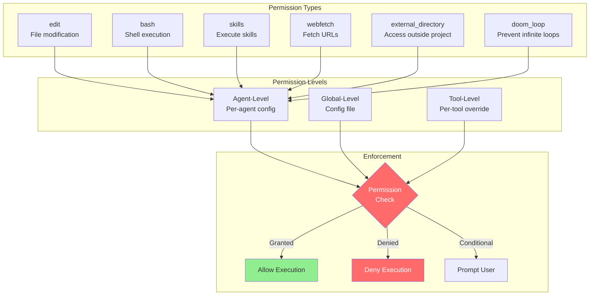
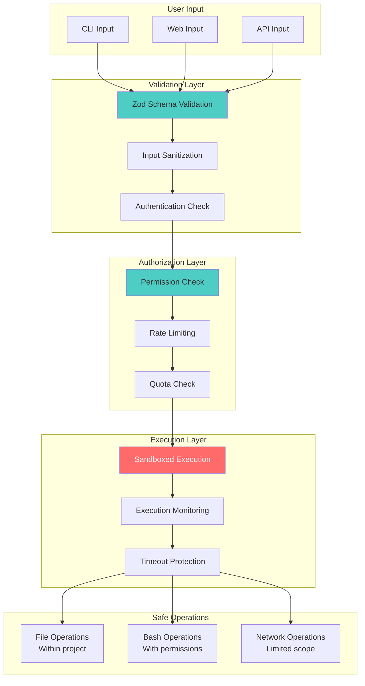
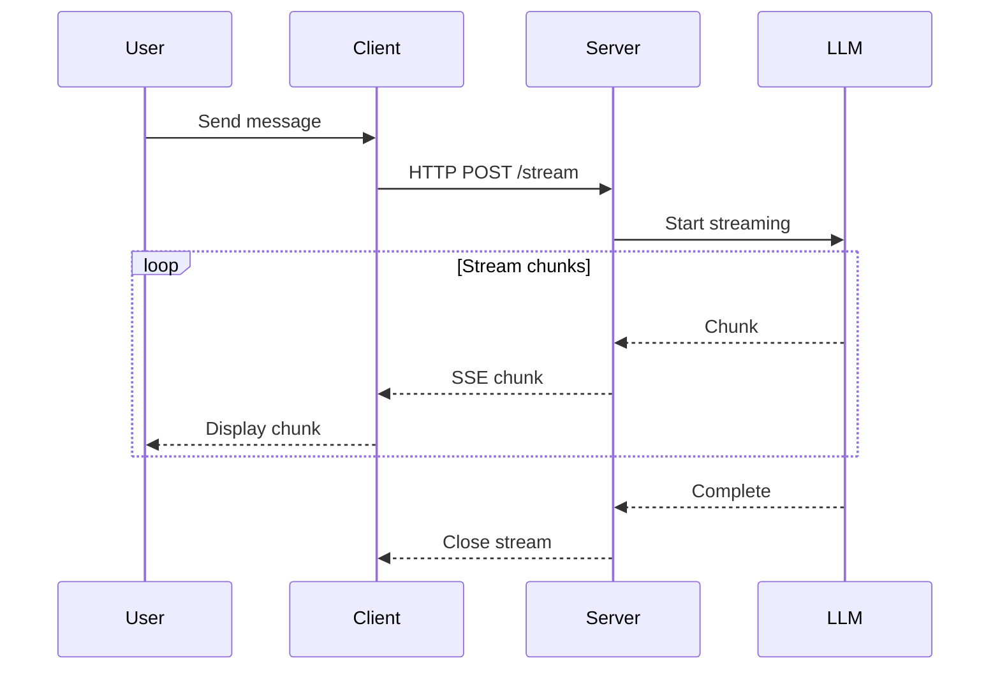
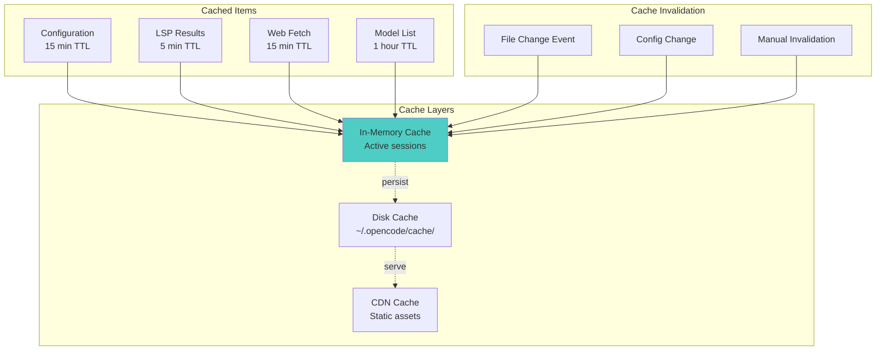
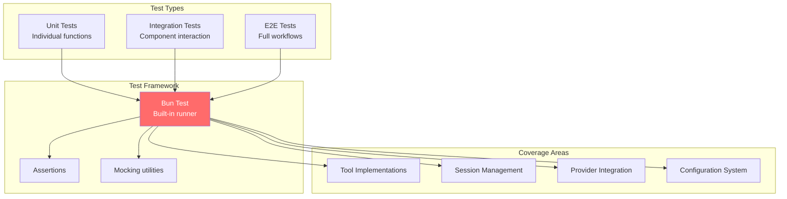

# OpenCode Technical Deep Dive

Advanced technical details and implementation patterns for developers who want to understand or build upon OpenCode.

## Table of Contents
1. [Technology Stack Details](#technology-stack-details)
2. [Core Implementation Patterns](#core-implementation-patterns)
3. [State Management](#state-management)
4. [Security & Permissions](#security--permissions)
5. [Performance Optimizations](#performance-optimizations)
6. [Testing Strategy](#testing-strategy)
7. [Code Examples](#code-examples)

---

## Technology Stack Details

### Runtime & Package Management



### Frontend Stack

```mermaid
graph TB
    subgraph "UI Framework"
        SolidJS[SolidJS 1.9.10<br/>Fine-grained reactivity]
        SolidStart[Solid Start<br/>Meta-framework]
        SolidRouter[Solid Router<br/>Routing]
        SolidMeta[Solid Meta<br/>SEO]
    end

    subgraph "Styling"
        Tailwind[Tailwind CSS 4.1.11<br/>Utility-first CSS]
        TailwindVite[@tailwindcss/vite<br/>Vite plugin]
        PostCSS[PostCSS<br/>CSS processing]
    end

    subgraph "UI Components"
        Kobalte[Kobalte 0.13.11<br/>Accessible components]
        CustomUI[Custom Components<br/>@opencode-ai/ui]
        Virtua[Virtua 0.42.3<br/>Virtual scrolling]
        SolidList[Solid List<br/>List virtualization]
    end

    subgraph "Build Tool"
        Vite[Vite 7.1.4<br/>Fast dev server]
        VitePluginSolid[vite-plugin-solid<br/>SolidJS integration]
        Esbuild[esbuild<br/>Fast bundler]
    end

    SolidJS --> SolidStart
    SolidJS --> SolidRouter
    SolidJS --> SolidMeta

    SolidJS --> Tailwind
    Tailwind --> TailwindVite
    Tailwind --> PostCSS

    SolidJS --> Kobalte
    SolidJS --> CustomUI
    SolidJS --> Virtua
    SolidJS --> SolidList

    SolidStart --> Vite
    Vite --> VitePluginSolid
    Vite --> Esbuild

    style SolidJS fill:#4ecdc4
    style Vite fill:#ff6b6b,color:#fff
```

### Backend Stack

```mermaid
graph TB
    subgraph "Web Framework"
        Hono[Hono 4.10.7<br/>Ultra-fast web framework]
        HonoOpenAPI[hono-openapi<br/>OpenAPI support]
        HonoValidators[Validators<br/>Zod & Standard Schema]
    end

    subgraph "Serverless Platform"
        Cloudflare[Cloudflare Workers<br/>Edge compute]
        WorkersTypes[@cloudflare/workers-types<br/>TypeScript types]
    end

    subgraph "Database"
        PlanetScale[PlanetScale<br/>Serverless MySQL]
        Drizzle[Drizzle ORM 0.41.0<br/>Type-safe ORM]
        DrizzleKit[Drizzle Kit<br/>Migrations]
    end

    subgraph "Infrastructure"
        SST[SST 3.17.23<br/>Infrastructure as Code]
        AWS[AWS Services<br/>S3, etc.]
    end

    Hono --> HonoOpenAPI
    Hono --> HonoValidators

    Hono --> Cloudflare
    Cloudflare --> WorkersTypes

    Cloudflare --> PlanetScale
    PlanetScale --> Drizzle
    Drizzle --> DrizzleKit

    Cloudflare --> SST
    SST --> AWS

    style Hono fill:#ff6b6b,color:#fff
    style Cloudflare fill:#4ecdc4
```

### AI & LLM Stack

```mermaid
graph TB
    subgraph "AI SDK Core"
        AISDK[AI SDK 5.0.97<br/>Vercel AI SDK]
        Streaming[Streaming Support]
        ToolCalling[Tool/Function Calling]
        MultiModal[Multi-modal Support]
    end

    subgraph "Provider SDKs"
        Anthropic[@ai-sdk/anthropic<br/>Claude]
        OpenAI[@ai-sdk/openai<br/>GPT-4]
        Google[@ai-sdk/google<br/>Gemini]
        Vertex[@ai-sdk/google-vertex<br/>Vertex AI]
        Azure[@ai-sdk/azure<br/>Azure OpenAI]
        Bedrock[@ai-sdk/amazon-bedrock<br/>Bedrock]
        Others[10+ other providers]
    end

    subgraph "Custom Providers"
        OpenRouter[@openrouter/ai-sdk-provider<br/>Multi-provider gateway]
        Compatible[@ai-sdk/openai-compatible<br/>Custom endpoints]
    end

    AISDK --> Streaming
    AISDK --> ToolCalling
    AISDK --> MultiModal

    AISDK --> Anthropic
    AISDK --> OpenAI
    AISDK --> Google
    AISDK --> Vertex
    AISDK --> Azure
    AISDK --> Bedrock
    AISDK --> Others

    AISDK --> OpenRouter
    AISDK --> Compatible

    style AISDK fill:#ff6b6b,color:#fff
```

---

## Core Implementation Patterns

### Pattern 1: Tool Definition

Every tool in OpenCode follows this pattern:

```typescript
// File: packages/opencode/src/tool/[toolname].ts

import { z } from 'zod'
import { tool } from 'ai'

// 1. Define Zod schema for parameters
export const ToolNameSchema = z.object({
  param1: z.string().describe('Description of param1'),
  param2: z.number().optional().describe('Optional param2'),
  options: z.object({
    flag: z.boolean().default(false)
  }).optional()
})

// 2. Define the tool implementation
export async function toolNameImpl(
  params: z.infer<typeof ToolNameSchema>,
  context: ToolContext // Session context
) {
  // Permission check (automatic via context)
  // Implementation logic
  const result = await doSomething(params)

  // Return result
  return {
    success: true,
    data: result
  }
}

// 3. Export as AI SDK tool
export const toolNameTool = tool({
  description: 'Tool description for LLM',
  parameters: ToolNameSchema,
  execute: toolNameImpl
})
```

### Pattern 2: Session-Based Architecture



### Pattern 3: Configuration Merging

```typescript
// Hierarchical configuration merging pattern

interface Config {
  agents?: Record<string, AgentConfig>
  providers?: ProviderConfig
  permissions?: PermissionConfig
  tools?: ToolConfig
}

async function loadConfig(): Promise<Config> {
  const configs: Config[] = []

  // 1. Environment variables
  configs.push(loadFromEnv())

  // 2. Global config (~/.opencode/)
  configs.push(await loadGlobalConfig())

  // 3. Project config (.opencode/)
  configs.push(await loadProjectConfig())

  // 4. Repository config (opencode.json)
  configs.push(await loadRepoConfig())

  // 5. Well-known endpoint
  configs.push(await loadWellKnownConfig())

  // Deep merge all configs (later overrides earlier)
  return deepMerge(...configs)
}
```

### Pattern 4: Streaming Response Handler

```typescript
// OpenCode's streaming pattern

async function streamLLMResponse(
  messages: Message[],
  tools: Tool[],
  onChunk: (chunk: string) => void
) {
  const result = await streamText({
    model: selectedModel,
    messages,
    tools,
    onChunk: ({ chunk }) => {
      if (chunk.type === 'text-delta') {
        onChunk(chunk.text)
      }
    },
    onFinish: ({ finishReason, usage }) => {
      // Handle completion
      if (finishReason === 'tool-calls') {
        // Execute tools
      }
    }
  })

  return result
}
```

---

## State Management

### Session State Structure



### Context Management & Compaction



### SolidJS Reactive State (Frontend)

```typescript
// OpenCode uses SolidJS signals for reactive state

import { createSignal, createEffect } from 'solid-js'

// Example from packages/app/
export function useSession() {
  const [messages, setMessages] = createSignal<Message[]>([])
  const [isStreaming, setIsStreaming] = createSignal(false)
  const [currentAgent, setCurrentAgent] = createSignal<Agent>()

  // Reactive effect
  createEffect(() => {
    const agent = currentAgent()
    if (agent) {
      // Update UI based on agent
    }
  })

  return {
    messages,
    addMessage: (msg: Message) => {
      setMessages([...messages(), msg])
    },
    isStreaming,
    setIsStreaming,
    currentAgent,
    setCurrentAgent
  }
}
```

---

## Security & Permissions

### Permission System Architecture



### Security Boundaries



---

## Performance Optimizations

### 1. Lazy Loading & Code Splitting

```typescript
// Dynamic imports for large modules
const loadLSP = async () => {
  const { LSPServer } = await import('./lsp/server')
  return new LSPServer()
}

// Only load when needed
if (needsLSP) {
  const lsp = await loadLSP()
}
```

### 2. Streaming Responses



### 3. Virtual Scrolling

```typescript
// Using Virtua for large lists in UI
import { VirtualScroller } from 'virtua'

<VirtualScroller
  data={messages()}
  itemHeight={60}
>
  {(message) => <MessageComponent message={message} />}
</VirtualScroller>
```

### 4. Caching Strategy



---

## Testing Strategy

### Test Structure



---

## Code Examples

### Example 1: Creating a Custom Tool

```typescript
// File: packages/opencode/src/tool/custom-tool.ts

import { z } from 'zod'
import { tool } from 'ai'
import type { ToolContext } from '../types'

// 1. Define schema
export const CustomToolSchema = z.object({
  query: z.string().describe('Search query'),
  filters: z.object({
    type: z.enum(['code', 'docs', 'tests']).optional(),
    limit: z.number().min(1).max(100).default(10)
  }).optional()
})

// 2. Implement logic
export async function customToolImpl(
  params: z.infer<typeof CustomToolSchema>,
  context: ToolContext
) {
  const { query, filters } = params

  // Access session context
  const { workingDirectory, permissions } = context

  // Check permissions (if needed)
  if (!permissions.customTool) {
    throw new Error('Custom tool permission denied')
  }

  // Implement your logic
  const results = await searchCodebase(
    workingDirectory,
    query,
    filters
  )

  return {
    results,
    count: results.length
  }
}

// 3. Export as tool
export const customTool = tool({
  description: 'Search codebase with custom filters',
  parameters: CustomToolSchema,
  execute: customToolImpl
})

// 4. Create description file
// File: packages/opencode/src/tool/custom-tool.txt
/*
Searches the codebase with custom filtering options.

Usage:
- query: The search query string
- filters.type: Filter by code, docs, or tests
- filters.limit: Maximum number of results (1-100)

Returns array of matching results with file paths and line numbers.
*/
```

### Example 2: Custom Agent Configuration

```json
// File: .opencode/config.json

{
  "agents": {
    "my-custom-agent": {
      "description": "Custom agent for specific tasks",
      "model": "claude-3-5-sonnet-20241022",
      "provider": "anthropic",
      "temperature": 0.7,
      "permissions": {
        "edit": true,
        "bash": false,
        "skills": true,
        "webfetch": true,
        "external_directory": false
      },
      "tools": {
        "enabled": ["read", "write", "grep", "glob", "websearch"],
        "disabled": ["bash", "task"]
      },
      "maxSteps": 25,
      "systemPrompt": "You are a specialized agent for..."
    }
  },
  "providers": {
    "anthropic": {
      "apiKey": "${ANTHROPIC_API_KEY}",
      "baseURL": "https://api.anthropic.com"
    }
  }
}
```

### Example 3: Session State Management

```typescript
// Simplified session state management

import { ulid } from 'ulid'

interface SessionState {
  id: string
  messages: Message[]
  agent: string
  workingDirectory: string
  createdAt: number
  updatedAt: number
}

class SessionManager {
  private sessions = new Map<string, SessionState>()

  createSession(
    agent: string,
    workingDirectory: string
  ): SessionState {
    const session: SessionState = {
      id: ulid(),
      messages: [],
      agent,
      workingDirectory,
      createdAt: Date.now(),
      updatedAt: Date.now()
    }

    this.sessions.set(session.id, session)
    return session
  }

  addMessage(
    sessionId: string,
    message: Message
  ): void {
    const session = this.sessions.get(sessionId)
    if (!session) throw new Error('Session not found')

    session.messages.push(message)
    session.updatedAt = Date.now()

    // Persist to disk
    this.persistSession(session)
  }

  private async persistSession(
    session: SessionState
  ): Promise<void> {
    const path = `~/.opencode/sessions/${session.id}.json`
    await Bun.write(path, JSON.stringify(session, null, 2))
  }
}
```

### Example 4: MCP Server Integration

```typescript
// Using MCP servers in your project

import { MCPClient } from '@modelcontextprotocol/sdk'

// Initialize MCP client
const mcpClient = new MCPClient({
  serverPath: '/path/to/mcp-server',
  serverArgs: ['--config', 'config.json']
})

// Connect to server
await mcpClient.connect()

// List available tools
const tools = await mcpClient.listTools()

// Call a tool
const result = await mcpClient.callTool({
  name: 'filesystem_read',
  arguments: {
    path: '/path/to/file'
  }
})

// Handle notifications
mcpClient.on('tools/list_changed', () => {
  // Refresh tool list
  refreshTools()
})
```

### Example 5: Provider Switching

```typescript
// Dynamic provider switching

import { createAnthropic } from '@ai-sdk/anthropic'
import { createOpenAI } from '@ai-sdk/openai'
import { createGoogleGenerativeAI } from '@ai-sdk/google'

type ProviderName = 'anthropic' | 'openai' | 'google'

function getProvider(name: ProviderName, config: ProviderConfig) {
  switch (name) {
    case 'anthropic':
      return createAnthropic({
        apiKey: config.apiKey,
        baseURL: config.baseURL
      })

    case 'openai':
      return createOpenAI({
        apiKey: config.apiKey,
        baseURL: config.baseURL
      })

    case 'google':
      return createGoogleGenerativeAI({
        apiKey: config.apiKey
      })

    default:
      throw new Error(`Unknown provider: ${name}`)
  }
}

// Usage
const provider = getProvider('anthropic', {
  apiKey: process.env.ANTHROPIC_API_KEY
})

const model = provider('claude-3-5-sonnet-20241022')
```

---

## Key Takeaways for Building Similar Systems

### 1. Architecture Principles

- **Modular Design**: Separate concerns into distinct packages
- **Provider Agnostic**: Abstract provider details behind unified interface
- **Permission Based**: Fine-grained control over capabilities
- **Streaming First**: Stream responses for better UX
- **Type Safe**: Use TypeScript and Zod for runtime safety

### 2. Performance Patterns

- **Lazy Loading**: Load modules only when needed
- **Virtual Scrolling**: Handle large lists efficiently
- **Caching**: Multi-layer caching strategy
- **Parallel Execution**: Run independent operations concurrently

### 3. Security Patterns

- **Input Validation**: Validate all inputs with schemas
- **Permission Checks**: Check before every sensitive operation
- **Sandboxing**: Isolate execution when possible
- **Rate Limiting**: Prevent abuse

### 4. Developer Experience

- **Clear Errors**: Provide helpful error messages
- **Type Safety**: Leverage TypeScript fully
- **Hot Reload**: Fast development iteration
- **Good Logging**: Comprehensive logging for debugging

---

## Files Worth Deep Study

1. **`packages/opencode/src/session/index.ts`** (Session orchestration)
   - Message handling
   - Context management
   - Tool execution coordination

2. **`packages/opencode/src/provider/provider.ts`** (Provider abstraction)
   - Multi-provider support
   - Model selection
   - Authentication handling

3. **`packages/opencode/src/agent/agent.ts`** (Agent system)
   - Permission system
   - Agent configuration
   - Custom agent support

4. **`packages/opencode/src/tool/task.ts`** (Sub-agent system)
   - Spawning specialized agents
   - Task delegation
   - Result aggregation

5. **`packages/app/src/pages/session.tsx`** (UI implementation)
   - SolidJS patterns
   - State management
   - Real-time updates

These patterns and implementations can be directly applied to your chatbot project!
