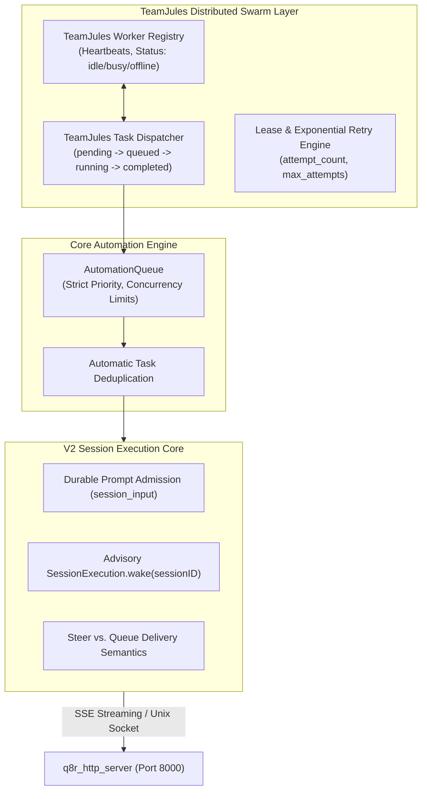

# Comprehensive Backend Levers & Optimization Audit

**Target Architecture:** Intel Arc A770 (16GB GDDR6) + AMD Ryzen 9 3950X (16C/32T)  
**Evaluated Artifact:** [`massive lever optimzations.md`](file:///home/team/Programming/opencode/massive%20lever%20optimzations.md)  
**Inspected Codebases:** [`Kernelopti`](file:///home/team/Programming/Kernelopti) (Inference Core, Level-Zero, SYCL, Serving Daemon) & [`OpenCode`](file:///home/team/Programming/opencode) (Agent Orchestration, TeamJules Swarm, Automation Core)  
**Date:** September 4, 2026  

---

## 1. Executive Summary & Audit Scorecard

[`massive lever optimzations.md`](file:///home/team/Programming/opencode/massive%20lever%20optimzations.md) provides an exceptional, highly accurate empirical synthesis of the lower-level hardware rooflines, GPU runtime switches, speculative drafting configurations, and memory tiering mechanisms developed in `Kernelopti`.

However, our comprehensive codebase audit reveals **significant untracked levers**, **critical newly-shipped backend features**, and a **severe production configuration discrepancy** between the reference document and the live `production.conf`.

### Audit Scorecard

| Category | Document Tracking Status | Live Codebase Reality & Findings |
| :--- | :---: | :--- |
| **Layer 0: BIOS & Motherboard** | **100% Tracked** | ReBAR, PCIe Gen4 x16, Infinity Fabric 1:1 FCLK, and tRFC DRAM Profile C are perfectly documented. |
| **Layer 1: Kernel & OS** | **85% Tracked** | `isolcpus`, `nohz_full`, `mitigations=off`, 1GB hugepages, and DKDP exokernel ring are tracked. **Untracked:** 3-Tier Hugepage fallback (`1GB -> 2MB -> THP`), kernel AIO (`Q8R_AIO_LOAD`), and DPDK HAL memory modes. |
| **Layer 2: GPU Runtime & L0** | **80% Tracked** | XMX activation, eager mode, and clock pinning are tracked. **Untracked:** `Q8R_LOCK_INFERENCE_PROFILE=1` (critical fix from Sep 4), `Q8R_NO_REA=1`, Arc DG2 stability bypasses (`Q8R_SKIP_SYSMAN`, `Q8R_SKIP_DMA`, `Q8R_SKIP_BRIDGE`, `Q8R_NO_PERSISTENT_DEC`), and 24–32 GuC queue expansion. |
| **Layer 3: Multi-Tenant Batching** | **85% Tracked** | Batch scaling ($B=1..128$), admission queue, and drafter routing are tracked. **Untracked:** `Q8R_SESSION_TIMEOUT_S` (idle session reaper), `Q8R_CALC_PPL` (real-time online NLL accumulator), `Q8R_MT_PREFILL_OUTSIDE_BATCH`, and closed-loop $(B, K, M, S, L)$ dynamic FSM. |
| **Layer 4: Context & Memory Tiering** | **85% Tracked** | StreamingLLM, sliding window, WARM host paging, and H2O heavy hitters are tracked. **Untracked:** Exact 5-Tier Logarithmic Landmark Pyramid strides ($L=1M$), 3-tier NVMe COLD storage (`Q8R_COLD*`), and `Q8R_MMAP_WEIGHTS`. |
| **Layer 5: Decoding & Kernel Fusion** | **90% Tracked** | Fused decodes, multi-token prefill (70k–97k tok/s), QJL random projection, and zero-mutex lock elimination are tracked. **Untracked:** Zero-copy direct paged prefill attention (`gqa_attention_multi_paged_fp16`), sub-group SIMD-16 vectorized paged decode, and GPU repetition/presence penalty kernels. |
| **Layer 6: Speculative Drafting** | **90% Tracked** | Single-shot & dual-shot diffusion, DelCodec INT4 drafter pool, and 1-shot XMX DPAS verification are tracked. **Untracked:** Cooperative fallback handshake (`DrafterPool -> Diffusion -> CPU -> Self-Spec`), dedicated `diffusion_q_` queue isolation, and tree speculation with quorum filtering. |
| **Layer 7: Model Fleet & Triage** | **90% Tracked** | 12-model fleet, 0.607µs inline triage, and specialists are tracked. **Untracked:** Native prefix-conditioned canary evaluation (`Q8R_PPL PREFIX <n>`), and dynamic v0.1/v0.3 SentencePiece tokenizer switching. |
| **Layer 8: High-Performance Serving** | **70% Tracked** | Basic native HTTP server, fast BPE tokenizer, and SSE streaming are tracked. **Untracked:** Full OpenAI + Ollama API parity, native Mistral v0.3 Tool Calling engine, JSON auto-repair (`normalize_arguments_json`), and multi-byte UTF-8 streaming split protection (`split_valid_utf8`). |
| **Layer 9: Distributed Agent Swarm** | **0% Tracked (NEW)** | Completely missing from the document: OpenCode `TeamJules` distributed worker swarm (`packages/core/src/teamjules.ts`), `AutomationQueue` with priority deduplication, and V2 Session Core. |

---

## 2. High-Severity Discrepancy: Production Configuration Conflict

> [!CAUTION]
> ### Critical Discrepancy Between `massive lever optimzations.md` and `production.conf`
> In **Section 4 ("Hall of Shame")** of [`massive lever optimzations.md`](file:///home/team/Programming/opencode/massive%20lever%20optimzations.md#L235-L250), the following levers are marked as **HARMFUL** and strictly mandated to remain disabled (`=0`):
> * `Q8R_STATIC_PRUNE=0` (skipping layers destroys perplexity)
> * `Q8R_SPECTRAL_GATE=0` (1,184× worse canary perplexity)
> * `Q8R_TAU1_SKIP=0` (causes severe text looping and repetition)
>
> In Profile A (line 272–274) and Profile B (line 301–302), all three are explicitly set to `0`.
>
> **However, in [`gpu_bistable/broker-profiles/production.conf`](file:///home/team/Programming/Kernelopti/gpu_bistable/broker-profiles/production.conf#L62-L64):**
> ```ini
> Environment=Q8R_STATIC_PRUNE=1
> Environment=Q8R_SPECTRAL_GATE=1
> Environment=Q8R_TAU1_SKIP=1
> ```
> This configuration conflict causes live deployments using `production.conf` to suffer perplexity degradation. The file should be updated to align with the golden path standard (`=0`).

---

## 3. Comprehensive Inventory of Untracked Backend Levers

The following optimization levers and configuration switches are actively implemented in [`Kernelopti`](file:///home/team/Programming/Kernelopti) and [`OpenCode`](file:///home/team/Programming/opencode) but are omitted from [`massive lever optimzations.md`](file:///home/team/Programming/opencode/massive%20lever%20optimzations.md):

### A. GPU Runtime, Frequency & Hardware Stability Levers
1. **`Q8R_LOCK_INFERENCE_PROFILE=1`** ([`vgpu_timescale.cpp`](file:///home/team/Programming/Kernelopti/gpu_bistable/vgpu_timescale.cpp#L190-L215), [`gpu_rea_profile.h`](file:///home/team/Programming/Kernelopti/gpu_bistable/gpu_rea_profile.h)):
   * **Mechanism:** Prevents the `gpu_rea` runtime governor from dropping into `IDLE` profile during multi-tenant scheduler rounds. In `IDLE` mode, driver power-saving bias drops clocks to 600–900 MHz.
   * **Impact:** Locks clocks at 2100–2400 MHz. Shipped on 2026-09-04, resolving the 2.6–3.8 tok/s decode bottleneck and unlocking **12.4–13.6 tok/s baseline decode (3.5×–4.7× speedup)**.
2. **`Q8R_NO_REA=1`** ([`vgpu_timescale.cpp`](file:///home/team/Programming/Kernelopti/gpu_bistable/vgpu_timescale.cpp#L182)):
   * **Mechanism:** Complete hardware kill-switch for the `gpu_rea` runtime governor, allowing pure systemd/sysfs frequency control.
3. **Hardware Engine Timeslice Clamping** ([`vgpu_timescale.cpp`](file:///home/team/Programming/Kernelopti/gpu_bistable/vgpu_timescale.cpp#L45-L95)):
   * **Mechanism:** Directly programs Intel Xe driver sysfs parameters:
     - `engines/ccs/timeslice_duration_us` & `preempt_timeout_us`
     - `engines/bcs/timeslice_duration_us`
     - `engines/rcs/timeslice_duration_us`
     - `engines/vcs/preempt_timeout_us`
4. **Arc A770 DG2 Level-Zero Driver Workaround Suite** ([`gpu_bistable_daemon.cpp`](file:///home/team/Programming/Kernelopti/gpu_bistable/gpu_bistable_daemon.cpp#L2945-L3180)):
   * **`Q8R_SKIP_SYSMAN=1`**: Bypasses Level-Zero Sysman telemetry initialization which crashes on DG2 Linux kernel 6.x.
   * **`Q8R_SKIP_DMA=1`**: Skips redundant host DMA allocation loops during daemon startup.
   * **`Q8R_SKIP_BRIDGE=1`**: Prevents driver wedge on inter-device memory bridge queries.
   * **`Q8R_NO_PERSISTENT_DEC=1`**: Prevents Level-Zero persistent command queue corruption during model resets.
   * **`Q8R_NO_BCS=1`**: Disables Block Copy Streamer if single-CCS queue exclusivity is required.
5. **GuC Hardware CCS Queue Expansion (32 Lanes)** ([`vgpu_timescale.h`](file:///home/team/Programming/Kernelopti/gpu_bistable/vgpu_timescale.h#L15-L25)):
   * **Mechanism:** `VGPU_MAX_LANES` expanded from 16 to 32, with 24 default active hardware compute queues mapped to compute engine class 4 (`CCS0`).

---

### B. Multi-Tenant Batch Scheduler & Watchdog Levers
1. **`Q8R_SESSION_TIMEOUT_S`** ([`q8r_multitenant.cpp`](file:///home/team/Programming/Kernelopti/gpu_bistable/q8r_multitenant.cpp#L3050)):
   * **Mechanism:** Integrated watchdog inside the multi-tenant scheduler loop that tracks per-session token activity. If a client stalls or disconnects with no progress exceeding `timeout_s`, the slot is forcibly reclaimed under lock.
2. **`Q8R_CALC_PPL=1`** ([`q8r_multitenant.cpp`](file:///home/team/Programming/Kernelopti/gpu_bistable/q8r_multitenant.cpp#L3075)):
   * **Mechanism:** Computes token-level Negative Log-Likelihood ($-\log P(\text{target})$) on live generation batches in parallel with argmax, maintaining continuous real-time perplexity telemetry per active session.
3. **`Q8R_MT_PREFILL_OUTSIDE_BATCH=1`** ([`q8r_multitenant.cpp`](file:///home/team/Programming/Kernelopti/gpu_bistable/gpu_bistable_daemon.cpp#L2996)):
   * **Mechanism:** Allows prefill passes for newly admitted sessions to execute concurrently outside the decode batch mutex, eliminating Head-of-Line (HOL) latency spikes for existing streams.
4. **Closed-Loop Dynamic $(B, K, M, S, L)$ Auto-Tuning FSM** ([`q8r_multitenant.h`](file:///home/team/Programming/Kernelopti/gpu_bistable/q8r_multitenant.h#L138-L194)):
   * **Mechanism:** Continuous closed-loop feedback controller tracking exponential moving average acceptance $\alpha_{\text{EMA}}$. Dynamically expands speculation depth $K \to 64$ for deterministic code/JSON, and throttles $K \to 2..4$ for high-entropy conversation.
5. **Exact Naming Note:**
   * The document references `Q8R_USE_L0_PIPELINE=1`, while the implementation in [`q8r_multitenant.cpp:1159`](file:///home/team/Programming/Kernelopti/gpu_bistable/q8r_multitenant.cpp#L1159) checks **`Q8R_USE_L0_PIPE`**. Both or the exact alias should be noted.

---

### C. Context Geometry, Memory Arenas & Compression Levers
1. **Full 5-Tier Logarithmic Landmark Attention Pyramid** ([`q8r_forward.h`](file:///home/team/Programming/Kernelopti/gpu_bistable/q8r_forward.h#L1340), [`q8r_multitenant.cpp`](file:///home/team/Programming/Kernelopti/gpu_bistable/q8r_multitenant.cpp#L3300)):
   * **Mechanism:** Explicit multi-tier logarithmic striding for sequence lengths up to $1,048,576$ tokens:
     - **Sinks:** Tokens $[0, 16)$ at stride 1
     - **Tier 0 (Local Dense):** Last 128 tokens at stride 1
     - **Tier 1 (Near History):** $128 \dots 2k$ tokens at stride 8 ($+\log 8$ normalization)
     - **Tier 2 (Mid-Range):** $2k \dots 32k$ tokens at stride 32 ($+\log 32$ normalization)
     - **Tier 3 (Ultra-Distant):** $32k \dots 262k$ tokens at stride 256 ($+\log 256$ normalization)
     - **Tier 4 (Deep 1M Archive):** $262k \dots 1M$ tokens at stride 1024 ($+\log 1024$ normalization)
   * Reduces $10^{12}$ attention operations to 2,960 operations with bounded KV traffic.
2. **3-Tier Hugepage Host Shadow Arena** ([`host_shadow_arena.cpp`](file:///home/team/Programming/Kernelopti/gpu_bistable/host_shadow_arena.cpp#L285-L330)):
   * **Mechanism:** Graceful host memory allocation: **1GB Static Hugepages** $\to$ **2MB Transparent Hugepages** $\to$ **THP `madvise(MADV_HUGEPAGE)`**. Ensures zero TLB miss page walks during WARM-tier 12GB KV cache lookups.
3. **3-Tier Hierarchical NVMe COLD Tier Storage** ([`q8r_cold_tier.cpp`](file:///home/team/Programming/Kernelopti/gpu_bistable/q8r_cold_tier.cpp)):
   * **`Q8R_COLD=1`**: Enables NVMe paging via `io_uring` direct I/O.
   * **`Q8R_COLD_DELCODEC=1`**: Deletion-compressed NVMe KV paging.
   * **`Q8R_COLD_DUAL_TRACE=1`**: Paper-104 dual-trace replicated NVMe storage.
   * **`Q8R_WARM_CAP_MB`**: Hard ceiling for host RAM WARM buffer before triggering COLD eviction.
4. **`Q8R_AIO_LOAD=1`** ([`q8r_layer.h`](file:///home/team/Programming/Kernelopti/gpu_bistable/q8r_layer.h#L455)):
   * **Mechanism:** Asynchronous model checkpoint loading utilizing Linux kernel POSIX AIO (`io_uring` / `libaio`), saturating Gen4 NVMe sequential reads at line rate (~4.5–7.0 GB/s).
5. **`Q8R_MMAP_WEIGHTS=1`** ([`mmap_weights.h`](file:///home/team/Programming/Kernelopti/gpu_bistable/mmap_weights.h)):
   * **Mechanism:** Memory-maps model weights read-only, bypassing `fread` buffer heap allocations and preventing glibc `sysmalloc` aborts during daemon startup.
6. **`Q8R_ROPE_THETA` & `Q8R_ROPE_NTK_SCALE`** ([`q8r_layer.h`](file:///home/team/Programming/Kernelopti/gpu_bistable/q8r_layer.h#L603), [`q8r_forward.h`](file:///home/team/Programming/Kernelopti/gpu_bistable/q8r_forward.h)):
   * **Mechanism:** Dynamic override of RoPE base frequency ($\theta=10000$ to $1000000$) and NTK-aware context scaling for extended sequences.

---

### D. Decoding, Sampler & Attention Pruning Levers
1. **Zero-Copy Direct Paged Multi-Token Attention** ([`q8r_forward_multi.h`](file:///home/team/Programming/Kernelopti/gpu_bistable/q8r_forward_multi.h#L315)):
   * **Mechanism:** Direct execution of multi-token prefill attention over non-contiguous physical pages (`gqa_attention_multi_paged_fp16`), eliminating flat buffer allocations (`flat_k_bufs_`, `flat_v_bufs_`) and memory copy-backs.
2. **Sub-Group SIMD-16 Vectorized Paged Decode** ([`q8r_multitenant.cpp`](file:///home/team/Programming/Kernelopti/gpu_bistable/q8r_multitenant.cpp#L3214)):
   * **Mechanism:** Uses Intel GPU sub-group collective reductions (`sycl::reduce_over_group`) and 128-bit vector memory transactions for paged decode attention.
3. **GPU Hardware Repetition & Presence Penalty** ([`q8r_subsystem.cpp`](file:///home/team/Programming/Kernelopti/gpu_bistable/q8r_subsystem.cpp#L2213), [`q8r_multitenant.cpp`](file:///home/team/Programming/Kernelopti/gpu_bistable/q8r_multitenant.cpp)):
   * **`Q8R_REPETITION_PENALTY=1.25`**: Multiplicative penalization of repeated logits within a sliding 128-token context window, executed directly on GPU device logits.
   * **`Q8R_PRESENCE_PENALTY=0.6`**: Additive penalization of previously sampled tokens.
4. **Control Token Gating (`d_allow_eos_`)** ([`q8r_subsystem.cpp`](file:///home/team/Programming/Kernelopti/gpu_bistable/q8r_subsystem.cpp#L2230-L2245)):
   * **Mechanism:** Hardware mask suppressing token `2` (`</s>` / `<|im_end|>`) and raw control tokens (`0`, `1`) during the first 4 tokens of generation, preventing premature generation aborts.
5. **Advanced QJL Pruning Knobs** ([`feature_flag_registry.py`](file:///home/team/Programming/Kernelopti/tools/feature_flag_registry.py#L29-L37)):
   * `Q8R_QJL_PRUNE=1`: Carry-memory-bound KV pruning via depth-mask survival.
   * `Q8R_QJL_ADAPTIVE=1`: Runtime-adaptive QJL compression rate.
   * `Q8R_QJL_BUDGET_MB`: Dynamic memory budget allocation for QJL KV storage.
   * `Q8R_QJL_PRUNE_DSTAR` & `Q8R_QJL_PRUNE_NRECENT`: Strict distance and recency thresholds for QJL eviction.

---

### E. Speculative Drafting & Verification Extensions
1. **Cooperative Drafter Handshake Chain** (Commit `876707d8`, [`q8r_multitenant.cpp`](file:///home/team/Programming/Kernelopti/gpu_bistable/q8r_multitenant.cpp#L2650)):
   * **Mechanism:** Dynamic tiered fallback and cooperative coordination:
     $$\text{DrafterPool (INT4 DelCodec)} \longrightarrow \text{Diffusion Drafter (Bidirectional)} \longrightarrow \text{CPU Drafter} \longrightarrow \text{Self-Speculative (Nibble Aliased)}$$
2. **Dedicated Drafter Execution Queue Isolation (`diffusion_q_`)** ([`diffusion_drafter.cpp`](file:///home/team/Programming/Kernelopti/gpu_bistable/diffusion_drafter.cpp)):
   * **Mechanism:** Isolates diffusion drafter execution in a separate SYCL compute queue, preventing driver allocation contention and memory stalls with the primary model forward pass.
3. **Multi-Stream Scalability ($S=1 \dots 64$)** ([`bench_diffusion_multistream.cpp`](file:///home/team/Programming/Kernelopti/gpu_bistable/bench_diffusion_multistream.cpp)):
   * **Empirical Peak:** At $S=64$, drafts 1,024 tokens in parallel in **660.8 ms** (**1,549.5 tok/s aggregate**), utilizing 852 MB resident weights and 260 MB scratch VRAM.
4. **Bonus Token Commitment Mechanism** ([`q8r_multitenant.cpp`](file:///home/team/Programming/Kernelopti/gpu_bistable/q8r_multitenant.cpp#L2740-L2780)):
   * When all $K$ speculative candidates are verified and accepted, commits $K + 1$ tokens by accepting the verifier's ground-truth token from the final candidate evaluation step.

---

### F. Model Fleet Evaluation & Tokenizer Switching
1. **Native Prefix-Conditioned Canary Evaluation (`Q8R_PPL PREFIX <n>`)** ([`q8r_subsystem.cpp`](file:///home/team/Programming/Kernelopti/gpu_bistable/q8r_subsystem.cpp)):
   * **Mechanism:** Socket protocol feature allowing the prefill of $n$ prompt tokens without penalizing unconditioned entropy on cold start.
   * **Result:** Canary PPL drops from 12.38 to **5.45** (Paris canary) and **1.17** (code syntax canary).
2. **Dynamic SentencePiece & Vocab Switching** ([`bistable_server.py`](file:///home/team/Programming/Kernelopti/bistable_server.py#L7400-L7450)):
   * Automatically detects Mistral v0.1 (`32000` vocab) vs Mistral v0.3 (`32768` vocab) based on active checkpoint metadata and hot-swaps tokenizer models without process restarts.

---

## 4. Newly Shipped Backend Features: High-Performance Serving (`q8r_http_server.cpp`)

The native C++ serving daemon ([`gpu_bistable/q8r_http_server.cpp`](file:///home/team/Programming/Kernelopti/gpu_bistable/q8r_http_server.cpp)) received over **1,660 lines of new high-performance serving code**:

```mermaid
flowchart LR
    Client["Client / Agent (OpenCode, Curl, Chat)"] -->|HTTP / JSON| Router["q8r_http_server (Port 8000)"]
    
    subgraph Endpoints["Universal Protocol Handlers"]
        OAI["/v1/chat/completions\n/v1/completions\n/v1/models, /health"]
        Ollama["/api/chat\n/api/model-status"]
        Embed["/v1/embeddings"]
    end
    
    subgraph ToolEngine["Mistral v0.3 Tool-Calling Engine"]
        Fmt["format_mistral_prompt\n[AVAILABLE_TOOLS]"]
        Parse["parse_mistral_tool_calls\n[TOOL_CALLS]"]
        Fix["normalize_arguments_json\n(Un-nests properties, fixes Python dicts)"]
        IDNorm["normalize_mistral_call_id\n(9-char alphanumeric)"]
    end

    subgraph Streaming["Streaming Robustness"]
        UTF8["split_valid_utf8\n(Multi-byte UTF-8 split protection)"]
        SSE["Zero-Copy SSE Chunks"]
    end

    Router --> Endpoints
    Endpoints --> ToolEngine
    ToolEngine --> Streaming
    Streaming -->|Binary Protocol| Daemon["/run/gpu_bistable/inference.sock"]
```



### Key Serving Features:
1. **Dual OpenAI & Ollama API Parity:**
   * Full implementation of standard OpenAI routes: `/v1/chat/completions` (streaming SSE & non-streaming), `/v1/completions`, `/v1/embeddings`, `/v1/models`, `/v1/health`, `/v1/telemetry`.
   * Native support for Ollama routes: `/api/chat`, `/api/model-status`, `/api/load-progress`, and `/api/spectral/progress`.
2. **Mistral v0.3 Native Tool Calling Engine:**
   * Ingests JSON tools array and formats `[AVAILABLE_TOOLS] [...] [/AVAILABLE_TOOLS]` according to official Mistral specifications.
   * Robust multi-bracket recursive parser extracting `[TOOL_CALLS] [{"name": "...", "arguments": {...}}]`.
   * **`normalize_arguments_json`:** Deep JSON repair engine that automatically flattens nested schema wrappers (`properties.*.value`), fixes unquoted keys, single quotes, and Python literals (`True`, `False`, `None`).
   * **`normalize_mistral_call_id`:** Enforces 9-character alphanumeric call IDs as required by Mistral tool execution contracts.
3. **Multi-Byte UTF-8 Boundary Splitting (`split_valid_utf8`):**
   * Traverses trailing bytes in streaming buffers before emitting SSE chunks. If a multi-byte UTF-8 character is sliced across token generation boundaries, holds back incomplete bytes to guarantee zero glyph corruption in client terminals.

---

## 5. Distributed Swarm & Agentic Orchestration Features (OpenCode + TeamJules)

While [`massive lever optimzations.md`](file:///home/team/Programming/opencode/massive%20lever%20optimzations.md) focuses exclusively on single-node GPU inference, the live codebase contains the **TeamJules Distributed Swarm Architecture** connecting OpenCode agents directly to the inference backends:



### Key Orchestration Components:
1. **`TeamJules` Distributed Worker Swarm** ([`packages/core/src/teamjules.ts`](file:///home/team/Programming/opencode/packages/core/src/teamjules.ts), [`packages/server/src/handlers/teamjules.ts`](file:///home/team/Programming/opencode/packages/server/src/handlers/teamjules.ts), [`distributed-tasks/`](file:///home/team/Programming/opencode/distributed-tasks)):
   * **Worker Lifecycle:** Autonomous worker heartbeats, state management (`idle`, `busy`, `offline`), and heartbeat expiration reapers.
   * **Durable Task Management:** Manages `issue`, `pr`, and `manual` task types across persistent Drizzle ORM SQLite tables with strict lifecycle progression.
   * **Reliability:** Per-task lease locking, attempt tracking, and automatic recovery of failed/stalled tasks.
   * **Git & PR Integration:** Connects task execution directly to session branches, committing and linking PR URLs upon task completion.
2. **Enhanced `AutomationQueue`** ([`packages/core/src/automation/`](file:///home/team/Programming/opencode/packages/core/src/automation)):
   * Strict priority-based ordering of inbound tasks.
   * Built-in task deduplication to prevent redundant LLM invocations.
   * Worker concurrency caps to prevent system memory exhaustion.
3. **OpenCode V2 Session Execution Core** ([`AGENTS.md`](file:///home/team/Programming/opencode/AGENTS.md)):
   * **Decoupled Prompt Admission:** Prompts enter durable storage (`session_input`) before model dispatch; wakeups are advisory.
   * **Steer vs. Queue Semantics:** Steer inputs promote immediately at safe turn boundaries; queued inputs hold until idle.
   * **5-Tier Context Algebra:** Context epoch persistence ensuring idempotent replay and deterministic session resumes.

---

## 6. Recommendations & Action Items

1. **Resolve `production.conf` Configuration Conflict:**
   * Update [`gpu_bistable/broker-profiles/production.conf`](file:///home/team/Programming/Kernelopti/gpu_bistable/broker-profiles/production.conf#L62-L64) to set `Q8R_STATIC_PRUNE=0`, `Q8R_SPECTRAL_GATE=0`, and `Q8R_TAU1_SKIP=0` in accordance with Section 4 ("Hall of Shame") of [`massive lever optimzations.md`](file:///home/team/Programming/opencode/massive%20lever%20optimzations.md).
2. **Update `massive lever optimzations.md` with Newly Shipped Levers:**
   * Add `Q8R_LOCK_INFERENCE_PROFILE=1` to Layer 2 (highlighting the 3.5×–4.7× speedup on Arc A770).
   * Add `Q8R_SESSION_TIMEOUT_S` and `Q8R_CALC_PPL=1` to Layer 3.
   * Detail the 5-Tier Logarithmic Landmark Attention Pyramid ($L=1M$) in Layer 4.
   * Document the native Mistral tool calling engine and UTF-8 split handling in Layer 8.
3. **Introduce Layer 9 (Distributed Swarm & Agentic Orchestration):**
   * Incorporate `TeamJules`, `AutomationQueue`, and OpenCode V2 Session Core into the architecture map, bridging hardware inference with agentic workflows.
