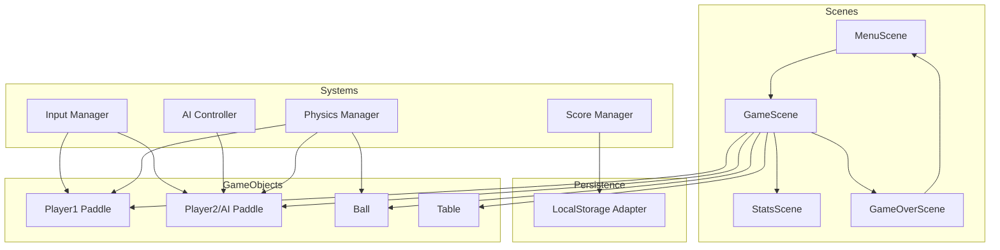

# Pingpong - Technical Design Document

> Generated from specification by DesignCraft
> Version: 1.0
> Date: 2026-01-12

## 1. Executive Summary

Pingpong is a browser-based table tennis video game targeting casual gamers. The application supports single-player mode with an AI opponent (5 difficulty levels) and 2-player local multiplayer. The game uses simple ball physics, keyboard controls, and first-to-11 scoring.

**Key Architectural Decisions:**

- **Phaser 3** as the game framework (proven, well-documented, optimal for 2D games)
- **Single HTML5 application** with no backend requirements
- **Browser LocalStorage** for persistence (high scores, player stats)
- **Entity-Component pattern** for game objects (paddle, ball, AI)

The architecture prioritizes simplicity and performance, targeting 60 FPS on modern browsers with minimal overhead.

## 2. Application Type & Context

### 2.1 Application Classification

**Web App** - Single-page browser game (static client-side application)

### 2.2 Key Characteristics

- **Target Platform(s)**: Modern web browsers (Chrome, Firefox, Safari, Edge)
- **Deployment Model**: Static file hosting (CDN, GitHub Pages, Netlify, or any static host)
- **Scale Expectations**: Single user per instance, no concurrent user concerns
- **Connectivity Requirements**: Fully offline-capable after initial load

## 3. System Architecture

### 3.1 Architecture Style

**Monolithic Client-Side Application** - All game logic, rendering, and state management runs in the browser. No server-side components required.

### 3.2 System Context Diagram (C4 Level 1)

```
┌─────────────────────────────────────────────────────────────┐
│                        Browser                               │
│  ┌─────────────────────────────────────────────────────┐    │
│  │                  Pingpong Game                       │    │
│  │                                                      │    │
│  │   Player(s) ──keyboard──> Game Engine               │    │
│  │                              │                       │    │
│  │                              ▼                       │    │
│  │                         Canvas/WebGL                 │    │
│  │                              │                       │    │
│  │                              ▼                       │    │
│  │                      LocalStorage                    │    │
│  │                    (Stats, High Scores)              │    │
│  └─────────────────────────────────────────────────────┘    │
└─────────────────────────────────────────────────────────────┘
```

### 3.3 Container Diagram (C4 Level 2)

```
┌──────────────────────────────────────────────────────────────┐
│                      Web Browser                              │
│                                                               │
│  ┌────────────────────────────────────────────────────────┐  │
│  │                   Pingpong Application                  │  │
│  │                                                         │  │
│  │  ┌─────────────┐  ┌─────────────┐  ┌───────────────┐   │  │
│  │  │   Phaser    │  │    Game     │  │   UI/Menu     │   │  │
│  │  │   Engine    │◄─┤   Scenes    │◄─┤   System      │   │  │
│  │  └──────┬──────┘  └──────┬──────┘  └───────────────┘   │  │
│  │         │                │                              │  │
│  │         ▼                ▼                              │  │
│  │  ┌─────────────┐  ┌─────────────┐                      │  │
│  │  │   Canvas    │  │   State     │                      │  │
│  │  │  Renderer   │  │  Manager    │                      │  │
│  │  └─────────────┘  └──────┬──────┘                      │  │
│  │                          │                              │  │
│  │                          ▼                              │  │
│  │                   ┌─────────────┐                      │  │
│  │                   │LocalStorage │                      │  │
│  │                   │  Adapter    │                      │  │
│  │                   └─────────────┘                      │  │
│  └────────────────────────────────────────────────────────┘  │
└──────────────────────────────────────────────────────────────┘
```

## 4. Component Design

### 4.1 Component Overview

| Component            | Purpose                                                |
| -------------------- | ------------------------------------------------------ |
| Game Engine (Phaser) | Core game loop, physics, rendering, input handling     |
| Scene Manager        | Manages game states (menu, gameplay, stats, game over) |
| Paddle System        | Player and AI paddle logic                             |
| Ball System          | Ball physics and collision detection                   |
| AI Controller        | Computer opponent with 5 difficulty levels             |
| Score Manager        | Tracks points, determines winner                       |
| Stats/Storage        | Persists high scores and player statistics             |
| UI System            | Menus, HUD, stats display                              |

### 4.2 Component Diagram (C4 Level 3)



### 4.3 Component Details

#### 4.3.1 Scene Manager

- **Responsibility**: Controls game flow between menu, gameplay, stats, and game over states
- **Technology**: Phaser Scene system
- **Dependencies**: All scenes, State Manager
- **Interfaces**: `changeScene(sceneName, data)`

#### 4.3.2 Game Scene

- **Responsibility**: Main gameplay loop, spawns game objects, handles collisions
- **Technology**: Phaser Scene with Arcade Physics
- **Dependencies**: Paddle System, Ball System, Score Manager, Input Manager
- **Interfaces**: `start(mode, difficulty)`, `pause()`, `resume()`, `end()`

#### 4.3.3 Paddle System

- **Responsibility**: Manages paddle movement, boundaries, and collision boxes
- **Technology**: Phaser Sprite with Arcade Physics body
- **Dependencies**: Input Manager (for player paddles), AI Controller (for AI paddle)
- **Interfaces**: `moveUp()`, `moveDown()`, `setPosition(y)`, `getBounds()`

#### 4.3.4 Ball System

- **Responsibility**: Ball movement, speed, direction, collision response
- **Technology**: Phaser Sprite with Arcade Physics body
- **Dependencies**: Physics Manager, Paddle System (for collisions)
- **Interfaces**: `serve(direction)`, `reset()`, `getVelocity()`

#### 4.3.5 AI Controller

- **Responsibility**: Controls AI paddle based on ball position and difficulty level
- **Technology**: Custom TypeScript class
- **Dependencies**: Ball System (reads position), Paddle System (controls AI paddle)
- **Interfaces**: `update(ballPosition, deltaTime)`, `setDifficulty(level)`

**Difficulty Levels:**
| Level | Reaction Speed | Prediction Accuracy | Error Rate |
|-------|---------------|---------------------|------------|
| 1 (Easy) | 40% | Low | 30% |
| 2 | 55% | Medium-Low | 20% |
| 3 (Medium) | 70% | Medium | 15% |
| 4 | 85% | Medium-High | 8% |
| 5 (Hard) | 95% | High | 3% |

#### 4.3.6 Score Manager

- **Responsibility**: Tracks current score, determines point winner, triggers game end
- **Technology**: Custom TypeScript class
- **Dependencies**: LocalStorage Adapter
- **Interfaces**: `addPoint(player)`, `getScore()`, `isGameOver()`, `reset()`

#### 4.3.7 LocalStorage Adapter

- **Responsibility**: Persists and retrieves high scores and player stats
- **Technology**: Browser LocalStorage API wrapper
- **Dependencies**: None
- **Interfaces**: `saveStats(data)`, `loadStats()`, `saveHighScore(score)`, `getHighScores()`

#### 4.3.8 Input Manager

- **Responsibility**: Maps keyboard input to game actions
- **Technology**: Phaser Input system
- **Dependencies**: None
- **Interfaces**: `isKeyDown(key)`, `getP1Controls()`, `getP2Controls()`

**Control Mapping:**
| Player | Up | Down |
|--------|-----|------|
| Player 1 | W | S |
| Player 2 | Arrow Up | Arrow Down |

## 5. Data Architecture

### 5.1 Data Model

```
┌─────────────────────────────────────────┐
│             GameState                    │
├─────────────────────────────────────────┤
│ mode: 'single' | 'multi'                │
│ difficulty: 1-5 (single-player only)    │
│ player1Score: number                    │
│ player2Score: number                    │
│ isPaused: boolean                       │
│ currentServer: 1 | 2                    │
└─────────────────────────────────────────┘

┌─────────────────────────────────────────┐
│           PersistedStats                 │
├─────────────────────────────────────────┤
│ highScores: HighScoreEntry[]            │
│ gamesPlayed: number                     │
│ gamesWon: number                        │
│ totalPoints: number                     │
│ longestRally: number                    │
└─────────────────────────────────────────┘

┌─────────────────────────────────────────┐
│          HighScoreEntry                  │
├─────────────────────────────────────────┤
│ playerName: string                      │
│ score: number (opponent score at win)   │
│ difficulty: number                      │
│ date: string (ISO 8601)                 │
└─────────────────────────────────────────┘
```

### 5.2 Data Storage Strategy

- **Primary Database**: Browser LocalStorage (key-value JSON)
- **Caching Strategy**: In-memory state during gameplay, persist on game end
- **File Storage**: N/A
- **Data Retention**: Indefinite (user can clear via browser settings)

**LocalStorage Keys:**
| Key | Description | Max Size |
|-----|-------------|----------|
| `pingpong_stats` | Player statistics | ~1KB |
| `pingpong_highscores` | Top 10 high scores | ~2KB |
| `pingpong_settings` | Audio, difficulty preferences | ~500B |

### 5.3 Data Flow

```
Game Start
    │
    ▼
Load Settings & Stats from LocalStorage
    │
    ▼
Initialize GameState (in-memory)
    │
    ▼
┌───────────────────┐
│   Gameplay Loop   │◄────────────────┐
│   (60 FPS)        │                 │
│   - Update ball   │                 │
│   - Update paddles│                 │
│   - Check collisions                │
│   - Update score  │                 │
└─────────┬─────────┘                 │
          │                           │
          ▼                           │
    Point Scored?───No────────────────┘
          │
         Yes
          │
          ▼
    Update Score
          │
          ▼
    Game Over?───No───> Show Stats ───┘
          │
         Yes
          │
          ▼
    Persist Stats to LocalStorage
          │
          ▼
    Show Game Over Screen
```

## 6. API Design

### 6.1 API Style

N/A - No external APIs. All logic is client-side.

### 6.2 Key Endpoints/Commands

N/A - Single-page application with no server communication.

### 6.3 Authentication & Authorization

N/A - No user accounts. All data is local to the browser.

## 7. Security Considerations

### 7.1 Security Architecture

Minimal attack surface as a static, offline-capable game with no network communication or user authentication.

### 7.2 Data Protection

- **At Rest**: LocalStorage (unencrypted, but contains no sensitive data)
- **In Transit**: N/A (no network requests after initial load)
- **Sensitive Data Handling**: N/A (no PII collected)

### 7.3 Access Control

N/A - Single-user, local gameplay only.

**Minor Considerations:**

- Sanitize player name input for high scores (prevent XSS if rendering)
- Validate LocalStorage data on load (handle corrupted data gracefully)

## 8. Infrastructure & Deployment

### 8.1 Deployment Architecture

```
┌─────────────────────────────────────────────────────────┐
│                   Static Hosting                         │
│            (GitHub Pages / Netlify / Vercel)             │
│                                                          │
│  ┌──────────────────────────────────────────────────┐   │
│  │                   CDN Edge                        │   │
│  │                                                   │   │
│  │   index.html                                      │   │
│  │   game.js (bundled)                               │   │
│  │   assets/                                         │   │
│  │     ├── sprites/                                  │   │
│  │     ├── sounds/                                   │   │
│  │     └── fonts/                                    │   │
│  └──────────────────────────────────────────────────┘   │
└─────────────────────────────────────────────────────────┘
                           │
                           ▼
                    ┌─────────────┐
                    │   Browser   │
                    │   (User)    │
                    └─────────────┘
```

### 8.2 Environment Strategy

| Environment | Purpose          | URL                    |
| ----------- | ---------------- | ---------------------- |
| Development | Local dev server | `localhost:5173`       |
| Production  | Live game        | `pingpong.example.com` |

No staging environment needed for a simple browser game.

### 8.3 CI/CD Approach

```
┌──────────────┐     ┌──────────────┐     ┌──────────────┐
│   Git Push   │────>│  Build/Test  │────>│   Deploy     │
│   (main)     │     │  (GitHub     │     │  (Static     │
│              │     │   Actions)   │     │   Host)      │
└──────────────┘     └──────────────┘     └──────────────┘
```

**Pipeline Steps:**

1. Install dependencies (`npm install`)
2. Run linter (`npm run lint`)
3. Run unit tests (`npm run test`)
4. Build production bundle (`npm run build`)
5. Deploy to static host

## 9. Technology Stack

### 9.1 Technology Choices

| Layer       | Technology                 | Rationale                                                       |
| ----------- | -------------------------- | --------------------------------------------------------------- |
| Game Engine | Phaser 3.70+               | Mature, well-documented, excellent 2D support, built-in physics |
| Language    | TypeScript                 | Type safety, better IDE support, catches errors early           |
| Build Tool  | Vite                       | Fast HMR, simple config, excellent Phaser template support      |
| Physics     | Phaser Arcade Physics      | Simple, performant, sufficient for ping-pong mechanics          |
| Rendering   | Canvas 2D (WebGL fallback) | Broad compatibility, sufficient for 2D game                     |
| Testing     | Vitest                     | Fast, Vite-native, TypeScript support                           |
| Linting     | ESLint + Prettier          | Code consistency                                                |

### 9.2 Key Dependencies

| Package      | Version | Purpose          |
| ------------ | ------- | ---------------- |
| `phaser`     | ^3.70.0 | Game framework   |
| `typescript` | ^5.3.0  | Type system      |
| `vite`       | ^5.0.0  | Build/dev server |
| `vitest`     | ^1.0.0  | Unit testing     |

## 10. Non-Functional Requirements

### 10.1 Performance

- **Frame Rate Target**: 60 FPS constant
- **Initial Load Time**: < 3 seconds on 3G connection
- **Bundle Size**: < 500KB gzipped (excluding assets)
- **Optimization Strategies**:
  - Sprite atlases for reduced draw calls
  - Object pooling for ball trails (if added)
  - RequestAnimationFrame-based game loop (Phaser default)
  - Preload all assets during loading screen

### 10.2 Scalability

N/A - Single-user client application. No server scaling concerns.

### 10.3 Reliability

- **Availability Target**: 99.9% (dependent on static host)
- **Disaster Recovery**: Static files can be redeployed from git
- **Backup Strategy**: Git repository is source of truth

**Error Handling:**

- Graceful fallback if LocalStorage unavailable
- Game continues if audio fails to load
- Display error message if WebGL not supported

### 10.4 Observability

- **Logging**: Console logging in development only (stripped in prod)
- **Metrics**: N/A for MVP (could add analytics later)
- **Tracing**: N/A
- **Alerting**: N/A (static hosting provides uptime monitoring)

## 11. Risks & Mitigations

| Risk                         | Impact | Likelihood | Mitigation                                                             |
| ---------------------------- | ------ | ---------- | ---------------------------------------------------------------------- |
| Phaser learning curve        | M      | M          | Use official templates and examples; extensive documentation available |
| Browser compatibility issues | M      | L          | Test on Chrome, Firefox, Safari, Edge; use feature detection           |
| LocalStorage quota exceeded  | L      | L          | Limit high scores to 10 entries; handle quota errors gracefully        |
| Mobile/touch not supported   | L      | M          | Document keyboard-only requirement; could add touch later              |
| AI too easy/hard             | M      | M          | Playtesting; expose difficulty tuning parameters                       |

## 12. Open Questions & Decisions Needed

| Question                           | Context                              | Recommendation                                                                    |
| ---------------------------------- | ------------------------------------ | --------------------------------------------------------------------------------- |
| Audio/SFX support?                 | Spec doesn't mention sound           | Add basic sounds (paddle hit, score, game over) - enhances gameplay significantly |
| Player name input for high scores? | Currently anonymous                  | Add simple text input - provides personalization                                  |
| Pause functionality?               | Standard game feature                | Include pause (P key or Escape)                                                   |
| Difficulty selection UI?           | 5 levels defined                     | Slider or button group on menu screen                                             |
| Success metrics?                   | How to measure if game is successful | Consider adding optional anonymous analytics                                      |

---

## Appendix A: Project Structure

```
pingpong/
├── index.html
├── package.json
├── tsconfig.json
├── vite.config.ts
├── src/
│   ├── main.ts                 # Entry point
│   ├── config.ts               # Game configuration
│   ├── scenes/
│   │   ├── BootScene.ts        # Asset preloading
│   │   ├── MenuScene.ts        # Main menu
│   │   ├── GameScene.ts        # Gameplay
│   │   ├── StatsScene.ts       # Between-point stats
│   │   └── GameOverScene.ts    # End screen
│   ├── objects/
│   │   ├── Paddle.ts           # Paddle sprite class
│   │   ├── Ball.ts             # Ball sprite class
│   │   └── Table.ts            # Table/net graphics
│   ├── systems/
│   │   ├── AIController.ts     # AI logic
│   │   ├── ScoreManager.ts     # Score tracking
│   │   └── InputManager.ts     # Keyboard handling
│   ├── storage/
│   │   └── StorageAdapter.ts   # LocalStorage wrapper
│   └── types/
│       └── index.ts            # TypeScript interfaces
├── assets/
│   ├── sprites/
│   ├── sounds/
│   └── fonts/
└── tests/
    ├── AIController.test.ts
    └── ScoreManager.test.ts
```

## Appendix B: Scene Flow Diagram

```
                    ┌─────────────┐
                    │  BootScene  │
                    │  (preload)  │
                    └──────┬──────┘
                           │
                           ▼
                    ┌─────────────┐
         ┌────────>│  MenuScene  │<────────┐
         │         └──────┬──────┘         │
         │                │                │
         │    ┌───────────┴───────────┐    │
         │    ▼                       ▼    │
         │ [1P Mode]              [2P Mode]│
         │    │                       │    │
         │    └───────────┬───────────┘    │
         │                │                │
         │                ▼                │
         │         ┌─────────────┐         │
         │         │  GameScene  │◄───┐    │
         │         └──────┬──────┘    │    │
         │                │           │    │
         │           Point Scored     │    │
         │                │           │    │
         │                ▼           │    │
         │         ┌─────────────┐    │    │
         │         │ StatsScene  │────┘    │
         │         └─────────────┘         │
         │                                 │
         │           Game Over             │
         │                │                │
         │                ▼                │
         │        ┌──────────────┐         │
         └────────│GameOverScene │─────────┘
                  └──────────────┘
```

---

_This design document is subject to review by the LLM Council for architectural soundness, security, and practicality._
