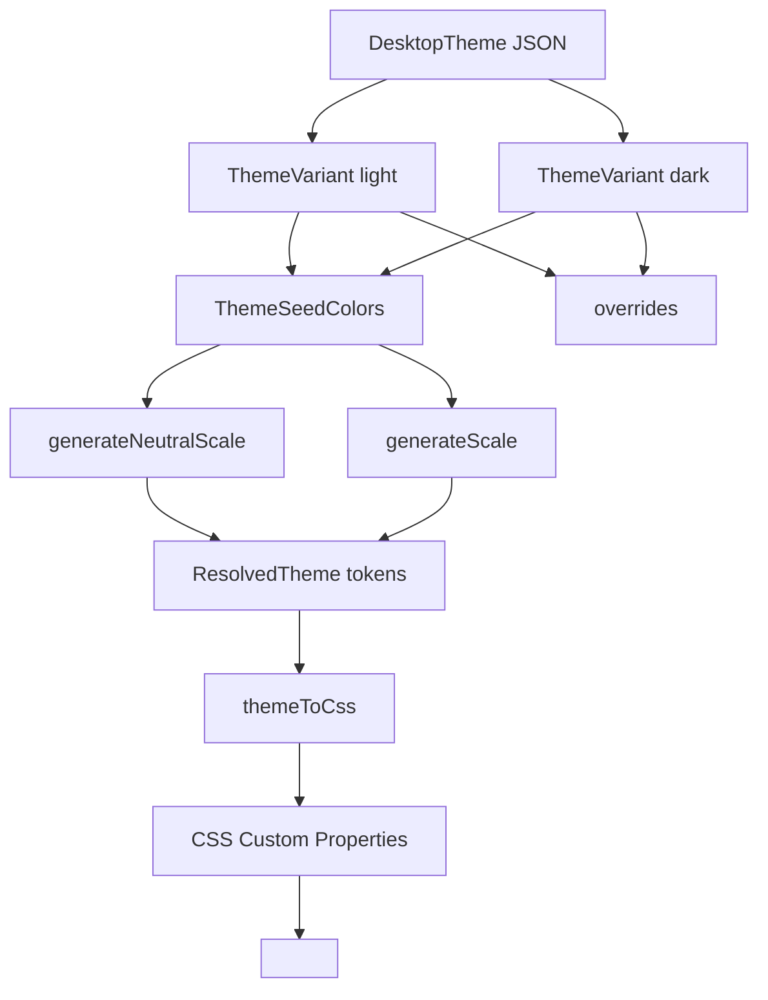

# Desktop GUI vs TUI/CLI Theme System Investigation

## Executive Summary

The OpenCode project implements **two completely separate theme systems** for the desktop GUI (web-based) and the TUI/CLI (terminal-based):

1. **Desktop GUI Themes** - CSS Custom Properties + OKLCH color space (in [`packages/ui/src/theme/`](packages/ui/src/theme/))
2. **TUI/CLI Themes** - RGBA values + ANSI color codes + OpenTUI framework (in [`packages/opencode/src/cli/cmd/tui/context/theme/`](packages/opencode/src/cli/cmd/tui/context/theme/))

These systems are **not interchangeable** and serve different rendering targets.

---

## Desktop GUI Theme System

### Location
- **Core**: [`packages/ui/src/theme/`](packages/ui/src/theme/)
- **Themes**: [`packages/ui/src/theme/themes/`](packages/ui/src/theme/themes/) (10 built-in themes)
- **Context**: [`packages/ui/src/theme/context.tsx`](packages/ui/src/theme/context.tsx:1)
- **Loader**: [`packages/ui/src/theme/loader.ts`](packages/ui/src/theme/loader.ts:1)
- **Resolver**: [`packages/ui/src/theme/resolve.ts`](packages/ui/src/theme/resolve.ts:1)

### Architecture



### Theme Schema (JSON)

```typescript
// packages/ui/src/theme/types.ts:26-32
interface DesktopTheme {
  $schema?: string
  name: string
  id: string
  light: ThemeVariant
  dark: ThemeVariant
}

interface ThemeVariant {
  seeds: ThemeSeedColors
  overrides?: Record<string, ColorValue>
}

interface ThemeSeedColors {
  neutral: HexColor
  primary: HexColor
  success: HexColor
  warning: HexColor
  error: HexColor
  info: HexColor
  interactive: HexColor
  diffAdd: HexColor
  diffDelete: HexColor
}
```

### Key Characteristics

| Aspect | Desktop GUI |
|--------|-------------|
| **Color Format** | Hex colors + CSS Variables |
| **Color Space** | OKLCH (via [`color.ts`](packages/ui/src/theme/color.ts:1)) |
| **Rendering Target** | Web browser (CSS) |
| **Token System** | ~150+ CSS custom properties |
| **Dark/Light Mode** | Per-theme variants with automatic scale generation |
| **Overrides** | Direct CSS variable assignments |
| **Schema** | `https://opencode.ai/desktop-theme.json` |

### Example Theme File

```json
// packages/ui/src/theme/themes/tokyonight.json
{
  "$schema": "https://opencode.ai/desktop-theme.json",
  "name": "Tokyonight",
  "id": "tokyonight",
  "light": {
    "seeds": {
      "neutral": "#e1e2e7",
      "primary": "#2e7de9",
      "success": "#587539",
      "warning": "#8c6c3e",
      "error": "#c94060",
      "info": "#007197",
      "interactive": "#2e7de9",
      "diffAdd": "#4f8f7b",
      "diffDelete": "#d05f7c"
    },
    "overrides": {
      "background-base": "#e1e2e7",
      "text-base": "#273153",
      "syntax-string": "#587539"
    }
  },
  "dark": { /* ... */ }
}
```

### CSS Generation Process

1. **Scale Generation** ([`resolve.ts:4`](packages/ui/src/theme/resolve.ts:4))
   - [`generateNeutralScale()`](packages/ui/src/theme/color.ts:124) - creates 12-step gray scale from seed
   - [`generateScale()`](packages/ui/src/theme/color.ts:99) - creates 12-step color scale per seed

2. **Token Resolution** ([`resolve.ts:4-297`](packages/ui/src/theme/resolve.ts:4))
   - Maps seeds to tokens like `--background-base`, `--text-weak`, `--surface-brand-base`
   - Applies alpha blending for transparent surfaces
   - Supports dark/light mode variants

3. **CSS Output** ([`resolve.ts:321-324`](packages/ui/src/theme/resolve.ts:321))
   ```typescript
   export function themeToCss(tokens: ResolvedTheme): string {
     return Object.entries(tokens)
       .map(([key, value]) => `--${key}: ${value};`)
       .join("\n  ")
   }
   ```

4. **Style Injection** ([`context.tsx:44-53`](packages/ui/src/theme/context.tsx:44))
   - Injects CSS into `<style id="oc-theme">` element
   - Sets `data-theme` and `data-color-scheme` attributes on document

### Built-in Themes

| Theme | File | Light/Dark |
|-------|------|------------|
| OC-1 (Default) | [`themes/oc-1.json`](packages/ui/src/theme/themes/oc-1.json) | ✓ |
| Tokyo Night | [`themes/tokyonight.json`](packages/ui/src/theme/themes/tokyonight.json) | ✓ |
| Dracula | [`themes/dracula.json`](packages/ui/src/theme/themes/dracula.json) | ✓ |
| Catppuccin | [`themes/catppuccin.json`](packages/ui/src/theme/themes/catppuccin.json) | ✓ |
| Nord | [`themes/nord.json`](packages/ui/src/theme/themes/nord.json) | ✓ |
| Solarized | [`themes/solarized.json`](packages/ui/src/theme/themes/solarized.json) | ✓ |
| Monokai | [`themes/monokai.json`](packages/ui/src/theme/themes/monokai.json) | ✓ |
| Ayu | [`themes/ayu.json`](packages/ui/src/theme/themes/ayu.json) | ✓ |
| One Dark Pro | [`themes/onedarkpro.json`](packages/ui/src/theme/themes/onedarkpro.json) | ✓ |
| Shades of Purple | [`themes/shadesofpurple.json`](packages/ui/src/theme/themes/shadesofpurple.json) | ✓ |

---

## TUI/CLI Theme System

### Location
- **Core**: [`packages/opencode/src/cli/cmd/tui/context/theme.tsx`](packages/opencode/src/cli/cmd/tui/context/theme.tsx:1)
- **Themes**: [`packages/opencode/src/cli/cmd/tui/context/theme/`](packages/opencode/src/cli/cmd/tui/context/theme/) (30+ built-in themes)
- **Context Provider**: [`ThemeProvider`](packages/opencode/src/cli/cmd/tui/context/theme.tsx:277)

### Architecture

```mermaid
graph TD
    A[TUI Theme JSON] --> B[defs color references]
    A --> C[theme color assignments]
    B --> D[resolveColor function]
    C --> D
    D --> E[RGBA objects]
    E --> F[SyntaxStyle rules]
    F --> G[@opentui/solid renderer]
    E --> G
    G --> H[Terminal ANSI codes]
```

### Theme Schema (JSON)

```typescript
// packages/opencode/src/cli/cmd/tui/context/theme.tsx:129-137
type ThemeJson = {
  $schema?: string
  defs?: Record<string, HexColor | RefName>
  theme: {
    primary: ColorValue
    secondary: ColorValue
    accent: ColorValue
    error: ColorValue
    warning: ColorValue
    success: ColorValue
    info: ColorValue
    text: ColorValue
    textMuted: ColorValue
    background: ColorValue
    backgroundPanel: ColorValue
    backgroundElement: ColorValue
    backgroundMenu?: ColorValue
    border: ColorValue
    borderActive: ColorValue
    borderSubtle: ColorValue
    // ... diff, markdown, syntax colors
  }
}

type ColorValue = HexColor | RefName | { dark: ColorValue; light: ColorValue } | number // ANSI code
```

### Key Characteristics

| Aspect | TUI/CLI |
|--------|---------|
| **Color Format** | RGBA (0-1 floats), Hex, ANSI codes (0-255), references |
| **Rendering Target** | Terminal via OpenTUI framework |
| **Color System** | RGBA + ANSI 256-color palette |
| **Dark/Light Mode** | Per-color `{ dark: "...", light: "..." }` objects |
| **References** | Named colors in `defs` section |
| **Schema** | `https://opencode.ai/theme.json` |
| **Custom Themes** | Loadable from `.opencode/themes/` directories |

### Example Theme File

```json
// packages/opencode/src/cli/cmd/tui/context/theme/dracula.json
{
  "$schema": "https://opencode.ai/theme.json",
  "defs": {
    "background": "#282a36",
    "foreground": "#f8f8f2",
    "comment": "#6272a4",
    "cyan": "#8be9fd",
    "green": "#50fa7b",
    "pink": "#ff79c6",
    "purple": "#bd93f9",
    "red": "#ff5555",
    "yellow": "#f1fa8c"
  },
  "theme": {
    "primary": { "dark": "purple", "light": "purple" },
    "secondary": { "dark": "pink", "light": "pink" },
    "accent": { "dark": "cyan", "light": "cyan" },
    "error": { "dark": "red", "light": "red" },
    "warning": { "dark": "yellow", "light": "yellow" },
    "success": { "dark": "green", "light": "green" },
    "info": { "dark": "orange", "light": "orange" },
    "text": { "dark": "foreground", "light": "#282a36" },
    "background": { "dark": "#282a36", "light": "#f8f8f2" },
    "syntaxComment": { "dark": "comment", "light": "#6272a4" },
    "syntaxKeyword": { "dark": "pink", "light": "pink" }
    // ... 40+ more color properties
  }
}
```

### Color Resolution Process

1. **Color References** ([`theme.tsx:174-195`](packages/opencode/src/cli/cmd/tui/context/theme.tsx:174))
   ```typescript
   function resolveColor(c: ColorValue): RGBA {
     if (c instanceof RGBA) return c
     if (typeof c === "string") {
       if (c.startsWith("#")) return RGBA.fromHex(c)
       if (defs[c] != null) return resolveColor(defs[c])
       // ...
     }
     if (typeof c === "number") return ansiToRgba(c) // ANSI color codes!
     return resolveColor(c[mode]) // { dark, light } object
   }
   ```

2. **ANSI Color Support** ([`theme.tsx:232-275`](packages/opencode/src/cli/cmd/tui/context/theme.tsx:232))
   - Supports 0-15 standard ANSI colors
   - Supports 16-231 (6x6x6 color cube)
   - Supports 232-255 (grayscale ramp)
   - Allows themes to reference terminal palette colors

3. **Syntax Highlighting** ([`theme.tsx:646-1148`](packages/opencode/src/cli/cmd/tui/context/theme.tsx:646))
   - Generates [`SyntaxStyle`](packages/opencode/src/cli/cmd/tui/context/theme.tsx:618) from theme colors
   - Supports ~50+ syntax scopes (comment, keyword, string, etc.)
   - Integrated with `@opentui/core` for tree-sitter syntax highlighting

4. **System Theme Detection** ([`theme.tsx:314-341`](packages/opencode/src/cli/cmd/tui/context/theme.tsx:314))
   - Queries terminal for background color via ANSI escape `\x1b]11;?\x07`
   - Parses RGB from `rgb:RR/GG/BB`, `#RRGGBB`, or `rgb(R,G,B)`
   - Generates dynamic theme matching terminal colors

### Built-in Themes

| Theme | File | Notes |
|-------|------|-------|
| OpenCode (Default) | [`theme/opencode.json`](packages/opencode/src/cli/cmd/tui/context/theme/opencode.json) | Custom theme |
| Dracula | [`theme/dracula.json`](packages/opencode/src/cli/cmd/tui/context/theme/dracula.json) | ✓ |
| Tokyo Night | [`theme/tokyonight.json`](packages/opencode/src/cli/cmd/tui/context/theme/tokyonight.json) | ✓ |
| Nord | [`theme/nord.json`](packages/opencode/src/cli/cmd/tui/context/theme/nord.json) | ✓ |
| Catppuccin | [`theme/catppuccin.json`](packages/opencode/src/cli/cmd/tui/context/theme/catppuccin.json) | + frappe, macchiato |
| Solarized | [`theme/solarized.json`](packages/opencode/src/cli/cmd/tui/context/theme/solarized.json) | ✓ |
| One Dark | [`theme/one-dark.json`](packages/opencode/src/cli/cmd/tui/context/theme/one-dark.json) | ✓ |
| And 20+ more... | [`theme/`](packages/opencode/src/cli/cmd/tui/context/theme/) | |

---

## Comparison Table

| Feature | Desktop GUI | TUI/CLI |
|---------|-------------|---------|
| **Framework** | SolidJS + CSS | OpenTUI (@opentui/solid) |
| **Color Output** | CSS Custom Properties | RGBA objects + ANSI codes |
| **Color Space** | OKLCH | RGB + ANSI palette |
| **Theme Location** | `packages/ui/src/theme/themes/` | `packages/opencode/src/cli/cmd/tui/context/theme/` |
| **Schema URL** | `https://opencode.ai/desktop-theme.json` | `https://opencode.ai/theme.json` |
| **Token Count** | ~150+ CSS variables | ~40 color properties |
| **Dark/Light Mode** | Per-theme objects | Per-color `{dark, light}` objects |
| **Seed Colors** | ✓ Automatic scale generation | ✗ Not supported |
| **Color References** | ✗ Not supported | ✓ Via `defs` section |
| **ANSI Colors** | ✗ Not supported | ✓ 0-255 color codes |
| **Custom Themes** | Not documented | ✓ `.opencode/themes/` dirs |
| **System Theme** | Via `color-scheme` media query | ✓ Via terminal escape codes |
| **Syntax Highlighting** | CSS variables | SyntaxStyle + tree-sitter |

---

## Key Differences Summary

### 1. **Fundamental Approach**
- **Desktop**: Token-based CSS generation from seed colors (procedural)
- **TUI**: Direct color assignment with references (declarative)

### 2. **Color Management**
- **Desktop**: OKLCH for perceptual uniformity, automatic scale generation
- **TUI**: RGB + ANSI for terminal compatibility, manual palette design

### 3. **Dark/Light Mode**
- **Desktop**: Separate `light` and `dark` objects in theme JSON
- **TUI**: Per-color `{ dark: "...", light: "..." }` objects

### 4. **Customization**
- **Desktop**: Overrides in theme JSON for specific tokens
- **TUI**: Custom theme files in `.opencode/themes/` directory

### 5. **Integration**
- **Desktop**: [`ThemeProvider`](packages/ui/src/theme/context.tsx:69) from UI package
- **TUI**: [`ThemeProvider`](packages/opencode/src/cli/cmd/tui/context/theme.tsx:277) from TUI context

---

## Files Reference

### Desktop GUI Theme System
| File | Purpose |
|------|---------|
| [`packages/ui/src/theme/index.ts`](packages/ui/src/theme/index.ts:1) | Public exports |
| [`packages/ui/src/theme/types.ts`](packages/ui/src/theme/types.ts:1) | TypeScript interfaces |
| [`packages/ui/src/theme/color.ts`](packages/ui/src/theme/color.ts:1) | Color conversion (HEX ↔ OKLCH) |
| [`packages/ui/src/theme/resolve.ts`](packages/ui/src/theme/resolve.ts:1) | Token generation from seeds |
| [`packages/ui/src/theme/loader.ts`](packages/ui/src/theme/loader.ts:1) | Theme application to DOM |
| [`packages/ui/src/theme/context.tsx`](packages/ui/src/theme/context.tsx:1) | React context + state management |
| [`packages/ui/src/theme/default-themes.ts`](packages/ui/src/theme/default-themes.ts:1) | Theme exports |
| [`packages/ui/src/theme/desktop-theme.schema.json`](packages/ui/src/theme/desktop-theme.schema.json:1) | JSON Schema |

### TUI/CLI Theme System
| File | Purpose |
|------|---------|
| [`packages/opencode/src/cli/cmd/tui/context/theme.tsx`](packages/opencode/src/cli/cmd/tui/context/theme.tsx:1) | Theme provider + resolution |
| [`packages/opencode/src/cli/cmd/tui/context/theme/*.json`](packages/opencode/src/cli/cmd/tui/context/theme/) | Built-in theme files |
| [`packages/opencode/src/cli/cmd/tui/app.tsx`](packages/opencode/src/cli/cmd/tui/app.tsx:1) | TUI app with ThemeProvider |

---

## Conclusion

The desktop GUI and TUI/CLI theme systems are **completely independent implementations** that serve different rendering environments:

1. **Desktop GUI** uses a modern, programmatic approach with OKLCH colors and automatic scale generation, outputting CSS custom properties
2. **TUI/CLI** uses a traditional terminal-friendly approach with RGBA colors and ANSI palette support, integrated with the OpenTUI framework

To create or modify themes for either system, you must use the appropriate schema and follow the conventions specific to that system. There is no automatic conversion between them.
