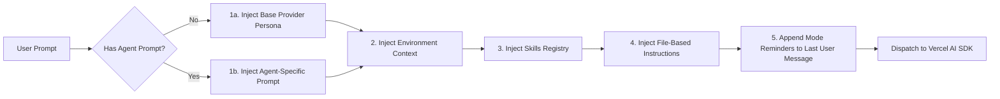
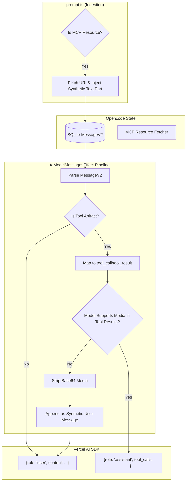

# Prompt & Context (Ingestion & The Start of the Loop)

## 1. System Prompt Composition

The final system prompt that the model evaluates is dynamically composed of multiple artifacts concatenated together at runtime. This execution sequence is explicitly governed by the internal array construction logic (specifically documented within the codebase at [`src/session/prompt.ts`](../../packages/opencode/src/session/prompt.ts) and [`src/session/llm.ts`](../../packages/opencode/src/session/llm.ts)).

### The System Prompt Composition Table

<table>
  <thead>
    <tr>
      <th style="min-width: 50px;">ID</th>
      <th style="min-width: 150px;">Artifact / Component</th>
      <th style="min-width: 300px;">Description</th>
      <th style="min-width: 600px;">Example Value</th>
    </tr>
  </thead>
  <tbody>
    <tr>
      <td><strong>1.1</strong></td>
      <td><strong>Base Provider Persona</strong></td>
      <td>A highly-optimized, model-specific base persona (e.g., <code>beast.txt</code>, <code>gemini.txt</code>). Defines the fundamental operational rules, safety boundaries, and tool utilization conventions. These personas are continuously tuned to combat the specific quirks, laziness, and failure modes of each vendor's foundation model.</td>
      <td>
        

          
Example 1: Gemini Persona (Base)

          <pre style="white-space: pre-wrap; font-size: 0.8em; max-height: 500px; overflow-y: auto; padding: 12px; border-radius: 6px; margin-top: 8px; line-height: 1.4;">You are opencode, an interactive CLI agent specializing in software engineering tasks. Your primary goal is to help users safely and efficiently, adhering strictly to the following instructions and utilizing your available tools...</pre>
        

        

          
Example 2: Claude Persona

          <pre style="white-space: pre-wrap; font-size: 0.8em; max-height: 500px; overflow-y: auto; padding: 12px; border-radius: 6px; margin-top: 8px; line-height: 1.4;">You are OpenCode, the best coding agent on the planet.
You are an interactive CLI tool that helps users with software engineering tasks. Use the instructions below and the tools available to you to assist the user...</pre>
        

      </td>
    </tr>
    <tr>
      <td><strong>1.2</strong></td>
      <td><strong>Environment Context</strong></td>
      <td>A dynamically injected string indicating the runtime model, followed by an <code>&lt;env&gt;</code> block containing the working directory, workspace root, OS platform, and timestamp.</td>
      <td>
        

          
Example 1: Windows Git Environment

          <pre style="white-space: pre-wrap; font-size: 0.8em; max-height: 500px; overflow-y: auto; padding: 12px; border-radius: 6px; margin-top: 8px; line-height: 1.4;">You are powered by the model named gemini-3.1-pro-preview. The exact model ID is google/gemini-3.1-pro-preview
Here is some useful information about the environment you are running in:
&lt;env&gt;
  Working directory: E:\projects_large\opencode
  Workspace root folder: E:\projects_large\opencode
  Is directory a git repo: yes
  Platform: win32
  Today's date: Sat Apr 25 2026
&lt;/env&gt;</pre>
        

      </td>
    </tr>
    <tr>
      <td><strong>1.3</strong></td>
      <td><strong>Skills Registry</strong></td>
      <td>A verbose registry of available "Skills" (custom programmatic workflows) injected if the agent possesses the required permissions.</td>
      <td>
        

          
Example 1: Populated Registry

          <pre style="white-space: pre-wrap; font-size: 0.8em; max-height: 500px; overflow-y: auto; padding: 12px; border-radius: 6px; margin-top: 8px; line-height: 1.4;">Skills provide specialized instructions and workflows for specific tasks.
Use the skill tool to load a skill when a task matches its description.

Available skills:

- git-rebase: Handles conflict resolution workflows for git rebases.
- react-component: Scaffolds a new React component with tests and stories.</pre>
  

  </td>
    </tr>
    <tr>
      <td><strong>1.4</strong></td>
      <td><strong>Agent-Specific Prompt</strong></td>
      <td>A tailored system prompt completely overriding (not supplementing) the base persona for a specific subagent (e.g., the `@explore` agent, the `@compaction` agent).</td>
      <td>
        

          
Example 1: @compaction Agent Prompt

          <pre style="white-space: pre-wrap; font-size: 0.8em; max-height: 500px; overflow-y: auto; padding: 12px; border-radius: 6px; margin-top: 8px; line-height: 1.4;">You are a helpful AI assistant tasked with summarizing conversations.

When asked to summarize, provide a detailed but concise summary of the older conversation history.
The most recent turns may be preserved verbatim outside your summary, so focus on information that would still be needed to continue the work with that recent context available.</pre>

</td>
</tr>
<tr>
<td><strong>1.5</strong></td>
<td><strong>File-Based Instructions</strong></td>
<td>Automatically scraped context from local repositories (e.g., <code>AGENTS.md</code>, <code>CLAUDE.md</code>) and user-configured global instruction files.</td>
<td>

Example 1: Project-Level (AGENTS.md)

<pre style="white-space: pre-wrap; font-size: 0.8em; max-height: 500px; overflow-y: auto; padding: 12px; border-radius: 6px; margin-top: 8px; line-height: 1.4;">Instructions from: E:\projects_large\opencode\AGENTS.md

- To regenerate the JavaScript SDK, run `./packages/sdk/js/script/build.ts`.
- ALWAYS USE PARALLEL TOOLS WHEN APPLICABLE.
- The default branch in this repo is `dev`.
- Prefer automation: execute requested actions without confirmation unless blocked by missing info or safety/irreversibility.</pre>
  

  </td>
  </tr>
  <tr>
  <td><strong>1.6</strong></td>
  <td><strong>Mode Reminders</strong></td>
  <td>State-based XML blocks appended to the <strong>last User Message</strong> (not the system prompt). Placing these at the end of the user message ensures high attention weighting. For example, appending a strict read-only constraint when the user requests a "plan".</td>
  <td>
  

  
Example 1: Build Mode Transition

  <pre style="white-space: pre-wrap; font-size: 0.8em; max-height: 500px; overflow-y: auto; padding: 12px; border-radius: 6px; margin-top: 8px; line-height: 1.4;">&lt;system-reminder&gt;
  Your operational mode has changed from plan to build.
  You are no longer in read-only mode.
  You are permitted to make file changes, run shell commands, and utilize your arsenal of tools as needed.
  &lt;/system-reminder&gt;</pre>
  

  

  
Example 2: Plan Mode (Read-Only)

  <pre style="white-space: pre-wrap; font-size: 0.8em; max-height: 500px; overflow-y: auto; padding: 12px; border-radius: 6px; margin-top: 8px; line-height: 1.4;">&lt;system-reminder&gt;

# Plan Mode - System Reminder

CRITICAL: Plan mode ACTIVE - you are in READ-ONLY phase. STRICTLY FORBIDDEN:
ANY file edits, modifications, or system changes. Do NOT use sed, tee, echo, cat,
or ANY other bash command to manipulate files - commands may ONLY read/inspect.
&lt;/system-reminder&gt;</pre>

</td>
</tr>

  </tbody>
</table>

---

## 2. Filesystem-as-State

Opencode operates on a foundational paradigm where "Filesystem-as-State" governs the agent's memory. Rather than relying heavily on internal, serialized conversation history (chat logs) to remember context like standard CLIs, Opencode dynamically injects repository state, local configuration files, and active workspace data into the prompt at runtime.

The agent always knows the _current_ state of the project, even if the user manually edited files in their IDE while the agent was running. This eliminates hallucinations caused by outdated chat logs where the agent assumes a file looks a certain way because of a previous response.

---

### Sandboxed Context Scoping

To achieve safe orchestration across multiple projects, Opencode explicitly abandons standard Node.js global singletons in favor of a strictly sandboxed context model powered by the Effect runtime. As implemented in [`src/effect/instance-state.ts`](../../packages/opencode/src/effect/instance-state.ts), services are encapsulated within an `InstanceState` wrapper keyed by the active workspace directory. (For more details, see [State & Memory Management](./05_state-and-memory.md)).

---

## 3. Bridging the Vercel AI SDK

While the Vercel AI SDK expects a highly simplistic payload (e.g., `{ role: "user", content: "hello" }`), Opencode utilizes a much richer internal `MessageV2` format. This event-sourced format is stored in SQLite and handles complex domain abstractions like MCP resources, background sub-agent logs, and synthetic context.

To bridge this gap, the `toModelMessagesEffect` pipeline executes right before making the API call. This translation process "dumbs down" Opencode's rich internal state into the simple array format required by the AI SDK.

### Message Translation

- **User Messages:** Translates raw user text inputs and resolves embedded `FilePart` URIs.
- **MCP Resources:** If a user message includes an MCP resource, it has already been eagerly resolved during the initial prompt ingestion phase (in `src/session/prompt.ts`) and stored in the database as a synthetic text block. `toModelMessagesEffect` simply translates this pre-fetched block into a standard user message.
- **Assistant Messages:** Maps prior AI responses from the database. It parses internal `<reasoning>` blocks and translates them into native SDK reasoning formats where supported.
- **Tool Artifacts:** Translates internal `ToolPart` objects into standardized `tool_call` and `tool_result` payloads.

### The "Media in Tool Results" Workaround

A critical fallback exists for SDK compatibility:

- **Challenge**: While official providers like `@ai-sdk/openai`, `@ai-sdk/anthropic`, and `@ai-sdk/google` natively handle rich media within `tool_result` objects, generic **OpenAI-compatible APIs** (e.g., local LLM routers) often enforce strict schemas that only allow text strings. However, certain tools return rich media (e.g., a browser snapshot).
- **Resolution**: Opencode dynamically evaluates the target model provider. If the target model utilizes a generic provider that does not support media within tool results, Opencode artificially extracts the base64 media data, strips it from the `tool_result`, and appends it as a subsequent `user` message block. This circumvents API schema validation errors while ensuring the model maintains visual context.

---

## 4. Source Code Reference

The mechanics discussed in this document are primarily implemented in the following files:

- **[`src/session/prompt.ts`](../../packages/opencode/src/session/prompt.ts)**: The core prompt execution pipeline that dynamically injects the artifacts, system contexts, and instructions discussed in Section 1 before dispatching the payload to the LLM.
- **[`src/session/llm.ts`](../../packages/opencode/src/session/llm.ts)**: Manages the actual dispatch to the model provider, applying the constructed prompt and tools.
- **[`src/session/instruction.ts`](../../packages/opencode/src/session/instruction.ts)**: Handles parsing and resolving local instruction files (like `AGENTS.md`) to inject into the system prompt.
- **[`src/session/message-v2.ts`](../../packages/opencode/src/session/message-v2.ts)**: Contains the `toModelMessagesEffect` mapping logic (Section 3) that bridges Opencode's rich SQLite schema to the Vercel AI SDK, including the rich-media stripping workaround.
- **[`src/effect/instance-state.ts`](../../packages/opencode/src/effect/instance-state.ts)**: The primary mechanism for sandboxing state. It manages the `ScopedCache` that ensures execution contexts are isolated per workspace directory.
