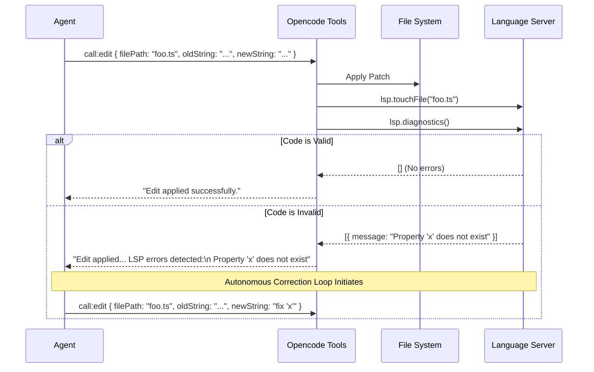

# Execution & Feedback (Action & Self-Correction)

Standard LLM CLIs treat tool usage as a simple call-and-response transaction. If an agent writes a file with a syntax error, the transaction completes, and the system halts, waiting for the human user to discover the error, copy the compiler output, and paste it back into the chat.

Opencode fundamentally shifts this paradigm by implementing **Synthesized Feedback Loops**. It intercepts tool operations and automatically injects deterministic environmental feedback directly back into the LLM's context window, forcing the agent to self-correct autonomously before returning control to the user.

---

## 1. Reactive Diagnostics (The Edit-Check Loop)

The most powerful manifestation of this loop is Opencode's deep integration with the Language Server Protocol (LSP). When an agent modifies the codebase, Opencode does not blindly trust the output.

As implemented in [`src/tool/edit.ts`](../../packages/opencode/src/tool/edit.ts):

1. The agent invokes the `edit` tool to apply a string replacement (`oldString` to `newString`) in `foo.ts`.
2. Opencode applies the physical file transformation.
3. Before returning the `tool_result` to the LLM, Opencode invokes `lsp.touchFile(filePath)` to notify the local Language Server (e.g., `tsserver`, `rust-analyzer`).
4. Opencode awaits `lsp.diagnostics()`.
5. If the LSP returns warnings or compilation errors (the "squiggly lines" in an IDE), Opencode synthesizes an addendum to the tool output:
   `LSP errors detected in this file, please fix:\n${block}`

Because the AI SDK loop remains active, the agent immediately reads this error in the tool observation phase, realizes it made a mistake (e.g., calling a method that doesn't exist on an interface), and autonomously issues a follow-up `edit` tool call to fix the bug—all within a single conversational turn without human intervention.

---

## 2. Proactive Codebase Interrogation (The LSP Tool)

While the Edit-Check loop is _reactive_, Opencode also provides _proactive_ feedback loops via the `LspTool` ([`src/tool/lsp.ts`](../../packages/opencode/src/tool/lsp.ts)).

Rather than relying purely on blunt `grep` searches, the agent can actively query the compiler's Abstract Syntax Tree (AST). The agent can execute operations like `findReferences`, `goToDefinition`, or `incomingCalls`. This allows the agent to build an accurate dependency graph in its context window before it begins writing code, drastically reducing the hallucination rate during large refactors.

---

## 3. Shell Execution & Stream Management

A fundamental feature of Opencode is its ability to seamlessly execute terminal commands (compilations, test runners, git commands) and reliably feed the resulting terminal output back into the LLM's context window. This presents a complex challenge: raw terminal output can contain ANSI escape sequences, progress bar redraws, and interactive prompts that easily confuse language models.

### Process Spawning & Streams

When the `@build` agent invokes the `bash` tool, Opencode relies on standard `child_process` execution primitives securely wrapped by Effect-TS (`ChildProcessSpawner`). 

Rather than executing in a fully interactive Pseudo-Terminal (PTY), Opencode intentionally executes the `bash` tool with `TERM="dumb"` to suppress interactive prompts and pagination (like `less` or `more`) that would otherwise hang an autonomous agent. However, to ensure it doesn't lose visibility during long-running commands, it continuously multiplexes and streams `stdout` and `stderr` back to the context metadata in real-time, rather than waiting for the process to exit.

(Note: Opencode *does* utilize true PTYs via `node-pty`/`bun-pty`, but strictly for the user-facing Terminal UI components, keeping agent execution safely decoupled from interactive UI layers).

### Sanitizing Output for the LLM

Feeding raw terminal buffers directly into an LLM can sometimes corrupt the prompt payload with unreadable escape sequences or massive redraws.

Opencode employs a sanitization and streaming pipeline before appending the terminal output to the `ToolState` metadata:

1. **Truncation:** If a command produces a massive log (e.g., thousands of lines of compiler warnings), Opencode truncates the output to a safe token limit before returning it, appending a synthetic warning that the log was truncated. The full log is safely persisted to disk, allowing the agent to use the `read` or `grep` tool if it specifically needs to inspect the truncated sections.
2. **Real-time Monitoring:** By streaming the chunks as they arrive, Opencode allows the execution boundary to impose safe, reactive timeouts if a command hangs or enters an unexpected infinite loop.

---

## 4. Subtask Delegation & Crash Boundaries

When the main agent delegates work to a specialized background sub-agent via the `TaskTool` ([`src/tool/task.ts`](../../packages/opencode/src/tool/task.ts)), the sub-agent executes in its own isolated context loop.

If the sub-agent crashes, encounters a permission denied error, or enters an unrecoverable state, the tool execution boundary catches it. The system formats the failure and returns the detailed exception to the main agent's prompt rather than crashing the primary application thread. This allows the main agent to formulate a fallback strategy, such as retrying the task with a different parameter or handling the work itself.

---

## 5. Source Code Reference

The mechanics discussed in this document are primarily implemented in the following files:

- **[`src/tool/edit.ts`](../../packages/opencode/src/tool/edit.ts)**: The primary file modification tool. Contains the logic that applies the diff patch and immediately invokes `lsp.diagnostics()` to append synthesized error warnings to the LLM's return payload.
- **[`src/tool/lsp.ts`](../../packages/opencode/src/tool/lsp.ts)**: The dedicated tool enabling the agent to proactively query AST graphs (e.g., `goToDefinition`, `findReferences`) rather than relying on regex searches.
- **[`src/tool/bash.ts`](../../packages/opencode/src/tool/bash.ts)**: The shell execution tool that connects to the PTY service and feeds testing failures back into the reasoning loop.
- **[`src/pty/index.ts`](../../packages/opencode/src/pty/index.ts)**: The underlying Pseudo-Terminal abstraction that handles process spawning and ANSI-escaped stream multiplexing.
- **[`src/tool/task.ts`](../../packages/opencode/src/tool/task.ts)**: Handles sub-agent orchestration, encapsulating execution boundaries and preventing unhandled exceptions in background fibers from crashing the primary conversational thread.