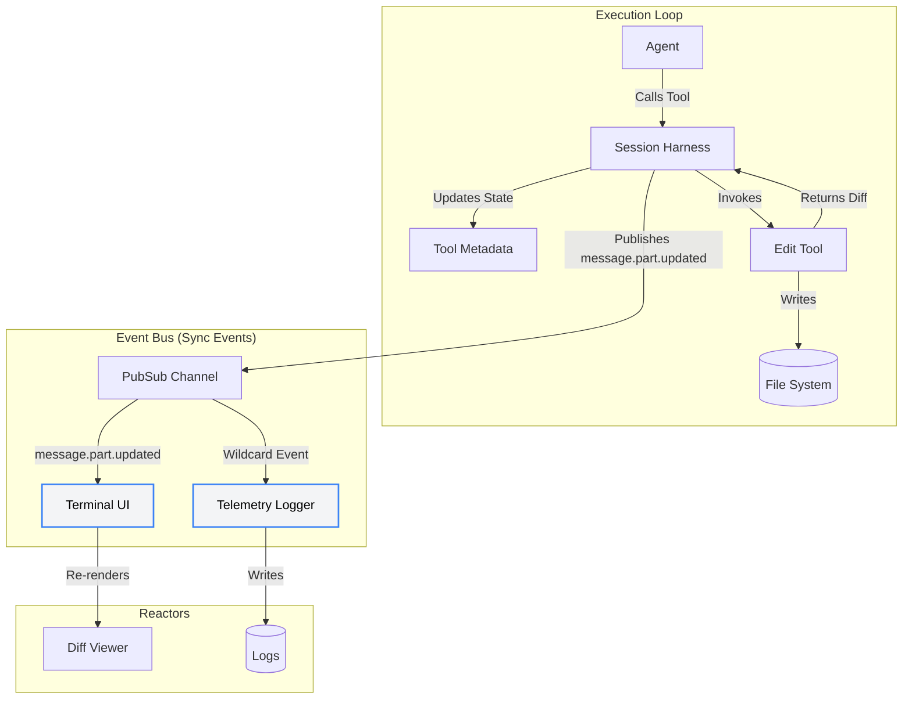

# Core Framework & Observability

Opencode embraces a **hybrid concurrency architecture** that blends the robust functional programming primitives of **Effect-TS** with native Node.js `async/await` and `try/catch` patterns.

Rather than dogmatically forcing all code into functional pipelines, Opencode strategically applies Effect-TS to solve complex architectural problems—like lifecycle management, pub/sub orchestration, and context sandboxing—while retaining native JavaScript paradigms for localized, straightforward logic.

---

## 1. Structured Concurrency & Resource Safety

Opencode utilizes Effect-TS specifically for enterprise-grade orchestration challenges where standard Node.js frequently fails:

- **Resource Scopes:** Standard architectures frequently orphan background child processes or leave dangling file watchers if a process fails abruptly. Opencode prevents this by using Effect's **Scopes**. When spinning up a local MCP server, it is tied to an execution Scope via `Effect.acquireUseRelease` and `Effect.addFinalizer`. If a session errors out or is aborted, these hooks guarantee that background fibers are brutally and reliably terminated, guaranteeing zero memory leaks.

<details>
<summary><strong>Example: Safe Background Tasks</strong></summary>

```typescript
// ❌ Standard Node.js (Dangling process risk)
function startMCP() {
  const child = spawn("npx", ["mcp-server"])
  // If the parent function errors out before attaching exit handlers,
  // this child process becomes an orphaned zombie.
  return child
}

// ✅ Effect-TS (Resource Safety)
const startMCP = Effect.acquireUseRelease(
  // 1. Acquire
  Effect.sync(() => spawn("npx", ["mcp-server"])),
  // 2. Use
  (child) => connectToTransport(child),
  // 3. Release (Guaranteed to run, even on crash/abort)
  (child) => Effect.sync(() => child.kill()),
)
```

</details>

- **Background Daemons (`Effect.forkIn`):** When the primary loop needs to execute an invisible background operation—like generating a `@title` label or executing token `@compaction`—it utilizes `Effect.forkIn(scope)`. This safely tethers the concurrent thread to the session lifecycle, rather than relying on dangling `setTimeout` or `Promise.then` operations.

<details>
<summary><strong>Example: Forking Daemons</strong></summary>

```typescript
// ❌ Standard Node.js (Uncaught promise risk)
async function chatTurn() {
  const response = await llm.chat()

  // Fire and forget - if this errors, it might crash the whole app silently
  generateTitleAsync(response.text).catch(console.error)

  return response
}

// ✅ Effect-TS (Structured Concurrency)
const chatTurn = Effect.gen(function* () {
  const response = yield* llm.chat()

  // Forks the task safely into the current scope.
  // If the parent scope is interrupted, the fiber is safely canceled.
  yield* generateTitle(response.text).pipe(Effect.ignore, Effect.forkIn(scope))

  return response
})
```

</details>

- **Sandboxed Context (`InstanceState`):** Opencode strictly isolates state (like SQLite connections or file watchers) per workspace. Effect's `ScopedCache` powers the `InstanceState` layer, guaranteeing that services are instantiated exactly once per directory and cleanly disposed of when the workspace changes.

---

## 2. Event-Driven UI Architecture (Pub/Sub Bus)

State transitions within Opencode's internal systems are heavily decoupled via an asynchronous Event Bus ([`src/bus/index.ts`](../../packages/opencode/src/bus/index.ts)) powered by `Effect.PubSub`.

This bus architecture solves the classical synchronization problem found in local agentic tools: keeping the user interface (the TUI/CLI) perfectly synced with the agent's invisible background operations without tightly coupling the frontend rendering engine to the LLM execution loop.

### Reactive State Reflection

The primary advantage of this architecture is zero-blocking reactivity:

1. The agent decides to modify a file and executes [`src/tool/edit.ts`](../../packages/opencode/src/tool/edit.ts).
2. The tool natively calculates the diff during execution using `createTwoFilesPatch` and explicitly publishes filesystem events (`File.Event.Edited` and `FileWatcher.Event.Updated`) to the bus. It yields the diff metadata back to its caller (the execution harness), maintaining strict functional purity without mutating the session database itself.
3. The session harness (`src/session/prompt.ts`) receives this metadata and updates the tool call state (`ctx.metadata()`), which in turn persists to the database and publishes the `message.part.updated` sync event.
4. The Terminal UI (SolidJS-based), which is independently subscribed to `message.part.updated` (in `src/cli/cmd/tui/context/sync.tsx`), instantly intercepts the event and re-renders the git diff viewer natively from the completed `ToolState` payload to reflect the agent's work.
5. The global telemetry logger intercepts the same event via the wildcard stream and writes it to disk.

All of this happens asynchronously without the core AI loop ever waiting for the UI to render or the disk to flush, ensuring maximum execution throughput.



---

## 3. Observability & Telemetry

Opencode integrates robust observability mechanisms, primarily leveraging OpenTelemetry to gain deep insights into agent execution and underlying operational lifecycles.

### OpenTelemetry Binding

To provide standardized telemetry, Opencode relies on the `@effect/opentelemetry` package, binding natively with its Effect-TS execution core. This tight coupling guarantees that any execution span initiated within the Effect architecture is automatically captured and attributed correctly, preserving context across asynchronous boundaries and `forkIn` daemon operations.

When telemetry is enabled, Opencode dynamically loads and injects the `OtelTracer` into the execution environment.

```typescript
// (from src/agent/agent.ts)
const tracer = cfg.experimental?.openTelemetry
  ? Option.getOrUndefined(yield * Effect.serviceOption(OtelTracer.OtelTracer))
  : undefined
```

### Vercel AI SDK Integration

Opencode delegates LLM interactions entirely to the Vercel AI SDK. To ensure traces extend all the way to the model provider, Opencode passes the loaded `OtelTracer` instance directly into the AI SDK's execution payload.

```typescript
const params = {
  experimental_telemetry: {
    isEnabled: cfg.experimental?.openTelemetry,
    tracer,
    metadata: {
      userId: cfg.username ?? "unknown",
    },
  },
  // ...
}
```

Because of this direct handoff, Opencode captures deep diagnostic data, including context assembly times, raw provider latency, and token consumption metrics uniformly across various model adapters (OpenAI, Anthropic, Gemini, etc.).

---

## 4. Source Code Reference

The hybrid architectural patterns discussed above are primarily concentrated in the following abstractions:

- **[`packages/opencode/src/effect/instance-state.ts`](../../packages/opencode/src/effect/instance-state.ts)**: The primary mechanism for sandboxing state. It manages the `ScopedCache` that ensures Effect scopes are properly acquired and released when switching directories.
- **[`packages/opencode/src/effect/run-service.ts`](../../packages/opencode/src/effect/run-service.ts)**: Contains the `makeRuntime` utility that spins up the initial Effect runtime and provides hooks like `runPromise` to seamlessly exit back into native JS.
- **[`packages/opencode/src/bus/index.ts`](../../packages/opencode/src/bus/index.ts)**: Implements the decoupled pub/sub architecture using `Effect.PubSub`.
- **[`packages/opencode/src/effect/observability.ts`](../../packages/opencode/src/effect/observability.ts)**: Configures the OpenTelemetry (`@effect/opentelemetry`) tracers and providers that hook into the execution context.
- **[`packages/opencode/src/cli/cmd/tui/context/sync.tsx`](../../packages/opencode/src/cli/cmd/tui/context/sync.tsx)**: The SolidJS event subscription layer that reactively repaints the CLI when `message.part.updated` events are broadcasted on the Event Bus.
