# Cleanup, Memory, & Background Tasks

## 1. Shadow Git Checkpointing & State Reversal

Opencode establishes a dedicated shadow directory within the user's application data folder to manage workspace snapshots independently of the primary repository. This invisible state layer serves as an automated safety net, tracking modifications made by the agent without polluting the user's standard version control history or requiring manual commits.

To capture the state efficiently, the checkpointing mechanism utilizes `git write-tree` to generate silent, near-instantaneous snapshots of the active workspace. Before the agent executes any tool that modifies the filesystem, the harness quietly records these point-in-time tree objects, guaranteeing a reliable recovery vector exists for every conversational turn.

When the user chooses to revert a chat turn, Opencode relies on a targeted `git checkout <hash> -- <file>` operation rather than a destructive hard reset. This surgical recovery approach ensures that only the specific files altered by the agent are rolled back, safely preserving any concurrent human edits made elsewhere in the codebase. However, if the agent newly *creates* a file (meaning it did not exist in the snapshot hash), running `git checkout <hash> -- <file>` will fail. The implementation handles this by proactively querying `git ls-tree`; if the file is missing from the tree, the engine executes a hard file deletion (`yield* remove(op.file)`).

*(Note: These Git operations are completely encapsulated behind the `Snapshot.Service` in [`src/snapshot/index.ts`](../../packages/opencode/src/snapshot/index.ts). The `SessionRevert` engine delegates all snapshotting and reversion logic to this service, rather than invoking bash commands directly).*

**Crucially, this revert mechanism is purely deterministic, not "smart."** It strictly reverts local filesystem diffs via Git. It has absolutely zero awareness of—and makes no intelligent attempt to rollback—external side effects.

---

## 2. Stateful Task Tracking (Todo)

Opencode features an explicit stateful task tracking mechanism designed to prevent the primary agent from losing track of long-running, multi-step operations as the conversation context window shifts or compresses over time.

This functionality is exposed to the LLM via the singular `todowrite` tool ([`src/tool/todo.ts`](../../packages/opencode/src/tool/todo.ts)). Crucially, there is exactly **one canonical todo list per conversational session**.

Whenever an agent invokes the `todowrite` tool, it must submit an array of updated task objects representing the entirety of the current plan. The system ([`src/session/todo.ts`](../../packages/opencode/src/session/todo.ts)) then executes a SQLite transaction that entirely deletes the previous todo rows for the active `session_id` and inserts the newly provided tasks:

```typescript
db.delete(TodoTable).where(eq(TodoTable.session_id, input.sessionID)).run()
db.insert(TodoTable).values(...)
```

Because of this hard replacement logic, the agent actively curates a single source of truth for its own execution state, ticking items to `completed` or `in_progress` over the lifecycle of the session without permanently bloating the chat log with intermediate planning text.

---

## 3. Asynchronous Daemons & Background Observers

Opencode diverges significantly from synchronous LLM wrappers by utilizing "Daemon Agents"—invisible, asynchronous subagents that operate on secondary threads without blocking the user's primary conversational loop. This architecture relies entirely on **Effect-TS** structured concurrency and explicit forking (`Effect.forkIn(scope)`).

By offloading metadata and state-maintenance tasks to these daemons, the primary execution loop remains perfectly focused on the user's prompt, achieving both lower latency and lower token costs by routing mundane tasks to smaller models (e.g., Claude Haiku or Gemini Flash).

### 3.1 The Daemon Lifecycle ([`src/session/prompt.ts`](../../packages/opencode/src/session/prompt.ts))

Within the core `runLoop`, Opencode dynamically forks background tasks attached to the session's active `Scope`. Because they are tied to this scope, if the user aborts the session, the background daemons are instantly and safely interrupted without leaving orphaned processing threads.

- **`@title` Agent**: Triggered automatically during the very first conversational step. Opencode forks a non-blocking fiber that invokes a fast model. It silently reads the user's initial prompt and the agent's first response, autonomously generates a highly descriptive label for the chat session, and updates the SQLite database. The user's terminal experience is never blocked waiting for this label generation.
- **`@summary` Agent**: Similar to the title daemon, this agent runs asynchronously to continually summarize the current trajectory of long-running tasks. It distills complex multi-step refactors into concise progress checkpoints that can be used for context restoration if the primary loop crashes.

---

## 4. Token Compaction & Context Management

Opencode diverges from traditional semantic vector memory stores (e.g., embedding-based RAG for conversation history). Historical context is strictly managed via linear pagination of the SQLite `MessageV2` event log.

To mitigate context window exhaustion (`ContextOverflowError`), the harness triggers the background **`@compaction` agent**.

This systemic daemon continually monitors token budgets (`compaction.isOverflow`). When the context window approaches its maximum token threshold, it silently processes the SQLite `MessageV2` event log, executing an LLM summarization pass to compress older message turns into dense "context anchors." It acts as an autonomous memory manager, ensuring the working prompt remains performant without requiring external vector databases or interrupting the primary agent's task execution.

---

## 5. Event-Driven Architecture & Cleanup (Pub/Sub Bus)

State transitions within Opencode's internal systems are heavily decoupled via an asynchronous Event Bus ([`src/bus/index.ts`](../../packages/opencode/src/bus/index.ts)) powered by `Effect.PubSub`.

This bus architecture solves the classical synchronization problem found in local agentic tools: keeping the user interface (the TUI/CLI) perfectly synced with the agent's invisible background operations without tightly coupling the frontend rendering engine to the LLM execution loop.

### 5.1 Reactive State Reflection

The primary advantage of this architecture is zero-blocking reactivity:

1. The agent decides to modify a file and executes [`src/tool/edit.ts`](../../packages/opencode/src/tool/edit.ts).
2. The tool natively calculates the diff during execution using `createTwoFilesPatch` and attaches it directly to the tool's output metadata (`filediff`).
3. The Terminal UI (SolidJS-based), which is independently subscribed to the `message.part.updated` sync events (in `src/cli/cmd/tui/context/sync.tsx`), instantly intercepts the event and re-renders the git diff viewer natively from the completed `ToolState` metadata payload to reflect the agent's work.
4. The global telemetry logger intercepts the same event via the wildcard stream and writes it to disk.

All of this happens instantaneously without the core AI loop ever waiting for the UI to render or the disk to flush, ensuring maximum execution throughput.

```mermaid
graph TD
    subgraph "Execution Loop"
        LLM[Agent] -->|Calls Tool| Edit[Edit Tool]
        Edit -->|Writes| FS[(File System)]
        Edit -->|Generates Diff| Meta[Tool Metadata]
    end

    subgraph "Event Bus (Sync Events)"
        Edit -->|Publishes message.part.updated| Bus[PubSub Channel]
        Bus -->|message.part.updated| TUI
        Bus -->|Wildcard Event| Log
    end

    subgraph "Reactors"
        TUI[Terminal UI] -->|Re-renders| Render[Diff Viewer]
        Log[Telemetry Logger] -->|Writes| Disk[(Logs)]
    end

    classDef nonBlocking fill:#1e1e1e,stroke:#3b82f6,stroke-width:2px;
    class TUI,Log nonBlocking;
```



### 5.2 InstanceState Resource Garbage Collection

Because the system is driven by `InstanceState` directory caches, when the user switches context to a new directory, or the workspace is closed, a `registerDisposer` hook triggers an `invalidate` command.
This invalidation physically destroys the underlying Effect `Scope`, triggering a sequential execution of all `Effect.addFinalizer` hooks. This flawlessly guarantees that background fibers are interrupted, MCP servers are sent `SIGTERM`, and Pub-Sub listeners are flushed, cleaning up host resources efficiently.

---

## 6. Source Code Reference

The mechanics discussed in this document are primarily implemented in the following files:

- **[`src/session/revert.ts`](../../packages/opencode/src/session/revert.ts)**: Manages the Shadow Git checkpointing, handling `git write-tree` caching and `git checkout` targeted reversions.
- **[`src/tool/todo.ts`](../../packages/opencode/src/tool/todo.ts)** and **[`src/session/session.sql.ts`](../../packages/opencode/src/session/session.sql.ts)**: Implements the stateful Todo tracking, handling the hard-delete-and-replace SQLite transactions.
- **[`src/session/prompt.ts`](../../packages/opencode/src/session/prompt.ts)**: The core execution engine where the `@title`, `@summary`, and `@compaction` daemon fibers are dynamically spawned using `Effect.forkIn`.
- **[`src/bus/index.ts`](../../packages/opencode/src/bus/index.ts)**: The centralized Event Bus orchestrating the `Effect.PubSub` streams.
